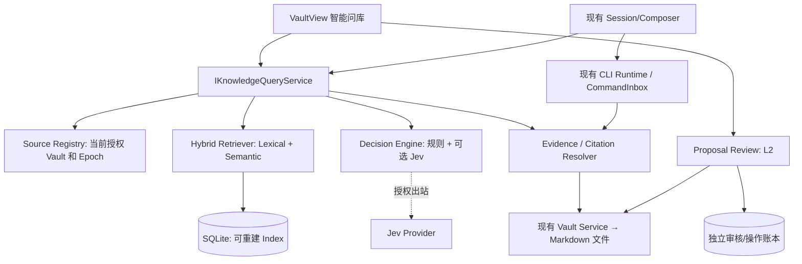

# 领域状态所有者和数据流

**唯一事实源**：Vault 文件本体与当前授权配置来自已有服务；Knowledge Index 为缓存；Proposal 账本不可随索引删除；Memory 是另一领域；会话队列属于现有 Runtime。

**检索序列**：Query → 服务端授权/范围 → 本地 FTS/语义召回 → 本地排序即时返回 → 可选 Jev 重排/证据判断 → 充分性决策（至多一次扩搜）→ 重读当前原文和版本 → 文章级候选 + receipt。

**问答序列**：用户选择文章 → prepareEvidence（有界、可预览、注明出站）→ 现有 Session enqueue → Runtime admission 前重验 sourceEpoch/hash/TTL → 模型回答 → 以现有 receipts 检验引用并可回跳。

**写入序列**：Agent 提交候选 → 人工审核 Diff → 审批与 sourceEpoch + revision + targetSha 绑定 → 事务账本与快照 → 同目标单写者 apply → 重读核对 → applied/conflict/uncertain；uncertain 绝不自动重放。

详见 `05_REFERENCE/ARCHITECTURE_v4.0.md`、`05_REFERENCE/ARCHITECTURE_REVIEW_R2.md`。