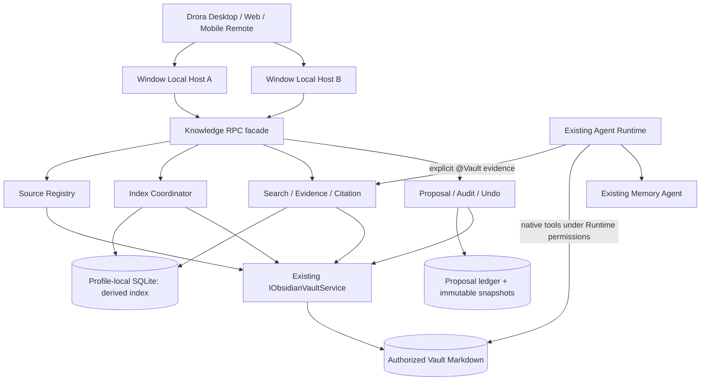
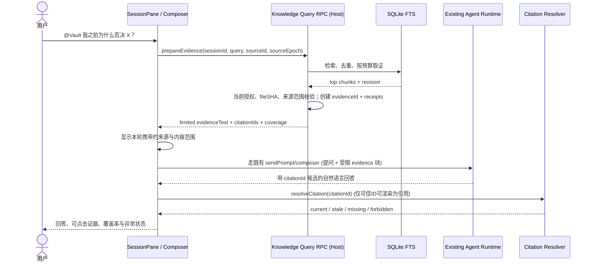
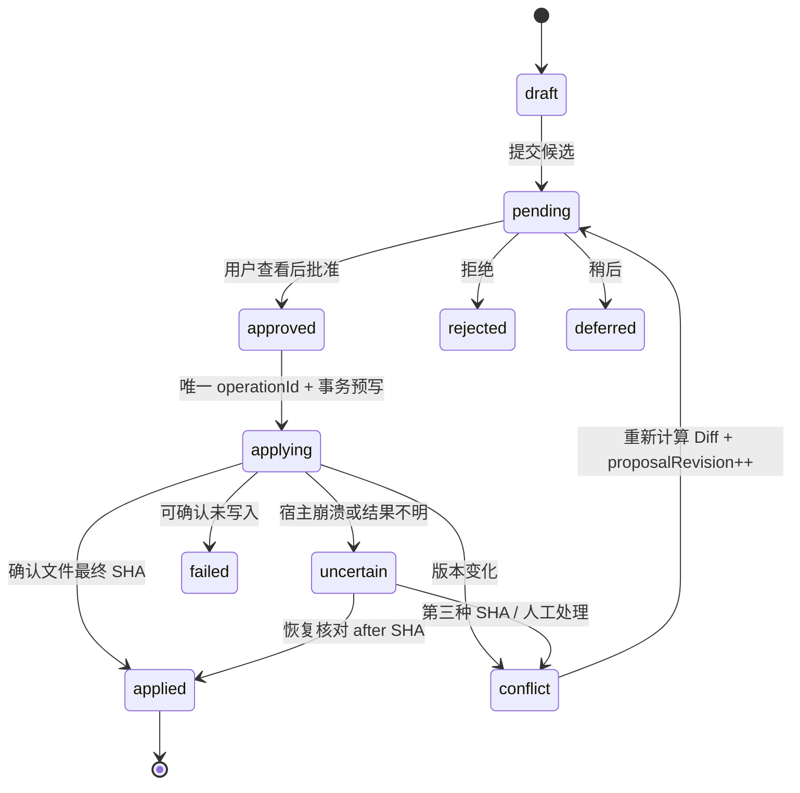

# Drora × Obsidian：第二轮技术架构评审 R2

> **日期**：2026-10-09　**状态**：架构设计建议（**方案 C 已裁定**；SQLite 同步/工具执行注入等仍需 Spike 验证）  
> **评审基线**：`CavinHuang/Drora` `main` tree `615a46e059b3801230d4b55f53c7fdbbb264727a`  
> **范围**：Knowledge Service / RPC / 跨窗口状态所有者 / SQLite 索引 / Agent 问库 / Proposal / 文件级实施。仅交付设计，**未修改 GitHub 仓库源代码**。  
> **资料**：上一轮 PRD v2.1、架构评审 R1、仓库源码与 `specs/obsidian-plugin.md`；本轮扩展的类型和数据表均为**设计提案**，不是既有代码。

## 0. 执行摘要与确定结果

- **正式产品决定**：方案 **C（风险分级审核）**。普通已授权单篇 Markdown 修改沿用 Drora Runtime；知识沉淀/批量/高风险操作必须受审核和执行策略约束；`.obsidian/**` 不因普通写入开关自动放行。
- **不新建 Agent Runtime，不替换 VaultView，不重建 Obsidian MCP 服务器**；持续使用已有 `Read/Glob/Grep/Edit/Write` 与三个 Hooks。面向知识检索新增独立只读服务面。
- **Vault 内容事实源** = 用户磁盘 Markdown；**Vault 授权事实源** = 当前 `vault-config.json`；**知识索引事实源** = 可重建的派生数据库；**Proposal/操作审计事实源** = 不可随索引重建清空的持久记录；**长期记忆事实源** = 现有 CLI Memory 目录。五者不能合并。
- **每窗口 Host 均可提供 RPC**，并不意味着每个 Host 都可以独立写同一索引。建议采用 Profile 级 SQLite 持久层与 writer lease/fencing；此为目标设计，须经多进程实验确认。
- **P0 检索链路**：`@Vault` 显式范围 → Host search/prepareEvidence → 带预算的证据包进入现有 Session 输入 → Agent 生成答案 → UI 对 citation receipt 做服务端验证再回跳。多轮主动检索工具放 P1。
- **P0 知识审核**：Proposal 独立审批、apply、幂等、快照、冲突与恢复。不能把 SHA 预校验 + atomic rename 描述成严格跨进程 CAS。

### R2 决策清单

| ID | 项目 | 处理结果 | 是否阻断 |
|---|---|---|---|
| D01 | 风险策略 | 方案 C **Accepted**，详见 `ADR-001-knowledge-risk-tiered-write.md` | 是，必须落地可测边界 |
| D02 | Knowledge 与 Vault | 新增独立服务，Vault Service 继续管理文件与授权 | 是 |
| D03 | Knowledge 与 Memory | 独立领域和持久化；P0 不自动写 Memory | 否，P1 再扩展 |
| D04 | 多窗口 | 共享 Profile 数据库 + lease/fencing + 事务；不由 Main 承载业务 | 是，须 Spike |
| D05 | 存储 | 推荐 `node:sqlite` + FTS5，复用工程现有 Node 24/SQLite 经验 | 是，须 Spike |
| D06 | 证据 | receipt 驱动可信引用，源文件点击前再次校验 | 是 |
| D07 | Agent 接入 | P0 受限预检索；P1 多轮 `KnowledgeSearch` 只读工具 | 是，须端到端 Spike |
| D08 | 审核事务 | 操作 idempotency + per-file 串行 + snapshots + unknown reconciliation | 是 |
| D09 | Vault 身份 | 复用现有 path-hash `vaultId`，再增加持久 `sourceEpoch` | 是 |
| D10 | UI | 在 Drora 原壳 / VaultView / SessionPane 中模块化新增 | 否 |

## 1. 仓库实证（本轮读取的真实代码）

| 位置 | 当前事实 | 对新方案的影响 |
|---|---|---|
| `packages/services/src/node.ts` | `createLocalServices()` 注册 `IMemoryService`、`IObsidianVaultService`；Local Host 使用 `ServiceCollection` | 新描述符注册点应在同一装配链；必须处理 remote collection |
| `packages/services/src/collection.ts` | 服务描述符按 `channelName` 注册、由 `ProxyChannel.fromService` 暴露 | 新 RPC 采用现有 descriptor + channel 体系 |
| `packages/shared/src/channels.ts` | `ServiceChannels.ObsidianVault = "obsidian-vault"` | 新增 Knowledge channel 键仅在 shared 定义一次 |
| `packages/desktop/src/host/index.ts` | 为窗口 Local Host 装配 `createLocalServices`，附着端暴露服务 | 多窗口不能让进程内 Map 作为全局事实源 |
| `packages/services/src/obsidian-vault/discovery.ts` | `vaultId(rootPath) = SHA256(rootPath)`；根使用 realpath | 移动根路径导致身份改变；不能把旧来源默默映射到新路径 |
| `packages/services/src/obsidian-vault/obsidianVault.ts` | 具备 getSummary、listFiles、readFile（SHA）、writeFile 等 | 复用原有 API，无需另写 Vault FS |
| `packages/services/src/obsidian-vault/vault-fs.ts` | 2MB 文件配额、5k 文件/1k 文件夹/深度 16；读 hash，原子 rename | 文件扫描应对齐现有限制；外部写竞争仍有 TOCTOU |
| `packages/ui/src/v4/vault/vault-document-controller.ts` | UI 每文件草稿序列化，最终依赖服务 SHA 检查 | Proposal 的写操作不借用 renderer 暂存状态 |
| `apps/drora-cli/packages/obsidian-plugin/src/hooks/*.ts` | 三个事件：SessionStart、UserPromptSubmit、PermissionRequest，写 Hook 只匹配 `Write|Edit` | 权限不能只根据 AI Prompt 宣称全覆盖；Bash 等须审计 |
| `packages/ui/src/lib/conversationSelectionReference.ts` | 选区块 `# userselect:`，只保留文本和路径，单段 8k/合计 16k 限制 | 不可把选区引用当可信的 citation receipt；问库证据需单独协议 |
| `packages/services/src/memory/memory.ts` | UI RPC 主要为 list/read Project Memory | 不直接把 Knowledge 候选塞进既有 Memory API |
| `packages/services/src/session/tasksDatabase/startup.ts` | 使用 `node:sqlite`、WAL、`BEGIN IMMEDIATE` 启动/迁移 | SQLite 是已有工程实践，但 Knowledge 的多 Host 锁仍需额外验证 |
| `packages/ui/src/app-shell/WorkspaceShellLayout.tsx` | 已有 VaultView 面板、会话及 SidePane | 不能另建完整应用壳；在现有面板插入卡片 |
| `specs/mobile-web-remote.md`、`AGENTS.md` | 手机远控通过同一 Host attachment 与会话运行时 | MVP 不创建手机独立 Knowledge DB 或 Agent |

本轮仅凭代码和文档确认**接口存在与逻辑写法**，未在真实多窗口运行环境中执行集成测试。版本、路径和功能会随主分支变化；落地前需运行 repo freshness 和架构检查。

## 2. 分层架构与依赖方向



说明：图中的 H1/H2 是各自执行请求的 RPC 宿主；真正跨进程共享的是数据库、租约与幂等账本。CLI 的原生工具路径与 Knowledge 受审写路径**并存**，由分级策略明确用户预期。默认不把原始 Vault 内容同步到其他机器；远端 workspace 的来源身份由远端 Host 负责，禁止将本地绝对路径作为远端可操作对象。

### 2.1 模块职责与边界

| 模块 | 输入 / 输出 | 唯一职责 | 禁止职责 |
|---|---|---|---|
| `sourceRegistry` | `vault-config.json`, `getSummary()` → sourceId/epoch | 维护单活动来源的知识视图与授权快照 | 成为第二份 Vault 配置事实源 |
| `indexCoordinator` | 文件事件、reconcile 请求 → IndexJob | lease、fence、任务状态、增量调度 | 保存知识候选审批 |
| `markdownChunker` | md bytes → chunk/heading/line/hash | 稳定切块和原文位置元数据 | 修改文档 / 自动解释为指令 |
| `lexicalIndex` | chunk → SQLite+FTS；query → hits | 本地词法索引；中文 bigram | 调外部大模型 |
| `queryService` | 检索条件 → 排序/去重结果 | 范围控制、查询配额、质量标记 | 伪造引用 |
| `evidenceService` | hits + session → evidence receipt | 预算、路径脱敏、来源绑定、证据签发 | 自动给 Memory 新增事实 |
| `citationResolver` | citationId → current/stale/missing | 回跳时校验源身份、存在性、SHA | 用旧行号冒充新原文 |
| `proposalCoordinator` | proposed diff → human review → apply | 审核状态/并发/幂等/日志/Undo | 绕过 Vault Service 的安全门面 |
| `insightEngine`（P1） | evidence graph → 候选洞察 | 相关笔记/旧决策/潜在冲突及反馈 | 将推断当作已确认事实 |
| `memoryBridge`（P1） | 已批准的记忆候选 → Memory 专用接口 | 向现有 Memory Agent 交接 | 直接写 CLI Memory 目录 |

## 3. 来源身份与 Scope —— 四个 ID 不得混用

**`workspaceIdentity`**：Drora 会话与远程 workspace 身份；**`profileKey`**：本地 Drora profile 数据根的内部 hash / namespacing；**`sourceId`**：当前 Vault root 的既有 SHA256 身份；**`sourceEpoch`**：Knowledge 目录中对**某个 profile 的活动授权状态**单调递增的版本。`sourceId` 只标识根路径，不等于授权代次。

- `sourceId` 当前算法沿用 `vaultId(realpath(root))`，来源移动后被视为新来源，不能静默继承旧提案。未来需要迁移时必须提供显式重绑定和引用复核。
- `sourceEpoch` 存于 Knowledge 数据库；首次接入为 1。切换活动来源、撤销/重新授权、授权范围/排除策略发生影响证据范围的变化均递增，使用事务写入。
- `indexRevision` 每次成功提交新索引 generation 递增，是检索内容的版本；**文件变更不一定意味着 sourceEpoch 变化**。
- `sessionId` 只标记一次 Agent 会话。`evidenceId` 绑定 session/sourceEpoch/query；引用跨会话复制不自动提升权限。
- 变更 Vault 时取消过期 Job 的提交资格：比较 `(profileKey, activeSourceId, sourceEpoch, generation, fencingToken)`，任何不符直接丢弃结果。
- 多个工作区共享同一来源时允许读共享索引，但不能据此授予另一个未授权 profile 的文件访问。

## 4. 多窗口状态所有者与并发协议（D04）

### 4.1 Owner 不变式

1. **每个 Local Host 拥有自己的 RPC request/response 和订阅生命周期**；Main 仅管理 Host/窗口和已有传输，不存 Knowledge 业务队列。
2. **DB 事务是跨进程事实的裁决点**。两个 Host 可以读已提交索引；只有成功认领 `knowledge_jobs` 中当前 generation 的 Host 可提交扫描结果。
3. **扫描不能长时间占用 SQLite 写事务**：`BEGIN IMMEDIATE` 短事务认领 → 磁盘外扫描和 chunk → 重新开启事务验证 fencing+epoch → 原子提交 chunk/FTS/版本。
4. 正在构建的索引不能污染已提交查询版本；查询读取 `indexedRevision` 的一致快照，提供 partial/ready 显示。
5. 进程崩溃/Host 离线后，租约到期可由另一 Host 领走；旧 Host 迟到的写入由于 fenceToken 不匹配必被拒绝。
6. 同一 Profile 可能位于用户搬迁的数据目录中；本设计假设**本地文件系统**，网络文件系统上的 WAL/锁语义不在 MVP 保证范围，检测到可疑环境应降级/禁止共享写者。

### 4.2 确切写者协议

```mermaid
sequenceDiagram
 participant A as Host A
 participant B as Host B
 participant DB as SQLite
 participant FS as Vault FS
 A->>DB: BEGIN IMMEDIATE / claim(job, generation)
 DB-->>A: lease owner=A; fence=17; COMMIT
 B->>DB: claim same job
 DB-->>B: already leased; no scan
 A->>FS: read bounded Markdown files
 FS-->>A: chunks + SHA snapshots
 A->>DB: BEGIN IMMEDIATE / compare fence=17, epoch, generation
 alt still owner and source unchanged
   A->>DB: replace changed chunks+FTS, bump indexedRevision
   DB-->>A: COMMIT ready
 else source changed or lease lost
   DB-->>A: ROLLBACK stale-generation
 end
 Note over A,B: A crashed → lease expires → B claims with fence=18; old A cannot commit
```

**租约建议值（待 Spike）**：heartbeat 5s，lease TTL 20s，锁等待按实际运行指标而非固定魔数；`ownerId` 不可只用 PID（PID 可复用），使用 process UUID+host scope，`fencingToken` 单调增加。达到 5000 文件限制时索引明确 `partial`，不是 `ready`。

## 5. 存储设计（D05）

数据库路径建议由 `getDroraDataRootDir()` 派生：`<profile-data-root>/knowledge/knowledge-v1.sqlite`；Vault 本身不出现 Drora 专属数据库文件。既有用户可能迁移数据目录，路径创建、权限、只读/空间不足必须使用 Drora 既有 startup/diagnostic 约定。

| 表 | 用途 | 是否可重建 |
|---|---|---|
| `knowledge_sources` | sourceId、root 私有路径、active、sourceEpoch、版本 | 可以由配置重建身份，但 epoch 需持久可靠 |
| `knowledge_jobs` | generation、owner lease、fence、progress | 可以恢复/重建任务 |
| `knowledge_documents` | path → file SHA/mtime/size/indexRevision/status | 是 |
| `knowledge_chunks` | chunkKey、段落、标题层级、行号、原文片段 | 是 |
| `knowledge_fts` | 词法 tokens 的 FTS5 倒排表 | 是 |
| `knowledge_citation_receipts` | citationId 到准确来源的服务端映射 | 不能在仍被会话使用时随意清除 |
| `knowledge_proposals` | 提案、目标、修改前后、审批版本 | **否** |
| `knowledge_operations` | `operationId` 幂等、状态、hash、快照引用 | **否** |
| `knowledge_audit` | 审批/应用/撤销事件流水 | **否** |

随包附有可运行 SQLite DDL 草案 `knowledge-schema-proposal.sql`；实际迁移要在正式启动事务中执行，不能通过直接运行 SQL 脚本改变用户数据库。建议数据库划分两个独立迁移域（derived-index 和 review-ledger），防止“清除索引”删除审核记录。

### 5.1 Markdown 解析与中文检索

- 仅使用授权根内普通 `.md`；逐段拒软链/隐藏目录/越权；和现有文件服务一致，单文件≤2MB、文件数≤5000、文件夹≤1000、深度≤16；超限按 `partial` 报告。
- Markdown 按 heading 层级 + 段落/列表块分 chunk，保留 `startLine/endLine`、`headingPath`、原文 SHA。大段可用固定字符预算拆分、保留少量重叠，避免切断引用原句。
- `chunkKey` 由 sourceId/path、标题范围与片段稳定哈希组成，文件变化更新影响的 chunks；Fts rowid 与 chunk id 在同一 DB 事务删除/插入。
- **FTS5 默认 Unicode tokenizer 不保证中文细粒度检索**。首期由业务 tokenizer 额外生成 CJK bigram + 拉丁词/数字的 `terms`，并分别设置标题/标题路径/正文权重；用户查询做相同 normalization；正则/Match 表达式必须先转换为受限 tokens 再参数化执行，避免 FTS query 注入和极端长查询。
- 排序：标题/小标题加权 + BM25 + 最近更新轻微加分，先对文档去重，返回 top 1~20；MVP **不承诺同义改写的语义召回**。若无语义模型保持纯本地检索可用。
- 文件事件只表示“可能变脏”；以 SHA 为最终比较值，watch 丢失和应用休眠通过周期 reconcile 补偿；不能仅以 mtime 判定内容相同。

### 5.2 隐私与清除行为

- 默认词法索引完全在本机，不调用远程 embedding 服务；调用云模型之前展示本轮准备发出的证据体量、来源及本机/远端模型归属；用户关闭“允许外发知识内容”时，只能使用不出站的模型，或退化成检索结果列表。
- 自定义排除目录/敏感笔记：在来源扫描时执行，曾索引但后来排除的 chunk 和 evidence receipt 必须标记不可使用；长期 Proposal 审计的历史记录按独立数据保留政策处理。
- 清空检索索引不能清除被批准过的 Proposal、快照、审计及尚在使用的引用；“清除全部知识历史”是另一个危险操作，单独确认。
- 手机和分享页面**不返回绝对 Vault 根路径**；只能返回经过授权的相对路径、摘录和操作标识。

## 6. RPC 服务接口与安全性（D06）

真实 Drora 的接口契约是 `ServiceChannels` + `createServiceDescriptor`，Host `createLocalServices` 装配，`ServiceCollection` 暴露 RPC。为遵守 `architecture-policy.yaml` 的单契约方法数限制，按领域拆为四个可组合的 descriptor，**不新造一个包含 20 个方法的巨型 IKnowledgeService**。

| 服务 | 方法（P0） | 边界 |
|---|---|---|
| `IKnowledgeIndexService` | `getStatus`, `start`, `reconcile`, `cancel` | 授权的本地 sources；Job state |
| `IKnowledgeQueryService` | `search`, `prepareEvidence`, `resolveCitation`, `relatedNotes`（P1） | read-only；不暴露根绝对路径 |
| `IKnowledgeReviewService` | `createProposal`, `listProposals`, `getProposal`, `review`, `apply`, `undo`, `reconcileUnknown` | Agent 仅可 propose；review/apply 必须来自用户受信交互入口 |
| `IKnowledgeInsightService`（P1） | `list`, `setFeedback` | 不直接写回 Vault/Memory |

详细 DTO 在 `knowledge-contract-proposal.ts`。**不可仅通过 TypeScript interface 证明权限控制**：RPC 入参必须做运行时结构/数量校验，Host 端从授权上下文解析实际 source，不能信任 Renderer 传来的 `rootPath`；review/apply 对 session/用户交互上下文进行校验，不对 Agent/MCP 暴露审批能力。所有错误统一使用 typed error code 并明确 `retryable`。

### 6.1 核心错误与用户状态

| Code | UI | 后端处置 |
|---|---|---|
| `SOURCE_NOT_CONFIGURED` | 连接 Obsidian Vault | 不扫描任何目录 |
| `SOURCE_CHANGED` | 来源已切换，重新搜索/审核 | sourceEpoch fence，拒旧任务 |
| `INDEX_PARTIAL` | 部分内容未收录 | 搜索附覆盖率告知，不得声称全库 |
| `CITATION_STALE` | 原文已更新，重新定位 | 不使用旧行号自动跳转 |
| `CITATION_NOT_AUTHORIZED` | 当前无法访问此来源 | 不泄漏路径、内容 |
| `PROPOSAL_CONFLICT` | 文件有变化，请重新核对 Diff | 不覆写；重新生成 revision 并重审 |
| `PROPOSAL_UNCERTAIN` | 写入结果待核对 | 阻断再次 apply，先 reconcile |
| `TARGET_NOT_AUTHORIZED` | 需要授权修改范围 | 绝不根据 UI 自报布尔值放行 |
| `OUTBOUND_DATA_BLOCKED` | 当前隐私规则禁止将片段送到所选模型 | 保留本地检索结果 |

## 7. 搜索到 Agent 的时序（D07）

### 7.1 P0：显式 `@Vault` + 有界预检索



**必须坦诚的技术限制**：现有 `conversationSelectionReference` 会把 `{path,text}` 序列化为 `# userselect:`，**没有服务端 receipt 机制**；本轮提案新增证据包和 receipt，不应直接将用户可编辑文本中的伪造 ID 渲染成可信引用。 `@Vault` P0 的输入接入不新增 Agent 引擎，但 Composer 实际提交/排队边界需 S02 端到端 Spike 测通。

**安全检查**：`prepareEvidence` 只能使用已授权源；sourceEpoch 不一致立即拒绝；有限证据（建议≤6 段，每段≤600 字，全文≤4000 字，数字经实验调整），已标注“来自用户文件的不可信数据，不得当系统指令”；用户可在发送前取消引用。若部分索引缺失返回 coverage=partial，并提示回答不代表全库完整性。

**模型无法信任**：模型生成引用 ID 只是文本。UI 中可信的可点击 citation **必须**被 `resolveCitation()` 找到且与当前 session/evidence receipt 对应；打开文件时重新读取并比较 SHA。后端不能依据模型输出的文件路径直接打开本地任意文件。

**会话队列注意**：Drora 的 busy 输入可能被排队。P0 预检索的来源证据在真正执行前可能变旧；至少显示 evidence snapshot 生成时间并在关键读/写前重验源。若要彻底保证执行时新鲜，需要 Runtime admission 之前重新验证 evidence；这是 S02 的技术门槛，不可宣称预检索天然具备此保证。

### 7.2 P1：知识检索工具

待完成 Runtime tool extensibility Spike 后，以 **只读**工具 `KnowledgeSearch` 提供多轮检索。不恢复早期已废弃的 `obsidian MCP server`：如依赖插件 MCP，可使用新工具提供者或已有 plugin tool registry，读的仍是同一 Profile/Source；需有 session scope 和 sourceEpoch，并复用 receipt。Agent 不可直接调用 `review`/`apply`。

## 8. Proposal 状态、事务与撤销（D08）

### 8.1 策略分类与入口

| 风险 | 用户任务例子 | 行为 |
|---|---|---|
| L0 | “查我写过哪些 Agent 记忆方案” | 只读，可直接检索 |
| L1 | “把这篇当前笔记第二段换成更准确的表述” | 明确目标的普通单文件 `.md`，走现有 Runtime 权限或用户选择“建议修改”进入 Proposal |
| L2 | “从聊天中提炼一个长期有效的决策，并写进笔记” | 强制生成 Proposal、人工审核、apply |
| L3 | “帮我批量重构所有笔记目录，删除旧版本” | MVP 不自动执行；必须独立的高风险审批能力后才能开放 |

现有 `PermissionRequest` 只匹配 Write/Edit，且没有保护隐藏目录扩展名；第一项安全修复是**收紧自动 allow**，而不是把所有写失败都提示“被 Knowledge 拦截”。`allowAgentWrites=false` 仍回退到原 Runtime 询问。**对于 Bash/脚本/MCP 等可能写盘的执行面，不能把 PermissionRequest 的返回静默当作阻断**，必须在 T0 通过实码审计和沙箱/工具政策闭环。

### 8.2 Proposal 状态机



- 用户批准是一个**具体 proposalRevision + sourceEpoch + target SHA** 的签核，修改 Diff 后原批准立即失效。
- `apply` 必须先落盘操作账本 `prepared` 与受保护原文快照，再尝试写；成功读取最终 SHA 后记 `applied`。重复 operationId 只读取状态或 reconcile，不再次执行写入。
- **同一目标文件单写者串行**：最少对 `(sourceId,relativePath)` 做共享 DB 互斥/租约，避免两个 Drora Host 的 Proposal 交错。
- 既有 Vault Service 当前 SHA 预检查与原子替换之间仍有外部写竞争窗口，不能保证与同时编辑的外部 Obsidian 进程实现严格线性化 CAS；本轮目标是检测常见冲突、保护数据、提供恢复与清晰提示。要承诺严格零覆盖，必须做额外文件事务技术方案。
- Undo 不直接删除历史记录：创建与 apply 逆操作，要求当前文件 SHA 与之前 appliedSha 相符，否则 `conflict`。
- 危险能力：“整篇替换”虽然属于单文件 `Write`，仍可能造成高风险。仅用扩展名和工具名不足以区分 L1/L2/L3；应引入用户明确选择的**任务意图 / 操作范围 / 授权对象**并在有效工具执行边界核对，未做之前谨慎维持自动授权默认关闭。

### 8.3 核对未知结果

1. 在 `knowledge_operations` 看到 `prepared/applying` 且未完成，启动/reconnect 时进入 `uncertain`。
2. 重新加载源授权，检查 sourceEpoch 和目标路径是否一致。
3. 若目标当前 SHA = `afterSha`：补记 `applied`；若 = `beforeSha`：可提示用户重新提交（不能自动重放未知外部副作用）；其他 SHA：`conflict`，显示人工核对。
4. 快照不可访问/源已撤销：仅显示“未知，需要人工处理”，不得执行覆盖或撤销。
5. 操作 ledger 的 `operationId` 用数据库 UNIQUE 约束保证幂等，不能只在 Renderer 禁用按钮。

## 9. 文件级实施设计（包含真实修改点）

以下 **`[NEW]` 为建议新增**；`[MODIFY]` 是已经核对存在的 Drora 文件；实际提交需遵守仓库 `AGENTS.md` 的“先 Spec 后代码、复原代码物理隔离”规则。每个模块的契约键只在 shared 定义一次。

### Phase T0：权限 / Identity / 注册 / Spike

| 文件 | 类型 | 具体职责 / 预期改动 | 验收 |
|---|---|---|---|
| `specs/obsidian-knowledge.md` | NEW | 引入本 R2 Spec，锁定 D01~D10、Source/Index/Proposal 状态机 | 架构评审确认后再编码 |
| `specs/obsidian-plugin.md` | MODIFY | 记录自动授权收紧、与既有 hooks 的兼容边界 | 无旧语义歧义 |
| `apps/drora-cli/packages/obsidian-plugin/src/hooks/permission-request.ts` | MODIFY | 仅针对可自动允许的安全 Markdown 编辑路径；高风险不自动 allow | `.obsidian`, `.hidden`, 非md 不自动 allow |
| `apps/drora-cli/packages/obsidian-plugin/src/lib/agent-access.ts` | MODIFY | 增加可测 `isAutoGrantableMarkdownPath` / 目标校验；保留源根安全校验 | 目录穿越、符号链接测试 |
| `apps/drora-cli/packages/obsidian-plugin/test/agent-access.test.mjs` | MODIFY | 补边界分类、Windows 路径、非法输入 | 独立测试通过 |
| `apps/drora-cli/packages/obsidian-plugin/test/hooks-e2e.mjs` | MODIFY | stdin/stdout Hook `allow/silent` 端到端 | `allowAgentWrites=false` 走原始询问 |
| `scripts/architecture/…` | NONE | 不为本功能更改架构检查器 | 遵守原有门禁 |
| `packages/shared/src/channels.ts` | MODIFY | 统一增加 3 个 Knowledge RPC channel 常量（P1 insight 另加） | 通道唯一命名 |
| `packages/shared/src/knowledge-contract.ts` | NEW | DTO、错误码、源版本、evidence/proposal shape；输入严格校验 schema | runtime validation |
| `packages/services/src/knowledge/…` | NEW | 详见 T1-T3 | 不依赖 UI |
| `packages/services/src/index.ts` | MODIFY | 导出 descriptors 和 DTO 类型 | 公开入口可导入 |
| `packages/services/src/node.ts` | MODIFY | `createLocalServices` 注册新 descriptors，在 Host lifecycle dispose 索引资源 | Desktop 本地生效 |
| `architecture-policy.yaml` | MODIFY（仅当批准） | 把新 Knowledge 模块设 `managed:true`，声明依赖/公开入口 | `architecture:check --changed` |

注意：**高风险工具的真实强制阻断位置尚未实证**。T0 应扫描 Native Bash、插件工具、MCP 等写盘路径，输出“覆盖/未覆盖表”；如不能用非侵入扩展点完成，就不能在 UI 宣称 L3 已经被系统层拦截，必须先收缩功能开放范围。

### Phase T1：索引与检索

| 文件 | 类型 | 责任 | 验收 |
|---|---|---|---|
| `packages/services/src/knowledge/contracts.ts` | NEW | 业务内部类型与 ports，调用 shared DTO | 无循环依赖 |
| `packages/services/src/knowledge/sourceRegistry.ts` | NEW | 只读现有 Vault 配置；sourceEpoch/active mapping | 切 Vault 后旧 Job 失效 |
| `packages/services/src/knowledge/store/knowledgeDb.ts` | NEW | `node:sqlite` 连接工厂、WAL、busy timeout、close | 多 Host 实测 |
| `packages/services/src/knowledge/store/migrations.ts` | NEW | schema / 数据迁移，review ledger 不随 index 清理 | 版本升级和回滚失败隔离 |
| `packages/services/src/knowledge/store/indexRepo.ts` | NEW | 文档/chunk/FTS 的短事务增删改查 | FTS rowid 一致 |
| `packages/services/src/knowledge/index/indexCoordinator.ts` | NEW | Job 租约、心跳、fence、恢复 | 只能合法 generation 提交 |
| `packages/services/src/knowledge/index/sourceScanner.ts` | NEW | Vault 安全枚举、文件 SHA、文件事件+reconcile | 软链/隐藏/超限处理 |
| `packages/services/src/knowledge/index/markdownChunker.ts` | NEW | 行号、标题层级、chunkKey | 标题/列表/代码块准确 |
| `packages/services/src/knowledge/search/cjkTokens.ts` | NEW | 中文 bigram 与拉丁 token 标准化 | 中文/中英混搜 |
| `packages/services/src/knowledge/search/lexicalSearch.ts` | NEW | 有界 MATCH、BM25 评分、去重 | 查询可控、不注入 |
| `packages/services/src/knowledge/knowledgeIndexService.ts` | NEW | `IKnowledgeIndexService` 业务外观 | 状态、取消、进度 |
| `packages/services/src/knowledge/knowledgeQueryService.ts` | NEW | `IKnowledgeQueryService` 业务外观 | 查询只读，范围有效 |
| `packages/services/test/knowledge/index-*.test.*` | NEW | 编译后单测、迁移/文件系统反例 | 新增编辑删除/恢复可测 |

### Phase T2：证据问库 / UI

| 文件 | 类型 | 责任 | 验收 |
|---|---|---|---|
| `packages/services/src/knowledge/query/evidenceService.ts` | NEW | 检索证据预算、session 关联、receipt 持久 | fake citation 不可信 |
| `packages/services/src/knowledge/query/citationResolver.ts` | NEW | 版本/授权再验证、失效标识 | 删除、重命名和文件变化反馈正确 |
| `packages/ui/src/knowledge/KnowledgeSearchPanel.tsx` | NEW | 搜索/显式选择 @Vault、覆盖率与进度 | 无 Vault 引导 |
| `packages/ui/src/knowledge/KnowledgeCitationCard.tsx` | NEW | 来源章节、原文和过期状态 | 打开前校验 |
| `packages/ui/src/knowledge/EvidenceScopePreview.tsx` | NEW | 本次携带证据与外发提示 | 用户可取消 |
| `packages/ui/src/hooks/useKnowledgeServices.tsx` | NEW | 通过 `useServices` 取得现有 Host RPC descriptor | 不直接用 window.drora |
| `packages/ui/src/v4/VaultView.tsx` | MODIFY / wrapper 优先 | 添加顶部索引状态与搜索入口，避免复写编辑器 | 原编辑/选区不回归 |
| `packages/ui/src/v4/SessionPane.tsx` | MODIFY / extension 优先 | 显式 @Vault search preflight 和证据卡；尽可能由独立 wrapper 注入 | 发送/续聊/队列一致 |
| `packages/ui/src/app-shell/WorkspaceShellLayout.tsx` | MODIFY / extension 优先 | 路由到 VaultView 并定位来源 | 原布局不回归 |
| `packages/ui/test/knowledge/*.test.*` | NEW | 来源可达、丢失/过期、键盘/焦点 | E2E 覆盖 |

**风险**：VaultView/SessionPane/WorkspaceShellLayout 有部分上游复原痕迹。应优先通过 props/component extension/独立 sidepane 集成；必须直接改复原文件时遵照 Drora 的上游对齐规则并保留证据。`@Vault` preflight 的真正 submit integration 和 queued busy turn 的时序必须先跑 T0/S02 Spike。

### Phase T3：Proposal / 审核 / Undo

| 文件 | 类型 | 责任 | 验收 |
|---|---|---|---|
| `packages/services/src/knowledge/review/proposalRepo.ts` | NEW | Proposal + revision + query + audit | 读写持久化 |
| `packages/services/src/knowledge/review/operationRepo.ts` | NEW | `operationId` UNIQUE + 状态机 + 恢复查询 | 断线重试不重复 |
| `packages/services/src/knowledge/review/snapshotStore.ts` | NEW | 敏感快照落 Profile 本地目录，内容 hash 校验 | 备份可恢复 |
| `packages/services/src/knowledge/review/riskPolicy.ts` | NEW | L0-L3 规则、作用域校验与批准 revision | 未授权不写 |
| `packages/services/src/knowledge/review/proposalCoordinator.ts` | NEW | pending/approved/applying/uncertain/reconcile/undo | 同一文件单写者 |
| `packages/services/src/knowledge/knowledgeReviewService.ts` | NEW | 限定 UI 审核入口的 RPC 业务外观 | Agent 不能审批自己提案 |
| `packages/ui/src/knowledge/ProposalReviewPanel.tsx` | NEW | Diff、来源、目标、确认/拒绝/延后 | 修改稿后需重新批准 |
| `packages/ui/src/knowledge/KnowledgeInbox.tsx` | NEW | 按状态分页展示待审核与异常 | 刷新后状态真实 |
| `packages/services/test/knowledge/review-*.test.*` | NEW | 幂等、竞争、未知状态/Undo 冲突 | 故障注入覆盖 |

### Phase T4 / T5（后续，非 MVP 阻断）

- T4：`insights/relatedNotes.ts`、`insights/conflicts.ts`、`insights/feedbackRepo.ts`、`IKnowledgeInsightService`；洞察仅作为候选，不在没有证据时用绝对判断。
- T5：`memory/knowledgeMemoryBridge.ts` 经**独立审核契约**联系现有 CLI Memory Agent，永不直接写 `~/.drora/cli/memories`；手机远控只沿原 Host attachment 投影可见摘要和经授权 citation。

## 10. 容错矩阵与可观测性

| 故障 | 状态/用户消息 | 恢复策略 | 禁止行为 |
|---|---|---|---|
| 未配置 Vault | `not-configured` / “连接知识库” | 明确配置 | 不从磁盘猜测并扫描 |
| 索引部分覆盖 | `partial` / “部分笔记未收录” | 列出排除/配额原因，重建 | 假装已检索全库 |
| 扫描期间切 Vault | `stale-generation` / “知识库已切换” | 取消旧 generation，重启新任务 | 旧 Job 提交 |
| Host A 崩溃 | `lease-expired` | B 获新 fence 重新扫描 | 接受 A 迟到提交 |
| 搜索时文件变更 | `stale-citation` | 重读、重新定位 | 静默使用旧行号 |
| Cloud 外发未授权 | `OUTBOUND_DATA_BLOCKED` | 切本地模型/只显示搜索 | 向云端发送证据 |
| 提案执行前文件变化 | `PROPOSAL_CONFLICT` | 重算 Diff，要求重审 | 以旧 hash 强行覆写 |
| 写成功响应丢失 | `PROPOSAL_UNCERTAIN` → reconcile | 比对最终 hash | 直接重放 operation |
| 磁盘空间不足 | `failed` / “磁盘空间不足” | 保留快照与审计，清理后人工重试 | 显示 applied |
| 远控断线 | `disconnected` / “连接中断” | 复用已有 Host 重连、读最终状态 | 手机自行写 Vault |

监控指标（**不采集用户正文**）：索引覆盖文件数/耗时、失败原因、Query latency p50/p95、citation stale ratio、Proposal conflict ratio、操作 uncertain 次数、AutoGrant 按类别计数、用户审核等待时间。诊断日志不能输出绝对 Vault 路径、API key、Markdown 正文或 snapshot。

## 11. 验收矩阵与关键技术 Spike

| ID | 测试 | 阻断 |
|---|---|---|
| AC-R2-01 | `allowAgentWrites=true` 时 `.obsidian/**`/隐藏/非 md/软链/越界不被自动批准 | 是 |
| AC-R2-02 | `allowAgentWrites=false` 保留现有逐次请求的 Runtime 语义 | 是 |
| AC-R2-03 | 普通明确授权 `.md` 编辑仍可用，不被 Proposal 功能吞没 | 是 |
| AC-R2-04 | 受审知识写入审批前无文件修改；同 operationId 重试仅有一次变更 | 是 |
| AC-R2-05 | 改变 Proposal Diff 后旧 approvedRevision 作废 | 是 |
| AC-R2-06 | 外部 Obsidian 修改造成冲突，不静默覆写且提供恢复 | 是 |
| AC-R2-07 | A/B 两 Host 并发扫描，只产生一个可提交的 generation，旧 fencingToken 不能提交 | 是 |
| AC-R2-08 | Host 崩溃/重启后恢复 index lease 和 operation unknown 状态 | 是 |
| AC-R2-09 | 切换 Vault 后旧 sourceEpoch 不能搜、引用到新源或写入 | 是 |
| AC-R2-10 | 中文/英文混合搜索，行号/章节与原 Markdown 对齐 | 是 |
| AC-R2-11 | 伪造 citationId 不能显示受信引用；文件变化提示过期 | 是 |
| AC-R2-12 | 模型外发被关闭时绝不送出 Vault 正文或摘要 | 是 |
| AC-R2-13 | Busy queue/续聊中的 Evidence 绑定正确，无旧 Session 泄漏 | 是 |
| AC-R2-14 | 远控断连/重试仍读同一 Host 的已提交审批状态 | T5 阻断 |
| AC-R2-15 | 清除索引不删除 Proposal/Audit/Snapshot | 是 |
| AC-R2-16 | 已配置 Vault 之外其他 Drora 编辑/Agent 会话行为不回归 | 是 |

**必须先执行的 Spike**：

- **S01 SQLite 多 Host**：在真实 Electron 两个 UtilityProcess、Windows/macOS 上建立/迁移数据库，验证 WAL 读写、BEGIN IMMEDIATE、租约/fence、崩溃恢复；Node `node:sqlite` 构建和 bundle 路径校验。
- **S02 证据入 Agent**：从 UI 的 `@Vault` 到 `prepareEvidence`、composer sendPrompt、busy queue、断线恢复、citation 回跳的真实 E2E；确认上下文注入发生在哪一条有权限的服务边界。
- **S03 写入安全**：Write/Edit/Bash/脚本/MCP 写路径全量盘点；Hook 不能单独证明强制审核；构造外部 Obsidian 并发写、断电/异常和 Undo 冲突测试。
- **S04 Source identity**：realpath hash、Profile 数据目录迁移、Vault 更名/移动、重新授权、sourceEpoch/fingerprint 一致性验证。
- **S05 中文检索**：小型有标准答案的数据集，评估中英混合、标题/标签/正文 BM25、漏事件与部分索引的正确性。

## 12. 研发迭代与交付门槛

| 阶段 | 产物 | 可验收的演示 | 必须达成 |
|---|---|---|---|
| T0 · ADR/Spikes | 新 Spec、R2 契约、风险覆盖报告、SQLite Spike | 两窗口/Hook 安全用例 | S01~S04 通过或明确降级 |
| T1 · 索引 | SourceRegistry、Chunker、IndexCoordinator、Query RPC | 1000 篇测试 Vault 检索原文 | 迁移/索引/中文/过期引用 |
| T2 · Agent 问库 | Evidence、Citation、@Vault / UI | 问题→证据→答案→来源回跳 | S02 入会话真实链路 |
| T3 · 审核 | Proposal/Audit/Undo | 改写建议→人工通过→写入/冲突/撤销 | 幂等与恢复通过 |
| T4 · 洞察 | 关联/冲突/旧决策 + 反馈 | 洞察证据可核对且不刷屏 | 明确弱证据处理 |
| T5 · 延伸 | Memory Bridge、手机展示与批准策略 | 同一个桌面 Session 多端状态一致 | 不能第二套 Runtime |

每个 T 阶段应按 Drora 规则：先改 Spec → architecture context → 实现 → 单测/集成 → `pnpm typecheck`、`pnpm lint`、`pnpm architecture:check --changed`。此处未执行任何源码相关测试，不能报告“已通过”。

## 13. 仍需技术证实的项目（不能直接标记完成）

1. `node:sqlite` 在发行版 Electron Host 中跨窗口共享 DB 的实际锁行为及 `busy_timeout` 配置。
2. `PermissionRequest` 与其他工具执行链之间真正能够实施高风险禁止的可信拦截位置。
3. 预检索 evidence 如何在现有 session busy queue/恢复过程中不跨 Session 或变成陈旧授权。
4. 是否存在不修改上游复原核心文件即可注册 Knowledge 只读工具的稳定扩展点。
5. 原子重命名前外部 Obsidian 修改导致 TOCTOU 的残余风险是否满足用户对数据安全的预期。

这 5 项都属于实现风险，不是重新打开用户已经确认的方案 C。

---

## 附件索引

- `ADR-001-knowledge-risk-tiered-write.md` —— 已确认的产品决策及限制
- `knowledge-contract-proposal.ts` —— RPC/DTO 接口草案（非仓库已存在接口）
- `knowledge-schema-proposal.sql` —— 数据存储/迁移结构草案（不得直接改生产 DB）
- `Drora_Obsidian_第二轮技术架构评审_R2.html` —— 可打印/浏览的图文评审版本

## 对照文件（真实仓库）

- https://github.com/CavinHuang/Drora/blob/main/specs/obsidian-plugin.md
- https://github.com/CavinHuang/Drora/blob/main/packages/services/src/node.ts
- https://github.com/CavinHuang/Drora/blob/main/packages/services/src/obsidian-vault/obsidianVault.ts
- https://github.com/CavinHuang/Drora/blob/main/packages/services/src/obsidian-vault/vault-fs.ts
- https://github.com/CavinHuang/Drora/blob/main/packages/services/src/obsidian-vault/discovery.ts
- https://github.com/CavinHuang/Drora/blob/main/packages/ui/src/v4/VaultView.tsx
- https://github.com/CavinHuang/Drora/blob/main/packages/ui/src/lib/conversationSelectionReference.ts
- https://github.com/CavinHuang/Drora/blob/main/apps/drora-cli/packages/obsidian-plugin/src/hooks/permission-request.ts
- https://github.com/CavinHuang/Drora/blob/main/packages/services/src/session/tasksDatabase/startup.ts