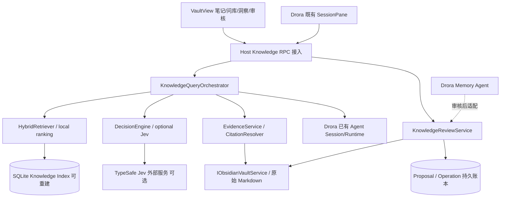
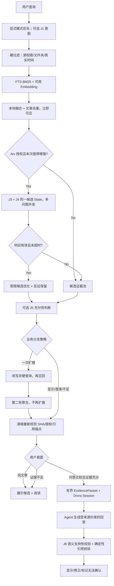
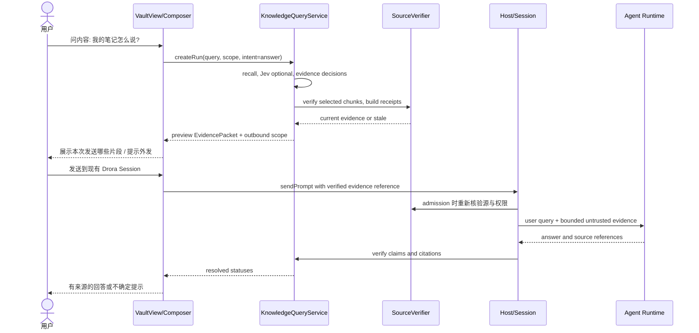

# Drora VaultView 2.0｜技术架构与文件级实施设计 v4.0

> **性质**：设计提案，尚未修改 Drora 仓库。**参考**：PRD v4.0、前序 R2（方案 C）、Jev 重排 v3.2；Drora HEAD tree `c1870c9c730975a02117e93e025ae486eb757cf1`。`JevDecisionProvider` 的网络参数需按最终选定的 TypeSafe SDK 实际协议实施，不在本稿臆造私有 API。  
> **原则**：先建立可检索/可验证的事实层，再叠加概率决策。Jev、回答模型、文件服务各司其职，所有有副作用操作由既有 Drora 权限体系及已确定的 C 分级审核执行业务硬约束。

## 1. 状态所有者总图



| 状态 | 唯一事实源 | 生命周期 | 读写规则 |
|---|---|---|---|
| 当前 Vault 的授权/根 | 当前 `vault-config.json` + VaultService | profile | 现有服务写入，hooks 只读 |
| 笔记内容 | Markdown 文件 | 永久 | 原生访问/安全门面，知识缓存不可覆盖 |
| 文件与片段索引 | Knowledge SQLite tables | 可重建 | 由租约持有人批量提交，引用前复核原文 |
| Jev 判定 | 绑定 query+chunk 的缓存 / QueryRun 记录 | 短期/有界 | 不能成为原文事实依据 |
| 来源引用 | EvidenceReceipt + 文件当前版本 | 与 query/session 关联 | 引用打开/生成前校验 |
| 用户会话 | Drora Session | Drora 既有 | 不新增第二套 Agent 历史 |
| Proposal/Apply 账本 | Review DB + 原文快照 | 持久 | 不因索引清理而删除 |
| UI 展开/选中候选 | Renderer scoped state | 会话展示 | 不是业务事实源 |

## 2. 服务拆分

| RPC 描述符 | 方法建议 | 领域唯一职责 |
|---|---|---|
| `IKnowledgeIndexService` | `getStatus(source)`, `requestRebuild`, `cancelJob`, `reconcile` | 管理 sourceEpoch、覆盖率、索引任务租约与恢复 |
| `IKnowledgeQueryService` | `createRun`, `search`, `getRun`, `prepareEvidence`, `resolveCitation`, `cancelRun` | 查找、证据准备、绑定 Session 和引用回跳 |
| `IKnowledgeDecisionService`（可与 QueryFacade 同进程不一定独立 RPC） | `getDecisionTrace`, `rerank`, `resolveSupport` | 将 Jev 作为可选 Provider，实现决策与降级 |
| `IKnowledgeReviewService` | `listProposals`, `createProposal`, `approve`, `reject`, `apply`, `reconcile`, `undo` | L2 审核、幂等写入、恢复与审计 |
| `IKnowledgeInsightService`（P1） | `list`, `openEvidence`, `feedback` | 关联/冲突候选和反馈 |

**默认实施建议**：仅注册 Index、Query、Review 三个公开 RPC，DecisionEngine 内部私有以减少暴露面；Inspector 的 Trace 可通过 Query.getRun 返回脱敏阶段记录。若单公开 RPC 的方法数超出 `architecture-policy.yaml` 公共方法限制，再独立追加 Decision descriptor。所有 DTO 与 channel 字面量必须唯一出处于 `packages/shared/`。

## 3. 数据结构草案

```ts
// 设计契约，不是现有仓库代码
export type KnowledgeIntent = 'find'|'answer'|'compare'|'edit'|'unknown';
export type QueryPhase = 'idle'|'local_recall'|'local_ready'|'jev_deciding'|
 'evidence_check'|'expand_once'|'ready'|'ambiguous'|'insufficient'|'degraded';
export type DecisionStage = 'intent'|'ambiguity'|'candidate'|'sufficiency'|'citation'|'followup';
export type SourceIdentity = { sourceId:string; sourceEpoch:number; vaultId:string };
export type QueryScope = {
  source:SourceIdentity;
  folderPrefixes:string[]; // validated under active authorized root
  sinceClippedAt?:string;   // only if genuinely recorded in clipped metadata
  untilClippedAt?:string;
  excludedTags?:string[];
};
export type KnowledgeQueryRun = {
  queryRunId:string; sessionId?:string; scope:QueryScope;
  query:string; intentOverride?:KnowledgeIntent;
  phase:QueryPhase; attempt:0|1; generation:number;
  indexCoverage:'full'|'partial'|'unknown';
  rerank:'local'|'jev'|'fallback';
  selectedArticleId?:string;
};
export type Candidate = {
  candidateId:string; docId:string; relativePath:string;
  headingPath:string[]; excerpt:string; chunkSha256:string;
  localRank:number; evidenceKind?:'direct'|'contradictory'|'context'|'uncertain';
  decisionId?:string; receiptId?:string;
};
export type EvidenceReceipt = {
  receiptId:string; queryRunId:string; sessionId?:string;
  source:SourceIdentity; relativePath:string; fileSha256:string;
  quoteExact:string; quotePrefix?:string; quoteSuffix?:string; headingPath:string[];
  createdAt:number;
};
export type DecisionRecord = {
  id:string; runId:string; stage:DecisionStage;
  rubricVersion:string; modelVersion?:string; inputHash:string;
  resultLabel:string; score?:number; status:'ok'|'fallback'|'timeout'|'rejected';
  usedOutbound:boolean; durationMs:number;
};
```

**严格契约限制**：所有来自模型的 `candidateId` 必须属于本次召回集合；裁定分支不能变更 scope；`decision.score` 有限且有效但不得成为用户感知准确率；引用中绝对路径由 VaultService 根据授权根解析；远控只查看同一 Host owner 关联的查询与会话。对齐 Drora Zod / RPC 现有模式，不透传 Node 句柄给 Renderer。

## 4. 决策执行图：避免“9 次请求层层串联”



**关键点**：在模型失效场景，依赖 deterministic fallback；若用户手选 FIND 则跳过 J1；如果原始标题 exact match 且内容对应，可以跳过 J3；若未授权出站，J1/J3/J4/J5/J6 不能远端运行，使用明确的本地替代策略。**不能因用了外部 Jev 就自动允许 Agent 模型查看正文**。

### 4.1 DecisionPort 与 Policy

```ts
export interface DecisionProvider {
  decide(input:{
    stage:DecisionStage;
    state:Record<string,unknown>;
    questions:ReadonlyArray<{id:string;kind:'noul'|'choice'|'score';rubric:string}>;
    abortSignal:AbortSignal;
  }):Promise<{answers:ReadonlyArray<{id:string;label:string;value?:number}>;version:string}>;
}

export interface DecisionPolicy {
  routeIntent(modelOpinion:unknown, explicit:KnowledgeIntent|undefined):KnowledgeIntent;
  classifyEvidence(candidates:Candidate[], opinions:DecisionRecord[]):Candidate[];
  chooseNext(run:KnowledgeQueryRun, candidates:Candidate[]):
    'show_candidates'|'generate_answer'|'expand_once'|'clarify'|'insufficient';
  validateRunGeneration(run:KnowledgeQueryRun, generation:number):void;
}
```

`JevDecisionProvider` 遵照 TypeSafe 实际 SDK 发送 `Noul/Choice/Score`，一条 candidate 一个 state；J3/J4 合批复用 state。避免空候选时调用、避免将 Markdown 内容作为指令、严格限定输入字符数。Provider 超时/429/无效输出不得抛出导致本地结果消失。`LocalDecisionProvider` 是明确降级策略（用户手选/关键词规则/不充分 → 保守展示），不是假装 Jev 离线也能同等智能判断。

### 4.2 受限二次检索

`maxExpansion=1`；只有在索引覆盖较好、明确缺直接证据且存在可尝试的同义表述时扩搜；优先保留原始 Query 并添加扩展 Query，聚合时保留第一轮候选，严禁删除用户指定 folder/date/source。总检索预算到时先返回已有候选，不等待递归 Agent。

### 4.3 证据门禁与语义支持

`EvidencePolicy` 区分 direct、contradictory、context 和 uncertain。真正的 `sourceVerifier` 必须校验当前 SHA + quote selector；得到 `unsupported` 的回答主张不能以受信引用呈现。判断 contradicted 与 unsupported 是语义任务，可交由 Jev 作为信号；文件 sha/文本存在性不是模型任务。

## 5. Agent 现有 Session 接入（高风险 Spike）



当前 Drora `conversationSelectionReference` 只把 `{text,path}` 放入 `# userselect:`，还不包含可验证 Receipt，因此需要新 Evidence 记录与 Session 关联。**Busy queue 是独立执行时点**，如果只在 UI 发送前校验，入队后文件或授权发生变化仍可使用旧上下文；T0/S02 必须实测真正的 admission 插入点，如暂做不到须标明“快照证据、生成时可能过期”，不能宣称绝对新鲜。

## 6. 存储结构建议

采用 SQLite；WAL 是优先候选，不是多 Host 问题的自动解决方案。将可重建索引与永久账本区分表、迁移和备份策略。

```sql
CREATE TABLE source_state(source_id TEXT PRIMARY KEY, profile_id TEXT NOT NULL,
 vault_id TEXT NOT NULL, epoch INTEGER NOT NULL, enabled INTEGER NOT NULL,
 updated_at INTEGER NOT NULL);
CREATE TABLE documents(doc_id TEXT PRIMARY KEY, source_id TEXT NOT NULL,
 epoch INTEGER NOT NULL, relative_path TEXT NOT NULL, file_sha256 TEXT NOT NULL,
 indexed_at INTEGER NOT NULL, UNIQUE(source_id,epoch,relative_path));
CREATE TABLE chunks(chunk_id TEXT PRIMARY KEY, doc_id TEXT NOT NULL,
 heading_path_json TEXT NOT NULL, content TEXT NOT NULL,
 chunk_sha256 TEXT NOT NULL, start_line INTEGER NOT NULL, end_line INTEGER NOT NULL);
CREATE VIRTUAL TABLE chunks_fts USING fts5(content, content='chunks', content_rowid='rowid');
CREATE TABLE index_jobs(job_id TEXT PRIMARY KEY, source_id TEXT NOT NULL, epoch INTEGER NOT NULL,
 fencing_token INTEGER NOT NULL, lease_owner TEXT NOT NULL, lease_until INTEGER NOT NULL,
 phase TEXT NOT NULL, updated_at INTEGER NOT NULL);
CREATE TABLE query_runs(run_id TEXT PRIMARY KEY, source_id TEXT NOT NULL, source_epoch INTEGER NOT NULL,
 session_id TEXT, query_hash TEXT NOT NULL, status TEXT NOT NULL, created_at INTEGER NOT NULL);
CREATE TABLE decision_audit(id TEXT PRIMARY KEY, run_id TEXT NOT NULL, stage TEXT NOT NULL,
 input_hash TEXT NOT NULL, result_label TEXT NOT NULL, status TEXT NOT NULL,
 model_version TEXT, rubric_version TEXT NOT NULL, elapsed_ms INTEGER NOT NULL);
CREATE TABLE evidence_receipts(id TEXT PRIMARY KEY, run_id TEXT NOT NULL,
 source_id TEXT NOT NULL, source_epoch INTEGER NOT NULL,
 relative_path TEXT NOT NULL, file_sha256 TEXT NOT NULL,
 selector_json TEXT NOT NULL, created_at INTEGER NOT NULL);
CREATE TABLE proposals(id TEXT PRIMARY KEY, source_id TEXT NOT NULL, source_epoch INTEGER NOT NULL,
 target_path TEXT NOT NULL, proposal_revision INTEGER NOT NULL, base_sha256 TEXT NOT NULL,
 status TEXT NOT NULL, created_at INTEGER NOT NULL);
CREATE TABLE operations(operation_id TEXT PRIMARY KEY, proposal_id TEXT NOT NULL,
 status TEXT NOT NULL, before_sha256 TEXT, after_sha256 TEXT, updated_at INTEGER NOT NULL);
```

**SQL 是数据库结构草案，不是即刻可运行的完整迁移**：需要单独定义 FTS external-content triggers / rowid 对应、查询参数与索引删除时同步；严禁直接运行草案但不实现同步触发器。FTS5 原生分词对中文效果不做假设，需实测 n-gram/Tokenizer 后确定正确方案。Decision audit 默认只存哈希与枚举，不保留用户原文全文或敏感模型响应。

## 7. 跨窗口 Host / Source 身份

- Host A/B 均提供 RPC，但 index job 使用共享 SQLite 的 **lease owner + monotonically increasing fencingToken + generation**；只有最新 fence 可以提交事务，旧 Host 迟到响应被拒绝。
- Source 为 `profileId + vaultId + sourceEpoch`；`vaultId` 当前来自规范路径 hash，移动 Vault 后 ID 变化，不能仅凭它当作永久知识身份；切库/重新授权递增 epoch 并清理短期 query caches。
- 租约过期后新 Host 重新对文件系统 reconcile；原文才是事实源。改变 sourceEpoch 后旧 Receipt/decision/query 应失效。
- 原文件外部改写时索引可以暂时 stale；查询或打开引用时必须重读源，不能只信赖索引。
- 多窗口批准 Proposal 使用 operation UNIQUE + 相同 `(sourceId,path)` 协调；外部 Obsidian 并发编辑仍有竞态，需要实证和冲突显式反馈。

## 8. 出站、缓存、隐私

- **Jev 默认为关闭**；“仅本次允许”绑定 normalizedQueryHash、candidateSetHash、sourceEpoch、providerId、sessionId、操作期限，任何一项变化失效。
- **远程 Embedding 另授权**；“允许 Jev”绝不允许把整个 Vault 发给任意模型。
- Jev state 最多包含 query、标题、小节、截断片段，不上传绝对路径/系统凭证；默认不持久化正文请求日志。
- Cloud agent 答案生成时的证据出站要独立展示和确认。即使 Jev 被拒绝，也可以本地找文章。
- 判定缓存 Key：sourceEpoch + fileSHA/chunkSHA + normalizedQueryHash + rubricVersion + modelVersion + providerId；撤权/切 Vault/原文变更清理。cache miss 优先回本地排序。
- PII/剪藏内容属于不可信用户数据，不能由 source 内容改变策略或触发工具。

## 9. 错误、降级、可观测性

| 技术事件 | 预期反馈 | fallback | 关键检测 |
|---|---|---|---|
| candidate recall 空 | 无可靠命中 | 可提示换词、检查索引 | coverage=full/partial 分开 |
| lexical 有结果但 semantic 离线 | 只用了部分召回策略 | 词法 | 明示语义不可用 |
| Jev 未授权 | 使用本地排序 | local | 出站计数 0 |
| Jev 429 / 超时 | 智能排序未完成 | local 保留已显示结果 | abort + generation gate |
| Jev 非法 candidateId / NaN | 忽略响应 | local | schema+membership check |
| J5 建议无限扩搜 | 最多一次 | BranchPolicy 上限 | attempt <=1 |
| 已选文章在后台重排换位 | selection 不变 | selectedArticleId 锚定 | 不自动切右栏 |
| 切 Vault/文件变更 | 当前来源待核验 | receipt stale | sourceEpoch + SHA |
| LLM 回答含虚假引用 | 引用不可信 | 无 clickable badge | receipt membership |
| write conflict | 重新审核 | 不写盘 | revision + expectedSHA |
| 未授权源 | 需要配置 | 不猜测路径 | permission hard check |

Trace 只记录：阶段 id、policy/model version、durationMs、fallback、去敏 Hash、使用的候选数、扩搜次数、branch、来源核验状态。默认用户不可见原始概率明细；仅在诊断面板打开。禁止向日志写整篇笔记、绝对路径、凭证或完整 Query。

## 10. 文件级实施地图（均为提案）

### S0｜先做 Spike、维护 specs

| 操作 | 文件 | 目标 |
|---|---|---|
| NEW | `specs/obsidian-knowledge.md` | PRD/决策/Source/Index/Query/Decision/Proposal 完整状态、异常和验收 |
| MODIFY | `specs/obsidian-plugin.md` | 记录方案 C 与 hooks 改动，删除历史错误描述前先确认当前实现 |
| NEW | `specs/obsidian-decision-engine.md` | 阶段/路由策略/出站字段白名单/降级矩阵 |
| MODIFY | `apps/drora-cli/packages/obsidian-plugin/src/hooks/permission-request.ts` | 限制 `.obsidian` 和高风险 Markdown 自动授权，但工具层仍需实测 |
| MODIFY | `apps/drora-cli/packages/obsidian-plugin/src/lib/agent-access.ts` | 路径与扩展名/风险判定公共函数，尽量不修改还原代码 |
| NEW | `packages/services/test/knowledge/spikes/*.test.*` | 两 Host 并发、真正 Agent submit、写路径覆盖和中文召回 Spike |

### M1｜索引与查询服务

| 操作 | 文件 | 目标 |
|---|---|---|
| MODIFY | `packages/shared/src/channels.ts` | 通道名单一出处（3 个建议 RPC） |
| NEW | `packages/shared/src/knowledge.ts` | DTO/Zod、error codes、外发授权和引用契约 |
| MODIFY | `packages/services/src/index.ts` + `packages/services/src/node.ts` | service descriptor 暴露/注册到 createLocalServices |
| NEW | `packages/services/src/knowledge/source/registry.ts` | 只读 Vault 配置并计算 sourceEpoch |
| NEW | `packages/services/src/knowledge/index/coordinator.ts` | job lease/fencing/reconcile |
| NEW | `packages/services/src/knowledge/index/markdown-chunker.ts` | 章节、frontmatter、元数据、行号/quoteSelector |
| NEW | `packages/services/src/knowledge/index/store.ts` | SQLite migration、事务、FTS 插入/删除一致性 |
| NEW | `packages/services/src/knowledge/query/lexical.ts` | 中文词法检索/有界 MATCH |
| NEW | `packages/services/src/knowledge/query/semantic.ts` | provider adapter，可离线/独立授权 |
| NEW | `packages/services/src/knowledge/query/fusion.ts` | RRF、文章级聚合、limit/diversity |
| NEW | `packages/services/src/knowledge/query/orchestrator.ts` | QueryRun、generation、取消/扩搜上限 |
| NEW | `packages/services/src/knowledge/query/source-verifier.ts` | 权限/源版本/引用锚点复核 |

### M2｜Jev 决策与控制

| 操作 | 文件 | 目标 |
|---|---|---|
| NEW | `packages/services/src/knowledge/decision/decision-provider.ts` | Jev/Local Port 类型，不把 SDK 泄漏给查询领域 |
| NEW | `packages/services/src/knowledge/decision/jev-provider.ts` | SDK 适配、超时、并发、响应校验（先查官方 API） |
| NEW | `packages/services/src/knowledge/decision/local-decision.ts` | 缺授权/异常可用保守路径 |
| NEW | `packages/services/src/knowledge/decision/intent-policy.ts` | 用户显式意图优先、unknown 可澄清 |
| NEW | `packages/services/src/knowledge/decision/evidence-policy.ts` | J3/J4 同次 candidate state 规则 |
| NEW | `packages/services/src/knowledge/decision/branch-policy.ts` | J5 分支与 expand-once 硬上限 |
| NEW | `packages/services/src/knowledge/decision/claim-policy.ts` | J6 引用语义支持分类 |
| NEW | `packages/services/src/knowledge/decision/consent.ts` | 仅本次出站授权与 TTL/source scope |
| NEW | `packages/services/src/knowledge/decision/audit.ts` | 脱敏记录/效果对照 |

### M3｜VaultView 交互 / 现有 Agent

| 操作 | 文件 | 目标 |
|---|---|---|
| NEW | `packages/ui/src/v4/vault/VaultShell.tsx` | Vault 四视图 tab 及活动源/索引摘要 |
| NEW | `packages/ui/src/v4/vault/VaultSmartQueryView.tsx` | 问库输入、状态机、结果与追问 |
| NEW | `packages/ui/src/v4/vault/VaultArticleCandidates.tsx` | 文章级候选列表和“找不到”提示 |
| NEW | `packages/ui/src/v4/vault/VaultEvidenceInspector.tsx` | 片段原文 + 核验状态 |
| NEW | `packages/ui/src/v4/vault/VaultDecisionTrace.tsx` | 折叠的多阶段执行与降级说明 |
| NEW | `packages/ui/src/v4/vault/VaultRerankConsentDialog.tsx` | Jev 出站 scope + 本次同意/拒绝 |
| NEW | `packages/ui/src/hooks/useVaultQuery.ts` | host RPC + queryGeneration + selectedArticleId |
| MODIFY (wrapper first) | `packages/ui/src/v4/VaultView.tsx` | 复用已有笔记编辑实现，集中四页签组装 |
| MODIFY (extension first) | `packages/ui/src/v4/SessionPane.tsx` | @Vault 附证据、busy queue/恢复落点；须 S02 Spike |
| MODIFY (extension first) | `packages/ui/src/app-shell/WorkspaceShellLayout.tsx` | 引用回跳 Vault 原文/侧栏定位 |
| NEW | `packages/ui/src/v4/vault/VaultInsightsView.tsx`、`VaultReviewView.tsx` | P1 入口 |

### M4｜审核、跨端、质量

`packages/services/src/knowledge/review/` 下新增 proposalRepo、operationRepo、riskPolicy、applyCoordinator、snapshotStore、reconcile/undo；沿用既有 VaultService 文件安全门面。P1 关联洞察只读；移动远控与现有 Host attachment 共用 query/receipt state，不复制会话。所有新服务符合 `architecture-policy.yaml` 的 managed 约束、跨包公开入口和文件长度限制。

## 11. 测试分组与阻断

- **Stage-FIND**：准确命中、无答案、混淆、仅关键词、同义改写、中文术语、硬过滤器、二次检索最多一次。
- **Stage-JEV**：每 candidate 独立 state、J3/J4 批问题、对齐候选 id、超时/429/invalid、原结果保留、取消与旧回包拒绝。
- **Stage-EVIDENCE**：无权/过期/删除/重命名/大文件/软链、恶意注入文章、虚假来源 ID、语义支持性。
- **Stage-SESSION**：@Vault E2E、Drora 真实 Busy queue、重新接管、断线恢复、切换模型/provider、手机复用同一会话。
- **Stage-REVIEW**：L2 未审不写、旧批准作废、并发 CAS/重试/unknown/reconcile/Undo、Bash/MCP 等执行覆盖。
- **Stage-UX**：深浅主题、按 `text-ui-*` 分级、中英文 UI 长文字、键盘、移动窄视口、工具状态默认折叠。

**发布门禁**：不能验证来源则不能显示已验证引用；不能拦住受审写入则不能启用自动知识写回；未通过中文真实 Vault 测试则不能宣称精准检索已可用。真实 Jev 效果需要与本地基线 A/B，而不是根据公开英文法律数据集做承诺。

## 12. 评审待办

1. 验证 Drora 当前 `createLocalServices`、Workspace/Host 相关路由对新 descriptors 的适配，确保 Web 与 Desktop 差异有明确 fallback。
2. 验证 Node `node:sqlite` 的 FTS5、中文分词、WAL 以及两个 Electron Host 并发/迁移/恢复。
3. 选择准确 TypeSafe Jev SDK 版本并对 Noul/Choice 调用、速率限制、费用做真实 Spike。
4. S02 找到真正的 Agent admission 入证据点；如需扩大修改还原代码，必须在 specs 记录回源证据。
5. 对风险 C 的“自动允许 Markdown”定义工具层约束，不单靠 PermissionRequest Hook。

**参考**：Drora 仓库 `https://github.com/CavinHuang/Drora`；TypeSafe `https://docs.typesafe.ai/cookbooks/rerank_typesafe`。