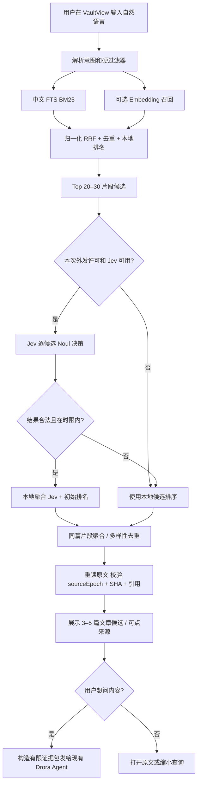

# Drora VaultView 2.0 · Jev 候选重排交互与技术设计 v3.2

**定位**：Jev 只对已召回的候选片段进行语义相关性决策；基础检索、原文核验、用户授权、Agent 回答和高风险写入继续由 Drora 现有或新增的独立服务实现。

**已确认决策**：VaultView 四主视图；方案 C 风险分级写入；首屏先展示文章候选；Jev 默认关闭且失败不影响本地搜索。

**阅读顺序**：本页包含 v3.2 新决策与落地细节；完整产品背景、其他页面和写入审核见 PRD v3.2。

## 1. Jev 候选决策重排设计

> **裁定 D32-01**：Jev 是 `KnowledgeQueryService` 的一个可插拔 Reranker，不是 Vault 数据库、Agent Runtime、模型供应商全局路由或最终事实判断器。**Jev 不能写笔记、不能越过来源验证、不能强制选中一篇文章、不能补回初始检索遗漏的文章。**
>
> **裁定 D32-02**：Jev 默认为 **关闭**；只有用户明确同意将本次查询及候选笔记片段发送至指定远端提供商、且已配置凭证，才允许调用。关闭或失败时可正常使用本地混合检索。
>
> **裁定 D32-03**：在 P0 先实现稳定的 `Noul` 单项相关性判断；`Score` 作为可选实验辅助判定，`Choice` 仅允许用于两三个近似候选且必须有“都不匹配”选项，不作为初版主排序。

### 0C.1 为什么需要 Jev

用户只记得“某篇文章提到大上下文窗口不能代替长期记忆”，但文章本身可能写成“上下文扩容无法取代持久化知识管理”。词法搜索容易错过；语义 Embedding 能提高召回，但排序靠前的可能只是主题相近而未表达具体观点。Jev 的职责是**在一组已有候选中比较查询与原文片段的命题匹配程度**。

三层成功条件必须区分：

1. `Recall@30`：相关段落是否进入前 30 个候选（由词法/语义召回负责）。
2. `Hit@1 / Hit@5 / MRR`：文章级候选是否排在前面（Jev 的主要评价维度）。
3. `Citation Validity`：用户点击引用时，文件当前确实包含该证据（文件系统 + Receipt 验证负责）。

**关键安全限制**：Jev 只负责概率决策；不得把 `noul=0.91` 显示成“文章准确率 91%”，也不得将相关性估计等同于可核验来源。

### 0C.2 查询全链路与阶段责任



硬过滤器：授权 Vault、文件夹范围、实际存在的收藏时间、排除目录、文件大小/路径安全、已失效来源，全部由**确定性代码**执行。**任何模型不得修改硬过滤器或授权范围。**

### 0C.3 Jev 的输入、输出与评分决策

- **输入内容最小化**：用户本次 Query、最多 20–30 条候选的必要片段（每段建议上限 1,000–1,500 中文字符）、标题/小节标题和有限标签；不发送原始绝对路径、私有 Profile 信息、全部 Vault 内容、凭证或其他会话历史。
- **请求粒度**：官方重排示例使用**一条候选对应一次请求**。为控制成本/延迟，可限制进入 Jev 的候选条数并使用并发池；同一个候选的 `Noul` + 实验性 `Score` 可共享一份 state，不假定支持把 30 段一次提交后自动返回稳定的独立分数。
- **主决策 Noul**：`这个段落是否明确支持用户想要找的特定观点，而不是只讨论相似主题？` 返回 `[0,1]` 相关性估计。
- **Score 辅助（实验）**：分级 0 不相关、1 仅主题相关、2 涉及部分主张、3 直接陈述主张；只有 A/B 验证有效才加入融合分数。
- **Choice**：初版不用来决定 Top 1，因所有候选不相关时也容易产生看似唯一的答案。未来如用于两篇对比必须包括 `none`。
- **输出处理**：检查 `candidateId / score / 状态 / 使用的 rubricVersion / modelVersion`。只接受输入候选清单中的 ID、有限且数值合法的分数；不接受模型自报的文件路径或引用。
- **融合**：使用可测试的单调融合，例如 `0.35 * normalizedLocal + 0.65 * jevNoul` 作为**实验起始权重**；禁止直接上线视为固定真值。原文精确命题、用户明确指定标题等情况下允许规则保障；最终由离线评测调权重。
- **无答案策略**：若最高候选仍低于实验阈值（例如 `noul < 0.45`）或候选相互接近，界面显示“不确定，可能是这几篇”，而不是宣布找到唯一目标；阈值由验证集标定。

**Jev 无权决定“文章可信”或“引用有效”。** 带有不可信指令的剪藏文章在 Jev 中仅作为待判断文本，绝不作为系统规则。

### 0C.4 运行策略与缓存

| 项 | v3.2 初始设计值（均待 Spike 调优） | 失败语义 |
|---|---|---|
| 候选池 | FTS + 向量融合后 Top 30 片段 | 召回不足时直接用已有候选，不补造数据 |
| Jev 输入上限 | Top 20，候选过多可分批扩至 30 | 超额返回本地排序，展示覆盖范围 |
| 并发 | 4–8 | 限流/429 用短退避，不阻塞候选首屏 |
| 单次调用超时 | 3 秒（实验值） | 单候选回退 local |
| 全阶段预算 | 6 秒（实验值） | 超时停止等待，沿用本地顺序 |
| 缓存键 | Profile + sourceEpoch + hash(query normalized) + chunk SHA + rubric/model 版本 | 修改任一项自动失效 |
| 缓存策略 | 仅本机，默认不持久化全文出站请求 | 撤权、Vault 切换、索引重建清理 |
| 提供商 | TypeSafe/经确认兼容的 Jev 决策 API，凭证存 Drora 安全配置 | 未配置显示不可用，不假造响应 |
| 默认选择 | **仅本地混合排序** | 不出站、不依赖 Jev |

**性能目标**：本地候选先显示，Jev 作为可取消的异步“优化排序”完成后原位更新。用户已点选并正在阅读的文章不能因为后台排序变动而被自动替换；需保留选择锚点和可感知的排序更新提示。页面关闭、Query 改变或 sourceEpoch 更新时取消旧请求；旧响应不得覆盖新结果。

### 0C.5 交互与文案（K02 智能问库）

| UI 部位 | 默认 | 开启 Jev | 故障/降级 |
|---|---|---|---|
| 输入框下方 | `检索：词法 + 语义（如可用） · 排序：本地` | `排序：Jev 辅助` | `排序：本地（Jev 未完成）` |
| 右侧「查找方式」 | 显示召回是否完整、索引是否更新 | 显示 Jev 是可选的候选重排服务 | 显示失败原因和“重试重排” |
| 候选列表 | 第一屏先渲染本地排序，不显示 AI 百分比 | 可选“查看排序变化”展示 local rank → 新 rank | 保留本地排序，不清空候选 |
| 文章条目 | 原文命中、文件路径、元数据 | 增加“观点直接匹配/主题相近”的**解释性标签（来自可验证原文和规则）** | 不使用“Jev 认为可信/已证实”等夸大标签 |
| 授权弹窗 | 无远端请求 | 明示“本次问题及候选片段将发送到 Jev 提供商”，显式选择授权 | 拒绝后继续使用本地排序，不能阻塞问库 |
| 对话追问 | 保留授权范围 | 追问属于新 Query，重新检查许可和缓存 | 不能静默复用仅适用于前次请求的许可 |

**设置状态**：`仅本地（默认）` / `本次允许 Jev` / `长期允许 Jev（用户显式持久选择）`。取消授权后停止新的请求、清除可清理的本地相关缓存，但不能宣称可删除第三方已收到的数据；出站的保存/保留期限必须以实际供应商政策为准，不假设零留存。

### 0C.6 权限策略与 Drora 分工

- `VaultView` 负责用户选择模式、展示排序和来源；不调用供应商 HTTP，不持有密钥。
- `IKnowledgeQueryService` 负责唯一 Query 状态与来源范围（sourceEpoch / workspaceIdentity），把候选交给 `RerankerPort`。
- `JevReranker` 位于 Host 服务层，经 Drora 既有 provider / credential / network 策略注入 HTTP 客户端；API Key 只能在安全存储/Host 中读取，不进入 renderer 或日志。
- `RerankPolicy` 在 Host 校验出站开关、允许的 Provider、单次 Consent Token、候选片段上限、费用/请求预算、取消信号。出站禁止时执行 `LocalReranker`，**不调用网络**。
- 现有 `VaultService` 仅做原文授权和安全读取，Jev 不接触文件写入。方案 C 的 L1/L2/L3 写入等级及 Proposal 审核流程**完全不变**。
- `Drora Agent` 只在问内容/比较阶段接收独立核验的 Evidence Packet。Jev 评分不直接进入 Agent 系统指令；可携带检索方法元数据作为不可信参考，不可带“请忽略此前规则”等内容。

### 0C.7 建议新接口（设计合同，尚未进入真实代码）

```ts
export type RerankMode = 'local' | 'jev';
export type RerankStatus = 'disabled' | 'running' | 'ready' | 'partial' | 'timeout' | 'error' | 'denied';
export interface RerankCandidate {
  candidateId: string; sourceId: string; chunkId: string; chunkSha256: string;
  title: string; headingPath: string[]; excerpt: string; localRank: number;
  localScore: number; // 本地归一化分数，不是概率
}
export interface RerankRequest {
  queryId: string; workspaceIdentity: string; sourceEpoch: number;
  query: string; candidates: RerankCandidate[]; mode: RerankMode;
  consentReceiptId?: string; // 由 Host 验证，不能由 renderer 自报为授权
}
export interface RerankCandidateResult {
  candidateId: string; localRank: number; finalRank: number;
  jevNoul?: number; finalScore: number;
  status: 'scored' | 'local-fallback';
}
export interface RerankResponse {
  queryId: string; status: RerankStatus; sourceEpoch: number;
  modelId?: string; rubricVersion: string;
  candidates: RerankCandidateResult[];
  fallbackReason?: 'disabled'|'consent'|'provider'|'timeout'|'quota'|'invalid_response'|'cancelled';
}
```

RPC 边界不暴露原始密钥，也**不允许 renderer 提交自定义 URL 或冒充 Provider**。旧请求需要用 queryId + sourceEpoch 双重门禁抑制迟到结果。高优先级状态变化（撤权/更换 Vault）必须使可见缓存立即失效。

### 0C.8 文件级研发实施（在 v3.1 的文件清单上增量）

```text
packages/services/src/knowledge/
  rerank/rerankerPort.ts          # RerankerPort：单候选判断 + 有界批处理
  rerank/jevReranker.ts           # Jev provider adapter，只走注入的服务端 transport
  rerank/localReranker.ts         # RRF 本地降级实现
  rerank/rerankPolicy.ts          # 出站许可、字数、并发、预算和取消
  rerank/rerankFusion.ts          # 规则+本地特征+Jev 分数融合及文章聚合
  rerank/rerankCache.ts           # query/chunk/model/rubric 版本缓存与撤权清理
  rerank/rerankTelemetry.ts       # 不记录原文的延迟/调用/失败指标
  contracts/rerankTypes.ts        # 编解码校验、结果枚举、版本
  search/evidence-verifier.ts     # 现有 proposal：保证重排结果回跳前重新验源
packages/ui/src/v4/vault/
  VaultRerankControl.tsx          # 本地/Jev 模式切换、排序说明
  VaultRerankConsentDialog.tsx    # 出站许可（本次/长期/拒绝）
  VaultRerankTrace.tsx            # 仅用于诊断的排序变化 local → Jev
  VaultConversationalSearchView.tsx # 接入重排状态、结果列表局部更新
packages/shared/src/channels.ts  # 如复用现有 Query RPC 则不新增频道；若新增需集中常量
```

按 `AGENTS.md` 先写独立 Spec，再建契约、单元测试及 Host 接入。所有新模块放自研目录，避免直接改写还原代码。真正可交互 UI 应通过 `packages/ui/src/hooks` 获取服务，不直接调用 `window.drora`。

### 0C.9 验收与 A/B 实验

采用至少 **150 条脱敏、人工标注的中文 Vault 找回任务**，覆盖已知标题、同义改写、观点记忆、跨语言缩写、相似主题迷惑项、正确文章缺失、来源过期与剪藏噪音。

| 编号 | 验收点 | 通过条件 |
|---|---|---|
| J01 | 召回充分性 | 首先测 `Recall@30`；相关文章没进候选池时不可归咎于 Jev |
| J02 | 排名增益 | 同一候选池对比 local vs local+Jev 的 Hit@1/Hit@5/MRR；至少 Hit@1 显著改善且不损害无答案判断，是否设阈值由试点基线确认 |
| J03 | 中文噪声与专名 | 中英混排、同义改写、文章标题无关键词、三篇近似命题时仍可解释排名 |
| J04 | 无答案拒识 | 空答案样本不可强制选一篇，并记录 abstention 错误率 |
| J05 | 外发隐私 | 默认/明确拒绝 Jev 时，无 Jev 网络请求，凭证和绝对路径均不出站 |
| J06 | 超时降级 | 429/5xx/超时/不合法响应不阻断本地结果，UI 标记降级 |
| J07 | 会话竞态 | 查询 A 与 B 交错，A 的迟到重排不能覆盖 B 的候选 |
| J08 | 来源真实性 | Jev 高分不能为失效文件生成有效 Receipt；引用跳转需重新核验 |
| J09 | 缓存隔离 | sourceEpoch、chunkHash、模型/规则版本变化、撤权均正确失效 |
| J10 | 成本延迟 | 报告 P50/P95 本地首屏、Jev 优化完成时间、单次请求数和总输入 token；未完成评测前不承诺体验指标 |
| J11 | 人工核验 | 对同意/拒绝开关、排序变化、候选列表选择锚点进行逐屏可用性验证 |

**分期**：T0 只做可重复的离线排序对比与 Jev 适配 Spike；T1 完成本地混合检索及证据核验；T2 在明确授权下灰度接入 Jev；通过回归基线后才允许默认提示用户打开 Jev，**不自动开启**。

### 0C.10 来源与事实边界

- **Drora 代码已核对**：`specs/obsidian-plugin.md`、`DESIGN.md`、`packages/ui/src/v4/VaultView.tsx`、`packages/services/src/obsidian-vault/`；已有 Vault 原生工具、Hook、文件版本控制，但**不存在**本节描述的 Jev 领域重排模块。
- **官方 Jev 文档**：<https://docs.typesafe.ai/cookbooks/rerank_typesafe>。官方例子是 CLERC **40 条英文法律检索**，BM25 先召回 30 个段落，逐候选 Noul 重排；文档报告 Top-1 5%→18%、Top-10 38%→62%。不能把它当成中文 Obsidian 实测成绩。
- **本方案自主设计**：候选数量、超时预算、融合权重、缓存键、许可 UX、代码文件和验收指标均为提案，必须先在 Drora 运行环境中测试。

---
