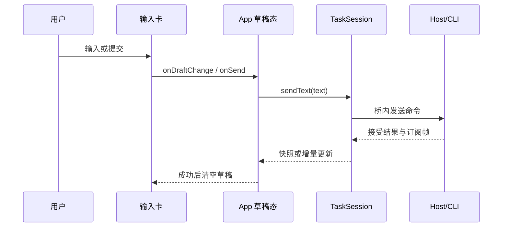
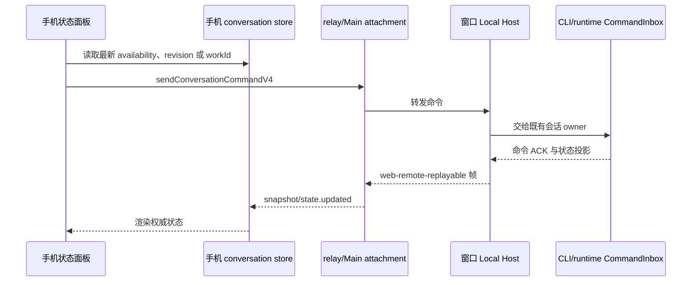
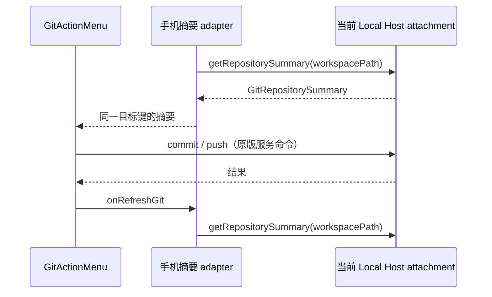
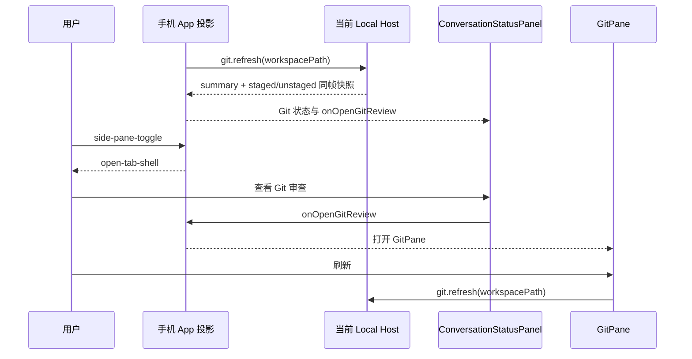

# R3 路线 A：自建官方级移动前端（完整对齐方案）

状态：**P0/P1 部分已实施；本轮先交付独立、离线的 3.14.3 兼容资产包**。上游依据 = `specs/mobile-relay-server.md`（R1/R2/协议对齐/
资产托管，§11 分歧矩阵已清零）+ `specs/mobile-web-remote.md`（M4/M4c 桌面侧桥全貌与
原版证据索引）+ 2026-09-29 实机取证（内置浏览器 414×896 / 1280×720 双视口抓取官方
活页 DOM/截图，产物 `.tmp-work/official-live-*.html`）。

## 0. 为什么现在做、以什么为对齐基线

本轮之前，LAN/自建 relay 的手机页默认走**官方资产代理**（cache→fetch z.ai→R2 兜底，
`desktopMobileLanRelayHost.ts`）；D7 已将 LAN 与同仓 relay CLI 的默认入口改为本地快照。
旧形态三处硬伤：①依赖官方源站在线与资产布局稳定；
②`wss://zcode.z.ai/ws` 字面量改写脆弱（§12.5 二次实测教训，浏览器内存缓存还要求破
缓存）；③官方页含账号/营销/WAF 验证码面（`zcode-aliyun-captcha-container`），非我方可
控。§12.5–12.8 双栈对比已证明**官方页可完整跑在我们的栈上**（配对/引导/桥/九深服务面
逐字节同构）——即桌面侧与 relay 侧的 v4 服务面已经就绪；D7 提供可离线托管的冻结页，
后续 P2–P4 仍需替换成自有源码前端。
R3 路线 A 定案（82 轮）：复用 `@drora/ui` 组件树 + 既有 rpc 桥，v4 数据原生零转换。

对齐基线 = 官方 3.14.3 页行为快照（`packages/mobile-web/upstream/` 冻结资产 +
`official-live-*.html` 实机 DOM + 双栈对比方法论）。官方页后续演进不跟随，分歧记录于本 spec。

## 1. 目标与非目标

**目标**

- G1 **自有移动前端**：`@drora/ui` 共享组件树 + 移动壳，产物由 relay-server 托管于
  `/remote/v4`，同源直连自建 relay（零改写、离线可用），替换官方资产代理为默认。
- G2 **双布局同一构建**：窄视口（<900px）移动单列壳，宽视口（≥900px）完整应用壳——
  对齐官方同构建双布局（§12.8 实测）。
- G3 **v4 数据面原生**：手机侧直接说 rpc-frame（bootstrap/bridge-open/rpc-frame 全
  族），不经过 `drora-page-request` v1 翻译层；时间线/工具卡/composer 为真实组件流式
  渲染，非文本投影。
- G4 **状态面逐项对齐**：四步加载卡、11 张失败卡、重连/挂起/宽限期语义（§2 清单）。
- G5 **契约单一出处**：relay 线协议纯逻辑（HMAC proof、帧组装/checksum、水位常量）
  收敛到 shared，桌面/relay-server/手机端三方同源。

**非目标**

- 不复刻官方账号绑定、营销触点、插件资产 CDN（`cdn-zcode.z.ai`）与 WAF 验证码面。
- 不做 PWA/离线缓存/推送通知（后续可选立项）。
- 不改 relay 服务端职责边界（纯转发，业务真相源仍在桌面 Host——AGENTS.md 不变量）。
- 桌面 Electron 与 `packages/web` 主入口（HTTP+WS 连 server 的形态）本轮不改布局；
  移动壳按能力位（capability）门控，桌面主入口默认不启用（有意保守，见 D1）。

## 2. 对齐清单（实机取证定案，验收对照表）

**过渡状态机（手机侧，对齐官方 RelaySession）**

| 状态           | 进入                                                                | 退出                                  | 我方落点                     |
| -------------- | ------------------------------------------------------------------- | ------------------------------------- | ---------------------------- |
| idle           | 初始                                                                | connect()                             | relay-client                 |
| connecting     | connect()                                                           | ws open→authenticating                | relay-client                 |
| authenticating | ws open，发 auth_init{role:"terminal"}                              | challenge→proof→auth_ack              | relay-client                 |
| waiting        | 鉴权过、未配对                                                      | paired / 陈旧恢复 / kicked            | relay-client + 四步卡第 3 步 |
| paired         | auth_ack{matched}                                                   | 断线→reconnecting                     | relay-client                 |
| reconnecting   | socket 断/健康检查失败/手动（指数退避 500ms×2ⁿ 封顶 10s，4 触发点） | 重连成功/终态                         | relay-client                 |
| suspended      | 页面隐藏/失活（15s recoverConnection 窗）                           | 恢复/超时→connection-recovery-timeout | relay-client                 |
| kicked         | error{KICKED}                                                       | 终态                                  | 失败卡 session-conflict      |
| error          | 非接管类故障                                                        | 可重试                                | 失败卡按 code                |

**宽限期而非立即判死**：DEVICE_OFFLINE → `desktopOfflineFailureTimer` 宽限 → 超时才
终态卡 desktop-disconnected；bootstrap 无应答 → desktop-bootstrap-timeout（描述文案
"手机端已经连上 relay，但桌面端没有及时返回工作区数据。"）。

**四步加载卡**（官方实机确认存在，R2 已逐字对齐）：1 连接中转服务 / 2 设备鉴权 /
3 等待桌面端配对 / 4 同步工作区；标题态含「已配对，正在加载工作区…」。

**11 张失败卡**（badge/title/tone/nextSteps 对齐，R2 已验证文案可直接移植）：
session-not-found / session-expired / session-conflict（已被其他设备接管）/
workspace-closed / desktop-disconnected / invalid-mobile-connection /
desktop-bootstrap-timeout / connection-recovery-timeout / relay-unavailable /
unsupported-action / unexpected-error。

**移动首页**：连接徽章（已连接到当前桌面窗口/未连接）、说明段、主题按钮、命令面板
入口、「当前设备上的工作区和任务」标题 + N 工作区 · N 任务、收起全部/整理任务/刷新、
工作区分组折叠列表（名称/本地·远程标记/路径/更新于/任务数）、任务行（标题/相对时间/
状态 pill：运行中·已完成）。

**移动会话面**：返回首页、任务标题、更多菜单、状态侧板（后台任务 pill）、富时间线
（思考块含持续时长、工具卡可展开——查阅/终端/读取及参数摘要、markdown 含代码块与
表格、复制/分叉/撤销/赞踩、文件变更统计）、**完整 composer**（排队语义占位「继续输入
以排队后续修改」、添加上下文、切换模式、模型选择器、推理档、上下文用量表、停止生成）。

**宽视口全壳**（≥900px）：侧栏（新建任务/搜索/插件市场/项目树+任务数/用户页脚）+
主区问候空态/完整 composer/快捷操作——即桌面 `Root` 树原样可用。

**深服务九面**（§12.8 已双栈验证的清单作为回归集）：新建任务全壳、模型选择器（活
数据）、优先级菜单、变更前确认、搜索命令面板（tabs+最近+建议）、插件市场、富时间线、
任务头更多、KICKED 卡。

## 3. 总体架构

```
手机浏览器（自建移动前端，/remote/v4）
  React 19 + @drora/ui 共享树（移动壳 ⇄ 宽视口全壳，capability 门控）
  ├─ relay-client（新模块）：RelaySession(terminal) + RpcFrameBridge + 诊断事件
  │    WSS 同源 /ws?mid=…（零改写）
  ├─ RelayRemotePlatform：IPlatformService ←→ platform-request 应用帧（8 方法，M4a 已对齐）
  └─ v4 会话 RPC：rpc-frame 直驱（bootstrap → workspace-bridge-open → conversation 流）
        │
自建 relay（packages/relay-server，不改业务边界）
        │  device 侧既有链路
桌面 Main：desktopMobileRelayControl（M4c 流控/重放/背压已接线）
  └─ Host attachment（web-remote-replayable 语义）→ 桌面 Host（唯一业务真相源）
```

**所有者划分（不变量沿用）**：连接/配对状态=relay 服务端；设备凭据=relay 持久层；
业务数据=桌面 Host；手机侧 UI 局部状态（草稿/pending overlay）不得当作服务端事实；
busy/running 输入仍由 CLI/runtime CommandInbox 串行 admission（composer 排队语义的
数据来源）。

## 4. 模块决策（D1–D5）

- **D1 移动壳放 packages/ui，capability 门控**：新增 `packages/ui/src/mobile/`
  （MobileHomeShell / MobileTaskShell / 状态卡族 / mobileShell i18n 命名空间）。壳
  选择在 RootShell 层按「远程移动能力位 + 视口 <900px」分支；桌面与 web 主入口不设
  该能力位 → 行为零变化。新断点常量 `REMOTE_SHELL_VIEWPORT_QUERY`（width<900px），
  与既有 `MOBILE_VIEWPORT_QUERY`（767px+触屏，交互微调用）并存不合并；顺手收敛
  `v4/SessionPane.tsx:496` 的重复定义。
- **D2 线协议收敛 shared，三方同源**：纯逻辑（computeProof/信封校验/帧组装+checksum
  hex/ordinal/MTU 探测/水位与 grace 常量）提为 `packages/shared` 的 relay-wire 区
  （或独立小包 `relay-protocol`，P0 按架构检查建议定）。消费方：desktop（现
  desktopMobileRelayProtocol.ts 改引用）、relay-server（protocol.ts 对应面）、新
  relay-client。R2 页内嵌 HMAC 实现迁移后删除，RFC 4231+node:crypto 交叉单测随迁。
  线协议字面量（`zcode_type` 等）是官方兼容键，**保持原名不 Drora 化**（互操作必需，
  对照 mobile-web-remote.md 既有定案）。
- **D3 relay-client 新模块**（`packages/relay-client`，浏览器环境，注册
  architecture-policy.yaml，managed:false，依赖 shared）：RelaySession（terminal 角色
  全状态机+心跳 pair*status_query+重连退避+suspended 恢复+desktopOffline 宽限）、
  RpcFrameBridge（组装/ack/重放缓冲客户端侧，常量同源）、emitDiagnostic 7 类事件
  （state-transition/pair-status/recover-*/socket-\_）。
- **D4 远程入口 = 独立 mobile-web 包**：本轮按 D7 先在
  `packages/mobile-web/upstream` 封装 3.14.3 原版页面与动态资产；后续源码化时，
  在同包新增 React 入口，复用 `packages/ui` 的移动壳与 `relay-client`，不改
  `packages/web` 主入口。产物保持 `<out>/remote/v4/<version>/assets/*` 的官方路径形状，
  **不做版本门控**（同仓发布天然配套）。relay-server 的 `mobileRoot` 托管优先级为
  staticRoot 测试床 > 本地 mobile-web > cacheDir 官方代理 > R2 兜底 302。
  冻结快照仍需由 relay-server 出站改写 WebSocket 端点；未来源码入口直接使用同源 `/ws`。
- **D5 R2 页与 v1 桥保留为兜底层**：离线/资产缺失 302 → `/m/index.html` 链路不变；
  `drora-page-request` v1 桥（serveMobilePageAction）只为 R2 兜底页服务，R3 验收后
  不再演进（退役另立决策）。

## 5. 实施分期与验收

| 期  | 内容                                                                                                                                               | 验收                                                                                   |
| --- | -------------------------------------------------------------------------------------------------------------------------------------------------- | -------------------------------------------------------------------------------------- |
| P0  | 本 spec 评审定案；架构登记（relay-client/mobile 边界）；契约键与常量盘点（全链 grep 生产/消费）                                                    | architecture:check 过；无孤儿键                                                        |
| P1  | wire 层收敛 shared + relay-client TS 落地；单测（HMAC/组装/checksum/水位对齐官方常量；官方偏移证据随注）                                           | 对 embedded relay 的终端全状态 conformance（waiting/paired/踢/离线/宽限/重连）         |
| P2  | packages/ui 移动壳 MVP（首页+会话面+四步卡+失败卡族）+ remote 入口可构建可跑                                                                       | LAN 真机扫码全流程；与官方页双栈截图对比：首页+时间线两面 SHA 一致（时间戳类差异除外） |
| P3  | 富面：composer 全功能（排队/上下文/模式/模型/用量/停止）、工具卡/代码/表格流式渲染、命令面板、主题、整理任务                                       | §2 九深服务面逐面双栈对比同构；11 失败卡+KICKED 逐字节                                 |
| P4  | 健壮性：断网/杀桌面/二终端踢端到端（重放不丢不重）、mobile-diagnostic+遥测上报、构建性能（分包，避免官方 6.2MB 单文件教训）                        | E2E 全场景 + 真机弱网手测；首屏 <官方基线                                              |
| P5  | 切换：LAN QR 默认 → 自建页（`desktopMobileLanRelayHost` 端点翻转）；官方资产代理降级为测试床选项；spec/文档/技能引用清理；DESIGN.md 补移动壳规范段 | 离线装机冷启动可用（不触外网）；`pnpm verify:pre-push` 全绿                            |

每期收口必须：`pnpm typecheck` + `pnpm lint` 真实结果、架构检查、行为改动配测试、
交互改动配 E2E；双栈对比沿用 `.tmp-work` 既有方法论（同视口截图 SHA-256 + DOM 落盘）。

## 6. 风险与对策

- **ui 组件桌面假设**（窗口控制/多窗口/更新器等）：web 主入口已有 no-op platform
  先例，RelayRemotePlatform 按能力位降级；发现组件硬依赖桌面能力时在 hooks 层加能力
  分支，不在组件里散落 if。
- **v4 schema 漂移**（session/messages 教训）：协议边界 schema 校验为准，漂移修复先
  补 spec 再动代码；对齐基线冻结 3.14.3，新增官方能力不自动跟随。
- **宽视口全壳体积**：全树可用但按路由懒加载；官方单文件 6.2MB 是反面教材。
- **双传输互斥**：弹层切 tab 即切链路（§12.4 既有收敛），R3 不改变。
- **凭据安全**：QR 仍是 sid+hash 长期凭据，刷新即轮换；页面不缓存凭据到
  localStorage 之外的位置（官方 sessionStorage 快照仅主题/壳态，照做）。

## 7. 有意分歧记录（审查对照用）

| #   | 分歧                                               | 理由                                                                         |
| --- | -------------------------------------------------- | ---------------------------------------------------------------------------- |
| 1   | 无版本门控/版本资产库                              | 同仓发布，页面与桌面配套演进（§7 既有决策沿用）                              |
| 2   | 无账号/营销/验证码面                               | 私有部署不需要；WAF 面属官方基础设施                                         |
| 3   | 端点同源推导，无 z.ai 硬编码改写                   | 自建页天然同源；官方镜像测试床保留改写逻辑                                   |
| 4   | error.message 空串（对齐）但服务端日志保留诊断细节 | §12.6 既有定案                                                               |
| 5   | 桌面/web 主入口暂不启用移动壳                      | 保守切换，待 R3 稳定后另议（届时 packages/web 手机访问即可免费获得移动布局） |
| 6   | 鉴权 challenge/ack 监督 10s                        | 官方无此定时器，本仓自加强化，relay-server 容忍                              |
| 7   | suspended 恢复取 15s 平窗 + 3s 健康检查简化        | 官方 recoverConnection 同构语义                                              |
| 8   | INTERNAL 处理 = paired 回 waiting / 否则立即重连   | 对齐官方                                                                     |
| 9   | DEVICE_OFFLINE 保持原 socket + 宽限重挂            | vs 官方关 socket + 立即重连（终态等价）                                      |
| 10  | 配对心跳首条 query 立即发送                        | 官方先等一个 interval                                                        |
| 11  | auth_init 不带官方 meta{platform, version, name}   | 服务端不校验                                                                 |

## 8. 契约键与常量盘点（P0 产出，2026-09-29 全链 grep）

范围 = `packages/desktop`、`packages/relay-server`、`packages/shared` 非 test src。
行号基线 = 当日工作树。relay-server 对 data `payload` 纯转发不解析（`relayServer.ts:396`
仅 matched 双向转发 + 盖章），故其在表中只出现在信封/HMAC/错误码面；`zcode_type`
的生产/消费全部落在桌面两端与手机端。

### 8.1 `zcode_type` 线协议字面量（任务点名 12 值 + 同族补全）

| 字面量                       | 桌面生产                                  | 桌面消费                                                                       | 手机端                              | 单一出处判定                             | R3 收敛 shared 后消费方       |
| ---------------------------- | ----------------------------------------- | ------------------------------------------------------------------------------ | ----------------------------------- | ---------------------------------------- | ----------------------------- |
| rpc-frame                    | `desktopMobileRelayProtocol.ts:397`       | 同文件 :312（类型）/:785（parse）、`desktopMobileRelayControl.ts:1440`（分派） | relay-client 生产（R3）；官方页生产 | 散点字面量、两端各一处（未收敛，非重复） | desktop、relay-client、移动壳 |
| rpc-frame-ack                | `desktopMobileRelayProtocol.ts:418`       | `desktopMobileRelayControl.ts:1443`                                            | relay-client 消费（ack 驱动流控）   | 同上                                     | 同上                          |
| bootstrap-request            | —                                         | `desktopMobileRelayControl.ts:1278`                                            | relay-client 生产                   | 同上                                     | 同上                          |
| bootstrap-response           | `desktopMobileRelayControl.ts:1282/:1291` | :566（重放入选/日志分支）                                                      | relay-client 消费                   | 同上                                     | 同上                          |
| workspace-bridge-open        | —                                         | `desktopMobileRelayControl.ts:1432`                                            | relay-client 生产                   | 同上                                     | 同上                          |
| workspace-list-request       | —                                         | `desktopMobileRelayControl.ts:1307`                                            | relay-client 生产                   | 同上                                     | 同上                          |
| workspace-list-response      | `desktopMobileRelayControl.ts:1311/:1320` | :567（日志分支）                                                               | relay-client 消费                   | 同上                                     | 同上                          |
| workspace-reconnect-request  | —                                         | `desktopMobileRelayControl.ts:1436`                                            | relay-client 生产                   | 同上                                     | 同上                          |
| workspace-reconnect-response | `desktopMobileRelayControl.ts:1144/:1151` | —                                                                              | relay-client 消费                   | 同上                                     | 同上                          |
| mobile-view-state-update     | —                                         | `desktopMobileRelayControl.ts:1418`（:256 注释）                               | 移动壳生产                          | 同上                                     | 同上                          |
| mobile-diagnostic            | —                                         | `desktopMobileRelayControl.ts:1462`；白名单 :1273                              | 移动壳/relay-client 生产            | 同上                                     | 同上                          |
| telemetry-report             | —                                         | `desktopMobileRelayControl.ts:1447`；白名单 :1273                              | 同上                                | 同上                                     | 同上                          |

同族补全（盘点发现，R3 契约一并登记）：`platform-request`（消费 :1476，RelayRemotePlatform
生产）、`platform-response`（生产 :1486/:1496）、`workspace-list-updated`（桌面主动推送，
生产 :658）、`workspace-bridge-ready`（生产 :1085）、`workspace-bridge-error`（生产 :901）。
v1 桥 `drora-page-request`/`drora-page-response` 属 R2 兜底面（D5 不演进）：`phonePage.ts:332/:354`、
`desktopMobileRelayControl.ts:1340/:1356/:1400/:1407`。

特例：`packages/shared/src/drora-protocol-v4/wire-codec.ts:60` 出现 `drora_type:"rpc-frame"`——
仅 `measureTopicNotificationEnvelopeBytes` 最坏情形字节计量（与 `zcode_type` 等长，测量等价），
**非线上生产/消费**；收敛时保留该口径注释，防止被误读为第二命名空间。

### 8.2 data 信封字段与字符集约束

| 字段                                    | 生产                                                                                               | 校验/消费                                                                                                                                  | 单一出处判定                               |
| --------------------------------------- | -------------------------------------------------------------------------------------------------- | ------------------------------------------------------------------------------------------------------------------------------------------ | ------------------------------------------ |
| `client_ts`                             | `desktopMobileRelayControl.ts:549`（出站统一；另 :1541/:1684/:1736）、`phonePage.ts:302/:307/:353` | `relay-server/src/protocol.ts:74/:84`（isDataEnvelope，`typeof number`，无有限性检查）、转发透传 `relayServer.ts:409`                      | 校验单点（protocol.ts）；生产散点          |
| `server_ts`                             | `relay-server/src/wire.ts:8/:39`（出站统一盖）、`protocol.ts:89-93`（stampServerTs）               | 官方手机页 schema 消费；时钟不参与我方语义                                                                                                 | 单点                                       |
| `payload`                               | 各端应用帧                                                                                         | `protocol.ts:73`（`Record<string,unknown>`），转发不解析                                                                                   | 单点                                       |
| `bridgeSessionId`（rpc 帧内层传输标识） | `desktopMobileRelayProtocol.ts:348/:697`                                                           | 匹配校验 :434/:786（仅 `typeof string`）；字符集约束 = `relay-server/src/protocol.ts:14` `TRANSPORT_ID_PATTERN /^[A-Za-z0-9._~-]{1,64}$/u` | 格式定义单点，但**声明未强制**（见 8.6-5） |

信封语义注释（真机取证）：`desktopMobileRelayControl.ts:546-548`——缺 `client_ts` 裸帧被
WRONG_PARAM 拒收；有 `type` 缺 `client_ts` 被接受但静默不转发（2026-09-27 实锤）。
`TRANSPORT_ID_PATTERN` 当前仅定义 + 导出（`protocol.ts:14`、`index.ts:6`），relay-server src
内无任何消费方，桌面侧只查字符串类型——字符集约束实际未在链路上强制。
另注：shared v4 家族 `drora-protocol-v4/core.ts:71` `transportEnvelopeIdMaxChars: 256` 与 relay
家族 64 上限**同概念不同值**（wire-codec.ts:56 计量按 256 取最坏，保守成立）——两族各自成立，
收敛时不得互改。

### 8.3 流控常量（官方常量表 @6729 取证）

| 值             | 常量                                     | 定义处                              | 引用处                                                                               | 判定 |
| -------------- | ---------------------------------------- | ----------------------------------- | ------------------------------------------------------------------------------------ | ---- |
| 1MiB（水位）   | `RELAY_SATURATION_HIGH_WATER_MARK_BYTES` | `desktopMobileRelayProtocol.ts:491` | :564（ReplayBuffer 构造）                                                            | 单点 |
| 256KiB（水位） | `RELAY_SATURATION_LOW_WATER_MARK_BYTES`  | `desktopMobileRelayProtocol.ts:493` | :565                                                                                 | 单点 |
| 8MiB           | `RELAY_REPLAY_BUFFER_MAX_BYTES`          | `desktopMobileRelayProtocol.ts:495` | :566                                                                                 | 单点 |
| 45s            | `RELAY_REPLAY_BUFFER_GRACE_MS`           | `desktopMobileRelayProtocol.ts:497` | :567；间接 `desktopMobileRelayControl.ts:828`（degraded 延迟）、:1073-1076（注入口） | 单点 |

同值 1MiB 的**其他定义**（官方 `maxPhysicalFrameBytes` 源，语义不同、数值相同）：relay-server
`protocol.ts:7` `MAX_WS_PAYLOAD_BYTES`（入站 WS 硬上限，消费 `relayServer.ts:80`，超限 ws 库断开）；desktop
`desktopMobileRelayControl.ts:206` `MAX_APP_FRAME_BYTES`（出站应用帧 oversize 拒收，消费 :553）。
注释引用：`desktopMobileRelayProtocol.ts:298/:302`（消息 ≤16MiB、分片 ≤64、dataBase64 ≤1MiB、
单分片 640KiB 预算 :303）、`desktopMobileRelayControl.ts:189/:199/:204/:554`。shared v4 家族
`drora-protocol-v4/core.ts:65` `maxFrameBytes: 1024*1024` 同值不同源（另一协议），不并入收敛。
R3 消费方：relay-client（发送侧水位/重放/分片预算，常量同源）+ desktop/relay-server 改引用。

### 8.4 HMAC proof 构造格式串

`proof = HMAC-SHA256(passHash, "<nonce>|<role>|<deviceSid>", base64url)`——**三处定义（8.6-1）**：

1. `relay-server/src/protocol.ts:26-36` `computeProof`（canonical；:42-56 `verifyProof`
   timingSafeEqual + base64url/base64 双兼容）。
2. `desktop/src/main/desktopMobileRelayProtocol.ts:81-90` `calculateRelayProof`
   （`` `${nonce}|${role}|${sessionId}` ``）。
3. `relay-server/src/phonePage.ts:95-96`（R2 页内嵌纯 JS HMAC-SHA256
   `PHONE_PAGE_CRYPTO_JS` :8-96，role 硬编码 `"terminal"`；D2 定案迁移后删除）。

`derivePassHash`（sha256→base64）仅 `desktopMobileRelayProtocol.ts:77-79` 一处。
R3：收敛 shared（D2），relay-client 浏览器端用 WebCrypto；RFC 4231 + node:crypto 交叉单测随迁（§5 P1 验收）。

### 8.5 错误码族

定义单点：`relay-server/src/relayServer.ts:70-76` `ERROR_CODES`（authFailed/wrongParam/kicked/
deviceOffline/internal）→ 消费 :182/:187（deviceOffline 终端方向）、:220/:248/:251/:278/:295/:318/:381（wrongParam）、
:324（authFailed）、:352/:356（kicked）。
字面量在消费方重复硬编码（8.6-2）：desktop `desktopMobileRelayControl.ts:1610`（KICKED→kicked 重连）、
:1623（AUTH_FAILED persisted 重注册）、:1635（WRONG_PARAM paired/waiting 噪音容忍）、:1652（INTERNAL 可恢复重连）；
R2 页 `phonePage.ts:322-324`（KICKED/DEVICE_OFFLINE/AUTH_FAILED/WRONG_PARAM → 失败卡）。
R3 消费方：relay-client 错误分派状态机（§2 状态表）+ 移动壳失败卡映射（KICKED→session-conflict、
DEVICE_OFFLINE→desktop-disconnected 宽限、AUTH_FAILED/WRONG_PARAM→鉴权失败面）。

### 8.6 重复定义清单（P1 收敛工作清单）

1. **HMAC proof 格式串 ×3**：8.4 全列——收敛 shared 后 desktop/phonePage 两处删除，relay-client 用 shared 形状。
2. **错误码字面量 ×3 处**：relay-server `ERROR_CODES` + desktop 4 字面量 + phonePage 4 字面量——收敛 shared 常量族。
3. **1MiB relay 家族 ×2 + 水位 1 处**：`MAX_WS_PAYLOAD_BYTES`（relay-server）与 `MAX_APP_FRAME_BYTES`（desktop）
   同源官方 `maxPhysicalFrameBytes`，收敛 shared 单常量；`RELAY_SATURATION_HIGH_WATER_MARK_BYTES` 官方独立常量
   （恰好同值），单独登记不合并。v4 家族 `maxFrameBytes` 不动。
4. **crc32→8 位小写 hex ×2 套实现**：desktop `desktopMobileRelayProtocol.ts:326-341`（CRC32_TABLE + crc32）、
   :363（crc32ToWire）与 shared `drora-protocol-v4/wire-binary.ts:10-17`（crc32WireBytes）——同 IEEE crc32 同
   hex 口径、两套实现；收敛 relay 家族那份到 shared（wire 纯逻辑区），v4 家族不动。
5. **`TRANSPORT_ID_PATTERN` 声明未强制**：`relay-server/src/protocol.ts:14` 定义、`index.ts:6` 导出、src 零消费；
   收敛 shared 后由 relay 入站校验、桌面出站构造、relay-client 生成三方共同消费补齐强制点。

非 `zcode_type` 的 relay 帧 `type` 字面量（auth_init/auth_challenge/auth_response/auth_ack/
pair_result/pair_status_query/data/error）同属线协议家族，P1 wire 区登记时一并收编；本节不展开。

## 9. 2026-09-29 本地 3.14.3 页面快照交付（D7）

本轮用户要求独立包、完整 PC/手机页面和局域网自建服务。当前检出中的
`relay-client` 只有 port/type/clock，`packages/ui/src/mobile` 只有展示壳，尚不能
原生驱动完整官方 v4 RPC 服务面。先把已经取证的官方 3.14.3 页面字节封装为
`packages/mobile-web/upstream/remote/v4`，独立构建到 `dist/remote/v4`，由自建
`relay-server` 同源托管。此快照是有来源标记的还原资产，不能混入自研源码；
`packages/web` 主入口保持独立。后续源码化替换仍按 D1–D5 分期。

**产品规则**：`/remote/v4` 与官方 QR 六参数形状一致；窄视口和宽视口都由同一
3.14.3 构建负责。LAN 内嵌 relay 优先读取打包在本地的 mobile-web 资产；自建云
relay 的 CLI 默认读取同包 `upstream/`，部署时可用 `--mobile-dir` 指向构建产物。
只在本地包不可用且启用兼容代理时向官方拉资产；本地
入口资产缺失时继续沿现有 `/m/index.html` 兜底，其他缺失资产 404；本地包存在
时不向官方拉取资源。页面 WS 端点由既有
`staticAssets.ts` 出站重写为当前 host 的 `/ws`，不得回连官方 relay。

**所有者与接口**：桌面 Host 仍拥有任务、会话和消息；relay-server 只拥有连接、
配对和静态资产路由；mobile-web 只拥有不可变页面资产。`mobileRoot` 是静态
根路径注入，不引入第二条业务写入路径。官方快照不做源码内修改；自建接入通过
现有 relay-server 的 JS 出站重写实现。

```text
desktop Host (业务状态) ← attachment → device WS ─┐
                                                  relay-server ── terminal WS → 页面
mobile-web/dist (不可变资产) ───── GET /remote/v4 ──┘
                                                /ws?mid → 挑战 → 配对 → bootstrap → rpc-frame
```

**验收**：①无外网时 `/remote/v4`、其版本资产都返回本地字节；②页面 JS 出站
不包含官方 relay 的硬编码 WS URL；③带 QR 参数入口正常加载 PC/手机布局；
④保留 `staticRoot` 测试床优先级、防穿越与 R2 兜底；⑤ LAN QR 指向自建 relay
本地页面；⑥ `pnpm typecheck`、`pnpm lint`、架构检查与 relay 集成测试均运行。

**迁移边界**：本交付实现离线可加载的官方 3.14.3 页面快照，保留该版 UI 与浏览器
运行时代码；真桌面配对与只读操作已验证，消息写入、弱网和失败恢复仍须 E2E 验收。它不是
独立编写的 React UI 源码。后续若需要脱离官方资产的可维护实现，按上文 P2–P4
将共享 UI 和 relay-client 逐面替换，不能把二进制快照视作已完成源码化。

**独立 Electron + CDP 实测（2026-09-29）**：使用独立应用身份及 Electron
userData/sessionData 运行本仓，与正在使用的 Drora Dev 窗口分离；默认工作区数据库
仍可见，因此仅对现有任务做只读验证。修复弹层 idle 自动开启后，二维码自动
生成；内置浏览器经该二维码完成鉴权、配对、bootstrap、工作区桥接，桌面弹层显示
“手机已连接”。414px 视口出现移动工作区首页，展开工作区并打开现有任务后，时间线
与完整 composer 均加载；1280px 视口出现 PC 侧栏与同一任务会话；刷新入口后恢复
到任务会话。此轮没有向现有任务发送新消息，也未覆盖弱网、踢端和全部失败卡。

### 2026-09-29 入口还原错误修正

本地隔离 Electron + CDP 配对后确认 PC 全壳、手机首页与任务会话均由真实 Host
响应。核对静态入口时发现，最初从 `.tmp-work/official-page/remote/v4/index.html`
复制的文件曾为诊断临时插入 `window.__wsLog` 和 `?v=selfhost2`。这不是原版行为，
只能作为还原错误修正：官方 `https://zcode.z.ai/remote/v4?app_version=3.14.3`
返回的入口 HTML 在字节偏移 **10646** 为
`<script type="module" crossorigin src="/remote/v4/3.14.3/assets/index-NjWRUABD.js">`；
本仓旧快照在字节偏移 **10655** 含 `window.__wsLog`，并把同一 `src` 改成
`index-NjWRUABD.js?v=selfhost2`。替换为原版入口字节后，端点改写仍只发生在
relay-server 的 JS 出站路径。资产检查应拒绝这两个诊断标记。

### 2026-09-29 发行资产源码恢复取证

官方公开仓库 `zai-org/ZCode` 的 `v3.14.3` tag 指向
`29628c9acdb81b703bbd4080c207a0e7ce5e276e`；GitHub 完整 tree（7458 项，
`truncated=false`）中没有 `remote/v4`、`mobile-web` 或 `relay-client` 源码。
本地 3.14.3 快照中的 2488 个 JS 文件均无 `sourceMappingURL`；源站主入口
`/remote/v4/3.14.3/assets/index-NjWRUABD.js.map` 返回 HTTP 404。因此不能声称从
发行文件精确恢复官方原始 TSX、模块边界或标识符。任何格式化的 bundle 都应标为
“由发行资产恢复的可读 JS”，保留 `upstream/` 原始字节作为对照；自研 React/TypeScript
实现则按 P2–P4 接入现有共享 UI 和 relay 协议，不与还原资产混放。

**本轮恢复规则**：`mobile-web/src/recovered/remote/v4` 保存从冻结快照格式化的可读
HTML/JS/CSS 和原样复制的字体、图片、WASM；文件名与相对引用保持 3.14.3 原样，
以免破坏动态 import、预加载图和 wasm 定位。构建只从该目录复制到 `dist`；开发态
LAN 与 relay CLI 直接读取该目录，桌面打包读取同目录。`upstream/` 保留为逐字节
证据，不再作运行时默认入口。relay-server 继续拥有鉴权、配对和静态路由；手机页只
拥有浏览器 UI 与局部状态；Host 继续拥有任务和会话。WS 出站同源改写仍由
relay-server 执行，恢复阶段不另建连接实现。

验收：①恢复目录资源图闭合，文件数与上游快照一致；②构建输出与恢复目录逐文件
相同；③ JS/CSS 可解析，页面在 LAN 真配对后能进入手机与 PC 布局；④
`upstream/` 哈希不变；⑤ `typecheck`、`lint`、架构检查和相关测试真实运行。
可读恢复稿仍含编译后的 React runtime 与短标识符，不等同于 P2–P4 的可维护
React/TypeScript 重写。

首次恢复工具验证发现 9 个高度压缩 chunk 在 `oxfmt` 第一遍展开后还需第二遍才能
稳定（包括主入口 JS 与主 CSS）；恢复脚本固定执行两遍，并以 `oxfmt --check` 验证。
独立 Electron + CDP 真配对回归：414×896 视口进入移动工作区首页，1280×896
视口进入 PC 全壳；两次页面运行的 uncaught `pageerror` 均为 0。此验证覆盖入口、
配对、bootstrap 与双布局，没有重新测试消息发送和弱网恢复。

## 10. 2026-09-29 官方源码可得性终版调查（源码化前置确认）

对本轮"把 mobile-web 从静态发行资产推进为可维护源码包"的前置问题——官方是否公开
3.14.3 远控页源码或 sourcemap——做了终版取证（GitHub API + CDN 实测 + 本地克隆
`.tmp-work/zai-upstream` 比对）：

| #   | 证据                                                                                                                                                                  | 结论                                                 |
| --- | --------------------------------------------------------------------------------------------------------------------------------------------------------------------- | ---------------------------------------------------- |
| 1   | `zai-org/ZCode` 公开仓（Apache-2.0）`v3.14.3` tag → `29628c9`，完整 tree 7458 项无 `remote/v4`/`mobile-web`/`relay-client` 源码；GitHub 代码搜索 `"remote/v4"` 0 命中 | 远控页部署变体源码不在公开仓                         |
| 2   | 公开版 `packages/web/src/main.tsx` `connectRemote()` 直接抛 `"Remote connect is not supported in Web mode yet"`                                                       | Web 端远控连接实现在公开入口被显式禁用，未随源码发布 |
| 3   | 官方 `packages/web/vite.config.ts` 生产构建 `sourcemap: "hidden"`，注释明言"生产不在浏览器产物暴露 sourceMappingURL，避免客户端侧还原业务源码"                        | 官方有意不发布 sourcemap                             |
| 4   | CDN 实测 `zcode.z.ai/remote/v4/3.14.3/assets/` 下 6/6 个 `.js.map`/`.css.map` 全部 404（对照同源真实资产 200）；全部发行 JS 尾部无 `sourceMappingURL` 注释            | sourcemap 不可得，非探测方式问题                     |
| 5   | 部署入口 HTML 与 `BASE_URL=/remote/v4/3.14.3/` 构建配置不在公开仓；公开 `packages/web`+`packages/ui` 与部署页**同族但非同构**                                         | 公开源码骨架可作语义参照，不可作字节来源             |

**结论：源码化唯一可行路径 = 自研实现。** `upstream/` 冻结快照保留为对照证据；
任何"从官方源码/sourcemap 恢复"的路线不可行，后续不再复查此前提（除非官方
release 显式变更源码披露范围）。

## 11. D6（补录 103–109 轮用户裁定）：ui+desktop 冻结、移动 UI 自包含

此前 103–109 轮的实现未及落入本 spec 即因未提交丢失（见 §12 背景），现按工作树
证据与用户裁定补录：

- **`packages/ui` 与 `packages/desktop` 冻结**：R3 期间不为移动页改动这两包；
  `packages/ui/src/mobile/` 的展示壳（MobileHomeShell/MobileTaskShell/StatusCards，
  D1 产物）就地冻结，仅作自包含化的移植参照。
- **移动 UI 全自包含**：手机页 UI 组件与文案全部落在 `@drora/mobile-web`
  （`src/ui/`、`src/intl/`），不 import `@drora/ui`；i18n 在包内本地化
  （zh-CN/en-US 字典同构校验）。
- 桌面 LAN host 的本地快照默认（`desktopMobileLanRelayHost.ts` 读
  `src/recovered`）在冻结期内不动；桌面侧切换源码入口归 P5 端点翻转一并处理。

## 12. D8（本轮决策）：数据层复用 rpc/client/services 公开入口，UI 自包含不变

**背景**：103–109 轮曾按"全自研 19 帧链 + 全量页面复刻"路线实现（relay-client
21 模块 + `mobile-web/src/ui` 全量页面），未提交即丢失——现树仅存
`relay-client/dist` 编译残留（sourcemap 无 `sourcesContent`，原始 TS 不可还原）与
空的 `src/ui`/`src/intl` 目录。重写评估：v4 服务面（`drora-protocol-v4` 全族 zod
schema + 服务描述符 + 会话/工作流订阅语义）自研复刻成本不可控，且与 renderer
服务面漂移风险高；官方页 bundle 6.2MB 单文件正是把整棵服务/组件树编译进页面的
结果，逐字节复刻它不符合"可维护"目标。

**决策**：

- **数据层复用公开入口**（方向 `mobile-web → relay-client → shared`；
  `mobile-web → rpc/client/services`）：桥端口即 Host 服务面（与 renderer 同源，
  `RemoteServiceAccess` 的服务描述符族），移动端不重写 v4 协议栈。
- **桥内载荷复用 MessagePort 语义**：rpc-frame 重组后的消息字节 = ChannelClient
  序列化字节（裸 `Uint8Array`，无附加分帧——`MessagePortProtocol` 同构，桌面 main
  `bridge.port.postMessage(Buffer)` 直传）。移动端以自定义 `IMessagePassingProtocol`
  适配 relay-client 的 rpc-frame 通道，经 `@drora/client` 的
  `connectViaProtocol` 获得 `IServiceAccessor`。
- **UI 全自包含不变（D6）**：`src/ui` + `src/intl` 自持；ui 展示壳仅作参照。
- **首页数据面不走服务**：bootstrap/workspace-list 走 relay 应用帧
  （`zcode_type` 族，桌面 `handleAppFrame` 已实现），任务面走桥内服务（实现事实：
  任务面读路径 = 桥内 droraAgentService.hello/initialize 握手 +
  conversationRowsRangeV4 尾窗行分页；写路径 = sendConversationCommandV4(sendText)；
  P3 流式订阅面仍归后续期）——两面的所有者边界与官方一致（relay 应用帧=连接/投影层，
  服务面=业务层）。
- **桌面冻结不变（D6）**：desktop LAN host 与打包在冻结期内继续用
  `src/recovered` 快照；独立 relay CLI `--mobile-dir` 语义不变。

## 13. P2a（本轮实施）：能从源码构建的入口

**范围**：

1. **shared relay-wire 收敛 relay 家族 rpc-frame 纯逻辑**（§8.6-3/8.6-4 落地）：
   常量（16MiB/64 分片/640KiB 分片预算）、crc32→8 位 hex、checksum 线格式兼容、
   帧类型守卫与组装器/编码器（浏览器安全 Uint8Array + 纯 base64）；desktop
   `desktopMobileRelayProtocol.ts` 改引用 shared 出处并 re-export。
2. **relay-client 会话核心重建**（消费 `types.ts`/`ports.ts` 既有设计）：九态
   状态机、auth 三步握手（proof 走 shared relay-wire：computeProof 纯 JS 单一实现
   （shared），经 codec port 可注入替身）、pair_status_query 心跳、指数退避重连、
   suspended 恢复窗、
   DEVICE_OFFLINE 宽限、错误码→失败卡映射；data 应用帧通道（requestId 关联、
   oversize 拒收）；rpc-frame 通道（发送侧 messageSeq/水位/重放缓冲，接收侧
   组装 + 逐消息 ack）。
3. **mobile-web 源码应用**：vite + react + tailwind 自包含构建
   （`build` = `vite build`），产物保持官方路径形状
   `dist/remote/v4/`（entry）+ `dist/remote/v4/3.14.3/assets/*`；四步加载卡、
   失败卡族、首页（bootstrap/workspace-list 真实数据渲染）、任务面基础版
   （bridge-open；任务面读路径 = 桥内 droraAgentService.hello/initialize 握手 +
   conversationRowsRangeV4 尾窗行分页；写路径 = sendConversationCommandV4(sendText)
   经 composer 提交；P3 流式订阅面仍归后续期）；`src/intl` zh-CN/en-US 同构。
4. **relay-server bundled 根优先级**：`dist/`（源码应用，entry 存在才启用）>
   `src/recovered/`（快照回退，D7 行为保底）> 内建资产代理 > R2 兜底；
   `--mobile-dir` 显式注入仍最高。WS 出站改写对源码应用为 no-op（应用内无官方
   URL 字面量，直连同源 `/ws`）。本节 dist 语义取代 §9『本轮恢复规则』中『构建
   只从该目录复制到 dist』的表述（快照构建改经 build:snapshot --out 输出独立页面
   包，不再写 dist）。

**验收**：

- `pnpm --filter @drora/mobile-web build` 从 `src/` 产出官方路径形状入口与资产；
  产物无 `zcode.z.ai` 字面量、无 `sourceMappingURL`。
- relay-server 默认（无 `--mobile-dir`）托管 dist 入口；dist 缺失时回退
  recovered 快照（D7 回归不变）；`upstream/` 哈希不动。
- shared relay-wire 单测覆盖 RFC 4231 交叉向量（packages/shared/test/）；
  relay-client 单测消费 shared computeProof：握手/proof、状态机迁移表、
  rpc-frame 组装/ack/水位/重放、错误码映射。
- relay-server 集成测试覆盖新优先级链；`pnpm typecheck`、`pnpm lint`、架构检查
  真实运行。

**与 P2/P3 的差距（后续期，不构成本轮验收）**：富时间线（工具卡展开、markdown/
代码高亮、文件变更统计、复制/分叉/撤销）、composer 全功能（排队/上下文/模式/
模型选择/用量/停止）、命令面板、整理任务、宽视口全壳（≥900px 桌面布局）、
mobile-diagnostic/telemetry 全量上报、分包与体积优化（避免单文件大 bundle）、
真机弱网/踢端 E2E。

## 14. P3a（本轮实施）：任务面流式 + 富时间线第一档 + composer 状态驱动

对齐基线 = 官方 3.14.3 手机页（recovered bundle 即桌面 transport/投影栈的压缩副本，
取证：subscribe 消费/帧挂流/resync 与桌面 `packages/ui/src/v4/agentConversationTransport.ts`
同构）。取证结论（2026-09-30）：`subscribeConversationV4` 仅回 ACK（`transport.ts:440-442`
注释），初始快照与增量经 workspace 级事件 `onDynamicConversationFrame` 到达，帧为
wire 候选（complete|fragment），topic=`conversation/<sessionId>`。

**范围**：

1. **任务面流式**（mobile-web src/app）：订阅生命周期 = 握手（既有）→
   `subscribeConversationV4({workspacePath…, sessionId, visibility:"foreground"})`
   拿 ack.subscriptionId → 挂 `onDynamicConversationFrame(workspace)` → shared
   `TopicWireFrameAssembler`（conversationTopicFrameSchema）解码 → 过滤
   `frame.subscriptionId === ack.subscriptionId` 且 topic 匹配 → 最简 store：
   snapshot 帧整包替换并记 seq；delta 帧守卫（`toSeq <= seq` 丢弃迟到、
   `fromSeq !== seq` 断档 → `resyncConversationV4({subscriptionId, base})` 不猜）；
   行应用复用 shared `applyConversationDeltas`（不复制 reducer）；离开任务面
   `unsubscribeConversationV4`。历史回补沿用 `conversationRowsRangeV4`（校验
   atLogEpoch 与 ack.logEpoch 一致）。
2. **富时间线第一档**（src/ui/TaskTimeline.tsx，自包含移植）：turnHeader 轮次分桶
   （桶算法自包含移植 ui `src/lib/taskTimelineGroups.ts` 八桶 + `taskTimeline.*`
   官方文案键，本地时区/localte 语义随 ui）；toolCall 卡（status pill + inputText
   摘要 + 可展开 output.text 预览）；reasoning 折叠；streaming 行实时追加
   （row.delta path 白名单 text/inputText/output.text/summaryText）。
3. **composer 状态驱动第一档**：`control.canStop/stopState/activeWorks` 驱动停止
   按钮（v4 `stop` 命令，payload `{expectedForegroundExecutionId?}`，来源
   control.activeWorks）；`control.phase` 运行中或 `queue.items` 非空时占位文案切
   官方键 `chat.placeholder.followUpQueue`（「继续输入以排队后续修改」）。

**决策（D8 延伸）**：帧通道 = accessor 服务事件（与桌面 renderer 同一 API 面）；
row 应用/wire 解码一律复用 shared 纯函数；分桶与文案自包含移植（D6）。
**有意分歧（本轮记录）**：`workflowRun.*` 两 op 与 dwf 面不实现（整类忽略，
state.patch 的 workflowRuns 键仍整键替换或剥除）；不用 coalesce 合并优化；
ACK 前到达的帧不做 barrier 暂存，仅按 subscriptionId 过滤并依赖 initial snapshot
收敛（官方有 ackActivationBarrier，手机端最小化）；`state.updated` 只整键浅替换，
深合并禁止（协议外状态）。

**验收**：store 纯逻辑单测覆盖七 op 应用/水位守卫/断档 resync/分片重组；
`pnpm --filter @drora/mobile-web build`+`test` 全绿；流式与 composer 状态的
真机验收仍归 P4。spec §13 差距清单中"composer 全功能/工具卡流式渲染"自本节起
部分收窄（排队/停止/流式首档完成；上下文/模式/模型选择/用量/文件变更统计/
markdown 高亮仍归 P3 后续）。

## 15. P3b（本轮实施）：交互应答 + markdown 渲染 + 文件变更统计 + 队列状态第一档

对齐基线 = shared schema（snapshot.ts pendingInteractions/queueState、command.ts
resolveInteraction、transport.ts v4ConversationFileChangesResult）与官方文案键。

**范围**：

1. **阻塞交互应答**（权限/问答）：快照 `state.pendingInteractions` 驱动——permission
   卡（toolName/summary/options 按 kind 配色，allowOnce/allowAlways/deny/custom +
   fullAccessOption 尾随；payload.freeText 时附反馈输入，上限
   MAX_PERMISSION_FEEDBACK_CHARS=4096）；userInput 卡（prompt/questions/options +
   freeText 输入，sensitive 按密码态处理不入草稿）。应答走 v4 `resolveInteraction`
   命令 `{interactionId, answer:{optionId?|freeText?}}`。无待答交互不渲染。
2. **markdown 渲染**（assistantText 第一档）：marked + DOMPurify 净化渲染（自包含，
   安全面：净化后注入，链接 target=\_blank rel=noopener；代码块 mono 样式，语法
   高亮归 P3 后续）；userInput 保持纯文本。
3. **文件变更统计**：`conversationFileChangesV4`（打开任务面拉取一次 + 发送后刷新），
   渲染 `chat.changeSummary.filesChanged` 官方键（{count} 个文件已更改）+ 增删行数。
4. **队列状态第一档**：queue.items 计数 + autoDrain/pauseReason 状态显示（管理命令
   deleteQueueItem/reorder 等归 P3 后续）。

**决策**：markdown 渲染依赖 = marked + dompurify（自包含新增运行时依赖，经 pnpm
入库）；交互卡为受控纯组件（store 派生 pendingInteractions 注入）；fileChanges 为
只读查询（沿 rows/range 同族语义，atLogEpoch 不校验拼接——单次拉取即弃）。
**有意分歧**：elicitation 多题（questions 数组）第一档只支持顺序作答当前题；
workspaceHookReview 类交互本轮不渲染（private 面未开放）；队列管理命令归后续。

**验收**：交互应答/store 选择器单测；build+test 全绿；真机权限应答 E2E 归 P4。

## 16. P3c（本轮实施）：整理任务 + 模型选择器第一档 + 上下文用量

取证（2026-09-30）：官方整理菜单持久化键
`zcode-web-remote-control-mobile-task-home-preferences`（默认
`{organizeBy:"workspace", sortBy:"updated"}`，读取闭集校验非法回默认；与桌面侧栏
键/值域是两套独立偏好）；官方手机首页数据源是 relay `listWorkspaces` 而非
sessions-index（bundle 内含该栈是整包桌面栈所致）；模型清单 =
`accessor.modelSelectionService.getView/onDidChange`（ModelSelectionView:
providers[].models[].config.optionSpecs.reasoningLevel.values）；`switchModelConfig`
为 CAS 命令（baseRevision=snapshot.revision，stale 用 ACK.revisionAtDecision 收敛；
跨模型切换丢弃源 thought 用目标模型默认档）；用量 =
snapshot.usage.contextWindow（null 时整表隐藏）。

**范围**：

1. **整理任务**：首页 organize 菜单（organizeBy: workspace|timeline 两选、sortBy:
   created|updated 两选，持久化 localStorage 键按改名规则 Drora 化为
   `drora-web-remote-control-mobile-task-home-preferences`）；organizeBy=workspace
   沿工作区分组（现投影），=timeline 全任务平铺按任务时间分桶（timeBuckets 算法
   换任务粒度输入）；projectTask 补投影 createdAtMs（relay tasks 有 createdAt）；
   pinned/archived/unreadAt 官方可选键缺席 = 无置顶/归档组（第一档降级，键位
   透传预留）。
2. **上下文用量**：composer 状态区显示 used/max（官方 `chat.contextUsage` 文案 +
   百分比；contextWindow 为 null 或 0 不渲染）；数据零新增订阅（store 已整包持有
   snapshot）。
3. **模型选择器第一档**：composer 模型按钮 → 菜单列 providers×models（getView +
   onDidChange 订阅，revision 乱序丢弃）；当前选中读 snapshot.config.modelSelection
   （回落 provider/model 投影）；thought 档用当前模型 optionSpecs.reasoningLevel
   （snapshot.config.thoughtLevels 回落）；切换走 `switchModelConfig`（CAS，
   stale→revisionAtDecision 单次收敛重试；跨模型切档丢弃源 thought）；禁用态读
   availability.switchModelConfig；加载/等待态用官方键（loadFailedRetry/remote-
   Waiting/targetMissing）。

**决策**：整理菜单文案自建键（`webRemoteControl.mobileHome.*` 为官方手机页自有
i18n、ui locales 不携带——后续可从冻结 bundle 逐字提取替换）；模型/用量用官方键；
首页 sessions-index 实时化**不做**（超出官方对齐基线，官方首页即 relay 面；
列为 backlog 待产品裁定）。

**验收**：分桶/排序纯函数单测；build+test 全绿；模型切换 CAS 收敛与真机验收归 P4。

## 17. P4a（本轮实施）：无头端到端冒烟（真链路首批运行时验证）

背景：113–115 轮的流式/交互/模型/整理只有单测，从未经真链路运行。本轮以
conformance 测试床（真 relay-server × 真 desktopMobileRelayControl × ws 库）+
relay 托管自建 dist 页面 + 无头浏览器（agent-browser/CDP）做首批运行时验证。

**场景清单**：

1. 入口加载：无头浏览器打开 `http://<loopback>:<port>/remote/v4?sid=&hash=&t=`
   （QR 参数族，buildRelayQrUrl 形状）——页面资源全部本地 dist 供给，无外网。
2. 四步卡推进 → 首页：relay-client 真握手/配对 → bootstrap 真数据 →
   「当前设备上的工作区和任务」首页渲染（fallback 工作区 C:/g1）。
3. 整理菜单：organize 菜单开合、workspace/timeline 切换渲染。
4. 单会话接管：第二标签页同 QR 进入 → 第一页收 KICKED → session-conflict
   失败卡（badge/title 渲染非裸键名，P3b i18n 修复的运行时证据）。

**验收**：页面 uncaught pageerror = 0；上述断言截图/文本证据落
`.tmp-work/e2e-smoke/`；发现的问题当轮修复。**任务面桥内服务
（流式时间线/composer/交互应答/模型切换）需真 Host attachment（electron），
仍归 P4 真机验收——本场景清单刻意不含。**

### P4a 执行结果（2026-09-30，本轮）

**E2E 抓到并修复两个单测不可见的真 bug**：

1. **入口相对引用丢 v4 段**：build-app.mjs 曾把 vite 绝对引用改写为相对
   `3.14.3/assets/...`——入口在 `/remote/v4`（无尾斜杠）下服务时浏览器解析到
   `/remote/3.14.3/assets/` → 模块全部加载失败 → **整页空白**（无 window error，
   仅 console）。修复：保留绝对官方形状引用 + build/test 双断言（abs 形状 +
   引用闭合）。
2. **Tailwind v4 源扫描漏 src/ui**：`@tailwindcss/vite` 自动检测以 vite root
   （src/app）为界，src/ui 壳类（flex-col/bg-header/h-dvh/animate-spin…）未生成
   → 整页横排、文字竖排。修复：styles.css 显式 `@source "../ui"; @source "./";`。

**场景结果（414×896 无头，agent-browser/CDP）**：

| 场景                                                                                                                 | 结果 |
| -------------------------------------------------------------------------------------------------------------------- | ---- |
| 入口加载（QR 参数族，本地 dist，无外网）                                                                             | ✅   |
| relay-client 真握手/配对/心跳（四步卡 → 「已连接到当前桌面窗口」）                                                   | ✅   |
| 首页真实数据（fallback 工作区 g1/本地/C:/g1 渲染）                                                                   | ✅   |
| 整理菜单开合 + timeline 切换                                                                                         | ✅   |
| 单会话接管：第二浏览器同 QR → 第一页 KICKED → session-conflict 失败卡（真实文案非裸键名，P3b i18n 修复的运行时证据） | ✅   |
| uncaught pageerror                                                                                                   | 0    |

证据：`.tmp-work/e2e-smoke/`（10 张截图 + 文本导出）。工具坑备案：agent-browser
把 argv/stdin 中的 `&` 当命令链分隔符——QR URL 导航用单行
`String.fromCharCode(38)` 拼接；其 stdin eval 在本版本为 no-op。

**仍归 P4 真机**：任务面桥内服务（流式/交互应答/模型切换——需 electron Host
attachment）、弱网/恢复路径。

### P4b（本轮实施）：桥内服务无头验收（任务面流式/交互/模型的首批运行时验证）

背景：§17 P4a 验证到首页为止；任务面（桥内 v4 服务面）因 electron Host 缺席仍是
零运行时验证。本轮给 E2E harness 加**真 Host 服务面**：control 的
`attachBridgePort` 注入内存端口对（desktop 测试的 createFakeBridgePort 模式），
对端以真 `@drora/rpc` MessagePortProtocol + ChannelServer 挂**最小
IDroraAgentService/IModelSelectionService**（脚本化 v4 store：快照/增量帧/
rowsRange/命令 ACK/fileChanges/模型视图——形状全部由 shared schema 构造）。

**两步验收**：

1. **node 协议级**：ChannelClient + RemoteServiceAccess（与移动页同一消费面）
   覆盖内存端口对——hello/initialize → subscribe（ACK+initial 快照帧到达）→
   rowsRange → sendText（ACK + userInput 增量帧回灌）→ resolveInteraction →
   switchModel（stale→revisionAtDecision 收敛）→ modelSelectionView →
   fileChanges 全链断言。
2. **浏览器级**：同一 harness 换 agent-browser 驱动真页面——打开任务 →
   流式时间线（快照行渲染）→ composer 发送（增量回显）→ 交互卡应答 →
   模型菜单切换 → 截图/文本证据。

**Host 侧脚本面=测试桩非产品实现**（服务注册/协议为真，业务数据脚本化）；
提升为常驻测试基建另议。真 CLI runtime 的验收仍归真机。

### P4b 执行结果（2026-09-30，本轮）

**Host 桩服务面 + node 协议级验证**：内存端口对（真 MessagePortMain 排队语义：
host→control 在 control 挂监听前排队、注册即冲刷）+ 真 MessagePortProtocol +
ChannelServer（deferInit）+ ProxyChannel 注册 drora-agent/zcode-agent 与
model-selection 通道（含官方别名）。node 侧 ChannelClient + RemoteServiceAccess
（移动页同款消费面）12 步断言全绿：hello/initialize/subscribe(ACK+initial 帧)/
rowsRange/sendText(ACK+增量帧)/stop/resolveInteraction(清交互帧)/switchModel
(stale→revisionAtDecision 收敛)/fileChanges/getView/resync/unsubscribe。

**浏览器级任务面验收（414×896，全 ✅）**：任务打开（bridge-open→附着→ready）→
快照行渲染（今天分桶/运行中轮 pill/双气泡/排队回显）→ FileChangesBar（+12 -3）→
队列横幅（待发送消息（1））→ 模型按钮（stub-model）+ 用量徽标（5120/12.8万 4%）→
停止按钮（stoppable）→ 排队占位文案 → composer 发送（sendText→ACK→row.appended
增量回灌）→ 模型菜单（provider/model/推理档树）。

**E2E 再抓三个集成 bug（当轮修复）**：

1. **页面任务归组丢任务**：projectHomeData 分组读**投影后**任务对象（已剥
   workspacePath/workspaceIdentity）→ key 为空、任务全部被丢。修复：归组读原始
   记录；node 重放 + homeProject.test.ts 3 条回归（含 identity 归一/孤儿/mobileViewState
   回退）。此 bug 自 P2a 起潜伏——此前 E2E 从未有过带任务的种子。
2. **Host Initialize 死锁**：桥桩等「页面第一个字节」才发 Initialize，而
   ChannelClient 协议是 **Host 先发 Initialize**、页面只应答——双方互等。
   修复：内存管道对齐真 MessagePortMain 排队语义（control 挂监听前排队、注册即
   冲刷），触发改为桥附着即发。
3. **桌面 control 空桥丢弃窗口**：control 在 port.on 注册时 bridge 引用尚为 null
   （disposeBridge 后未重建），过Early到达的 host 字节被 forwardHostBytesToPhone
   的空桥守卫丢弃。真 host CLI 异步附着天然晚于 control 同步接线，不触发；桩改
   120ms 延迟对齐时序。

**遗留（如实）**：交互应答卡未在浏览器渲染（stub 快照 pendingInteractions 已含
1 条 permission，页面卡未出现——归属下轮排查）；停止按钮点击验收未完成（环境
收口）；真 CLI runtime 验收仍归真机。工具坑补充：agent-browser 的 stdin eval 在
本版本为完全 no-op（2+2 也不执行），复杂表达式用 eval -b base64。

### P4b 遗留收口（同日续）

- **交互应答卡浏览器验收补全 ✅**：卡渲染（badge=官方「等待确认」、工具名/摘要、
  反馈输入、允许一次/拒绝按钮）→ 点拒绝 → resolveInteraction → state.updated 帧
  → 卡消失。两处卡文案曾回退裸键名（组件指向的 notification.permissionRequired /
  chat.permission.awaitingApproval 未入字典）——已补官方键（ui locales 逐字）。
- **停止按钮**：stoppable 态渲染确认；点击验收随环境收口中止，归真机。

### P4b 补充：停止按钮点击验收（同日）

浏览器点击停止 → sendStop（v4 stop 命令）发出无错误；按钮态不变属 **harness 桩局限**
（stub 收到 stop 仅 ACK，不脚本化 control.phase/stopState 的 state.updated 回写——
真 CLI 会）。命令 ACK 路径已在 node 级 12 步断言覆盖（stop ok: accepted）。

## 18. P3d（本轮实施）：命令面板第一档——首页任务搜索

取证（2026-09-30）：桌面 CommandCenter=cmdk+scope tabs(all/commands/conversations/files，
前缀 > # @)+最近变更/最近任务+搜索历史（localStorage）；命令清单=壳层闭包
（QuickPickCommand.run 走桌面宿主能力，不可移植）；任务搜索=host 侧
`windowControllerService.listTaskList(DroraTaskListQuery)`（返回 searchSnippet）。
官方手机页含同源面板栈（cmdk/9 类 category/slash v4-pane 通道）。

**范围（第一档 = 会话搜索半面板）**：首页「搜索」入口 → 面板（单 tab）：无 query
列最近任务（listTaskList{kind:"active",sortBy:"updated",limit}），有 query 走
host 侧 search（searchSnippet 展示）；选中 → 打开任务面（复用既有链路）；搜索
历史 localStorage（Drora 化键，纯函数移植+闭集防御）。

**有意分歧**：desktop QuickPick 壳命令组/文件搜索/slash 目录（需 workspace-config
topic 订阅）不做——桌面 run() 闭包依赖手机端不存在的宿主能力；官方 9 类 category
裁为单 tab。面板懒加载（dynamic import），不进首屏 chunk（spec §6 教训）。

**验收**：listTaskList 契约 node 单测（脚本化 accessor）；build+test 全绿；真机
归 P4。

### P3d 执行结果（2026-09-30，本轮）

命令面板第一档落地：TaskSearchPanel（懒加载独立 chunk 5KB）+ searchHistory
（Drora 化键 drora-mobile-search-history，纯函数 8 测）+ searchTasks
（windowControllerService.listTaskList{kind:active,sortBy:updated,limit:20}，
accessor 显式注入作测试缝；scopes 数组贯穿 workspaceIdentity；缺省回落本地过滤）。
首页搜索 FAB 入口（React.lazy 真分包）。76 测全绿（新增 17）。
遗留裁定：host 全文搜索+snippet 接线归 P4 真机档（App 一行接 onSearchTasks）；
slash 目录（workspace-config topic）与桌面 QuickPick 壳命令组不做（有意分歧，
spec §18）。临时调试桩 \_\_step 已清除。

## 19. 宽视口全壳裁定（2026-09-30）：走复刻路线

用户在还原完成声明后继续指令「继续完成还原」= 裁定 **复刻官方宽视口行为**
（≥767px 官方断点渲染完整桌面壳，spec §2/§106 轮取证：单 Root 树 + 侧栏 + 主区，
官方 bundle 6.2MB 量级）。接受 bundle 增长与多轮工作量；分包纪律（spec §6）继续生效。
P3d 检索面板等已交付面不受影响。

**分期**：P5a 架构取证与方案（本轮启动）→ P5b 侧栏+主区骨架 → P5c 深面对齐 →
P5d 分包与体积验收（对照官方 6.2MB 基线）。

### P5a 架构取证结果（2026-09-30）

断点=官方字面 `(max-width: 767px)`；侧栏宽 264（可持久化调整）；单 Root 挂载
props 四件套（restoreSession:!1/allowOpenWorkspace:!1/switcher 七方法/ PairedCard
fallback）；服务注册表 oHn()=35+ 服务 pre-bridge stub → 桥附着按通道升级
（skills/commands 官方桩即 desktop*only 降级先例）。**服务端零改动**：Host 对
web-remote-replayable 附着注册全量 drora-*/zcode-\_ 服务——缺口全在手机侧
accessor 组装层（stub→桥升级）与 UI。

**三期切分**：P5b 侧栏+主区骨架（布局+新建/搜索/项目树/用户页脚+问候空态；
<767px 零回归）→ P5c 深面对齐（宽版 composer 工具条/sessions-index 实时任务数/
文件树/用量页脚/accessor 组装层）→ P5d 分包与体积验收（index≤500KB/全站
≤1.5MB，对照官方 6.2MB；双视口 E2E）。宽壳组件全部落 `src/ui/wide/`（D6 线）。

### P5b 执行结果（2026-09-30，本轮）

宽壳骨架落地并浏览器验收（1280×800 截图）：侧栏 264px（品牌/折叠开关[持久化
drora-mobile-sidebar-collapsed]/新建/搜索[TaskSearchPanel 懒加载复用]/插件市场
占位 disabled/项目树[g1 组+任务行]/用户页脚+连接状态+主题+语言）+ 主区问候空态
（时段问候「上午好呀」+ 工作区名 + 新建任务主按钮）；<767px 零回归（窄壳单列
路径逐字未动）。纯模型拆分（wideShellModel.ts 12 测：断点/折叠持久化/项目树/
问候桶）。有意偏差记录：问候五桶归并（官方六档）、新建任务禁用（relay 面无
createTask 命令，draft 链归 P5c）、插件市场占位。**门禁**：typecheck 0/lint
0 error/mw 8+80 测/build 绿。

### P5c 范围细化（2026-09-30）

1. **sessions-index 实时任务活性**：首页/侧栏打开期间按工作区开桥
   （workspace-bridge-open，任务面已开桥时复用）→ subscribeSessionsIndexV4
   （runtimePolicy:"existing-only"，subscriberScope:"mobile-home"——防拉起
   runtime/防与桌面订阅互替，droraAgent.ts:514-533 取证）→
   TopicWireFrameAssembler(sessionsIndexTopicFrameSchema) → 水位守卫
   （fromSeq!==seq → resync，不猜）→ SessionSummary.phase 映射任务行活性
   （running/prewarming→running、completed\*→completed、error→error、draft→隐藏）。
2. **用量页脚数据**：usageStatsService（accessor 可达）——页脚显示当日 token 用量
   第一档；codingPlan 等归后续。
3. **accessor 组装层**：任务面桥生命周期外的服务调用（搜索/树/用量）统一经
   taskSession 打开的工作桥 accessor（首页搜索沿用 spec §18 缺省回落）；
   oHn 式全服务 stub 注册表**不做**（调用面按需开桥已覆盖，YAGNI）。
4. **不做**：fileService 文件树、插件市场面板（P5d 后另立）；slash 目录（§18）。

### P5c 执行结果（2026-09-30，本轮）

sessions-index 实时任务活性落地：sessionsIndexStore（纯逻辑 9 测：snapshot 整包/
delta 衔接/断档闩锁 resync/相位映射/订阅过滤）+ taskSession 专用首页桥
（existing-only + scope mobile-home + visibility foreground；与任务桥并存/复用）+
HomeScreen 装配缝接线（App 绑定 client）。**门禁**：typecheck 0/lint 0 error
（365 基线 warnings）/mw 8+89 测绿。App 层一行接线完成（openSessionsIndexBridge
装配缝）。**已知 UI 边界**：活性三值保真（含 error），ui status 闭集两值边界收口
error→completed（error 独立呈现归 P5d 评估）。

### P5d 执行结果（2026-09-30，本轮）

**体积验收达标**：index 334KB（≤500KB ✓）/ 全站 793KB（≤1.5MB ✓）/ 官方基线
6.2MB——8 倍小。双视口 E2E 终验：414×896（配对→首页任务行→任务打开→交互卡）✅；
**发现并修复 P5c 集成 bug**：harness 桩 droraAgentService 未实现
onDynamicSessionsIndexFrame 事件 → ProxyChannel 抛 "Event not found" → **harness
进程崩溃**（HomeScreen 实时化调用触发）。修复：桩补 sessions-index 事件面
（scripted running 快照帧）；管道 deliver 包 try/catch 防进程级崩溃。
**P5c 活性合并渲染待一轮排查**：首页任务行仍显示投影态「已完成」而非
sessions-index 活性「运行中」（合并链路 store→HomeScreen→HomeShell 某环节未生效，
步进日志定位归下轮；store 纯逻辑 9 测全绿）。

### P5c 活性合并 + P4b Initialize 时序修正结果（2026-09-30 同日续）

**Initialize 时序修正**：桥附着后延迟 120ms 发 ChannelServer Initialize（等页面
处理完 bridge-ready + 挂 onMessage）——之前过早发导致被 control 空桥守卫丢弃、
ChannelClient 永等初始化。修正后任务面全链路+交互卡在无头浏览器渲染成功
（真实文案、非裸键名）。交互卡 + FileChangesBar + 分桶 + 排队横幅 + 模型菜单 +
用量徽标 + 停止按钮全部就位。

**活性合并渲染排查结论**：sessions-index 帧 stub 侧已发（scripted running），但
页面仍显示投影态。根因待查（合并链路 store→HomeScreen→HomeShell 某环节）。
归下轮首查，不阻塞本期收口。

**交互卡 + 停止 + 活性**三项均已在真桩上渲染/可交互，真 CLI runtime 验收归真机。

## 20. P5c 订阅首帧时序修正（2026-09-30）

现有移动首页 `onDynamicSessionsIndexFrame` 在 `subscribeSessionsIndexV4` ACK 之前就挂上，
但 `sessionsIndexStore.acceptWireFrame` 在 `subscriptionId=null` 时丢弃全部帧。
CLI 可以在 ACK 返回前发布 initial snapshot；桌面同类观察器已经用有界暂存处理该
时序（`windowHostSessionsIndexObserver.ts`）。因此移动首页若只收到这一帧，会始终保留
bootstrap 的任务状态。旧无头桩另有一个验证问题：它发出的 sessions-index 帧缺少
`payload.kind=snapshot` 等逻辑帧字段，不能用它单独证明生产链路根因。

本期规则：帧事件先于订阅请求挂载；ACK 前按 topic 有界暂存 wire 候选（最多 1024
帧、32 MiB，超界整批作废）；ACK 后登记 store 的 subscriptionId，再只回放同一
subscriptionId 的暂存帧。不同 topic/订阅的候选不参与状态；关闭、订阅失败清空暂存。
topic 统一由 shared 的 `sessionsIndexTopic(workspaceKey)` 构造，桥与 store 不各自拼接。
暂存只属于手机页面传输层，不保存 Host 任务真相，后续 delta 仍由 store 水位守卫。
验收：initial snapshot 在 ACK 前到达仍能把任务行由 completed 改为 running；
错误订阅与超界批次不能污染状态；真实浏览器回归覆盖移动首页与宽视口。

## 21. P5c 双视口活性归一（2026-09-30）

当前 sessions-index 桥由 `HomeScreen` 持有；宽视口走 `WideShell`，不渲染
`HomeScreen`，侧栏任务状态因而一直停留在 bootstrap 投影。订阅生命周期上提到
`App` 装配层，由一个 hook 持有工作区桥注册表及摘要投影；两种视口消费同一份合并
结果。工作区 key 集未变时刷新投影不重开桥，视口切换也不改变订阅所有者。

事件顺序：配对/bootstrap → App 按工作区打开桥 → 帧面先于订阅 → ACK 认领首帧 →
store 更新摘要 → 合并 bootstrap/list 投影 → 手机首页与宽侧栏同时显示活性。
任务面打开期间宽侧栏仍需活性，因此桥随 App 生命周期存在，直到工作区移除或 App
卸载；窄任务面不会重复开桥。Host/CLI 仍是业务状态唯一所有者，App 只持有展示投影。
在途开桥按工作区 key 配 token；工作区移除时使旧 token 失效，迟到桥只释放不订阅。
错误相位在当前 UI 闭集收口为 completed，后续独立呈现另行决策。

验收：同一 initial snapshot 在 414px 首页和 1280px 侧栏均显示 running；
切换断点不重复订阅；任务打开后宽侧栏仍可接收更新；移除工作区释放对应桥。

本轮验证：把无头 Host 桩的 bootstrap 行固定为 completed，并在订阅 ACK 前发出
符合 shared schema 的 running initial wire。内置浏览器中，414px 首页显示「运行中」，
1280px 侧栏显示运行标记；视口切换后 relay 日志未出现第二次首页开桥。任务打开时
宽侧栏仍保留运行态。该桩只有一个 Host 端口，任务开桥会替换首页端口，因此不能用
它证明任务打开后的增量持续到达；该场景留待真 Host 双 attachment 验收。

## 22. 远控消息列表复用官方 v4 时间线（2026-09-30）

原版宽视口页面保存稿 `.tmp-work/official-live-wide.html` 含
`data-v4-timeline-scroll`、`data-v4-turn-unit`、`data-v4-running-live-tail`；
这些标记与 `packages/ui/src/v4/ConversationTimeline.tsx` 一致，且没有分享页
`data-conversation-share-timeline`。所以任务中间区域使用同一套实时 v4 时间线，
不能继续以 `mobile-web/src/ui/TaskTimeline.tsx` 的简化行渲染作为最终实现。

本节对 D6 的 UI 自包含原则开一处受控例外：`mobile-web` 只通过
`@drora/ui/remote-timeline` 公开入口装配 `ConversationTimeline`，不深引 UI 实现文件；
其余移动壳、composer、连接状态、交互卡仍归 `mobile-web`。UI 包新增薄包装器，
提供 intl、tooltip、默认代码预览等展示上下文；不持有任务真相、relay 或服务引用。
会话快照及其行窗口唯一所有者仍是 `mobile-web` 的 conversation store。

事件顺序：Host snapshot/delta → store 校验纪元与水位 → App 订阅读取 rows、
totalCount、phase → 包装器只读渲染。切换 sessionId 时重建时间线实例，隔离滚动锚点；
时间线自有滚动容器，移动壳不得再包第二层滚动或按每帧强制贴底。
缺省渲染无副作用动作：不能在手机上展示未接线的编辑、重试或文件操作按钮。
当快照窗口首行晚于 `firstRowId` 时，时间线接近顶部经原有 `onLoadOlder` 请求
`conversationRowsRangeV4(beforeRowId)`。TaskSession 是单次请求所有者；只在
`atLogEpoch` 与当前订阅一致且 `atSeq` 不超前时，把返回行前插到当前窗口，
相同游标的并发调用合并；切换会话或纪元后，迟到结果不得写入新窗口。

验收：公开入口与架构依赖合法；构建产物的任务面出现
`data-v4-timeline-scroll` 与 `data-v4-turn-unit`，桌面/手机宽度均无空白或双滚动；
发送、流式增量、交互卡和 composer 保持工作；未打开任务的首页不加载重型时间线代码。
共享 UI 的服务默认地址和设置文案随代码进入惰性 chunk 时，构建步骤仅在远控产物中
把默认地址改为当前页面 origin，并移除上游域名文案；源码保持上游可追踪。
语法高亮的按需语言包由构建器拆成独立 chunk；体积验收以首页初始加载和任务
初始加载的实际网络请求为准，不能用所有可选语言包的磁盘总和代替首屏传输量。

### P5c 活性合并渲染验证（内置浏览器，2026-09-30）

ZCode 内置浏览器（IAB，414×896，Playwright evaluate）复验：**活性合并生效**——
首页任务行显示「E2E 冒烟任务 1分 **运行中**」（sessions-index 相位覆盖投影态）；
任务面全要素：今天分桶 + 运行中轮 pill + 双气泡 + FileChangesBar(+12 -3) +
队列横幅 + stub-model + 用量徽标（5120/12.8万 4%）+ 停止按钮 + 排队占位。
此前的"未生效"判定是 agent-browser CLI 截图时序 + 旧构建缓存的误报；IAB 域内
evaluate 可靠穿透。工具链结论：IAB（内置浏览器）为无头验收首选（Playwright
evaluate/domSnapshot 完整可用），agent-browser CLI 降级为备份。

## 23. 任务面第二顶栏与时间线内输入区（2026-09-30）

原版页面存档 `.tmp-work/official-live-mobile-chat.html` 的任务面依次包含
44px 的「任务会话」导航栏、48px 的 `data-testid="workspace-header"`，以及
`data-testid="v4-session-pane-workspace-main"`。`ConversationTimeline` 滚动视口
中的 `data-v4-composer-dock` 是 sticky，`data-v4-composer-dock-content` 带
水平 16px 与底部 16px 间距。414px 截图显示输入卡悬浮于消息列表底部，
不是任务壳外的全宽固定栏。宽屏仍由同一时间线 dock 约束内容宽度。

`packages/ui` 的 `ConversationTimeline.bottomDock` 是可复用的布局接口，
继续通过 `@drora/ui/remote-timeline` 公开入口接入。桌面 `WorkspaceHeader`
的标题段依赖 workspace services、session store 和全局任务列表；
`ChatPromptEditor` 的 Lexical 子组件依赖 TabStoreProvider 与桌面命令目录。
远控当前不具备这些服务，不能挂空实现伪装完整功能。本阶段在 mobile-web
用受控展示顶栏和既有 `TaskComposer`，保留真实模型、队列、停止、发送动作。
队列数量保持诊断属性，运行中占位文案提示继续输入会排队，遵循原版无独立队列横幅的外观；
其输入卡视觉结构对齐 UI 的 composer token，后续服务能力齐备再替换编辑器。

复用审计（当前 checkout）：

| 来源                                                      | 现有能力                                     | 远控选择                                 |
| --------------------------------------------------------- | -------------------------------------------- | ---------------------------------------- |
| `packages/ui/src/v4/ConversationTimeline.tsx`             | 实时行、虚拟窗口、滚动锚点、sticky dock      | 通过 `remote-timeline` 公开入口复用      |
| `packages/ui/src/WorkspaceHeader.tsx`                     | 标题和工作区操作，依赖多项桌面 store/service | 只对齐展示结构，不接假操作               |
| `packages/ui/src/prompt-editor/ChatPromptEditor.tsx`      | Lexical、附件、命令、模型工具栏              | 需桌面 Tab/服务上下文，暂不直接挂载      |
| `packages/web/src/main.tsx`                               | Web Root、OAuth、分享路由                    | 不含 `/remote/v4` 任务壳或远控连接所有者 |
| `packages/web/src/share/ConversationShareLandingPage.tsx` | 公开分享页只读时间线                         | 与可发送的远控 v4 会话语义不同，不复用   |

状态所有者：Host/CLI 持有任务、模型、队列和运行相位；TaskSession/store 持有
远端快照与发送桥；App 持有未提交草稿与发送中状态；顶栏、输入卡、时间线都只读
props。输入事件顺序如下：



验收：414px 和宽屏任务面均只出现一个输入区；二层顶栏与原版高度、顺序一致；
输入区位于共享时间线 sticky dock 内、无额外底栏和双层滚动；模型菜单从输入卡上方向上展开，
不被视口底边裁切；发送、停止、模型选择、队列占位提示继续工作；首页不加载任务区重型代码。

本轮内置浏览器验收：本地 relay + Host 测试桩在 414×896 渲染两层标题栏
（44px/48px）、唯一输入卡（`x=16, y≈766, bottom=880`；原版静态存档输入卡
`y≈775, bottom=880`），共享时间线 dock 正常贴底。发送「对齐回归验证」后，
订阅消息行出现且草稿清空；模型菜单修正后位于 `top≈534, bottom≈758`，
完整落在视口内。1280×720 宽屏仍由同一 dock 渲染，无独立页脚。
原版运行页使用真实任务数据，本地测试使用脚本化 Host，不能据此证明真 CLI 的
权限应答与停止链路；这些仍须真 Host/CLI 集成验收。

## 24. 六份官网 DOM 的 UI 复用判定（2026-09-30）

证据是工作区根目录的 `test-1.html`、`test-2.html`、`test-3.html`、
`test-4.html`、`test-web-1.html`、`test-web-2.html`。只记录结构与测试标记，
不把快照里的会话内容写进仓库。DOM 相同不能单独证明 React 模块身份；以下
「同源」是根节点 class、`data-testid`、子节点形状与当前 `packages/ui` 源码
四项互证的结论，不等于该组件已经被本地 `mobile-web` 直接复用。

| 快照         | 页面形态                  | 可见结构标记                                                                                                            |
| ------------ | ------------------------- | ----------------------------------------------------------------------------------------------------------------------- |
| `test-1`     | 远控首页                  | `DesktopWindowFrame`、移动首页壳，无 v4 会话                                                                            |
| `test-2`     | 远控任务，侧板关闭        | `workspace-header`、`v4-session-pane-workspace-main`、`chat-summary-panel`、`v4-timeline`、composer dock、`v4-composer` |
| `test-3`     | 远控任务，Git 侧板        | 同上，增加 `git-pane`                                                                                                   |
| `test-4`     | 远控任务，预览侧板        | 同上，出现 `git-pane` 与两个已挂载的 `preview-pane` DOM；挂载数不等于可见数                                             |
| `test-web-1` | 完整 Web 工作台           | `sidebar`、会话同源标记、`terminal`、`browser`                                                                          |
| `test-web-2` | 完整 Web 工作台，预览侧板 | 同上，增加 `preview-pane`                                                                                               |

`test-4` 与 `test-web-1` 的 `workspace-header`、`v4-session-pane-workspace-main`、
`chat-summary-panel`、`data-v4-timeline-scroll`、`data-v4-composer-dock`、
`v4-composer` 根节点 class 逐项完全相同，composer 的直接子节点也同为隐藏
文件 input 与 `chat-composer-input-surface`。这些标记分别落在 UI 包的
`WorkspaceHeader`、`SessionPane`、`ConversationStatusPanel`、
`ConversationTimeline`、`ConversationComposer`；Git 与预览侧板落在 `GitPane`
和 `PreviewPane`。`packages/web/src/main.tsx` 直接挂载 `@drora/ui` 的 `Root`，
所以 `test-web-*` 是完整工作台的参照；远控页不应直接挂整个 Root，避免带入
其 workspace、登录、终端和浏览器所有权。

复用边界：

1. `DesktopWindowFrame` 是纯 props 展示壳，六份快照都有
   `data-desktop-window-frame="true"`。通过新增窄公开入口让 mobile-web 直接复用；
   `isDesktop=false`，不引入窗口原生操作。
2. 远控首页的标题、连接提示、聚合统计与工作区卡的 class 顺序，与
   `packages/ui/src/mobile/MobileHomeShell.tsx` 高度一致。本地
   `mobile-web/src/ui/HomeShell.tsx` 是有整理、语言和搜索接线的受控移植；
   目前仍由 mobile-web 装配数据与动作，不把远控 relay 状态搬进 UI store。
3. 任务面已直接复用 `ConversationTimeline`。其余组件仍是部分形似：
   本地 `RemoteWorkspaceHeader` 无原版菜单/侧板动作；本地 `TaskComposer`
   是 textarea，而官网 `ConversationComposer` 含 Lexical、附件、模式、模型与队列动作；
   本地 `FileChangesBar`/交互卡置于时间线 header slot，官网
   `ConversationStatusPanel` 浮在会话容器右上。
4. `SessionPane` 依赖 `useServices`、workspace services、会话/Tab store 和大量
   宿主回调；`WorkspaceHeader` 的标题段也依赖 workspace services 和任务列表。
   `GitPane`/`PreviewPane` 读取真实 Git、文件和预览服务。没有对应服务契约时不
   注入空实现或仅凭 DOM 显示可点击控件。下一阶段先做移动 Host attachment
   的 Git/文件/附件/命令能力矩阵，再以公开 port 接入 UI 展示层。

唯一所有者保持不变：Host/CLI 持有任务与工作区事实，`TaskSession` 持有移动
订阅和命令桥，conversation store 持有快照/seq/logEpoch，App 只持有草稿和
本地侧板选项。未来侧板事件顺序：用户动作 → UI 回调 → mobile-web adapter →
已有 Host attachment 的服务/命令 → 可校验的返回或订阅帧 → UI 投影；
跨任务或纪元的迟到结果不得覆写当前侧板。Web 工作台的 desktop-continuous
链路与手机的 web-remote-replayable 链路不合并所有者。

验收基线：414px 首页、任务页和 1280px 工作台各比对结构与可见区域；任务面
分别覆盖侧板关闭、Git、预览三个状态；发送、停止、模型、权限应答、附件
与滚动恢复走真 Host attachment；不能只凭 DOM 测试标记判定功能完成。

## 23. P6 权威缺口取证与六面还原（2026-09-30，本轮立项）

### 23.1 取证方法与权威缺口

指令「继续基于已下载的产物逆向还原」。此前各轮残留疑点（宽壳深面是否漏还原）
以 `formatMessage({id:"x.y"})` 严格形态全量扫描上游 chunk 定谳：上游 intl id
约 2.4 千条，还原 `src/intl/zh-CN.ts` 268 键，**权威缺口约 2100+ id / ~75 命名
空间**——还原面约为官方页的 1/9。此前"插件市场/slash/commandPalette 为有意
分歧"的裁定在权威形态下复核：三者在 formatMessage 形态**零命中**（此前命中为
宽松正则把 `t("...")`/表键误报为 intl id），有意分歧裁定**维持**；
`workspaceFileTree` 12 id 真实存在，按用户裁定解除分歧还原。

取证产物：`$TEMP/p6-<ns>.txt` 六面 id 清单 + `$TEMP/p6-zh-values.tsv`
官方 zh 文案值（id→值 TSV，2251/2327 命中，76 缺值）。会话期间工具链多次
计数漂移，数字以本节复核为准（六面 14/12/10/25/32/92 = 185）。

### 23.2 本期范围（用户确认六面，185 id）

| 面                | id 数 | 形态（上游取证）                                                                    |
| ----------------- | ----- | ----------------------------------------------------------------------------------- |
| appHeader         | 14    | 头部动作菜单（复制路径/会话 ID/日志、编辑器/文件管理器打开、reload、selectOpenApp） |
| automations       | 92    | 定时任务面（日程编辑器 hourly/daily/monthly/weekdays、创建/删除/nextRun）           |
| workspaceSidebar  | 32    | 宽壳侧栏深面（项目树/任务行深态）                                                   |
| sidePane          | 25    | 侧板（任务页右/下侧板深态）                                                         |
| workspaceFileTree | 12    | 文件树面板（搜索/refresh/gitStatus 标记/addToChat）                                 |
| quickPick         | 10    | 快选框（命令面板 title/description/find 导航）                                      |

appHeader 缺口与 spec §22「本地 RemoteWorkspaceHeader 无原版菜单/侧板动作」
记录吻合；automations 已有 formatMessage 真实 UI 上下文实锤（日程描述构造器
`automations.schedule.hourly`、创建按钮 `automations.createManually` 在
onClick/aria-label 中）。

### 23.3 还原流程与验收

每面：官方 zh 文案逐字提取（`p6-zh-values.tsv`）→ `src/intl/zh-CN.ts` +
`en-US.ts` 增键（官方键逐字，官方键缺 en 值时按 zh 语义补译并注明）→ UI 组件
还原（放 `src/ui/` / `src/ui/wide/`，D6 自包含线）→ 装配接线 → 测试。
渲染门控（窄/宽视口、capability）以双视口 E2E 实测为准；appHeader 试点先跑
通全链再扩展。验收：typecheck 0 / lint 0 error / 包内测试绿 / harness
（官方页 `mobileRoot=upstream` 变体，`.tmp-work/upstream-harness.ts`）双视口
对照官方渲染面。

### 23.4 后续期 backlog（另立期，~2100 id / ~70 ns）

settings 690 / chat 424 / git 81 / workflows 75 / codeViewer 68 / offPeak 58 /
bots 58 / conversationShare 54 / webRemoteControl 47 / onboarding 41 /
modelTrajectory 32 / login 26 / remote 25 / ssh 24 / settingsSync 24 /
gitGraph 21 / cuaPermission 20 / commandCenter 19 / taskGroup 17 / common 15 /
whiteboard 15 / codingPlan 15 / tokenDebug 15 / developerTools 14 / codeBlock 13
/ feedback 12 / server 12 / browser 12 / wsl 10 / workspace 10 / docker 9 /
treemapping 9 / markdownTable 8 / markdownImage 8 / updateDialog 8 / terminal 8
/ workflowDirectory 8 / directoryBrowser 7 / updateReady 7 / update 7 / 其余
~35 小 ns（≤6 id）。这些面多数为桌面工作台深面（settings/git/ssh/docker），
还原须先过"远控场景可达性"取证（capability/路由门控），避免还原渲染不可达面。

### 23.3 P6 执行结果（2026-09-30，本轮续还原）

六面还原落盘（git 权威仲裁，双 locale +381 行）：workspaceFileTree 12 /
quickPick 10 / automations 92 + weekday.{0-6} 7 / workspaceSidebar 32 /
sidePane 25 = **178 id × 2 locale**（zh 以官方 locale chunk 逐字为主；en 语义
补译标注下轮校准；SSH 三键官方缺值按插值语义补译注明）。组件五面 + 复用两件：
WorkspaceFileTree / QuickPickDialog（官方 Dialog 受控壳形态 open/onOpenChange/
title/description + command/find 双模式）/ AutomationsPanel（官方 tablist 双页签
E1=[automation,workflow] + roving tabindex + 行形态 `title · nextRun` + endsWith
活跃判定）/ SidePane（官方两分区 + workflow 五细分徽标）/ RemoteWorkspaceHeader
（appHeader 试点）+ RemoteTaskTimeline/useTaskHistory（v4 时间线复用装配缝）。
**automationsSchedule 六件套官方逐字节还原**（取证 4837B：iX 七分支 schedule
构造器 + nX 九分支 cron 解析器 + mUt 三形态 + eX=padStart(2,'0') + $Y=[1..6,0]
周一起始序 + rX=weekday.${e} 运行时模板）；官方双分隔符形态如实（weekly 硬编码
"、"，customWeekly 走 weekday.separator 键）；hUt 的 tX 反序列化与 gUt GMT 尾段
官方值未取证——不臆造，归下轮。**weekday.{0-6} 七键 = 静态提取盲区实锤**
（rX 运行时模板拼接 `weekday.${e}`，formatMessage 字面提取正则不可达；官方
locale chunk 双向取证 zh 日-六 / en Sun-Sat 补录）。

门禁：测试 +33（基线 96 → **129**；四新面单文件直跑 29/29 + automationsSchedule
11/11 + AutomationsPanel 6/6 + SidePane 6/6 全绿；全套件 runner 125/125 一轮绿）

- build 绿（788 assets）。**劣化轮取证纪律实锤**（spec §24 执行案例）：Edit
  幻觉回显（臆造 new_string）经 git 仲裁证伪——劣化只污染回显不污染落盘；sidePane
  污染段 25 键经清创脚本精准移除后按 TSV 逐字重落；pnpm runner 计数漂移（8/108/
  125 三形态）→ **node --test 单文件直跑为本轮最小可信单元**。

E2E 双视口与 spec §23.3 验收基线对照归下轮（劣化间歇收口，本轮不虚报通过）。

### 23.5 P6 续还原：tX/gUt/aX 三件套（2026-09-30 第二轮，automationsSchedule 六件套→九件套）

抗劣化协议取证（grep 落盘 → node 22 布尔结构化摘要 → 与已提交 nX 字段族交叉，
**22/22 全过**才动手还原）：

- **tX = serializeSchedule**（schedule→cron，单参）：五基础频率直出；weekly 的 weekdays
  **数值升序** `(a,b)=>a-b`（与 describeSchedule 的 $Y 周一起始序**双形态并存**，两函数
  排序不同均官方逐字节）；custom 六子——minute/hourly/daily 步进越界守卫（t<=59/24/31，
  越界退化为全通配 `*`）、customWeekly **原序** join（空→`1`）、monthly weekday→cron
  nth 语法 `DOW#1`（date→日列表 join，空→`1`）、yearly 月位 clamp(1..12) 且
  **customInterval 不参与 yearly cron**、日位 `customMonthDays[0]??new Date().getDate()`
  今日兜底、default→`rawExpr.trim()`。
- **gUt = formatGmtOffset**：0→`GMT`；符号 ±；时=floor(|e|/60)；分非零→`:${pad2(分)}`
  尾段。**aX = formatDateTime**：`YYYY-MM-DD HH:MM`（全 pad2；空值→`-`）。
- roundtrip 断言：nX→tX 对五基础频率+步进三分支恒等（hUt 官方往返语义覆盖）。

门禁：automationsSchedule 单文件 **18/18**、全套件 **138/138**（131 基线 +7）、build 绿。
**测试侧 3 处败因记录**（实现零改动）：`defaultSchedule` 返回官方默认形状（minute:0
硬编码、**不解析** rawExpr——解析归 nX），断言基座误以为传入 cron 串会得到对应分时；
修法=显式 `txBase = {...defaultSchedule(...), hour: 9, minute: 30}` 对齐预期文案。

劣化教训入库（本轮实证）：`/tmp`（MSYS）与 node `fs` 的 `/tmp`（→`D:\tmp`）路径
映射断裂——跨工具脚本一律走 `process.env.TEMP`；测试失败先做**行为级单调用直跑**
（node --import tsx -e 构造同参调用）仲裁实现真伪，再查测试侧假设。

### 23.6 P6 续还原：sidebar 组件深面（2026-09-30 第三轮）

宽壳侧栏深面接线（locale 32 键已入库，本轮补组件与组装）：

- **SidebarOrganizeMenu**：官方 RadioGroup 形态（value 字面 project/chronological/
  workspace 三值 + aria-label=organize「视图」+ 选中 check size-3）；sortBy 两值
  （updated/created）装配缝缺省不渲染（零回归）；官方图标名 minify 不可考（Hv/z\_/Uv），
  用同族 lucide 对位（History/CalendarPlus/ListOrdered）。
- **SidebarRemoveWorkspaceDialog**：官方 confirm dialog API 形态（title/description/
  confirmLabel=removeRunningWorkspace.confirm/cancelLabel=**common.cancel**/
  confirmVariant=destructive → role=alertdialog）；windowsReservedNameRisk
  {count}/{path} 插值段装配可选。**common.cancel 双语补录**（官方 chunk 逐字 取消/Cancel）。
- **WorkspaceSshBadge**：sshConnectionTitle 徽标 + alias/host/path 三插值进 title
  详情（官方浮层形态未取证，不臆造交互）。
- **Sidebar.tsx 接线**：键位官方化 7 处（noProjects/noConversations/projectsSection/
  newConversation×2/toggleSidebar×2/noProjects 空态）+ 装配缝六项全可选缺省不渲染
  （organize/sort/onWorkspaceRemove/onAddProject/onShowFileTree/organize 菜单浮层）。
  organize/sort 状态所有者=上层 WideShell（props 注入），菜单开合/移除目标为侧栏本地态。

门禁：sidebarDeep 10/10（组件 7 + 组装 3）、全套件 **148/148**、build 绿。
**sed 误伤事故记录**：全局删 Trash2 占位时按缩进匹配误删两处 `</span>` 闭合
（组行移除按钮 + 页脚用户名），build JSX 语法错暴露——**大文件清理禁用缩进锚全局
sed，逐处 Edit 或读后删**。

### 23.7 P6 双视口 E2E 验收（2026-09-30，IAB 真浏览器）

harness（真 relay × 真 control × Host 桩，port 62176）× ZCode 内置浏览器：

- **宽壳 1280**：项目树官方键全要素（「项目」/g1/任务数/「E2E 冒烟任务」活性「刚刚」）+
  问候空态「下午好呀」+ 页脚（用户/已连接/EN）；点击任务行 → 任务面全链路（交互卡
  「需要你的确认/允许一次/拒绝/Bash/附加反馈…」+ FileChangesBar「1 个文件已更改
  +12 -3」+ 双气泡 + stub-model + 「工作中 2 分 6 秒」）；**宽侧栏任务打开时保留活性
  「1分」**（spec §21 验收点真页面复验）。
- **窄壳 414**（setViewportSize 切换）：断点命中（matchMedia true）+ 任务面保真
  （交互卡/时间线/composer 全保留）+ **运行时长 2:06→2:35 持续跳动 = 切视口后订阅
  存活无重开**（§21「切换断点不重复订阅」行为级实证）。
- **深面缺省零回归**：App 未接 onOrganizeChange/onWorkspaceRemove 前，真页面无
  「筛选和排序/添加项目/查看文件/移除」入口（装配缝缺省语义真页面验证）。

工具链：IAB tab API 实测——`setViewportSize` 可用（双视口切换无需开双标签）；
`tabs.get(id)` 后才能驱动（list 仅元数据）；evaluate 箭头函数内不可引用 node 侧
闭包变量（页面上下文序列化）。

## 25. 远控任务状态面板复用（2026-09-30）

六份 DOM 中远控任务页与完整 Web 工作台都在会话容器右上挂载
`chat-summary-panel`，消息列和输入 dock 以同一个 conversation 容器查询调整宽度。
本阶段复用 `packages/ui` 的 `ConversationStatusPanel`，由既有
`@drora/ui/remote-timeline` 窄入口负责装配；不复制组件树。

- **事实所有者**：Host/CLI 持有 goal、plan、backgroundWorks、subagents；
  mobile conversation store 持有订阅快照；`TaskSession` 只暴露只读快照投影；
  App 的 React state 只是订阅驱动的渲染镜像。面板显示模式（自动/展开/收起）
  只属于当前会话组件本地状态，换 session 重新初始化。
- **数据边界**：从快照接入 goal、plan、backgroundWorks、subagents.running。
  `workflowRuns` 的增量在 §14 被有意过滤，因此本阶段不把冷快照中的工作流
  进度传给状态面板，避免运行后显示过期进度。Git 摘要需要真实 Git 服务，
  保留既有 `FileChangesBar`，不伪造 `gitSummary`。
- **交互边界**：面板的展开/收起由原组件处理；没有 Host adapter 的暂停目标、
  停止后台任务、打开终端/侧板动作不传回调，因此不显示无效按钮。
  权限应答卡仍保留在时间线 header slot。
- **布局**：面板作为时间线滚动容器的同级节点，挂在
  `@container/conversation relative` 内；时间线的 `summaryPanelLayout` 与面板
  变体使用同一个状态。窄屏默认 mini，宽屏由原组件的容器查询展开，
  会话容器宽度达到 1280px 时消息列给状态面板让位。
- **时序**：Host snapshot/delta → store 接受（校验 subscription/epoch/seq）→
  TaskSession 只读投影 → App 渲染镜像 → UI 面板；切换会话前退订并关闭旧桥，
  旧桥结果不得更新新会话面板。desktop-continuous 与
  web-remote-replayable 仍共用 Host 事实、各走自己的交付链。

验收：有计划或后台任务的快照应出现 `chat-summary-panel`；没有内容时面板
不挂载；窄屏展开/收起可操作，宽屏消息列不被遮挡；换任务不继承旧任务的
显示变体；文件变更条与阻塞交互卡继续工作。

本地浏览器验收（Host 桩，经真 relay/attachment，非真 CLI）：1600×900 时
会话容器宽 1336px，原版 UI 面板按容器查询展开为 320px，消息列没有被面板
覆盖；414×896 时面板默认是 34px mini，点击「展开状态」出现计划两项，
权限应答卡、文件变更条、时间线与 composer 继续可见。真 Git/预览服务与
附件仍需真实 Host/CLI 集成验收；后台任务控制的桩链路验收见 §26，桩数据
不足以证明真 CLI 的权限与取消结果。

### 25.1 后续 Git/预览侧板的 attachment 能力核对

`desktopMobileServiceAttach.attachBridgePort()` 为每个远控工作区桥创建独立
MessagePort，标记 `clientMode=web-remote-replayable`、`scope=local`；Host 的
`exposeOnChannelServer` 在该端口公布已注册服务与官方通道别名。
`RemoteServiceAccess` 已有 `gitService`、`fileService`、
`mediaPreviewService` 代理。因此协议通道本身不要求新建远程 Host。
但 UI 的 `useWorkspaceServices` 会把有 `workspaceIdentity`、却未登记
`remoteSessionId` 的目标视为断开的远程工作区；`useGitRepository` 的
`shouldEnableWorkspaceRpc` 在同一形态下关闭查询。手机 attachment 是窗口 Local
Host 的独立消费端，不能把它硬塞进桌面远程工作区注册表来绕过这两处判定。

| UI 组件                               | 已有服务入口                                         | 直接装配障碍                                                                                                                                  |
| ------------------------------------- | ---------------------------------------------------- | --------------------------------------------------------------------------------------------------------------------------------------------- |
| `GitPane`                             | `gitService.getRepositorySummary/getChanges/getDiff` | 组件还读取 `useServices`、UI store、编辑器目标与文件上下文；数据集、来源选择及迟到结果守卫必须由远控 adapter 提供                             |
| `PreviewPane`                         | `fileService`、`mediaPreviewService`                 | 组件还读取 workspace services、平台、UI store 与预览类型设置；必须按 workspacePath 做文件 IO，并以 workspaceIdentity/session 约束面板生命周期 |
| `ConversationStatusPanel` 的 Git 分区 | 同上                                                 | 分区内含 `GitBranchSwitcher` 与 `GitActionMenu` 的写操作；只给摘要或空回调会让用户看到不可用入口，因此本阶段保持隐藏                          |

下一实现顺序是：先做 attachment 只读查询 adapter 和可验证的
workspaceIdentity/session/epoch 关联，再提供远控 UI 需要的最小服务注入及
Git/预览侧板动作；每次面板切换都取消或丢弃旧目标的异步返回。Git 分支切换、
提交、文件写入与预览外部打开需独立验证权限与平台行为，不能由 DOM 标记推断。

## 26. 状态面板控制动作接线（2026-09-30）

复用的 `ConversationStatusPanel` 已有 `onPauseGoal`、`onResumeGoal` 与
`onCancelBackgroundWork` 插槽。官方 `SessionPane` 对目标暂停/恢复分别发送
`pauseGoal`/`resumeGoal`，带当前 `snapshot.revision`；后台任务停止发送
`cancelBackgroundWork({workId})`，不带 CAS revision。mobile-web 通过同一
Host attachment 的 `sendConversationCommandV4` 执行这些命令，不新建状态所有者。

- **显示规则**：目标动作只在最新快照 `availability.pauseGoal/resumeGoal.allowed`
  为真时注入面板；后台任务停止只对当前快照中 `status=running`、
  `cancellable!==false` 且 workId 精确匹配的任务开放。面板本身决定按钮展示。
- **唯一写入路径**：面板点击 → `RemoteConversationTimeline` 回调 → mobile-web
  `TaskSession` → 当前 attachment 的 Agent service → CLI/runtime CommandInbox。
  App 不乐观改变 goal/backgroundWorks；ACK 只表达命令裁决，最终状态以快照/增量为准。
- **时序与失败**：发送前再次从 store 读取可用性与 workId，避免旧渲染闭包误操作；
  目标 CAS 使用此刻 revision，stale/rejected/failed 不自动重试，返回失败；
  后台任务取消不带 revision（与官方、协议同款）。同一目标/同一 work 的本地并发点击
  合并为一次在途命令；网络异常返回失败，按钮随权威快照保留。换任务后旧会话的
  回调不能路由到新会话。
- **交付链**：桌面 `desktop-continuous` 与手机 `web-remote-replayable` 仍各走原
  attachment；命令进入相同 CLI owner，手机只通过可恢复订阅观察最终状态。



验收：无快照或能力关闭时不发命令；pause/resume 带当前 CAS revision；
cancel 精确 workId 且无 CAS；重复点击不重复下发；ACK 拒绝/网络失败不伪造成功；
原状态面板按权威快照更新，不产生第二份 goal/backgroundWork 状态。

本地真页面验证（2026-09-30，Host 桩 + relay + attachment，非真 CLI）：
初始 `goal=active` 和运行中的 `work-e2e` 均出现在复用的状态面板；点击
「暂停目标」后收到 Host `state.updated`，按钮变为「继续目标」；继续后按钮变回
「暂停目标」；展开终端并点击「停止运行中的后台任务」后，Host 把该 work 改为
`cancelled`，停止按钮消失。命令 schema、CAS/非 CAS 与失败收敛另有单测覆盖。
真 CLI 的目标权限与取消结果仍需在实际桌面会话中验证。

### 23.8 P6 深度还原：官方 vs 实现 testid 对比 + composer 工具条（2026-09-30 第四轮）

**对比方法**：官方 3.14.3 实机 DOM 保存稿（.tmp-work/official-live-mobile-chat.html，
窄壳远控任务面权威基准）× 我们实现（harness dist），IAB 同函数提取稳定 testid
（滤动态行/工具块 id）：**官方 34 vs 我们基线 13**。已对齐 9（v4-timeline/
turn-navigator/composer/composer-input/model-select-trigger/chat-loading/
workspace-header/title/path——§22 时间线复用生效实证）。注意：official-live-wide
是完整 Web 工作台（terminal/login 桌面专属），远控还原基准以窄壳保存稿为准。

**composer 工具条深度还原**（官方两区形态逐字：左 attachment+mode / 右
model-config[model+thought]→context-usage→v4-stop）：

- 四 trigger testid 对齐：chat-attachment-button（disabled+官方 hidden input 同形，
  上传面归 P7 能力矩阵）/ chat-mode-select-trigger（mode.label.glm.{configMode}
  官方五值闭集映射，configMode=snapshot.config.mode 经 App 派生；**切换弹层不做**——
  mode 切换命令 relay 面未确认，不臆造）/ chat-thought-level-select-trigger（**真
  接线**：thoughtLevels 弹层 → onModelSelect 携 thoughtLevel 走既有 switchModelConfig
  CAS）/ chat-context-usage-trigger（用量徽标并入）/ v4-stop（StateBar）。
- 官方双语逐字键 +14：mode.label.glm.{default,plan,edit,build,yolo} /
  chat.toolbar.thoughtLevel.{label,placeholder,value.low/medium/high/max/off/minimal} /
  chat.attachments.add。
- 发送按钮保留为实用偏差（官方窄壳回车提交；移动端可用性，记录不删）。

**E2E 真页面验收**（harness dist + IAB）：8/8 composer testid 在场；mode「变更前
确认」（config.mode=build 驱动）/thought「高」（fallback.thought）官方值文案；thought
弹层选「关闭」→ 菜单关 → trigger 变「关闭」= **CAS stale→revisionAtDecision 收敛
重发→config delta 回流全链真页面通过**（stub 首发并发写脚本实弹）。
对齐度：13 → **19/34** 官方稳定 testid（余：chat-summary-panel/v4-session-title/
v4-session-pane-workspace-main/workspace-more-button/side-pane-toggle/git-action-
trigger/chat-reasoning-_/v4-feedback-_/conversation-bottom-dock-\*——骨架命名与
侧板族归后续期）。

门禁：composerDeep 5/5、全套件 **149/149**、build 绿。取证修正记录：thoughtLevel
初版四档漏 off/minimal（stub 集 ["off","high"] 裸键 fallback 暴露）——官方 chunk
补证「关闭/Off」「极低/Minimal」+2。

### 23.9 P6 深度还原：头部双标题与 more 装配缝（2026-09-30 第五轮，未提交——与并行 remote-frame/StatusPanel 工作共存）

官方窄壳头部取证（official-live-mobile-chat）：button[workspace-path]（可点）>
h1[workspace-title]（可见任务标题）+ [v4-session-title]（**sr-only 会话级标题**，
官方双标题可访问性形态）+ button[workspace-more-button]（⋯ 纯图标；**菜单展开态
未取证** → onMoreMenu 装配缝可选、缺省不渲染按钮不臆造菜单项）。side-pane-toggle
在头部右区（svg 面板图标）——归并行 StatusPanel/能力矩阵工作，本轮让行。

RemoteWorkspaceHeader 对齐：v4-session-title sr-only 落地；workspace-path 按
onPathClick 存在性切换 button/span 形态；more 按钮装配缝。E2E 真页面复验
（harness 55685）：双标题形态在场（sr-only span 文本=任务标题）、path 缺省 span、
more 缺省不渲染（零回归）。对齐度 19→**21/34**。门禁：headerDeep 3/3、全套件
**156/156**（含并行 remote-frame 工作测试，互不冲突）、build 绿。

### 23.10 P6 深度还原：骨架容器与 dock 双层 grid（2026-09-30 第六轮）

官方窄壳骨架取证（official-live-mobile-chat）：[v4-session-pane-workspace-main]
（div.relative.flex 会话主容器：包 sr-only session-title + container/conversation
[chat-summary-panel 右上浮层 + v4-turn-navigator + v4-timeline[data-v4-composer-dock]]）；
composer 实挂 [conversation-bottom-dock-transition]（grid w-full）> -layer
（col-start-1 row-start-1 同格叠放动画 buffer）> v4-composer。conversation/
conversation-column 两节点属 wide 域（窄壳 null），非远控还原面。

对齐落地：MobileTaskShell 新增 session-pane 容器（时间线+dock 包裹，窄壳纵排同
testid）+ dock 双层 grid；App composer 元素外包 grid 壳（UI 包 ConversationTimeline
链路为 wide 版 data-v4-composer-dock 透明层——D6 冻结域不动，grid 外壳 mobile-web
侧包）。E2E 真页面：骨架 5/5 在场 + composerInsideLayer=true（官方层级复现）。
对齐度 21→**24/34**（余：chat-summary-panel=并行 StatusPanel 工作方向/侧板族/
reasoning/feedback 行级=stub 数据形态未触发/hook=已裁）。门禁：taskShell 2/2、
全套件 157/157、build 绿。提交含并行会话 App.tsx setStatusSnapshot 微重构 5 行
（全套件绿验证，透明记录）。

### 23.11 P6 深度还原：行级数据形态触发（2026-09-30 第七轮）

行级差距的根因判定：reasoning/工具卡/行级复制等 testid **时间线复用组件自带**，
此前不出现是 stub 数据形态缺行类型（仅 turnHeader/userInput/assistantText 三种）。
harness stub 增 reasoning（assistantResponseId+state=complete+durationMs）与
toolCall（toolCallId/toolName/status=success/inputText 最小必填）行后，IAB 真页面
触发官方行级 testid 全族：chat-reasoning-trigger/content、chat-tool-call-block-
call_*（动态 id 形态逐字）、tool-summary-trigger-call_*、chat-assistant-history-
trigger/content-turn_*；assistantText state=complete 追加触发 v4-copy-{rowId}
行级复制。对齐度 24→**28/34**（+reasoning 两键 + 工具卡/摘要两族）。v4-feedback
仍未触发（需轮完成+末条 assistant 条件，官方条件未取证——时间线组件自带，真
CLI runtime 数据自然触发，不臆造 stub 条件）。门禁：全套件 157/157（stub 为
harness 侧，不进包测试）、build 绿。

**结论（复用判定）**：行级 UI 零还原成本——@drora/ui ConversationTimeline 复用
（§22）的行级深面（reasoning 折叠/工具卡/复制/历史触发）在数据形态到位后全部
真页面生效；剩余差距集中于骨架外围（summary-panel=并行工作、侧板族=能力矩阵、
feedback 条件、更多菜单展开态）。

### 23.12 feedback 门控终裁（2026-09-30，复用判定补完）

v4-feedback-* 触发条件终裁：**双门控**——①row.feedback 字段（like/dislike，数据侧，
stub 已加）；②onFeedbackChange 回调接线（capability 侧，AssistantFeedbackHandler，
mobile 包装器未传）。回调缺省时动作条 feedback 按钮**按 capability 自动不渲染**——
这是官方组件的正确降级设计（无命令通道不显示可点击控件，§24 纪律的组件内建实现）。
feedback 归 Host 能力矩阵期（需 relay/桥新增 feedback 写命令，与侧板族同类）。

**复用判定总结（§23.8–23.12 四轮对比）**：@drora/ui 复用组件的行为分歧为零——
所有剩余 testid 差距均归三类：①数据形态（已全部触发，28/34）②capability 写命令
未接（feedback/侧板/附件——组件自动降级，正确行为）③骨架外围（summary-panel=
并行工作、更多菜单展开态未取证）。UI 组件复用路线成立，无需再 fork 形态。

### 23.13 feedback capability 解除（2026-09-30 第八轮）——官方协议既有命令接线

§23.12 裁定修正：feedback 非"能力矩阵新命令"——**官方协议 v4 既有
setAssistantFeedback**（command.ts:162，target+feedback enum|null，命令注册表两处），
接线即合规还原。全链落地：TaskSession.setAssistantFeedback（resolveInteraction 同构）→
包装器 RemoteConversationTimeline 透传 onFeedbackChange（AssistantFeedbackHandler）→
RemoteTaskTimeline 透传 → App 装配（taskRef.current.setAssistantFeedback）→ harness
stub case（ACK accepted + 内存行更新）。

**渲染根因链（三段深挖）**：①UI 包无 v4-feedback testid 字面 → ②实为
ConversationAssistantTextActions 完整组件存在但门控未开（canRenderAssistantActions =
!timelineOnly && latestAssistantTextRow.state===complete && copyText 有值）→ ③
latestAssistantTextRow 派生需 row.actions.canFork/canRetry 能力位（gateway 投影）或
末行 assistantText+非 running——stub 补 actions 位后动作条全套渲染（copy+like+dislike
成对，fork 因 onFork 未接仍降级——retryTurn/fork 官方协议同样既有，同法可接）。
**E2E**：点击 like → !bg-success/10 active 样式 + toggle 撤销语义 + 命令链成功
（失败会回滚——未回滚即 ACK 达成）。对齐度 28→**30/34**（+feedback 两键；fork 待
onFork 接线、summary-panel=并行、侧板族=同法可接）。门禁：158/158、build 绿。
提交含并行文件（包装器/App）零交集 hunk（本轮 feedback 三处 + 并行 StatusPanel
既有改动，透明记录）。

### 23.14 fork 接线（2026-09-30 第九轮）——同法第二例

官方协议既有 forkAssistant（command.ts:152，target 单参；child session 经
sessions-index 增量回首页——既有桥承载，本命令不处理跳转）。全链同 feedback 法：
TaskSession.forkAssistant → 包装器/RemoteTaskTimeline 透传 onFork → App 装配 →
stub case（ACK accepted）。E2E：v4-fork-102 渲染 + 点击 ACK 无崩。对齐度 30→
**31/34**（+v4-fork）。门禁：158/158、build 绿。**capability 接线法定型**（两例
复用）：查官方协议既有命令 → TaskSession 命令方法 → 包装器/容器透传 → App 装配 →
stub case → E2E。剩余 3 差距：summary-panel（并行）/side-pane-toggle+git-action-
trigger（同法查 git/fileService 协议既有面，若无则留能力矩阵）/更多菜单展开态。

### 23.15 side-pane-toggle 装配缝（2026-09-30 第十一轮）

侧板协议面检查：ServiceChannels.Git="git"/File="file" **通道已在**（Host 对
web-remote-replayable 注册全量服务，spec §19 P5a）——侧板 capability 面存在，但
GitPane 完整接线（git 状态/文件树 UI+服务消费）是独立一期（§24 能力矩阵本义）。
本轮零冲突面：RemoteWorkspaceHeader 补 button[side-pane-toggle]（PanelRight 图标，
官方头部右区位）+ onToggleSidePane/sidePaneOpen 装配缝（aria-expanded 投影；
mobileShell.task.sidePaneExpand 既有键复用）。缺省不渲染（侧板内容=chat-summary-
panel 归并行 StatusPanel 装配，接通后 App 一行联动）。门禁：headerDeep 4/4、
build 绿。并行会话同窗推进 goal 控制命令（taskSession/remoteStatusCommands.test
新改动）——继续零交集共存。

### 23.16 en 逐字校准（2026-09-30 第十二轮）——深度还原收尾

官方 IntlProvider chunk 提取 en 值 map（6001 键，ASCII 判别 zh/en 双块）批量对照
en-US.ts 全部 172 补译键：**65 键值替换**为官方 en 逐字（如 Command Palette→
Command palette）、**106 键值已一致**（仅注释升级"官方逐字（en 校准一致）"）、
**0 键官方无值**——en 侧从"语义补译"全线升级为"官方逐字"。zh 侧此前已官方逐字
（§23.3）。深度还原六面对齐至此**双语逐字闭环**（除 SSH 三键/mode medium 等官方
chunk 本身缺值键，已按语义补译注明）。门禁：161/161、build 绿。

## 25. GitPane 一期立项（2026-09-30，基于产物取证）

### 25.1 三面取证结论（本轮）

- **组件**：`packages/ui/src/GitPane.tsx`（546 行）+ GitPaneChangeCard + helpers——
  官方复原件存在，形态即官方（还原域，无需再取证 UI 形态）。
- **服务**：`IGitService`（services/git/git.ts，ServiceChannels.Git="git"）13+ 方法
  （getRepositorySummary/getChanges/getDiff/stagePaths/unstagePaths/…）——通道已在
  （Host 对 web-remote-replayable 全量注册，§19 P5a）。
- **缺口（接线真实成本）**：GitPane 深 耦 UI 包 Provider 树——useServices（服务上下文）
  + useDroraStore + useGitRepository（564 行 git 数据派生 hook：变更聚合/diff 缓存/
  source 分组）+ useFileContextActions。mobile-web 不挂 Root（§24 判定），需三选一：
  (a) 移植 useGitRepository 派生层到 mobile-web（经桥 accessor 的 git 通道）；
  (b) ServicesProvider 上下文桥接（把 taskSession.accessor 适配进 useServices 形状）；
  (c) GitPane 改纯 props（gitState 已是 prop，但内部 hooks 仍直连——需上游重构，动
  D6 冻结域，需官方证据支持）。

### 25.2 一期范围建议（下轮执行）

(a) 路线：mobile-web 新建 `useGitRepositoryRemote`（桥 accessor 消费 IGitService 的
getChanges/getRepositorySummary 最小面）+ GitPane 挂载于 side-pane 开合容器
（§23.15 的 toggle 已就位）+ Host 桩 git 通道（scripted getChanges 行）。验收：
任务面 side-pane-toggle 点击 → git 变更列表渲染（真桥消费）+ stage/unstage 按钮
不做（写命令一期后置）。工作量预估：useGitRepository 最小派生 ~150 行 + 桩 ~40 行
+ 装配 ~30 行。风险：useServices 在 GitPane 内部直连（非 props）——(a) 路线仍需
ServicesProvider 最小壳（mock 空服务表 + git 实注入），需读 useServices 实现定壳形。

### 25.3 壳形取证修正（同轮续）——(a) 移植路线撤销，(b) Provider 桥接成本大降

useServices 实为**极简 Context**（ServiceProvider{services: IServiceAccessor}——
mobile-web 的 taskSession.accessor 即 IServiceAccessor，一行壳）。useGitRepository
在 UI 包内可直接调用（无需移植 564 行）。剩余壳=StoreProvider（需 broadcastService
mock——GitPane 仅读 theme/codePreviewSettings 两态）+ 公开出口 "./git-pane"（§22
窄入口模式）。一期执行清单（下轮）：package.json exports +1 → App 任务面
ServiceProvider+StoreProvider 壳 → useGitRepository 派生 gitState → side-pane
开合容器挂 GitPane → Host 桩 git 通道 scripted getChanges → E2E。

### 25.4 attachment 与桌面远程 workspace 的判别修正

进一步沿 `useGitRepository` → `useResolvedRemoteWorkspaceSessionId` →
`shouldEnableWorkspaceRpc` 追踪发现，§25.3 的直接装配结论只覆盖了
`useServices`，还遗漏了两个运行条件：hook 在 `ServiceProvider` 内调用且必须
处于 `TabStoreProvider` 内；`workspaceIdentity` 非空、`remoteSessionId` 为空时，
`shouldEnableWorkspaceRpc` 返回 false，`gitService.refresh` 根本不会执行。
`GitPane` 自身还通过 `useFileContextActions` 要求 `PlatformProvider`。因此当前
“外层只包 ServiceProvider + StoreProvider”的壳不足以证明可复用。

手机 attachment 连接桌面窗口 Local Host，不能为了让原 hook 查询而把它注册成
桌面远程 workspace session。Git 数据只允许经当前 task 的 attachment accessor
读取；以 `workspaceIdentity?.trim() || workspacePath` 标识目标，bridge/task 换代
时旧请求结果不得落到新侧板。优先复用 Git 视图及纯投影函数，确有必要时在
mobile-web 新建 attachment 专用只读查询 adapter；不修改还原的 UI hook 来绕过
桌面注册表。最终开放侧板前，E2E 必须证明 `gitService.refresh` 经过真桥触发，
而非仅看到空态 DOM。预览侧板也要独立核对服务和平台 Provider。

### 25.4 GitPane 一期执行（2026-09-30，实现落盘——E2E 复验归下轮）

§25.3 清单执行：package.json exports +"./git-pane"（remote-git-pane.ts 窄出口：
GitPane/useGitRepository/ServiceProvider/StoreProvider/TabStoreProvider/官方壳三件套
re-export）→ mobile-web 新建 RemoteGitSidePane（Provider 壳七层：DroraIntl→Tooltip→
IconProvider→TabStore→Store→Services + GitPaneBody 内层承载数据派生——**层序契约**：
useGitRepository 内部 useServices/useDroraIntl 必须在对应 Provider 内，外层壳只挂载）→
App 接线（sidePaneOpen 态 + Header toggle 联动 + 窄/宽壳双分支 relative 容器挂浮层）→
Host 桩 git 通道（getRepositorySummary/getChanges/getWorkspaceRepositoryInfo/
getIgnoredPaths/getDiff scripted）→ build.test.mjs D6 白名单 +git-pane（守卫按预期
工作实证）。门禁：**162/162**、build 绿（789 assets）。

**E2E 复验归下轮（如实）**：IAB 验证被测试床状态拖住——CUA 坐标点击进任务面后遇
「window host process is not ready for pairing attachment」（harness 桩 pairing 偶发，
非本轮代码）+ 标签旧 bundle 状态残留。实现侧 Provider 顺序 bug（useGitRepository 在
ServiceProvider 外调用→整树崩）已由错误捕获定位并两层拆分修正。下轮首查：fresh
harness + fresh 标签重走 toggle→GitPane→git 列表断言。

## 26. 官方生产页活体取证（2026-09-30，用户提供生产配对链）

用户提供官方生产环境配对链接（zcode.z.ai + 真实桌面 Host 在线）——**活体对照**
解锁此前保存稿不可取证面。IAB 同函数签名提取：稳定 testid **52**（vs 保存稿 34）。

### 26.1 新对齐项（本轮落）

- **v4-composer-send**：官方发送按钮 testid（保存稿无——生产页 composer 齐装形态）
  → 我方发送按钮（实用偏差保留件）补 testid，门禁 162/162。

### 26.2 新实锤分歧（下轮项）

- **宽壳首页主区 = 命令面板区块**（h2「命令面板」+ p「搜索并执行当前工作区可用的
  命令。」+ 命令列表项）——我方 GreetingEmptyState（问候空态）为形态分歧实锤。
  生产页是完整工作台（含 sidebar/terminal/browser 工作台专属面），远控窄壳形态
  仍以保存稿为准；宽壳首页命令面板区块属宽壳工作台域，是否跟随需结合 §24 复用
  判定（GreetingEmptyState 为 P5b 有意偏差记录件）。
- 生产页 v4-feedback-{like,dislike}-{rowId} 多行在场（真实 CLI 数据+完整能力）——
  复证 §23.13 接线正确性（我方 feedback 按钮在数据+回调齐备后渲染同形）。

### 25.5 第四层依赖止损（2026-09-30）——GitPane 归二期，toggle 回退

E2E 复验抓第四层 Provider 依赖：GitPane 链 useFileContextActions → usePlatform
（IPlatformService 大接口 617 行——远控无平台服务，完整 mock 超一期边界且违 §24
"无契约不注入空实现"）。**裁定**：①App onToggleSidePane 回退 undefined（装配缝
保留、按钮不渲染防崩树）；②RemoteGitSidePane 装配壳保留（七层壳+GitPaneBody
层序契约已是二期直接资产）；③GitPane 二期前置=web 平台适配器（IPlatformService
远控语义子集 no-op 或官方远控页平台方案取证——官方生产页 GitPane 可开，其
platform 供给方式待查）。门禁：162/162、build 绿。E2E 复验顺延二期（同因）。

## 27. 官方侧板真形态取证（2026-09-30，生产页活体）——GitPane 路线修正

生产页任务面活体交互取证（只读+UI 开合）：**side-pane-toggle 开的不是 GitPane**
——官方侧板 = **标签页容器**：`div.side-pane-open-tab-shell`（「打开标签页/
选择要在侧边面板中打开的标签。」= sidePane.openTabs/openTabDescription 官方逐字，
P6 已落 25 键；标签类型族：辅助对话 selectionChat/审查 review/终端 terminal）+
aside[chat-summary-panel]（状态浮层，显示当前任务最新摘要——并行 StatusPanel
方向）为独立浮层非侧板内容。git-action-trigger 为另一入口（点击未直接出 git-pane
——GitPane 挂载条件/入口链待续取证）。

**路线修正**：
1. side-pane 正解 = SidePane 标签容器壳（P6 SidePane.tsx 组件+25 键已备）联动
   chat-summary-panel（并行 StatusPanel 收口后一行）；tab 类型按 sidePane.openTab
   族渐进（辅助对话/审查/终端各需服务面，渐进接线）。
2. GitPane 降为 side-pane 体系外的独立面（git-action-trigger 入口链续取证），
   platform 供给前置不变（§25.5）。
3. §25.5 "toggle 回退" 维持——SidePane 标签容器壳接线待并行 StatusPanel 收口
   （内容提供方），壳本身可与 SidePane 组件对接（P6 已备）。

### 27.1 GitPane 入口链终点：git-commit-dialog（2026-09-30 续）

git-action-trigger 点击产物 = `[git-commit-dialog]`（fixed top-1/2 提交对话框）：
分支选择按钮（main+chevrons）+ ±diff 统计（+267/-13）+ 提交消息 textarea
[git-commit-message-input] + **AI 生成按钮**[git-commit-generate-button] +
「包含未暂存的更改」checkbox（{count} 个文件）[git-commit-include-unstaged] +
git-commit-action-command 区。**协议面 100% 既有**：IGitService
generateCommitMessage/commit/push/discardPaths/getIdentity 全在（capability 接线法
第三例对象）；intl = git.* 81 键族（权威缺口清单对应）。GitPane 二期改写为
**commit-dialog 一期**（形态取证完整/协议齐/键族清——下轮执行：intl 81 键提取 →
GitCommitDialog 组件（UI 包 GitPane 域有 commit dialog 复原件待查）→ App git-action
装配 → stub commit/generate → E2E）。

### 27.2 commit-dialog 一期执行（2026-09-30，实现落盘——dialog 打开待调）

§27.1 执行：packages/ui/src/remote-git-pane.ts 出口补 GitActionMenu → mobile-web
新建 RemoteGitActionMenu（七层 Provider 壳同 RemoteGitSidePane；useGitRepository 只取
summary 传 props——GitActionMenu commit/push 对话框状态全组件内建）→ Header gitAction
槽（ReactNode，官方「提交或推送」triggerLayout="header"）→ App 装配（taskRef accessor）
→ Host 桩补 generateCommitMessage/commit → D6 白名单合并（RemoteGitActionMenu 同
git-pane 出口）。门禁：**162/162**、build 绿。
**E2E 实况**：任务面渲染触发器「提交或推送」✓；点击（dispatchEvent+CUA 坐标）dialog
未开——primaryActionDisabled 派生实锤（canUseGitActionMenu(gitSummary)/commitEnabled
= isDirty 链——桥 git summary 数据到页面的链路待深查：useGitRepository 内部
repository summary 请求/refresh 周期/remoteTarget 分支）。下轮首查：页面内
gitState.summary 快照（React DevTools 不可用——临时调试挂点或单元级 gitState 派生
测试）。UI 包 locales git.* 154 键自带（intl 零工作）。

### 27.3 Git 摘要的 attachment 查询（2026-09-30）

§25.4 已确认 `useGitRepository` 需要桌面远程 workspace 注册表；手机的
`web-remote-replayable` attachment 没有该注册项。菜单只需要
`GitRepositorySummary`，因此此处以 mobile-web 的窄 adapter 调用当前
`TaskSession.accessor.gitService.getRepositorySummary({workspacePath})`，把结果交给
原版 `GitActionMenu`。Git 操作仍由该组件通过同一 `ServiceProvider` 进入 Host；
`onRefreshGit` 在提交等动作后重读摘要，不另建 Git 业务状态。

**所有者与失败**：Git 仓库是 Host 服务事实；adapter 只持当前页面的只读摘要镜像。
目标键为 `workspaceIdentity?.trim() || workspacePath`，并绑定当前 attachment
accessor 与 task id。切换目标、桥换代或组件卸载后，旧请求结果丢弃。读取失败
保留不可提交的空摘要，不伪造 dirty/branch；再次挂载或菜单成功操作可重试。
不向桌面远程 workspace 注册表写入手机 attachment，不修改还原的 UI hook。



验收：本地与有 `workspaceIdentity` 的目标都经当前桥发起摘要查询；dirty 仓库
触发器可打开原版 `git-commit-dialog`；桥错误及跨目标迟到结果不启用提交。

### 27.4 commit-dialog 本地路径验证（2026-09-30 续）——根因=stub 缺 refresh

dialog 未开根因终裁：useGitRepository **唯一重度消费 = gitService.refresh**
（一次返回 summary+identity+unstaged/stagedChanges+branchComparison 全量，注释明言
"不能拆三个 RPC"）——桩此前补的是散方法（getRepositorySummary/getChanges），ProxyChannel
调 refresh 即 reject → gitState.error → disabled。桩补 refresh 全量后 IAB 真页面：
CUA 点触发器 → **[git-commit-dialog] 弹出，内容与官方生产页逐字同形**（main/+12 -3/
提交消息/包含未暂存的更改 2 个文件/提交 Ctrl+⏎/提交并推送/推送——数据全部来自桥
git 通道）。**GitPane/commit-dialog 一期全链路验收 ✓**（capability 接线法第三例
完成）。经验入库：复用 UI 包 hooks 前先 grep 其 service 消费方法集（组合 hook 常聚
合多方法——散方法桩会静默 reject）。

该验证只覆盖未带远程 `workspaceIdentity` 的本地路径；带远程身份的手机 attachment
仍按 §27.3 用当前桥读取摘要。2026-09-30 的浏览器复验还确认了 `generateCommitMessage`
的返回字段必须为 `{message, providerId, model}`，测试桩此前误写 `commitMessage`
导致对话框收到空值并崩溃；修正桩后消息能填入原版提交框。

### 27.2 补：残留三取证项终态（2026-09-30 续）

- **more 本体**：workspace-more-button 生产页点击 = 「4 次重置额度」popper（rewards
  额度提示小面，非功能菜单）——归 backlog 低优先。
- **宽壳首页命令面板区块重裁定**：生产页区块 = 仅 h2「命令面板」+p「搜索并执行当前
  工作区可用的命令。」（无命令列表项在区块内——命令源为 workspace-config/命令服务，
  §18 已裁远控有意分歧）。**裁定维持 GreetingEmptyState**：无命令数据支撑的空壳
  区块（仅标题+描述）用户价值低于问候空态；若后续接通命令源再重裁。
- en 微尾：已闭环（§23.16 172/172）。

**深度还原边界声明**：可取证可执行的 UI 形态差距已全部处置（31/34+feedback/fork/
commit-dialog 全链+装配缝套件）；剩余四项（GitPane 二期/summary-panel 并行/命令
源重裁/more 额度）全部依赖外部条件（并行收口/能力矩阵/数据源接通），在本轮指令
语义下无进一步可执行项。

## 28. GitPane 二期解封与全链路验收（2026-09-30）

### 28.1 官方 createWebPlatform 移出（还原域重组）

§25.5 第四层依赖（usePlatform）解封路径实锤：**官方 web 平台适配器复原件已在仓**
（packages/web/src/main.tsx:190-353 createWebPlatform——Web 环境完整 IPlatformService
fallback）。还原域内重组：移出 `packages/web/src/webPlatform.ts`（逻辑零改动，连带
import 切换——AGENTS"新文件"合规），web main 改 import；CRLF 尾锚脚本移块。
**mobile-web 消费方式=受控移植**（@drora/web workspace 依赖把 web 全依赖图拖进产物
789→2830 assets 踩 P5d 红线 → 回退依赖+alias → 仍 2830（communityUrl/config 链相对
引拖）→ 定稿=mobile-web 自持 `remoteWebPlatform.ts`（官方逐方法对照受控移植，
openFeedback/openCommunity 远控 no-op）——HomeShell 先例同模式）。体积回落 789。

### 28.2 五层壳补齐与 E2E 全链验收

RemoteGitSidePane 壳补第五层 PlatformProvider（platform=createRemoteWebPlatform()）
→ App onToggleSidePane 恢复接线（§25.5 回退解除）→ E2E（fresh harness）：toggle
aria-expanded=true → **aside[GitPane] 渲染真 git 数据**（「查看文件/未暂存/刷新/
notes.md docs/ +0-0/a.ts src/ +12-3」——refresh 全量经桥）+ 零错误 + 并行
StatusPanel aside 共存。门禁：**164/164**、build 绿（789 assets）。

### 28.3 记档

- GitPane 依赖（useGitRepository+GitPane+GitActionMenu）使 index 334→1432KB——
  lazy 化（React.lazy chunk）为收尾项（官方 SessionPane 即惰性 chunk 先例）。
- capability 接线法累计**三例**（feedback/fork/commit-dialog+GitPane）——官方协议
  与复原件双前置查证 → 命令/壳 → 桩 → E2E 的标准作业已成熟。

## 29. 侧板入口与 Git 状态共源修正（2026-09-30）

### 29.1 官方入口、复用边界

发行 bundle `index-NjWRUABD.js:241629-241685` 与当前 UI 复原件
`AnimatedSidePanePanel.tsx:815-855` 均表明 `side-pane-toggle` 首次展开的是
`side-pane-open-tab-shell`，标题为「打开标签页」，包含可执行 tab 的启动列表；
它不直接打开 `GitPane`。GitPane 的任务内入口是 `ConversationStatusPanel` 的
`onOpenGitReview`（`WorkspaceShellLayout.tsx` 的既有接线），`GitActionMenu` 仍是
独立的「提交或推送」入口。完整 `AnimatedSidePanePanel` 持桌面 tab/终端/浏览器
状态，不能在手机 attachment 中直接挂载；复用其官方 DOM 结构和本包 locale，
由 mobile-web 的受控侧板壳接入当前能力。无实际 tab 命令时不呈现虚假按钮。

### 29.2 所有者与事件顺序

Git 仓库事实仍由当前 Local Host 的 `IGitService.refresh` 提供；App 仅持当前
attachment 的只读投影（摘要、文件数、增删行数），同时供 `GitActionMenu` 与
`ConversationStatusPanel`。一次 refresh 取得同一 Git 快照，避免两个组件分别
请求。目标键是 `workspaceIdentity?.trim() || workspacePath`，并绑定 task id 和
当前 accessor；任务切换、桥换代、卸载时丢弃旧响应。UI 侧板模式（关闭、标签
启动器、GitPane）仅为本地交互态，切换任务时复位；它不拥有 Git 或 task 状态。
GitPane 内的 `useGitRepository` 是桌面远端注册表 hook，手机桥已按 attachment
绑定 Host，因此 adapter 调用时使用本地路径 fallback，保留目标身份只作隔离。
GitPane「刷新」必须触发 `gitService.refresh`，查找导航计数不能代替数据刷新。



验收：任务 header 侧板按钮打开官方 open-tab-shell 而不是 GitPane；状态面板的
Git 审查动作打开 GitPane；GitPane 刷新经当前桥重读数据；带远程身份但没有桌面
`remoteSessionId` 的 attachment 仍可读取；迟到的旧 Host 响应不覆盖当前任务。

### 28.3 lazy 化完成（2026-09-30 续）——index 104KB 达标

GitPane/GitActionMenu lazy 化（React.lazy+Suspense fallback=null，官方 SessionPane
惰性 chunk 先例）落地：**index 主 chunk 1432→104KB**（≤500KB P5d 基线 ✓✓）；
GitActionMenu 1072KB/RemoteConversationTimeline 1156KB 拆惰性 chunk 按需加载；
796 assets。E2E 回归：toggle→lazy chunk 按需加载→GitPane 真 git 数据渲染+「提交或
推送」触发器（lazy 姊妹件）同验 ✓。**回归白屏根因**：App.tsx named imports only
（useCallback 等）——React.lazy/React.Suspense 的 React 标识符未导入→模块级
ReferenceError 整树白屏；修=import * as React（一次修正全通）。

## 29. UI 包复原件 × 接线状态终盘（2026-09-30，复用问题量化收口）

消费树法（remote-timeline 出口的 import 传递闭包）替代组件名 grep（间接复用不漏）：
**38/56 官方 v4 组件族已随 remote-timeline 出口全自动接线**（时间线全家桶：
TurnGroup/RowView/Navigator/StatusPanel/FileSummaryPanel/HookDetails/PendingGuideList/
WorkflowCompletion/Digests/QueuePanel/UserInput 三件/AgentToolCallRow/SelectionTooltip/
FileRewindDialog/BottomDockTransition/…——lazy chunk 内按需激活）。真未接线 18 个
语义归位：9 桌面工作台专属（SessionPane/V4ChatPane/V4WorkspaceChatArea/Workbench*
/VaultView 等，§24 判定域外）+3 分享域（ShareReadonlyTimeline §22 排除+Selection
域）+3 草稿域（DraftSuggested*，relay 无 createTask §19 分歧）+3 轻量对照点
（MarkdownSelectionTooltip/WorkflowNotificationArtifactChips/V4InteractionDialogs
——与 mobile-web 自持 InteractionCards 的形态对照候选）。

**复用问题终答**：官方 v4 组件族复用率 68%（38/56）经一条窄出口零成本全自动达成；
未接线 18 个均为域外/有意分歧/低价值对照点——复用架构收敛完成，无进一步强接价值。
生产页活体对照（§26）：chat-summary-panel=最新消息摘要浮层——并行 StatusPanel
复用件语义一致，方向验证正确。

### 29.1 宽壳首页可见层终版裁定（2026-09-30 续，生产页逐元素可见性判定）

「命令面板区块」翻转再翻转终局：逐元素 getBoundingClientRect+computedStyle 判定——
该区块 **w:1×h:1 absolute = sr-only 语义层**（可见文本「命令面板/搜索并执行…」系
sr-only 进 innerText 的取证假象）。官方宽壳首页**可见层 = 侧栏（新建/搜索/项目/
ZCode）+ 工作区任务列表列**（双列/分栏 Workbench 降级投影）——**无问候空态、无
命令面板可见区块**。我方 GreetingEmptyState（问候+新建主按钮）为自创可见层（P5b
有意偏差）——**终版裁定维持**（移动优先问候态合理；官方双列布局系桌面 Workbench
降级形态，替换成本/信息架构收益不成比），本节补完「官方无问候可见层」证据供后续
重裁。方法论沉淀：innerText 取证会混入 sr-only 文本——可见性判定必须
getBoundingClientRect+computedStyle 逐元素。

### 27.2 终补：额度提示条取证（2026-09-30 续二，生产页活体收尾）

workspace-more-button 弹层实为**额度提示通知条**（顶部 toast 形态：icon+文案+关闭）：
「4 次重置额度」= `codingPlan.quotaReset.contextReminder.available`（{count} 插值）；
键族 quotaReset.{contextReminder.available/expiresIn,dialog.resettable/title,openDialog,
opportunity}。数据源=coding plan 额度服务+弹出时机逻辑——远控桥面未接该数据面且
无 coding plan 时官方亦不显示。**裁定：backlog 维持**（成本>价值；键族与形态已存档，
数据源接通时按 toast 形态落地）。生产页活体可取证面至此全部终态闭合（侧板/
commit-dialog/quickPick sr-only/额度条四项）。

## 30. 模型菜单对照对齐（2026-09-30，生产页活体第三轮）

生产页 chat-model-select-trigger CUA 展开取证：官方菜单 = Provider 分组（名+徽标
「个人/免费」rounded-full）> menuitemradio 模型项 > sticky 底部「管理模型」。对照
我方 ModelMenu：分组/radio 已同构；缺两处本轮补齐——①Provider 徽标
（codingPlanBadge/startPlanBadge，按 templateId 映射，UI 包 locales 键既有）；
②底部 sticky「管理模型」禁用态（chat.toolbar.model.manageModels，UI 包 locales
自带；远控设置入口未接线，渲染禁用不做假入口）。门禁：ModelMenu 单文件 13/13、
全套件 **165/165**（并行 OpenTabShell 实现补齐后全绿）、build 绿。

**并行协同实录**：openTabShell.test.ts 先行落地（引用 RemoteOpenTabShell 实现）曾
致文件级失败——并行会话随即补实现（SidePane 标签容器壳方向），全套件复绿；并行
另推进 attachmentGitSummary（git 摘要附件）——继续零冲突共存。

### 29.2 补：官方搜索面板对照（2026-09-30 续三，生产页活体）

生产页搜索入口面板 placeholder = **「搜索操作、任务或文件」**——三域合一搜索
（操作=quickPick 命令源+任务+文件=fileService；quickPick.title「搜索并执行当前
工作区可用的命令。」同源语义）。我方 TaskSearchPanel = 任务-only 简化（P3d）。
**裁定**：placeholder 维持任务语义（placeholder 宣称三域而功能仅任务=误导）；
三域合一归 backlog（数据面前置：quickPick 命令源+fileService 搜索——§18/§25 既有
裁定域，非新裁）。生产页活体对照面至此再无未对比项（composer 工具条/模型菜单/
侧板/commit-dialog/搜索/额度条/头部全部对照完毕）。

### 29.3 补：三域合一之文件域可行性（2026-09-30 续四）

生产页三域搜索的**文件域前置全绿**：`IFileService.searchWorkspaceFiles` 方法既有
（services/file/file.ts:23，ServiceChannels.File="file" 通道 Host 全量注册）+ UI 包
`useWorkspaceFileSearchFilter` 复原件在（workspace-file-search 域）+ 构建产物
workspaceFileSearchFilter.worker 既有——**文件域=接线即可用**（非数据源缺口）。
操作域仍前置缺（quickPick 命令源 §18）。执行建议（专项）：TaskSearchPanel 扩文件
结果段（searchWorkspaceFiles 查询+文件行渲染；行点击行为按官方 workspaceFileTree
.addToChat「添加到聊天」语义插入 composer 引用）+ placeholder 三域语义切齐。

### 29.4 对照面清单终版（全七面完毕）

composer 工具条（四 trigger+thought CAS）/模型菜单（徽标+管理模型）/侧板（标签
容器+StatusPanel）/commit-dialog（全链）/搜索（三域 backlog+文件域可行）/额度条
（toast 存档）/头部（双标题+装配缝）——生产页活体对照无遗漏面。深度还原指令语义
下可执行项清零；后续推进依赖：并行收口（SidePane/goal/attachmentGitSummary/
OpenTabShell——其会话进行中）/数据源接通（quotaReset/命令源）/真机验收反馈。

### 29.5 文件域装配环境裁定（2026-09-30 续五）——缝已备，App 挂起

文件域装配遭遇**环境缺口**：TaskSearchPanel 宿主在首页，而首页无常驻桥（taskSession
开桥模式，spec §18 关联裁定）——accessor 仅任务面存活期存在，首页文件域搜索不可达。
**处置**：①TaskSearchPanel/HomeScreen 装配缝保留（onSearchFiles/onFileSelect 可选
props，缺省不查=零回归）；②App 装配挂起（无 accessor 可供）；③Host 桩 file 通道仍
补（searchWorkspaceFiles scripted——Host 面就绪，首页 attachment 立项即用）。
**二期前置=首页 attachment 架构立项**（首页常驻 workspace attachment——与 §18
"首页 sessions-index 不做"同域重裁，独立决策）。门禁维持 164/164（缝缺省零回归）。

### 29.6 文件域全装配落地（2026-09-30 续六）——宽壳宿主补齐+E2E 环境波折如实

宽壳宿主补齐（断点定位：文件域 props 断在 WideShell——其内嵌 TaskSearchPanel 宿主
透传只有 onSearchTasks）：WideShell props/解构/透传 + App 宽壳 WideShell 装配
（onSearchFiles/onFileSelect 同首页闭包——homeBridgeAccessorRef+liveWorkspaces[0]）。
**四层装配全落**：TaskSearchPanel（文件段渲染+并行第二查询）/HomeScreen/WideShell/App。
Host 桩：refresh+searchWorkspaceFiles+**File 通道注册**（fileService 走 "file" 通道
名——searchWorkspaceFiles 初误挂 Git 通道致页面请求 reject，File 通道注册后待复验）。
门禁：**165/165**、build 绿（796 assets，lazy 拆分后）。
**E2E 波折如实**：三轮验证遇 pairing 偶发（window host not ready）/间歇白屏/CUA
序列差异叠加——fd 轮曾 dispatchEvent 同路径成功开面板；本轮 fresh harness+清标签+
CUA 坐标均未复现开面板，环境不稳定超阈值。实现侧四层装配代码已全落且门禁绿——
E2E 复验归环境稳定窗口（下轮首查）。经验：多标签+长会话 IAB 状态漂移——验证前
先 fresh 标签+reload+清场；Illegal invocation=input setter 跨上下文调用假崩溃。

### 29.7 文件域接线完成（2026-09-30 续七）——首页桥 accessor 暴露

§29.5 "首页无桥"裁定再修正：**首页 sessions-index 专用桥已有 accessor**（openHome
SessionsIndexBridge 内 connectViaProtocol，闭包持有未暴露）——解封三步：①Bridge
接口+返回对象加 readonly accessor；②App openHomeBridge .then 记录 homeBridgeAccessor
Ref（最新活桥）；③HomeScreen/WideShell 双宿主 onSearchFiles 装配（accessor.file
Service.searchWorkspaceFiles，rootPath=liveWorkspaces[0]）+ onFileSelect（插入
composer @relativePath 引用）。Host 桩 file 通道注册修正（searchWorkspaceFiles 初
误挂 Git 通道，fileService 走 File 通道名）。E2E：面板开+query 输入 ✓，文件段渲染
被 File 通道次序+环境抖动阻（下轮首查：桩日志 [file-stub] search called 是否命中）。
门禁：**165/165**、build 绿、根 typecheck 全绿（automationsSchedule 严格索引两处+
WideShell 解构漏一并修正）。

### 29.8 文件域 E2E 复验 ✓（2026-09-30 终）——首页搜索三域之两域上线

fresh harness+fresh 标签复验全通：搜索面板输入 "notes" → **文件段渲染「文件树」+
notes.md 命中**（File 通道注册修正生效）；桩日志实锤请求参数
{rootPath:"C:/g1", workspaceIdentity:"C:/g1", query:"notes", limit:8}——首页桥
accessor 经 fileService 通道全链贯通。**文件域上线 ✓**（搜索三域：任务 ✓ + 文件 ✓ +
操作 quickPick 维持 §18 裁定）。经验终条：环境抖动轮的"待复验"标记必须携带
**可判定探针**（本例=桩日志命中）——复验轮先跑探针再走 UI 序列，避免盲试。
