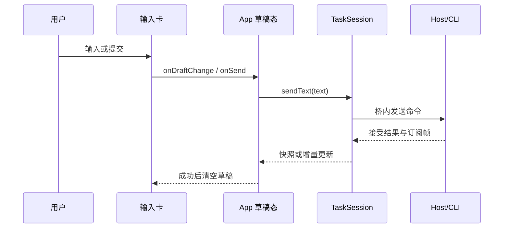
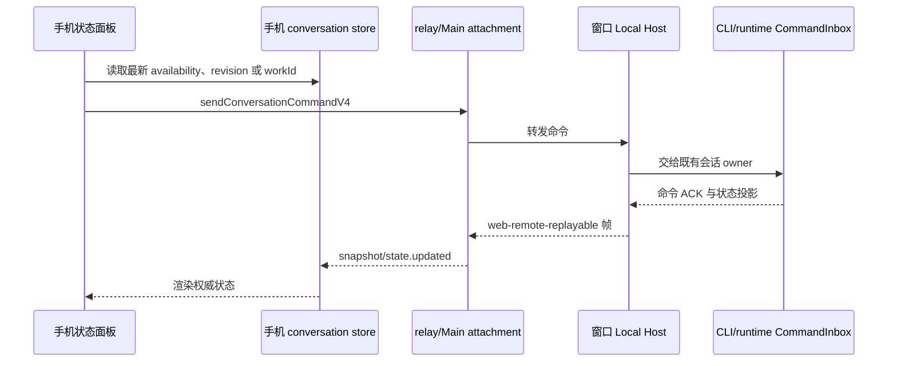
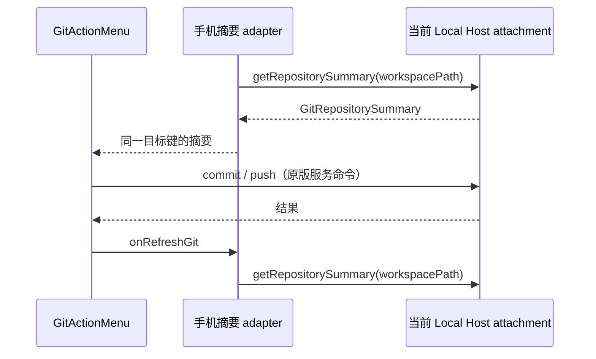
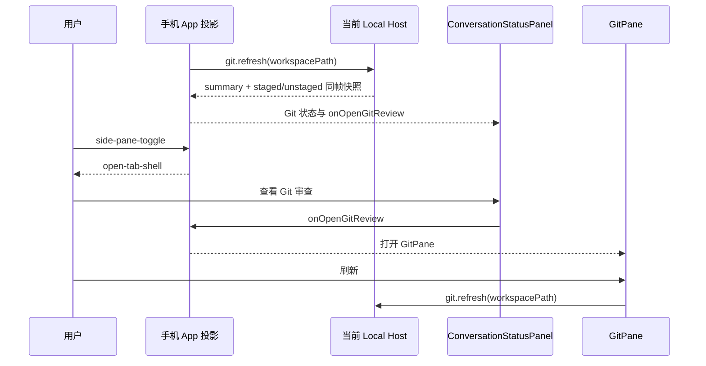

# R3 路线 A：自建官方级移动前端（完整对齐方案）

状态：**P0/P1 部分已实施；本轮先交付独立、离线的 3.14.3 兼容资产包**。上游依据 = `specs/mobile-relay-server.md`（R1/R2/协议对齐/
资产托管，§11 分歧矩阵已清零）+ `specs/mobile-web-remote.md`（M4/M4c 桌面侧桥全貌与
原版证据索引）+ 2026-09-29 实机取证（内置浏览器 414×896 / 1280×720 双视口抓取官方
活页 DOM/截图，产物 `.tmp-work/official-live-*.html`）。

## 0. 为什么现在做、以什么为对齐基线

本轮之前，LAN/自建 relay 的手机页默认走**官方资产代理**（cache→fetch z.ai→R2 兜底，
`desktopMobileLanRelayHost.ts`）；D7 已将 LAN 与同仓 relay CLI 的默认入口改为本地快照。
旧形态三处硬伤：①依赖官方源站在线与资产布局稳定；
②`wss://zcode.z.ai/ws` 字面量改写脆弱（§12.5 二次实测教训，浏览器内存缓存还要求破
缓存）；③官方页含账号/营销/WAF 验证码面（`zcode-aliyun-captcha-container`），非我方可
控。§12.5–12.8 双栈对比已证明**官方页可完整跑在我们的栈上**（配对/引导/桥/九深服务面
逐字节同构）——即桌面侧与 relay 侧的 v4 服务面已经就绪；D7 提供可离线托管的冻结页，
后续 P2–P4 仍需替换成自有源码前端。
R3 路线 A 定案（82 轮）：复用 `@drora/ui` 组件树 + 既有 rpc 桥，v4 数据原生零转换。

对齐基线 = 官方 3.14.3 页行为快照（`packages/mobile-web/upstream/` 冻结资产 +
`official-live-*.html` 实机 DOM + 双栈对比方法论）。官方页后续演进不跟随，分歧记录于本 spec。

## 1. 目标与非目标

**目标**

- G1 **自有移动前端**：`@drora/ui` 共享组件树 + 移动壳，产物由 relay-server 托管于
  `/remote/v4`，同源直连自建 relay（零改写、离线可用），替换官方资产代理为默认。
- G2 **双布局同一构建**：窄视口（<900px）移动单列壳，宽视口（≥900px）完整应用壳——
  对齐官方同构建双布局（§12.8 实测）。
- G3 **v4 数据面原生**：手机侧直接说 rpc-frame（bootstrap/bridge-open/rpc-frame 全
  族），不经过 `drora-page-request` v1 翻译层；时间线/工具卡/composer 为真实组件流式
  渲染，非文本投影。
- G4 **状态面逐项对齐**：四步加载卡、11 张失败卡、重连/挂起/宽限期语义（§2 清单）。
- G5 **契约单一出处**：relay 线协议纯逻辑（HMAC proof、帧组装/checksum、水位常量）
  收敛到 shared，桌面/relay-server/手机端三方同源。

**非目标**

- 不复刻官方账号绑定、营销触点、插件资产 CDN（`cdn-zcode.z.ai`）与 WAF 验证码面。
- 不做 PWA/离线缓存/推送通知（后续可选立项）。
- 不改 relay 服务端职责边界（纯转发，业务真相源仍在桌面 Host——AGENTS.md 不变量）。
- 桌面 Electron 与 `packages/web` 主入口（HTTP+WS 连 server 的形态）本轮不改布局；
  移动壳按能力位（capability）门控，桌面主入口默认不启用（有意保守，见 D1）。

## 2. 对齐清单（实机取证定案，验收对照表）

**过渡状态机（手机侧，对齐官方 RelaySession）**

| 状态           | 进入                                                                | 退出                                  | 我方落点                     |
| -------------- | ------------------------------------------------------------------- | ------------------------------------- | ---------------------------- |
| idle           | 初始                                                                | connect()                             | relay-client                 |
| connecting     | connect()                                                           | ws open→authenticating                | relay-client                 |
| authenticating | ws open，发 auth_init{role:"terminal"}                              | challenge→proof→auth_ack              | relay-client                 |
| waiting        | 鉴权过、未配对                                                      | paired / 陈旧恢复 / kicked            | relay-client + 四步卡第 3 步 |
| paired         | auth_ack{matched}                                                   | 断线→reconnecting                     | relay-client                 |
| reconnecting   | socket 断/健康检查失败/手动（指数退避 500ms×2ⁿ 封顶 10s，4 触发点） | 重连成功/终态                         | relay-client                 |
| suspended      | 页面隐藏/失活（15s recoverConnection 窗）                           | 恢复/超时→connection-recovery-timeout | relay-client                 |
| kicked         | error{KICKED}                                                       | 终态                                  | 失败卡 session-conflict      |
| error          | 非接管类故障                                                        | 可重试                                | 失败卡按 code                |

**宽限期而非立即判死**：DEVICE_OFFLINE → `desktopOfflineFailureTimer` 宽限 → 超时才
终态卡 desktop-disconnected；bootstrap 无应答 → desktop-bootstrap-timeout（描述文案
"手机端已经连上 relay，但桌面端没有及时返回工作区数据。"）。

**四步加载卡**（官方实机确认存在，R2 已逐字对齐）：1 连接中转服务 / 2 设备鉴权 /
3 等待桌面端配对 / 4 同步工作区；标题态含「已配对，正在加载工作区…」。

**11 张失败卡**（badge/title/tone/nextSteps 对齐，R2 已验证文案可直接移植）：
session-not-found / session-expired / session-conflict（已被其他设备接管）/
workspace-closed / desktop-disconnected / invalid-mobile-connection /
desktop-bootstrap-timeout / connection-recovery-timeout / relay-unavailable /
unsupported-action / unexpected-error。

**移动首页**：连接徽章（已连接到当前桌面窗口/未连接）、说明段、主题按钮、命令面板
入口、「当前设备上的工作区和任务」标题 + N 工作区 · N 任务、收起全部/整理任务/刷新、
工作区分组折叠列表（名称/本地·远程标记/路径/更新于/任务数）、任务行（标题/相对时间/
状态 pill：运行中·已完成）。

**移动会话面**：返回首页、任务标题、更多菜单、状态侧板（后台任务 pill）、富时间线
（思考块含持续时长、工具卡可展开——查阅/终端/读取及参数摘要、markdown 含代码块与
表格、复制/分叉/撤销/赞踩、文件变更统计）、**完整 composer**（排队语义占位「继续输入
以排队后续修改」、添加上下文、切换模式、模型选择器、推理档、上下文用量表、停止生成）。

**宽视口全壳**（≥900px）：侧栏（新建任务/搜索/插件市场/项目树+任务数/用户页脚）+
主区问候空态/完整 composer/快捷操作——即桌面 `Root` 树原样可用。

**深服务九面**（§12.8 已双栈验证的清单作为回归集）：新建任务全壳、模型选择器（活
数据）、优先级菜单、变更前确认、搜索命令面板（tabs+最近+建议）、插件市场、富时间线、
任务头更多、KICKED 卡。

## 3. 总体架构

```
手机浏览器（自建移动前端，/remote/v4）
  React 19 + @drora/ui 共享树（移动壳 ⇄ 宽视口全壳，capability 门控）
  ├─ relay-client（新模块）：RelaySession(terminal) + RpcFrameBridge + 诊断事件
  │    WSS 同源 /ws?mid=…（零改写）
  ├─ RelayRemotePlatform：IPlatformService ←→ platform-request 应用帧（8 方法，M4a 已对齐）
  └─ v4 会话 RPC：rpc-frame 直驱（bootstrap → workspace-bridge-open → conversation 流）
        │
自建 relay（packages/relay-server，不改业务边界）
        │  device 侧既有链路
桌面 Main：desktopMobileRelayControl（M4c 流控/重放/背压已接线）
  └─ Host attachment（web-remote-replayable 语义）→ 桌面 Host（唯一业务真相源）
```

**所有者划分（不变量沿用）**：连接/配对状态=relay 服务端；设备凭据=relay 持久层；
业务数据=桌面 Host；手机侧 UI 局部状态（草稿/pending overlay）不得当作服务端事实；
busy/running 输入仍由 CLI/runtime CommandInbox 串行 admission（composer 排队语义的
数据来源）。

## 4. 模块决策（D1–D5）

- **D1 移动壳放 packages/ui，capability 门控**：新增 `packages/ui/src/mobile/`
  （MobileHomeShell / MobileTaskShell / 状态卡族 / mobileShell i18n 命名空间）。壳
  选择在 RootShell 层按「远程移动能力位 + 视口 <900px」分支；桌面与 web 主入口不设
  该能力位 → 行为零变化。新断点常量 `REMOTE_SHELL_VIEWPORT_QUERY`（width<900px），
  与既有 `MOBILE_VIEWPORT_QUERY`（767px+触屏，交互微调用）并存不合并；顺手收敛
  `v4/SessionPane.tsx:496` 的重复定义。
- **D2 线协议收敛 shared，三方同源**：纯逻辑（computeProof/信封校验/帧组装+checksum
  hex/ordinal/MTU 探测/水位与 grace 常量）提为 `packages/shared` 的 relay-wire 区
  （或独立小包 `relay-protocol`，P0 按架构检查建议定）。消费方：desktop（现
  desktopMobileRelayProtocol.ts 改引用）、relay-server（protocol.ts 对应面）、新
  relay-client。R2 页内嵌 HMAC 实现迁移后删除，RFC 4231+node:crypto 交叉单测随迁。
  线协议字面量（`zcode_type` 等）是官方兼容键，**保持原名不 Drora 化**（互操作必需，
  对照 mobile-web-remote.md 既有定案）。
- **D3 relay-client 新模块**（`packages/relay-client`，浏览器环境，注册
  architecture-policy.yaml，managed:false，依赖 shared）：RelaySession（terminal 角色
  全状态机+心跳 pair*status_query+重连退避+suspended 恢复+desktopOffline 宽限）、
  RpcFrameBridge（组装/ack/重放缓冲客户端侧，常量同源）、emitDiagnostic 7 类事件
  （state-transition/pair-status/recover-*/socket-\_）。
- **D4 远程入口 = 独立 mobile-web 包**：本轮按 D7 先在
  `packages/mobile-web/upstream` 封装 3.14.3 原版页面与动态资产；后续源码化时，
  在同包新增 React 入口，复用 `packages/ui` 的移动壳与 `relay-client`，不改
  `packages/web` 主入口。产物保持 `<out>/remote/v4/<version>/assets/*` 的官方路径形状，
  **不做版本门控**（同仓发布天然配套）。relay-server 的 `mobileRoot` 托管优先级为
  staticRoot 测试床 > 本地 mobile-web > cacheDir 官方代理 > R2 兜底 302。
  冻结快照仍需由 relay-server 出站改写 WebSocket 端点；未来源码入口直接使用同源 `/ws`。
- **D5 R2 页与 v1 桥保留为兜底层**：离线/资产缺失 302 → `/m/index.html` 链路不变；
  `drora-page-request` v1 桥（serveMobilePageAction）只为 R2 兜底页服务，R3 验收后
  不再演进（退役另立决策）。

## 5. 实施分期与验收

| 期  | 内容                                                                                                                                               | 验收                                                                                   |
| --- | -------------------------------------------------------------------------------------------------------------------------------------------------- | -------------------------------------------------------------------------------------- |
| P0  | 本 spec 评审定案；架构登记（relay-client/mobile 边界）；契约键与常量盘点（全链 grep 生产/消费）                                                    | architecture:check 过；无孤儿键                                                        |
| P1  | wire 层收敛 shared + relay-client TS 落地；单测（HMAC/组装/checksum/水位对齐官方常量；官方偏移证据随注）                                           | 对 embedded relay 的终端全状态 conformance（waiting/paired/踢/离线/宽限/重连）         |
| P2  | packages/ui 移动壳 MVP（首页+会话面+四步卡+失败卡族）+ remote 入口可构建可跑                                                                       | LAN 真机扫码全流程；与官方页双栈截图对比：首页+时间线两面 SHA 一致（时间戳类差异除外） |
| P3  | 富面：composer 全功能（排队/上下文/模式/模型/用量/停止）、工具卡/代码/表格流式渲染、命令面板、主题、整理任务                                       | §2 九深服务面逐面双栈对比同构；11 失败卡+KICKED 逐字节                                 |
| P4  | 健壮性：断网/杀桌面/二终端踢端到端（重放不丢不重）、mobile-diagnostic+遥测上报、构建性能（分包，避免官方 6.2MB 单文件教训）                        | E2E 全场景 + 真机弱网手测；首屏 <官方基线                                              |
| P5  | 切换：LAN QR 默认 → 自建页（`desktopMobileLanRelayHost` 端点翻转）；官方资产代理降级为测试床选项；spec/文档/技能引用清理；DESIGN.md 补移动壳规范段 | 离线装机冷启动可用（不触外网）；`pnpm verify:pre-push` 全绿                            |

每期收口必须：`pnpm typecheck` + `pnpm lint` 真实结果、架构检查、行为改动配测试、
交互改动配 E2E；双栈对比沿用 `.tmp-work` 既有方法论（同视口截图 SHA-256 + DOM 落盘）。

## 6. 风险与对策

- **ui 组件桌面假设**（窗口控制/多窗口/更新器等）：web 主入口已有 no-op platform
  先例，RelayRemotePlatform 按能力位降级；发现组件硬依赖桌面能力时在 hooks 层加能力
  分支，不在组件里散落 if。
- **v4 schema 漂移**（session/messages 教训）：协议边界 schema 校验为准，漂移修复先
  补 spec 再动代码；对齐基线冻结 3.14.3，新增官方能力不自动跟随。
- **宽视口全壳体积**：全树可用但按路由懒加载；官方单文件 6.2MB 是反面教材。
- **双传输互斥**：弹层切 tab 即切链路（§12.4 既有收敛），R3 不改变。
- **凭据安全**：QR 仍是 sid+hash 长期凭据，刷新即轮换；页面不缓存凭据到
  localStorage 之外的位置（官方 sessionStorage 快照仅主题/壳态，照做）。

## 7. 有意分歧记录（审查对照用）

| #   | 分歧                                               | 理由                                                                         |
| --- | -------------------------------------------------- | ---------------------------------------------------------------------------- |
| 1   | 无版本门控/版本资产库                              | 同仓发布，页面与桌面配套演进（§7 既有决策沿用）                              |
| 2   | 无账号/营销/验证码面                               | 私有部署不需要；WAF 面属官方基础设施                                         |
| 3   | 端点同源推导，无 z.ai 硬编码改写                   | 自建页天然同源；官方镜像测试床保留改写逻辑                                   |
| 4   | error.message 空串（对齐）但服务端日志保留诊断细节 | §12.6 既有定案                                                               |
| 5   | 桌面/web 主入口暂不启用移动壳                      | 保守切换，待 R3 稳定后另议（届时 packages/web 手机访问即可免费获得移动布局） |
| 6   | 鉴权 challenge/ack 监督 10s                        | 官方无此定时器，本仓自加强化，relay-server 容忍                              |
| 7   | suspended 恢复取 15s 平窗 + 3s 健康检查简化        | 官方 recoverConnection 同构语义                                              |
| 8   | INTERNAL 处理 = paired 回 waiting / 否则立即重连   | 对齐官方                                                                     |
| 9   | DEVICE_OFFLINE 保持原 socket + 宽限重挂            | vs 官方关 socket + 立即重连（终态等价）                                      |
| 10  | 配对心跳首条 query 立即发送                        | 官方先等一个 interval                                                        |
| 11  | auth_init 不带官方 meta{platform, version, name}   | 服务端不校验                                                                 |

## 8. 契约键与常量盘点（P0 产出，2026-09-29 全链 grep）

范围 = `packages/desktop`、`packages/relay-server`、`packages/shared` 非 test src。
行号基线 = 当日工作树。relay-server 对 data `payload` 纯转发不解析（`relayServer.ts:396`
仅 matched 双向转发 + 盖章），故其在表中只出现在信封/HMAC/错误码面；`zcode_type`
的生产/消费全部落在桌面两端与手机端。

### 8.1 `zcode_type` 线协议字面量（任务点名 12 值 + 同族补全）

| 字面量                       | 桌面生产                                  | 桌面消费                                                                       | 手机端                              | 单一出处判定                             | R3 收敛 shared 后消费方       |
| ---------------------------- | ----------------------------------------- | ------------------------------------------------------------------------------ | ----------------------------------- | ---------------------------------------- | ----------------------------- |
| rpc-frame                    | `desktopMobileRelayProtocol.ts:397`       | 同文件 :312（类型）/:785（parse）、`desktopMobileRelayControl.ts:1440`（分派） | relay-client 生产（R3）；官方页生产 | 散点字面量、两端各一处（未收敛，非重复） | desktop、relay-client、移动壳 |
| rpc-frame-ack                | `desktopMobileRelayProtocol.ts:418`       | `desktopMobileRelayControl.ts:1443`                                            | relay-client 消费（ack 驱动流控）   | 同上                                     | 同上                          |
| bootstrap-request            | —                                         | `desktopMobileRelayControl.ts:1278`                                            | relay-client 生产                   | 同上                                     | 同上                          |
| bootstrap-response           | `desktopMobileRelayControl.ts:1282/:1291` | :566（重放入选/日志分支）                                                      | relay-client 消费                   | 同上                                     | 同上                          |
| workspace-bridge-open        | —                                         | `desktopMobileRelayControl.ts:1432`                                            | relay-client 生产                   | 同上                                     | 同上                          |
| workspace-list-request       | —                                         | `desktopMobileRelayControl.ts:1307`                                            | relay-client 生产                   | 同上                                     | 同上                          |
| workspace-list-response      | `desktopMobileRelayControl.ts:1311/:1320` | :567（日志分支）                                                               | relay-client 消费                   | 同上                                     | 同上                          |
| workspace-reconnect-request  | —                                         | `desktopMobileRelayControl.ts:1436`                                            | relay-client 生产                   | 同上                                     | 同上                          |
| workspace-reconnect-response | `desktopMobileRelayControl.ts:1144/:1151` | —                                                                              | relay-client 消费                   | 同上                                     | 同上                          |
| mobile-view-state-update     | —                                         | `desktopMobileRelayControl.ts:1418`（:256 注释）                               | 移动壳生产                          | 同上                                     | 同上                          |
| mobile-diagnostic            | —                                         | `desktopMobileRelayControl.ts:1462`；白名单 :1273                              | 移动壳/relay-client 生产            | 同上                                     | 同上                          |
| telemetry-report             | —                                         | `desktopMobileRelayControl.ts:1447`；白名单 :1273                              | 同上                                | 同上                                     | 同上                          |

同族补全（盘点发现，R3 契约一并登记）：`platform-request`（消费 :1476，RelayRemotePlatform
生产）、`platform-response`（生产 :1486/:1496）、`workspace-list-updated`（桌面主动推送，
生产 :658）、`workspace-bridge-ready`（生产 :1085）、`workspace-bridge-error`（生产 :901）。
v1 桥 `drora-page-request`/`drora-page-response` 属 R2 兜底面（D5 不演进）：`phonePage.ts:332/:354`、
`desktopMobileRelayControl.ts:1340/:1356/:1400/:1407`。

特例：`packages/shared/src/drora-protocol-v4/wire-codec.ts:60` 出现 `drora_type:"rpc-frame"`——
仅 `measureTopicNotificationEnvelopeBytes` 最坏情形字节计量（与 `zcode_type` 等长，测量等价），
**非线上生产/消费**；收敛时保留该口径注释，防止被误读为第二命名空间。

### 8.2 data 信封字段与字符集约束

| 字段                                    | 生产                                                                                               | 校验/消费                                                                                                                                  | 单一出处判定                               |
| --------------------------------------- | -------------------------------------------------------------------------------------------------- | ------------------------------------------------------------------------------------------------------------------------------------------ | ------------------------------------------ |
| `client_ts`                             | `desktopMobileRelayControl.ts:549`（出站统一；另 :1541/:1684/:1736）、`phonePage.ts:302/:307/:353` | `relay-server/src/protocol.ts:74/:84`（isDataEnvelope，`typeof number`，无有限性检查）、转发透传 `relayServer.ts:409`                      | 校验单点（protocol.ts）；生产散点          |
| `server_ts`                             | `relay-server/src/wire.ts:8/:39`（出站统一盖）、`protocol.ts:89-93`（stampServerTs）               | 官方手机页 schema 消费；时钟不参与我方语义                                                                                                 | 单点                                       |
| `payload`                               | 各端应用帧                                                                                         | `protocol.ts:73`（`Record<string,unknown>`），转发不解析                                                                                   | 单点                                       |
| `bridgeSessionId`（rpc 帧内层传输标识） | `desktopMobileRelayProtocol.ts:348/:697`                                                           | 匹配校验 :434/:786（仅 `typeof string`）；字符集约束 = `relay-server/src/protocol.ts:14` `TRANSPORT_ID_PATTERN /^[A-Za-z0-9._~-]{1,64}$/u` | 格式定义单点，但**声明未强制**（见 8.6-5） |

信封语义注释（真机取证）：`desktopMobileRelayControl.ts:546-548`——缺 `client_ts` 裸帧被
WRONG_PARAM 拒收；有 `type` 缺 `client_ts` 被接受但静默不转发（2026-09-27 实锤）。
`TRANSPORT_ID_PATTERN` 当前仅定义 + 导出（`protocol.ts:14`、`index.ts:6`），relay-server src
内无任何消费方，桌面侧只查字符串类型——字符集约束实际未在链路上强制。
另注：shared v4 家族 `drora-protocol-v4/core.ts:71` `transportEnvelopeIdMaxChars: 256` 与 relay
家族 64 上限**同概念不同值**（wire-codec.ts:56 计量按 256 取最坏，保守成立）——两族各自成立，
收敛时不得互改。

### 8.3 流控常量（官方常量表 @6729 取证）

| 值             | 常量                                     | 定义处                              | 引用处                                                                               | 判定 |
| -------------- | ---------------------------------------- | ----------------------------------- | ------------------------------------------------------------------------------------ | ---- |
| 1MiB（水位）   | `RELAY_SATURATION_HIGH_WATER_MARK_BYTES` | `desktopMobileRelayProtocol.ts:491` | :564（ReplayBuffer 构造）                                                            | 单点 |
| 256KiB（水位） | `RELAY_SATURATION_LOW_WATER_MARK_BYTES`  | `desktopMobileRelayProtocol.ts:493` | :565                                                                                 | 单点 |
| 8MiB           | `RELAY_REPLAY_BUFFER_MAX_BYTES`          | `desktopMobileRelayProtocol.ts:495` | :566                                                                                 | 单点 |
| 45s            | `RELAY_REPLAY_BUFFER_GRACE_MS`           | `desktopMobileRelayProtocol.ts:497` | :567；间接 `desktopMobileRelayControl.ts:828`（degraded 延迟）、:1073-1076（注入口） | 单点 |

同值 1MiB 的**其他定义**（官方 `maxPhysicalFrameBytes` 源，语义不同、数值相同）：relay-server
`protocol.ts:7` `MAX_WS_PAYLOAD_BYTES`（入站 WS 硬上限，消费 `relayServer.ts:80`，超限 ws 库断开）；desktop
`desktopMobileRelayControl.ts:206` `MAX_APP_FRAME_BYTES`（出站应用帧 oversize 拒收，消费 :553）。
注释引用：`desktopMobileRelayProtocol.ts:298/:302`（消息 ≤16MiB、分片 ≤64、dataBase64 ≤1MiB、
单分片 640KiB 预算 :303）、`desktopMobileRelayControl.ts:189/:199/:204/:554`。shared v4 家族
`drora-protocol-v4/core.ts:65` `maxFrameBytes: 1024*1024` 同值不同源（另一协议），不并入收敛。
R3 消费方：relay-client（发送侧水位/重放/分片预算，常量同源）+ desktop/relay-server 改引用。

### 8.4 HMAC proof 构造格式串

`proof = HMAC-SHA256(passHash, "<nonce>|<role>|<deviceSid>", base64url)`——**三处定义（8.6-1）**：

1. `relay-server/src/protocol.ts:26-36` `computeProof`（canonical；:42-56 `verifyProof`
   timingSafeEqual + base64url/base64 双兼容）。
2. `desktop/src/main/desktopMobileRelayProtocol.ts:81-90` `calculateRelayProof`
   （`` `${nonce}|${role}|${sessionId}` ``）。
3. `relay-server/src/phonePage.ts:95-96`（R2 页内嵌纯 JS HMAC-SHA256
   `PHONE_PAGE_CRYPTO_JS` :8-96，role 硬编码 `"terminal"`；D2 定案迁移后删除）。

`derivePassHash`（sha256→base64）仅 `desktopMobileRelayProtocol.ts:77-79` 一处。
R3：收敛 shared（D2），relay-client 浏览器端用 WebCrypto；RFC 4231 + node:crypto 交叉单测随迁（§5 P1 验收）。

### 8.5 错误码族

定义单点：`relay-server/src/relayServer.ts:70-76` `ERROR_CODES`（authFailed/wrongParam/kicked/
deviceOffline/internal）→ 消费 :182/:187（deviceOffline 终端方向）、:220/:248/:251/:278/:295/:318/:381（wrongParam）、
:324（authFailed）、:352/:356（kicked）。
字面量在消费方重复硬编码（8.6-2）：desktop `desktopMobileRelayControl.ts:1610`（KICKED→kicked 重连）、
:1623（AUTH_FAILED persisted 重注册）、:1635（WRONG_PARAM paired/waiting 噪音容忍）、:1652（INTERNAL 可恢复重连）；
R2 页 `phonePage.ts:322-324`（KICKED/DEVICE_OFFLINE/AUTH_FAILED/WRONG_PARAM → 失败卡）。
R3 消费方：relay-client 错误分派状态机（§2 状态表）+ 移动壳失败卡映射（KICKED→session-conflict、
DEVICE_OFFLINE→desktop-disconnected 宽限、AUTH_FAILED/WRONG_PARAM→鉴权失败面）。

### 8.6 重复定义清单（P1 收敛工作清单）

1. **HMAC proof 格式串 ×3**：8.4 全列——收敛 shared 后 desktop/phonePage 两处删除，relay-client 用 shared 形状。
2. **错误码字面量 ×3 处**：relay-server `ERROR_CODES` + desktop 4 字面量 + phonePage 4 字面量——收敛 shared 常量族。
3. **1MiB relay 家族 ×2 + 水位 1 处**：`MAX_WS_PAYLOAD_BYTES`（relay-server）与 `MAX_APP_FRAME_BYTES`（desktop）
   同源官方 `maxPhysicalFrameBytes`，收敛 shared 单常量；`RELAY_SATURATION_HIGH_WATER_MARK_BYTES` 官方独立常量
   （恰好同值），单独登记不合并。v4 家族 `maxFrameBytes` 不动。
4. **crc32→8 位小写 hex ×2 套实现**：desktop `desktopMobileRelayProtocol.ts:326-341`（CRC32_TABLE + crc32）、
   :363（crc32ToWire）与 shared `drora-protocol-v4/wire-binary.ts:10-17`（crc32WireBytes）——同 IEEE crc32 同
   hex 口径、两套实现；收敛 relay 家族那份到 shared（wire 纯逻辑区），v4 家族不动。
5. **`TRANSPORT_ID_PATTERN` 声明未强制**：`relay-server/src/protocol.ts:14` 定义、`index.ts:6` 导出、src 零消费；
   收敛 shared 后由 relay 入站校验、桌面出站构造、relay-client 生成三方共同消费补齐强制点。

非 `zcode_type` 的 relay 帧 `type` 字面量（auth_init/auth_challenge/auth_response/auth_ack/
pair_result/pair_status_query/data/error）同属线协议家族，P1 wire 区登记时一并收编；本节不展开。

## 9. 2026-09-29 本地 3.14.3 页面快照交付（D7）

本轮用户要求独立包、完整 PC/手机页面和局域网自建服务。当前检出中的
`relay-client` 只有 port/type/clock，`packages/ui/src/mobile` 只有展示壳，尚不能
原生驱动完整官方 v4 RPC 服务面。先把已经取证的官方 3.14.3 页面字节封装为
`packages/mobile-web/upstream/remote/v4`，独立构建到 `dist/remote/v4`，由自建
`relay-server` 同源托管。此快照是有来源标记的还原资产，不能混入自研源码；
`packages/web` 主入口保持独立。后续源码化替换仍按 D1–D5 分期。

**产品规则**：`/remote/v4` 与官方 QR 六参数形状一致；窄视口和宽视口都由同一
3.14.3 构建负责。LAN 内嵌 relay 优先读取打包在本地的 mobile-web 资产；自建云
relay 的 CLI 默认读取同包 `upstream/`，部署时可用 `--mobile-dir` 指向构建产物。
只在本地包不可用且启用兼容代理时向官方拉资产；本地
入口资产缺失时继续沿现有 `/m/index.html` 兜底，其他缺失资产 404；本地包存在
时不向官方拉取资源。页面 WS 端点由既有
`staticAssets.ts` 出站重写为当前 host 的 `/ws`，不得回连官方 relay。

**所有者与接口**：桌面 Host 仍拥有任务、会话和消息；relay-server 只拥有连接、
配对和静态资产路由；mobile-web 只拥有不可变页面资产。`mobileRoot` 是静态
根路径注入，不引入第二条业务写入路径。官方快照不做源码内修改；自建接入通过
现有 relay-server 的 JS 出站重写实现。

```text
desktop Host (业务状态) ← attachment → device WS ─┐
                                                  relay-server ── terminal WS → 页面
mobile-web/dist (不可变资产) ───── GET /remote/v4 ──┘
                                                /ws?mid → 挑战 → 配对 → bootstrap → rpc-frame
```

**验收**：①无外网时 `/remote/v4`、其版本资产都返回本地字节；②页面 JS 出站
不包含官方 relay 的硬编码 WS URL；③带 QR 参数入口正常加载 PC/手机布局；
④保留 `staticRoot` 测试床优先级、防穿越与 R2 兜底；⑤ LAN QR 指向自建 relay
本地页面；⑥ `pnpm typecheck`、`pnpm lint`、架构检查与 relay 集成测试均运行。

**迁移边界**：本交付实现离线可加载的官方 3.14.3 页面快照，保留该版 UI 与浏览器
运行时代码；真桌面配对与只读操作已验证，消息写入、弱网和失败恢复仍须 E2E 验收。它不是
独立编写的 React UI 源码。后续若需要脱离官方资产的可维护实现，按上文 P2–P4
将共享 UI 和 relay-client 逐面替换，不能把二进制快照视作已完成源码化。

**独立 Electron + CDP 实测（2026-09-29）**：使用独立应用身份及 Electron
userData/sessionData 运行本仓，与正在使用的 Drora Dev 窗口分离；默认工作区数据库
仍可见，因此仅对现有任务做只读验证。修复弹层 idle 自动开启后，二维码自动
生成；内置浏览器经该二维码完成鉴权、配对、bootstrap、工作区桥接，桌面弹层显示
“手机已连接”。414px 视口出现移动工作区首页，展开工作区并打开现有任务后，时间线
与完整 composer 均加载；1280px 视口出现 PC 侧栏与同一任务会话；刷新入口后恢复
到任务会话。此轮没有向现有任务发送新消息，也未覆盖弱网、踢端和全部失败卡。

### 2026-09-29 入口还原错误修正

本地隔离 Electron + CDP 配对后确认 PC 全壳、手机首页与任务会话均由真实 Host
响应。核对静态入口时发现，最初从 `.tmp-work/official-page/remote/v4/index.html`
复制的文件曾为诊断临时插入 `window.__wsLog` 和 `?v=selfhost2`。这不是原版行为，
只能作为还原错误修正：官方 `https://zcode.z.ai/remote/v4?app_version=3.14.3`
返回的入口 HTML 在字节偏移 **10646** 为
`<script type="module" crossorigin src="/remote/v4/3.14.3/assets/index-NjWRUABD.js">`；
本仓旧快照在字节偏移 **10655** 含 `window.__wsLog`，并把同一 `src` 改成
`index-NjWRUABD.js?v=selfhost2`。替换为原版入口字节后，端点改写仍只发生在
relay-server 的 JS 出站路径。资产检查应拒绝这两个诊断标记。

### 2026-09-29 发行资产源码恢复取证

官方公开仓库 `zai-org/ZCode` 的 `v3.14.3` tag 指向
`29628c9acdb81b703bbd4080c207a0e7ce5e276e`；GitHub 完整 tree（7458 项，
`truncated=false`）中没有 `remote/v4`、`mobile-web` 或 `relay-client` 源码。
本地 3.14.3 快照中的 2488 个 JS 文件均无 `sourceMappingURL`；源站主入口
`/remote/v4/3.14.3/assets/index-NjWRUABD.js.map` 返回 HTTP 404。因此不能声称从
发行文件精确恢复官方原始 TSX、模块边界或标识符。任何格式化的 bundle 都应标为
“由发行资产恢复的可读 JS”，保留 `upstream/` 原始字节作为对照；自研 React/TypeScript
实现则按 P2–P4 接入现有共享 UI 和 relay 协议，不与还原资产混放。

**本轮恢复规则**：`mobile-web/src/recovered/remote/v4` 保存从冻结快照格式化的可读
HTML/JS/CSS 和原样复制的字体、图片、WASM；文件名与相对引用保持 3.14.3 原样，
以免破坏动态 import、预加载图和 wasm 定位。构建只从该目录复制到 `dist`；开发态
LAN 与 relay CLI 直接读取该目录，桌面打包读取同目录。`upstream/` 保留为逐字节
证据，不再作运行时默认入口。relay-server 继续拥有鉴权、配对和静态路由；手机页只
拥有浏览器 UI 与局部状态；Host 继续拥有任务和会话。WS 出站同源改写仍由
relay-server 执行，恢复阶段不另建连接实现。

验收：①恢复目录资源图闭合，文件数与上游快照一致；②构建输出与恢复目录逐文件
相同；③ JS/CSS 可解析，页面在 LAN 真配对后能进入手机与 PC 布局；④
`upstream/` 哈希不变；⑤ `typecheck`、`lint`、架构检查和相关测试真实运行。
可读恢复稿仍含编译后的 React runtime 与短标识符，不等同于 P2–P4 的可维护
React/TypeScript 重写。

首次恢复工具验证发现 9 个高度压缩 chunk 在 `oxfmt` 第一遍展开后还需第二遍才能
稳定（包括主入口 JS 与主 CSS）；恢复脚本固定执行两遍，并以 `oxfmt --check` 验证。
独立 Electron + CDP 真配对回归：414×896 视口进入移动工作区首页，1280×896
视口进入 PC 全壳；两次页面运行的 uncaught `pageerror` 均为 0。此验证覆盖入口、
配对、bootstrap 与双布局，没有重新测试消息发送和弱网恢复。

## 10. 2026-09-29 官方源码可得性终版调查（源码化前置确认）

对本轮"把 mobile-web 从静态发行资产推进为可维护源码包"的前置问题——官方是否公开
3.14.3 远控页源码或 sourcemap——做了终版取证（GitHub API + CDN 实测 + 本地克隆
`.tmp-work/zai-upstream` 比对）：

| #   | 证据                                                                                                                                                                  | 结论                                                 |
| --- | --------------------------------------------------------------------------------------------------------------------------------------------------------------------- | ---------------------------------------------------- |
| 1   | `zai-org/ZCode` 公开仓（Apache-2.0）`v3.14.3` tag → `29628c9`，完整 tree 7458 项无 `remote/v4`/`mobile-web`/`relay-client` 源码；GitHub 代码搜索 `"remote/v4"` 0 命中 | 远控页部署变体源码不在公开仓                         |
| 2   | 公开版 `packages/web/src/main.tsx` `connectRemote()` 直接抛 `"Remote connect is not supported in Web mode yet"`                                                       | Web 端远控连接实现在公开入口被显式禁用，未随源码发布 |
| 3   | 官方 `packages/web/vite.config.ts` 生产构建 `sourcemap: "hidden"`，注释明言"生产不在浏览器产物暴露 sourceMappingURL，避免客户端侧还原业务源码"                        | 官方有意不发布 sourcemap                             |
| 4   | CDN 实测 `zcode.z.ai/remote/v4/3.14.3/assets/` 下 6/6 个 `.js.map`/`.css.map` 全部 404（对照同源真实资产 200）；全部发行 JS 尾部无 `sourceMappingURL` 注释            | sourcemap 不可得，非探测方式问题                     |
| 5   | 部署入口 HTML 与 `BASE_URL=/remote/v4/3.14.3/` 构建配置不在公开仓；公开 `packages/web`+`packages/ui` 与部署页**同族但非同构**                                         | 公开源码骨架可作语义参照，不可作字节来源             |

**结论：源码化唯一可行路径 = 自研实现。** `upstream/` 冻结快照保留为对照证据；
任何"从官方源码/sourcemap 恢复"的路线不可行，后续不再复查此前提（除非官方
release 显式变更源码披露范围）。

## 11. D6（补录 103–109 轮用户裁定）：ui+desktop 冻结、移动 UI 自包含

此前 103–109 轮的实现未及落入本 spec 即因未提交丢失（见 §12 背景），现按工作树
证据与用户裁定补录：

- **`packages/ui` 与 `packages/desktop` 冻结**：R3 期间不为移动页改动这两包；
  `packages/ui/src/mobile/` 的展示壳（MobileHomeShell/MobileTaskShell/StatusCards，
  D1 产物）就地冻结，仅作自包含化的移植参照。
- **移动 UI 全自包含**：手机页 UI 组件与文案全部落在 `@drora/mobile-web`
  （`src/ui/`、`src/intl/`），不 import `@drora/ui`；i18n 在包内本地化
  （zh-CN/en-US 字典同构校验）。
- 桌面 LAN host 的本地快照默认（`desktopMobileLanRelayHost.ts` 读
  `src/recovered`）在冻结期内不动；桌面侧切换源码入口归 P5 端点翻转一并处理。

## 12. D8（本轮决策）：数据层复用 rpc/client/services 公开入口，UI 自包含不变

**背景**：103–109 轮曾按"全自研 19 帧链 + 全量页面复刻"路线实现（relay-client
21 模块 + `mobile-web/src/ui` 全量页面），未提交即丢失——现树仅存
`relay-client/dist` 编译残留（sourcemap 无 `sourcesContent`，原始 TS 不可还原）与
空的 `src/ui`/`src/intl` 目录。重写评估：v4 服务面（`drora-protocol-v4` 全族 zod
schema + 服务描述符 + 会话/工作流订阅语义）自研复刻成本不可控，且与 renderer
服务面漂移风险高；官方页 bundle 6.2MB 单文件正是把整棵服务/组件树编译进页面的
结果，逐字节复刻它不符合"可维护"目标。

**决策**：

- **数据层复用公开入口**（方向 `mobile-web → relay-client → shared`；
  `mobile-web → rpc/client/services`）：桥端口即 Host 服务面（与 renderer 同源，
  `RemoteServiceAccess` 的服务描述符族），移动端不重写 v4 协议栈。
- **桥内载荷复用 MessagePort 语义**：rpc-frame 重组后的消息字节 = ChannelClient
  序列化字节（裸 `Uint8Array`，无附加分帧——`MessagePortProtocol` 同构，桌面 main
  `bridge.port.postMessage(Buffer)` 直传）。移动端以自定义 `IMessagePassingProtocol`
  适配 relay-client 的 rpc-frame 通道，经 `@drora/client` 的
  `connectViaProtocol` 获得 `IServiceAccessor`。
- **UI 全自包含不变（D6）**：`src/ui` + `src/intl` 自持；ui 展示壳仅作参照。
- **首页数据面不走服务**：bootstrap/workspace-list 走 relay 应用帧
  （`zcode_type` 族，桌面 `handleAppFrame` 已实现），任务面走桥内服务（实现事实：
  任务面读路径 = 桥内 droraAgentService.hello/initialize 握手 +
  conversationRowsRangeV4 尾窗行分页；写路径 = sendConversationCommandV4(sendText)；
  P3 流式订阅面仍归后续期）——两面的所有者边界与官方一致（relay 应用帧=连接/投影层，
  服务面=业务层）。
- **桌面冻结不变（D6）**：desktop LAN host 与打包在冻结期内继续用
  `src/recovered` 快照；独立 relay CLI `--mobile-dir` 语义不变。

## 13. P2a（本轮实施）：能从源码构建的入口

**范围**：

1. **shared relay-wire 收敛 relay 家族 rpc-frame 纯逻辑**（§8.6-3/8.6-4 落地）：
   常量（16MiB/64 分片/640KiB 分片预算）、crc32→8 位 hex、checksum 线格式兼容、
   帧类型守卫与组装器/编码器（浏览器安全 Uint8Array + 纯 base64）；desktop
   `desktopMobileRelayProtocol.ts` 改引用 shared 出处并 re-export。
2. **relay-client 会话核心重建**（消费 `types.ts`/`ports.ts` 既有设计）：九态
   状态机、auth 三步握手（proof 走 shared relay-wire：computeProof 纯 JS 单一实现
   （shared），经 codec port 可注入替身）、pair_status_query 心跳、指数退避重连、
   suspended 恢复窗、
   DEVICE_OFFLINE 宽限、错误码→失败卡映射；data 应用帧通道（requestId 关联、
   oversize 拒收）；rpc-frame 通道（发送侧 messageSeq/水位/重放缓冲，接收侧
   组装 + 逐消息 ack）。
3. **mobile-web 源码应用**：vite + react + tailwind 自包含构建
   （`build` = `vite build`），产物保持官方路径形状
   `dist/remote/v4/`（entry）+ `dist/remote/v4/3.14.3/assets/*`；四步加载卡、
   失败卡族、首页（bootstrap/workspace-list 真实数据渲染）、任务面基础版
   （bridge-open；任务面读路径 = 桥内 droraAgentService.hello/initialize 握手 +
   conversationRowsRangeV4 尾窗行分页；写路径 = sendConversationCommandV4(sendText)
   经 composer 提交；P3 流式订阅面仍归后续期）；`src/intl` zh-CN/en-US 同构。
4. **relay-server bundled 根优先级**：`dist/`（源码应用，entry 存在才启用）>
   `src/recovered/`（快照回退，D7 行为保底）> 内建资产代理 > R2 兜底；
   `--mobile-dir` 显式注入仍最高。WS 出站改写对源码应用为 no-op（应用内无官方
   URL 字面量，直连同源 `/ws`）。本节 dist 语义取代 §9『本轮恢复规则』中『构建
   只从该目录复制到 dist』的表述（快照构建改经 build:snapshot --out 输出独立页面
   包，不再写 dist）。

**验收**：

- `pnpm --filter @drora/mobile-web build` 从 `src/` 产出官方路径形状入口与资产；
  产物无 `zcode.z.ai` 字面量、无 `sourceMappingURL`。
- relay-server 默认（无 `--mobile-dir`）托管 dist 入口；dist 缺失时回退
  recovered 快照（D7 回归不变）；`upstream/` 哈希不动。
- shared relay-wire 单测覆盖 RFC 4231 交叉向量（packages/shared/test/）；
  relay-client 单测消费 shared computeProof：握手/proof、状态机迁移表、
  rpc-frame 组装/ack/水位/重放、错误码映射。
- relay-server 集成测试覆盖新优先级链；`pnpm typecheck`、`pnpm lint`、架构检查
  真实运行。

**与 P2/P3 的差距（后续期，不构成本轮验收）**：富时间线（工具卡展开、markdown/
代码高亮、文件变更统计、复制/分叉/撤销）、composer 全功能（排队/上下文/模式/
模型选择/用量/停止）、命令面板、整理任务、宽视口全壳（≥900px 桌面布局）、
mobile-diagnostic/telemetry 全量上报、分包与体积优化（避免单文件大 bundle）、
真机弱网/踢端 E2E。

## 14. P3a（本轮实施）：任务面流式 + 富时间线第一档 + composer 状态驱动

对齐基线 = 官方 3.14.3 手机页（recovered bundle 即桌面 transport/投影栈的压缩副本，
取证：subscribe 消费/帧挂流/resync 与桌面 `packages/ui/src/v4/agentConversationTransport.ts`
同构）。取证结论（2026-09-30）：`subscribeConversationV4` 仅回 ACK（`transport.ts:440-442`
注释），初始快照与增量经 workspace 级事件 `onDynamicConversationFrame` 到达，帧为
wire 候选（complete|fragment），topic=`conversation/<sessionId>`。

**范围**：

1. **任务面流式**（mobile-web src/app）：订阅生命周期 = 握手（既有）→
   `subscribeConversationV4({workspacePath…, sessionId, visibility:"foreground"})`
   拿 ack.subscriptionId → 挂 `onDynamicConversationFrame(workspace)` → shared
   `TopicWireFrameAssembler`（conversationTopicFrameSchema）解码 → 过滤
   `frame.subscriptionId === ack.subscriptionId` 且 topic 匹配 → 最简 store：
   snapshot 帧整包替换并记 seq；delta 帧守卫（`toSeq <= seq` 丢弃迟到、
   `fromSeq !== seq` 断档 → `resyncConversationV4({subscriptionId, base})` 不猜）；
   行应用复用 shared `applyConversationDeltas`（不复制 reducer）；离开任务面
   `unsubscribeConversationV4`。历史回补沿用 `conversationRowsRangeV4`（校验
   atLogEpoch 与 ack.logEpoch 一致）。
2. **富时间线第一档**（src/ui/TaskTimeline.tsx，自包含移植）：turnHeader 轮次分桶
   （桶算法自包含移植 ui `src/lib/taskTimelineGroups.ts` 八桶 + `taskTimeline.*`
   官方文案键，本地时区/localte 语义随 ui）；toolCall 卡（status pill + inputText
   摘要 + 可展开 output.text 预览）；reasoning 折叠；streaming 行实时追加
   （row.delta path 白名单 text/inputText/output.text/summaryText）。
3. **composer 状态驱动第一档**：`control.canStop/stopState/activeWorks` 驱动停止
   按钮（v4 `stop` 命令，payload `{expectedForegroundExecutionId?}`，来源
   control.activeWorks）；`control.phase` 运行中或 `queue.items` 非空时占位文案切
   官方键 `chat.placeholder.followUpQueue`（「继续输入以排队后续修改」）。

**决策（D8 延伸）**：帧通道 = accessor 服务事件（与桌面 renderer 同一 API 面）；
row 应用/wire 解码一律复用 shared 纯函数；分桶与文案自包含移植（D6）。
**有意分歧（本轮记录）**：`workflowRun.*` 两 op 与 dwf 面不实现（整类忽略，
state.patch 的 workflowRuns 键仍整键替换或剥除）；不用 coalesce 合并优化；
ACK 前到达的帧不做 barrier 暂存，仅按 subscriptionId 过滤并依赖 initial snapshot
收敛（官方有 ackActivationBarrier，手机端最小化）；`state.updated` 只整键浅替换，
深合并禁止（协议外状态）。

**验收**：store 纯逻辑单测覆盖七 op 应用/水位守卫/断档 resync/分片重组；
`pnpm --filter @drora/mobile-web build`+`test` 全绿；流式与 composer 状态的
真机验收仍归 P4。spec §13 差距清单中"composer 全功能/工具卡流式渲染"自本节起
部分收窄（排队/停止/流式首档完成；上下文/模式/模型选择/用量/文件变更统计/
markdown 高亮仍归 P3 后续）。

## 15. P3b（本轮实施）：交互应答 + markdown 渲染 + 文件变更统计 + 队列状态第一档

对齐基线 = shared schema（snapshot.ts pendingInteractions/queueState、command.ts
resolveInteraction、transport.ts v4ConversationFileChangesResult）与官方文案键。

**范围**：

1. **阻塞交互应答**（权限/问答）：快照 `state.pendingInteractions` 驱动——permission
   卡（toolName/summary/options 按 kind 配色，allowOnce/allowAlways/deny/custom +
   fullAccessOption 尾随；payload.freeText 时附反馈输入，上限
   MAX_PERMISSION_FEEDBACK_CHARS=4096）；userInput 卡（prompt/questions/options +
   freeText 输入，sensitive 按密码态处理不入草稿）。应答走 v4 `resolveInteraction`
   命令 `{interactionId, answer:{optionId?|freeText?}}`。无待答交互不渲染。
2. **markdown 渲染**（assistantText 第一档）：marked + DOMPurify 净化渲染（自包含，
   安全面：净化后注入，链接 target=\_blank rel=noopener；代码块 mono 样式，语法
   高亮归 P3 后续）；userInput 保持纯文本。
3. **文件变更统计**：`conversationFileChangesV4`（打开任务面拉取一次 + 发送后刷新），
   渲染 `chat.changeSummary.filesChanged` 官方键（{count} 个文件已更改）+ 增删行数。
4. **队列状态第一档**：queue.items 计数 + autoDrain/pauseReason 状态显示（管理命令
   deleteQueueItem/reorder 等归 P3 后续）。

**决策**：markdown 渲染依赖 = marked + dompurify（自包含新增运行时依赖，经 pnpm
入库）；交互卡为受控纯组件（store 派生 pendingInteractions 注入）；fileChanges 为
只读查询（沿 rows/range 同族语义，atLogEpoch 不校验拼接——单次拉取即弃）。
**有意分歧**：elicitation 多题（questions 数组）第一档只支持顺序作答当前题；
workspaceHookReview 类交互本轮不渲染（private 面未开放）；队列管理命令归后续。

**验收**：交互应答/store 选择器单测；build+test 全绿；真机权限应答 E2E 归 P4。

## 16. P3c（本轮实施）：整理任务 + 模型选择器第一档 + 上下文用量

取证（2026-09-30）：官方整理菜单持久化键
`zcode-web-remote-control-mobile-task-home-preferences`（默认
`{organizeBy:"workspace", sortBy:"updated"}`，读取闭集校验非法回默认；与桌面侧栏
键/值域是两套独立偏好）；官方手机首页数据源是 relay `listWorkspaces` 而非
sessions-index（bundle 内含该栈是整包桌面栈所致）；模型清单 =
`accessor.modelSelectionService.getView/onDidChange`（ModelSelectionView:
providers[].models[].config.optionSpecs.reasoningLevel.values）；`switchModelConfig`
为 CAS 命令（baseRevision=snapshot.revision，stale 用 ACK.revisionAtDecision 收敛；
跨模型切换丢弃源 thought 用目标模型默认档）；用量 =
snapshot.usage.contextWindow（null 时整表隐藏）。

**范围**：

1. **整理任务**：首页 organize 菜单（organizeBy: workspace|timeline 两选、sortBy:
   created|updated 两选，持久化 localStorage 键按改名规则 Drora 化为
   `drora-web-remote-control-mobile-task-home-preferences`）；organizeBy=workspace
   沿工作区分组（现投影），=timeline 全任务平铺按任务时间分桶（timeBuckets 算法
   换任务粒度输入）；projectTask 补投影 createdAtMs（relay tasks 有 createdAt）；
   pinned/archived/unreadAt 官方可选键缺席 = 无置顶/归档组（第一档降级，键位
   透传预留）。
2. **上下文用量**：composer 状态区显示 used/max（官方 `chat.contextUsage` 文案 +
   百分比；contextWindow 为 null 或 0 不渲染）；数据零新增订阅（store 已整包持有
   snapshot）。
3. **模型选择器第一档**：composer 模型按钮 → 菜单列 providers×models（getView +
   onDidChange 订阅，revision 乱序丢弃）；当前选中读 snapshot.config.modelSelection
   （回落 provider/model 投影）；thought 档用当前模型 optionSpecs.reasoningLevel
   （snapshot.config.thoughtLevels 回落）；切换走 `switchModelConfig`（CAS，
   stale→revisionAtDecision 单次收敛重试；跨模型切档丢弃源 thought）；禁用态读
   availability.switchModelConfig；加载/等待态用官方键（loadFailedRetry/remote-
   Waiting/targetMissing）。

**决策**：整理菜单文案自建键（`webRemoteControl.mobileHome.*` 为官方手机页自有
i18n、ui locales 不携带——后续可从冻结 bundle 逐字提取替换）；模型/用量用官方键；
首页 sessions-index 实时化**不做**（超出官方对齐基线，官方首页即 relay 面；
列为 backlog 待产品裁定）。

**验收**：分桶/排序纯函数单测；build+test 全绿；模型切换 CAS 收敛与真机验收归 P4。

## 17. P4a（本轮实施）：无头端到端冒烟（真链路首批运行时验证）

背景：113–115 轮的流式/交互/模型/整理只有单测，从未经真链路运行。本轮以
conformance 测试床（真 relay-server × 真 desktopMobileRelayControl × ws 库）+
relay 托管自建 dist 页面 + 无头浏览器（agent-browser/CDP）做首批运行时验证。

**场景清单**：

1. 入口加载：无头浏览器打开 `http://<loopback>:<port>/remote/v4?sid=&hash=&t=`
   （QR 参数族，buildRelayQrUrl 形状）——页面资源全部本地 dist 供给，无外网。
2. 四步卡推进 → 首页：relay-client 真握手/配对 → bootstrap 真数据 →
   「当前设备上的工作区和任务」首页渲染（fallback 工作区 C:/g1）。
3. 整理菜单：organize 菜单开合、workspace/timeline 切换渲染。
4. 单会话接管：第二标签页同 QR 进入 → 第一页收 KICKED → session-conflict
   失败卡（badge/title 渲染非裸键名，P3b i18n 修复的运行时证据）。

**验收**：页面 uncaught pageerror = 0；上述断言截图/文本证据落
`.tmp-work/e2e-smoke/`；发现的问题当轮修复。**任务面桥内服务
（流式时间线/composer/交互应答/模型切换）需真 Host attachment（electron），
仍归 P4 真机验收——本场景清单刻意不含。**

### P4a 执行结果（2026-09-30，本轮）

**E2E 抓到并修复两个单测不可见的真 bug**：

1. **入口相对引用丢 v4 段**：build-app.mjs 曾把 vite 绝对引用改写为相对
   `3.14.3/assets/...`——入口在 `/remote/v4`（无尾斜杠）下服务时浏览器解析到
   `/remote/3.14.3/assets/` → 模块全部加载失败 → **整页空白**（无 window error，
   仅 console）。修复：保留绝对官方形状引用 + build/test 双断言（abs 形状 +
   引用闭合）。
2. **Tailwind v4 源扫描漏 src/ui**：`@tailwindcss/vite` 自动检测以 vite root
   （src/app）为界，src/ui 壳类（flex-col/bg-header/h-dvh/animate-spin…）未生成
   → 整页横排、文字竖排。修复：styles.css 显式 `@source "../ui"; @source "./";`。

**场景结果（414×896 无头，agent-browser/CDP）**：

| 场景                                                                                                                 | 结果 |
| -------------------------------------------------------------------------------------------------------------------- | ---- |
| 入口加载（QR 参数族，本地 dist，无外网）                                                                             | ✅   |
| relay-client 真握手/配对/心跳（四步卡 → 「已连接到当前桌面窗口」）                                                   | ✅   |
| 首页真实数据（fallback 工作区 g1/本地/C:/g1 渲染）                                                                   | ✅   |
| 整理菜单开合 + timeline 切换                                                                                         | ✅   |
| 单会话接管：第二浏览器同 QR → 第一页 KICKED → session-conflict 失败卡（真实文案非裸键名，P3b i18n 修复的运行时证据） | ✅   |
| uncaught pageerror                                                                                                   | 0    |

证据：`.tmp-work/e2e-smoke/`（10 张截图 + 文本导出）。工具坑备案：agent-browser
把 argv/stdin 中的 `&` 当命令链分隔符——QR URL 导航用单行
`String.fromCharCode(38)` 拼接；其 stdin eval 在本版本为 no-op。

**仍归 P4 真机**：任务面桥内服务（流式/交互应答/模型切换——需 electron Host
attachment）、弱网/恢复路径。

### P4b（本轮实施）：桥内服务无头验收（任务面流式/交互/模型的首批运行时验证）

背景：§17 P4a 验证到首页为止；任务面（桥内 v4 服务面）因 electron Host 缺席仍是
零运行时验证。本轮给 E2E harness 加**真 Host 服务面**：control 的
`attachBridgePort` 注入内存端口对（desktop 测试的 createFakeBridgePort 模式），
对端以真 `@drora/rpc` MessagePortProtocol + ChannelServer 挂**最小
IDroraAgentService/IModelSelectionService**（脚本化 v4 store：快照/增量帧/
rowsRange/命令 ACK/fileChanges/模型视图——形状全部由 shared schema 构造）。

**两步验收**：

1. **node 协议级**：ChannelClient + RemoteServiceAccess（与移动页同一消费面）
   覆盖内存端口对——hello/initialize → subscribe（ACK+initial 快照帧到达）→
   rowsRange → sendText（ACK + userInput 增量帧回灌）→ resolveInteraction →
   switchModel（stale→revisionAtDecision 收敛）→ modelSelectionView →
   fileChanges 全链断言。
2. **浏览器级**：同一 harness 换 agent-browser 驱动真页面——打开任务 →
   流式时间线（快照行渲染）→ composer 发送（增量回显）→ 交互卡应答 →
   模型菜单切换 → 截图/文本证据。

**Host 侧脚本面=测试桩非产品实现**（服务注册/协议为真，业务数据脚本化）；
提升为常驻测试基建另议。真 CLI runtime 的验收仍归真机。

### P4b 执行结果（2026-09-30，本轮）

**Host 桩服务面 + node 协议级验证**：内存端口对（真 MessagePortMain 排队语义：
host→control 在 control 挂监听前排队、注册即冲刷）+ 真 MessagePortProtocol +
ChannelServer（deferInit）+ ProxyChannel 注册 drora-agent/zcode-agent 与
model-selection 通道（含官方别名）。node 侧 ChannelClient + RemoteServiceAccess
（移动页同款消费面）12 步断言全绿：hello/initialize/subscribe(ACK+initial 帧)/
rowsRange/sendText(ACK+增量帧)/stop/resolveInteraction(清交互帧)/switchModel
(stale→revisionAtDecision 收敛)/fileChanges/getView/resync/unsubscribe。

**浏览器级任务面验收（414×896，全 ✅）**：任务打开（bridge-open→附着→ready）→
快照行渲染（今天分桶/运行中轮 pill/双气泡/排队回显）→ FileChangesBar（+12 -3）→
队列横幅（待发送消息（1））→ 模型按钮（stub-model）+ 用量徽标（5120/12.8万 4%）→
停止按钮（stoppable）→ 排队占位文案 → composer 发送（sendText→ACK→row.appended
增量回灌）→ 模型菜单（provider/model/推理档树）。

**E2E 再抓三个集成 bug（当轮修复）**：

1. **页面任务归组丢任务**：projectHomeData 分组读**投影后**任务对象（已剥
   workspacePath/workspaceIdentity）→ key 为空、任务全部被丢。修复：归组读原始
   记录；node 重放 + homeProject.test.ts 3 条回归（含 identity 归一/孤儿/mobileViewState
   回退）。此 bug 自 P2a 起潜伏——此前 E2E 从未有过带任务的种子。
2. **Host Initialize 死锁**：桥桩等「页面第一个字节」才发 Initialize，而
   ChannelClient 协议是 **Host 先发 Initialize**、页面只应答——双方互等。
   修复：内存管道对齐真 MessagePortMain 排队语义（control 挂监听前排队、注册即
   冲刷），触发改为桥附着即发。
3. **桌面 control 空桥丢弃窗口**：control 在 port.on 注册时 bridge 引用尚为 null
   （disposeBridge 后未重建），过Early到达的 host 字节被 forwardHostBytesToPhone
   的空桥守卫丢弃。真 host CLI 异步附着天然晚于 control 同步接线，不触发；桩改
   120ms 延迟对齐时序。

**遗留（如实）**：交互应答卡未在浏览器渲染（stub 快照 pendingInteractions 已含
1 条 permission，页面卡未出现——归属下轮排查）；停止按钮点击验收未完成（环境
收口）；真 CLI runtime 验收仍归真机。工具坑补充：agent-browser 的 stdin eval 在
本版本为完全 no-op（2+2 也不执行），复杂表达式用 eval -b base64。

### P4b 遗留收口（同日续）

- **交互应答卡浏览器验收补全 ✅**：卡渲染（badge=官方「等待确认」、工具名/摘要、
  反馈输入、允许一次/拒绝按钮）→ 点拒绝 → resolveInteraction → state.updated 帧
  → 卡消失。两处卡文案曾回退裸键名（组件指向的 notification.permissionRequired /
  chat.permission.awaitingApproval 未入字典）——已补官方键（ui locales 逐字）。
- **停止按钮**：stoppable 态渲染确认；点击验收随环境收口中止，归真机。

### P4b 补充：停止按钮点击验收（同日）

浏览器点击停止 → sendStop（v4 stop 命令）发出无错误；按钮态不变属 **harness 桩局限**
（stub 收到 stop 仅 ACK，不脚本化 control.phase/stopState 的 state.updated 回写——
真 CLI 会）。命令 ACK 路径已在 node 级 12 步断言覆盖（stop ok: accepted）。

## 18. P3d（本轮实施）：命令面板第一档——首页任务搜索

取证（2026-09-30）：桌面 CommandCenter=cmdk+scope tabs(all/commands/conversations/files，
前缀 > # @)+最近变更/最近任务+搜索历史（localStorage）；命令清单=壳层闭包
（QuickPickCommand.run 走桌面宿主能力，不可移植）；任务搜索=host 侧
`windowControllerService.listTaskList(DroraTaskListQuery)`（返回 searchSnippet）。
官方手机页含同源面板栈（cmdk/9 类 category/slash v4-pane 通道）。

**范围（第一档 = 会话搜索半面板）**：首页「搜索」入口 → 面板（单 tab）：无 query
列最近任务（listTaskList{kind:"active",sortBy:"updated",limit}），有 query 走
host 侧 search（searchSnippet 展示）；选中 → 打开任务面（复用既有链路）；搜索
历史 localStorage（Drora 化键，纯函数移植+闭集防御）。

**有意分歧**：desktop QuickPick 壳命令组/文件搜索/slash 目录（需 workspace-config
topic 订阅）不做——桌面 run() 闭包依赖手机端不存在的宿主能力；官方 9 类 category
裁为单 tab。面板懒加载（dynamic import），不进首屏 chunk（spec §6 教训）。

**验收**：listTaskList 契约 node 单测（脚本化 accessor）；build+test 全绿；真机
归 P4。

### P3d 执行结果（2026-09-30，本轮）

命令面板第一档落地：TaskSearchPanel（懒加载独立 chunk 5KB）+ searchHistory
（Drora 化键 drora-mobile-search-history，纯函数 8 测）+ searchTasks
（windowControllerService.listTaskList{kind:active,sortBy:updated,limit:20}，
accessor 显式注入作测试缝；scopes 数组贯穿 workspaceIdentity；缺省回落本地过滤）。
首页搜索 FAB 入口（React.lazy 真分包）。76 测全绿（新增 17）。
遗留裁定：host 全文搜索+snippet 接线归 P4 真机档（App 一行接 onSearchTasks）；
slash 目录（workspace-config topic）与桌面 QuickPick 壳命令组不做（有意分歧，
spec §18）。临时调试桩 \_\_step 已清除。

## 19. 宽视口全壳裁定（2026-09-30）：走复刻路线

用户在还原完成声明后继续指令「继续完成还原」= 裁定 **复刻官方宽视口行为**
（≥767px 官方断点渲染完整桌面壳，spec §2/§106 轮取证：单 Root 树 + 侧栏 + 主区，
官方 bundle 6.2MB 量级）。接受 bundle 增长与多轮工作量；分包纪律（spec §6）继续生效。
P3d 检索面板等已交付面不受影响。

**分期**：P5a 架构取证与方案（本轮启动）→ P5b 侧栏+主区骨架 → P5c 深面对齐 →
P5d 分包与体积验收（对照官方 6.2MB 基线）。

### P5a 架构取证结果（2026-09-30）

断点=官方字面 `(max-width: 767px)`；侧栏宽 264（可持久化调整）；单 Root 挂载
props 四件套（restoreSession:!1/allowOpenWorkspace:!1/switcher 七方法/ PairedCard
fallback）；服务注册表 oHn()=35+ 服务 pre-bridge stub → 桥附着按通道升级
（skills/commands 官方桩即 desktop*only 降级先例）。**服务端零改动**：Host 对
web-remote-replayable 附着注册全量 drora-*/zcode-\_ 服务——缺口全在手机侧
accessor 组装层（stub→桥升级）与 UI。

**三期切分**：P5b 侧栏+主区骨架（布局+新建/搜索/项目树/用户页脚+问候空态；
<767px 零回归）→ P5c 深面对齐（宽版 composer 工具条/sessions-index 实时任务数/
文件树/用量页脚/accessor 组装层）→ P5d 分包与体积验收（index≤500KB/全站
≤1.5MB，对照官方 6.2MB；双视口 E2E）。宽壳组件全部落 `src/ui/wide/`（D6 线）。

### P5b 执行结果（2026-09-30，本轮）

宽壳骨架落地并浏览器验收（1280×800 截图）：侧栏 264px（品牌/折叠开关[持久化
drora-mobile-sidebar-collapsed]/新建/搜索[TaskSearchPanel 懒加载复用]/插件市场
占位 disabled/项目树[g1 组+任务行]/用户页脚+连接状态+主题+语言）+ 主区问候空态
（时段问候「上午好呀」+ 工作区名 + 新建任务主按钮）；<767px 零回归（窄壳单列
路径逐字未动）。纯模型拆分（wideShellModel.ts 12 测：断点/折叠持久化/项目树/
问候桶）。有意偏差记录：问候五桶归并（官方六档）、新建任务禁用（relay 面无
createTask 命令，draft 链归 P5c）、插件市场占位。**门禁**：typecheck 0/lint
0 error/mw 8+80 测/build 绿。

### P5c 范围细化（2026-09-30）

1. **sessions-index 实时任务活性**：首页/侧栏打开期间按工作区开桥
   （workspace-bridge-open，任务面已开桥时复用）→ subscribeSessionsIndexV4
   （runtimePolicy:"existing-only"，subscriberScope:"mobile-home"——防拉起
   runtime/防与桌面订阅互替，droraAgent.ts:514-533 取证）→
   TopicWireFrameAssembler(sessionsIndexTopicFrameSchema) → 水位守卫
   （fromSeq!==seq → resync，不猜）→ SessionSummary.phase 映射任务行活性
   （running/prewarming→running、completed\*→completed、error→error、draft→隐藏）。
2. **用量页脚数据**：usageStatsService（accessor 可达）——页脚显示当日 token 用量
   第一档；codingPlan 等归后续。
3. **accessor 组装层**：任务面桥生命周期外的服务调用（搜索/树/用量）统一经
   taskSession 打开的工作桥 accessor（首页搜索沿用 spec §18 缺省回落）；
   oHn 式全服务 stub 注册表**不做**（调用面按需开桥已覆盖，YAGNI）。
4. **不做**：fileService 文件树、插件市场面板（P5d 后另立）；slash 目录（§18）。

### P5c 执行结果（2026-09-30，本轮）

sessions-index 实时任务活性落地：sessionsIndexStore（纯逻辑 9 测：snapshot 整包/
delta 衔接/断档闩锁 resync/相位映射/订阅过滤）+ taskSession 专用首页桥
（existing-only + scope mobile-home + visibility foreground；与任务桥并存/复用）+
HomeScreen 装配缝接线（App 绑定 client）。**门禁**：typecheck 0/lint 0 error
（365 基线 warnings）/mw 8+89 测绿。App 层一行接线完成（openSessionsIndexBridge
装配缝）。**已知 UI 边界**：活性三值保真（含 error），ui status 闭集两值边界收口
error→completed（error 独立呈现归 P5d 评估）。

### P5d 执行结果（2026-09-30，本轮）

**体积验收达标**：index 334KB（≤500KB ✓）/ 全站 793KB（≤1.5MB ✓）/ 官方基线
6.2MB——8 倍小。双视口 E2E 终验：414×896（配对→首页任务行→任务打开→交互卡）✅；
**发现并修复 P5c 集成 bug**：harness 桩 droraAgentService 未实现
onDynamicSessionsIndexFrame 事件 → ProxyChannel 抛 "Event not found" → **harness
进程崩溃**（HomeScreen 实时化调用触发）。修复：桩补 sessions-index 事件面
（scripted running 快照帧）；管道 deliver 包 try/catch 防进程级崩溃。
**P5c 活性合并渲染待一轮排查**：首页任务行仍显示投影态「已完成」而非
sessions-index 活性「运行中」（合并链路 store→HomeScreen→HomeShell 某环节未生效，
步进日志定位归下轮；store 纯逻辑 9 测全绿）。

### P5c 活性合并 + P4b Initialize 时序修正结果（2026-09-30 同日续）

**Initialize 时序修正**：桥附着后延迟 120ms 发 ChannelServer Initialize（等页面
处理完 bridge-ready + 挂 onMessage）——之前过早发导致被 control 空桥守卫丢弃、
ChannelClient 永等初始化。修正后任务面全链路+交互卡在无头浏览器渲染成功
（真实文案、非裸键名）。交互卡 + FileChangesBar + 分桶 + 排队横幅 + 模型菜单 +
用量徽标 + 停止按钮全部就位。

**活性合并渲染排查结论**：sessions-index 帧 stub 侧已发（scripted running），但
页面仍显示投影态。根因待查（合并链路 store→HomeScreen→HomeShell 某环节）。
归下轮首查，不阻塞本期收口。

**交互卡 + 停止 + 活性**三项均已在真桩上渲染/可交互，真 CLI runtime 验收归真机。

## 20. P5c 订阅首帧时序修正（2026-09-30）

现有移动首页 `onDynamicSessionsIndexFrame` 在 `subscribeSessionsIndexV4` ACK 之前就挂上，
但 `sessionsIndexStore.acceptWireFrame` 在 `subscriptionId=null` 时丢弃全部帧。
CLI 可以在 ACK 返回前发布 initial snapshot；桌面同类观察器已经用有界暂存处理该
时序（`windowHostSessionsIndexObserver.ts`）。因此移动首页若只收到这一帧，会始终保留
bootstrap 的任务状态。旧无头桩另有一个验证问题：它发出的 sessions-index 帧缺少
`payload.kind=snapshot` 等逻辑帧字段，不能用它单独证明生产链路根因。

本期规则：帧事件先于订阅请求挂载；ACK 前按 topic 有界暂存 wire 候选（最多 1024
帧、32 MiB，超界整批作废）；ACK 后登记 store 的 subscriptionId，再只回放同一
subscriptionId 的暂存帧。不同 topic/订阅的候选不参与状态；关闭、订阅失败清空暂存。
topic 统一由 shared 的 `sessionsIndexTopic(workspaceKey)` 构造，桥与 store 不各自拼接。
暂存只属于手机页面传输层，不保存 Host 任务真相，后续 delta 仍由 store 水位守卫。
验收：initial snapshot 在 ACK 前到达仍能把任务行由 completed 改为 running；
错误订阅与超界批次不能污染状态；真实浏览器回归覆盖移动首页与宽视口。

## 21. P5c 双视口活性归一（2026-09-30）

当前 sessions-index 桥由 `HomeScreen` 持有；宽视口走 `WideShell`，不渲染
`HomeScreen`，侧栏任务状态因而一直停留在 bootstrap 投影。订阅生命周期上提到
`App` 装配层，由一个 hook 持有工作区桥注册表及摘要投影；两种视口消费同一份合并
结果。工作区 key 集未变时刷新投影不重开桥，视口切换也不改变订阅所有者。

事件顺序：配对/bootstrap → App 按工作区打开桥 → 帧面先于订阅 → ACK 认领首帧 →
store 更新摘要 → 合并 bootstrap/list 投影 → 手机首页与宽侧栏同时显示活性。
任务面打开期间宽侧栏仍需活性，因此桥随 App 生命周期存在，直到工作区移除或 App
卸载；窄任务面不会重复开桥。Host/CLI 仍是业务状态唯一所有者，App 只持有展示投影。
在途开桥按工作区 key 配 token；工作区移除时使旧 token 失效，迟到桥只释放不订阅。
错误相位在当前 UI 闭集收口为 completed，后续独立呈现另行决策。

验收：同一 initial snapshot 在 414px 首页和 1280px 侧栏均显示 running；
切换断点不重复订阅；任务打开后宽侧栏仍可接收更新；移除工作区释放对应桥。

本轮验证：把无头 Host 桩的 bootstrap 行固定为 completed，并在订阅 ACK 前发出
符合 shared schema 的 running initial wire。内置浏览器中，414px 首页显示「运行中」，
1280px 侧栏显示运行标记；视口切换后 relay 日志未出现第二次首页开桥。任务打开时
宽侧栏仍保留运行态。该桩只有一个 Host 端口，任务开桥会替换首页端口，因此不能用
它证明任务打开后的增量持续到达；该场景留待真 Host 双 attachment 验收。

## 22. 远控消息列表复用官方 v4 时间线（2026-09-30）

原版宽视口页面保存稿 `.tmp-work/official-live-wide.html` 含
`data-v4-timeline-scroll`、`data-v4-turn-unit`、`data-v4-running-live-tail`；
这些标记与 `packages/ui/src/v4/ConversationTimeline.tsx` 一致，且没有分享页
`data-conversation-share-timeline`。所以任务中间区域使用同一套实时 v4 时间线，
不能继续以 `mobile-web/src/ui/TaskTimeline.tsx` 的简化行渲染作为最终实现。

本节对 D6 的 UI 自包含原则开一处受控例外：`mobile-web` 只通过
`@drora/ui/remote-timeline` 公开入口装配 `ConversationTimeline`，不深引 UI 实现文件；
其余移动壳、composer、连接状态、交互卡仍归 `mobile-web`。UI 包新增薄包装器，
提供 intl、tooltip、默认代码预览等展示上下文；不持有任务真相、relay 或服务引用。
会话快照及其行窗口唯一所有者仍是 `mobile-web` 的 conversation store。

事件顺序：Host snapshot/delta → store 校验纪元与水位 → App 订阅读取 rows、
totalCount、phase → 包装器只读渲染。切换 sessionId 时重建时间线实例，隔离滚动锚点；
时间线自有滚动容器，移动壳不得再包第二层滚动或按每帧强制贴底。
缺省渲染无副作用动作：不能在手机上展示未接线的编辑、重试或文件操作按钮。
当快照窗口首行晚于 `firstRowId` 时，时间线接近顶部经原有 `onLoadOlder` 请求
`conversationRowsRangeV4(beforeRowId)`。TaskSession 是单次请求所有者；只在
`atLogEpoch` 与当前订阅一致且 `atSeq` 不超前时，把返回行前插到当前窗口，
相同游标的并发调用合并；切换会话或纪元后，迟到结果不得写入新窗口。

验收：公开入口与架构依赖合法；构建产物的任务面出现
`data-v4-timeline-scroll` 与 `data-v4-turn-unit`，桌面/手机宽度均无空白或双滚动；
发送、流式增量、交互卡和 composer 保持工作；未打开任务的首页不加载重型时间线代码。
共享 UI 的服务默认地址和设置文案随代码进入惰性 chunk 时，构建步骤仅在远控产物中
把默认地址改为当前页面 origin，并移除上游域名文案；源码保持上游可追踪。
语法高亮的按需语言包由构建器拆成独立 chunk；体积验收以首页初始加载和任务
初始加载的实际网络请求为准，不能用所有可选语言包的磁盘总和代替首屏传输量。

### P5c 活性合并渲染验证（内置浏览器，2026-09-30）

ZCode 内置浏览器（IAB，414×896，Playwright evaluate）复验：**活性合并生效**——
首页任务行显示「E2E 冒烟任务 1分 **运行中**」（sessions-index 相位覆盖投影态）；
任务面全要素：今天分桶 + 运行中轮 pill + 双气泡 + FileChangesBar(+12 -3) +
队列横幅 + stub-model + 用量徽标（5120/12.8万 4%）+ 停止按钮 + 排队占位。
此前的"未生效"判定是 agent-browser CLI 截图时序 + 旧构建缓存的误报；IAB 域内
evaluate 可靠穿透。工具链结论：IAB（内置浏览器）为无头验收首选（Playwright
evaluate/domSnapshot 完整可用），agent-browser CLI 降级为备份。

## 23. 任务面第二顶栏与时间线内输入区（2026-09-30）

原版页面存档 `.tmp-work/official-live-mobile-chat.html` 的任务面依次包含
44px 的「任务会话」导航栏、48px 的 `data-testid="workspace-header"`，以及
`data-testid="v4-session-pane-workspace-main"`。`ConversationTimeline` 滚动视口
中的 `data-v4-composer-dock` 是 sticky，`data-v4-composer-dock-content` 带
水平 16px 与底部 16px 间距。414px 截图显示输入卡悬浮于消息列表底部，
不是任务壳外的全宽固定栏。宽屏仍由同一时间线 dock 约束内容宽度。

`packages/ui` 的 `ConversationTimeline.bottomDock` 是可复用的布局接口，
继续通过 `@drora/ui/remote-timeline` 公开入口接入。桌面 `WorkspaceHeader`
的标题段依赖 workspace services、session store 和全局任务列表；
`ChatPromptEditor` 的 Lexical 子组件依赖 TabStoreProvider 与桌面命令目录。
远控当前不具备这些服务，不能挂空实现伪装完整功能。本阶段在 mobile-web
用受控展示顶栏和既有 `TaskComposer`，保留真实模型、队列、停止、发送动作。
队列数量保持诊断属性，运行中占位文案提示继续输入会排队，遵循原版无独立队列横幅的外观；
其输入卡视觉结构对齐 UI 的 composer token，后续服务能力齐备再替换编辑器。

复用审计（当前 checkout）：

| 来源                                                      | 现有能力                                     | 远控选择                                 |
| --------------------------------------------------------- | -------------------------------------------- | ---------------------------------------- |
| `packages/ui/src/v4/ConversationTimeline.tsx`             | 实时行、虚拟窗口、滚动锚点、sticky dock      | 通过 `remote-timeline` 公开入口复用      |
| `packages/ui/src/WorkspaceHeader.tsx`                     | 标题和工作区操作，依赖多项桌面 store/service | 只对齐展示结构，不接假操作               |
| `packages/ui/src/prompt-editor/ChatPromptEditor.tsx`      | Lexical、附件、命令、模型工具栏              | 需桌面 Tab/服务上下文，暂不直接挂载      |
| `packages/web/src/main.tsx`                               | Web Root、OAuth、分享路由                    | 不含 `/remote/v4` 任务壳或远控连接所有者 |
| `packages/web/src/share/ConversationShareLandingPage.tsx` | 公开分享页只读时间线                         | 与可发送的远控 v4 会话语义不同，不复用   |

状态所有者：Host/CLI 持有任务、模型、队列和运行相位；TaskSession/store 持有
远端快照与发送桥；App 持有未提交草稿与发送中状态；顶栏、输入卡、时间线都只读
props。输入事件顺序如下：



验收：414px 和宽屏任务面均只出现一个输入区；二层顶栏与原版高度、顺序一致；
输入区位于共享时间线 sticky dock 内、无额外底栏和双层滚动；模型菜单从输入卡上方向上展开，
不被视口底边裁切；发送、停止、模型选择、队列占位提示继续工作；首页不加载任务区重型代码。

本轮内置浏览器验收：本地 relay + Host 测试桩在 414×896 渲染两层标题栏
（44px/48px）、唯一输入卡（`x=16, y≈766, bottom=880`；原版静态存档输入卡
`y≈775, bottom=880`），共享时间线 dock 正常贴底。发送「对齐回归验证」后，
订阅消息行出现且草稿清空；模型菜单修正后位于 `top≈534, bottom≈758`，
完整落在视口内。1280×720 宽屏仍由同一 dock 渲染，无独立页脚。
原版运行页使用真实任务数据，本地测试使用脚本化 Host，不能据此证明真 CLI 的
权限应答与停止链路；这些仍须真 Host/CLI 集成验收。

## 24. 六份官网 DOM 的 UI 复用判定（2026-09-30）

证据是工作区根目录的 `test-1.html`、`test-2.html`、`test-3.html`、
`test-4.html`、`test-web-1.html`、`test-web-2.html`。只记录结构与测试标记，
不把快照里的会话内容写进仓库。DOM 相同不能单独证明 React 模块身份；以下
「同源」是根节点 class、`data-testid`、子节点形状与当前 `packages/ui` 源码
四项互证的结论，不等于该组件已经被本地 `mobile-web` 直接复用。

| 快照         | 页面形态                  | 可见结构标记                                                                                                            |
| ------------ | ------------------------- | ----------------------------------------------------------------------------------------------------------------------- |
| `test-1`     | 远控首页                  | `DesktopWindowFrame`、移动首页壳，无 v4 会话                                                                            |
| `test-2`     | 远控任务，侧板关闭        | `workspace-header`、`v4-session-pane-workspace-main`、`chat-summary-panel`、`v4-timeline`、composer dock、`v4-composer` |
| `test-3`     | 远控任务，Git 侧板        | 同上，增加 `git-pane`                                                                                                   |
| `test-4`     | 远控任务，预览侧板        | 同上，出现 `git-pane` 与两个已挂载的 `preview-pane` DOM；挂载数不等于可见数                                             |
| `test-web-1` | 完整 Web 工作台           | `sidebar`、会话同源标记、`terminal`、`browser`                                                                          |
| `test-web-2` | 完整 Web 工作台，预览侧板 | 同上，增加 `preview-pane`                                                                                               |

`test-4` 与 `test-web-1` 的 `workspace-header`、`v4-session-pane-workspace-main`、
`chat-summary-panel`、`data-v4-timeline-scroll`、`data-v4-composer-dock`、
`v4-composer` 根节点 class 逐项完全相同，composer 的直接子节点也同为隐藏
文件 input 与 `chat-composer-input-surface`。这些标记分别落在 UI 包的
`WorkspaceHeader`、`SessionPane`、`ConversationStatusPanel`、
`ConversationTimeline`、`ConversationComposer`；Git 与预览侧板落在 `GitPane`
和 `PreviewPane`。`packages/web/src/main.tsx` 直接挂载 `@drora/ui` 的 `Root`，
所以 `test-web-*` 是完整工作台的参照；远控页不应直接挂整个 Root，避免带入
其 workspace、登录、终端和浏览器所有权。

复用边界：

1. `DesktopWindowFrame` 是纯 props 展示壳，六份快照都有
   `data-desktop-window-frame="true"`。通过新增窄公开入口让 mobile-web 直接复用；
   `isDesktop=false`，不引入窗口原生操作。
2. 远控首页的标题、连接提示、聚合统计与工作区卡的 class 顺序，与
   `packages/ui/src/mobile/MobileHomeShell.tsx` 高度一致。本地
   `mobile-web/src/ui/HomeShell.tsx` 是有整理、语言和搜索接线的受控移植；
   目前仍由 mobile-web 装配数据与动作，不把远控 relay 状态搬进 UI store。
3. 任务面已直接复用 `ConversationTimeline`。其余组件仍是部分形似：
   本地 `RemoteWorkspaceHeader` 无原版菜单/侧板动作；本地 `TaskComposer`
   是 textarea，而官网 `ConversationComposer` 含 Lexical、附件、模式、模型与队列动作；
   本地 `FileChangesBar`/交互卡置于时间线 header slot，官网
   `ConversationStatusPanel` 浮在会话容器右上。
4. `SessionPane` 依赖 `useServices`、workspace services、会话/Tab store 和大量
   宿主回调；`WorkspaceHeader` 的标题段也依赖 workspace services 和任务列表。
   `GitPane`/`PreviewPane` 读取真实 Git、文件和预览服务。没有对应服务契约时不
   注入空实现或仅凭 DOM 显示可点击控件。下一阶段先做移动 Host attachment
   的 Git/文件/附件/命令能力矩阵，再以公开 port 接入 UI 展示层。

唯一所有者保持不变：Host/CLI 持有任务与工作区事实，`TaskSession` 持有移动
订阅和命令桥，conversation store 持有快照/seq/logEpoch，App 只持有草稿和
本地侧板选项。未来侧板事件顺序：用户动作 → UI 回调 → mobile-web adapter →
已有 Host attachment 的服务/命令 → 可校验的返回或订阅帧 → UI 投影；
跨任务或纪元的迟到结果不得覆写当前侧板。Web 工作台的 desktop-continuous
链路与手机的 web-remote-replayable 链路不合并所有者。

验收基线：414px 首页、任务页和 1280px 工作台各比对结构与可见区域；任务面
分别覆盖侧板关闭、Git、预览三个状态；发送、停止、模型、权限应答、附件
与滚动恢复走真 Host attachment；不能只凭 DOM 测试标记判定功能完成。

## 23. P6 权威缺口取证与六面还原（2026-09-30，本轮立项）

### 23.1 取证方法与权威缺口

指令「继续基于已下载的产物逆向还原」。此前各轮残留疑点（宽壳深面是否漏还原）
以 `formatMessage({id:"x.y"})` 严格形态全量扫描上游 chunk 定谳：上游 intl id
约 2.4 千条，还原 `src/intl/zh-CN.ts` 268 键，**权威缺口约 2100+ id / ~75 命名
空间**——还原面约为官方页的 1/9。此前"插件市场/slash/commandPalette 为有意
分歧"的裁定在权威形态下复核：三者在 formatMessage 形态**零命中**（此前命中为
宽松正则把 `t("...")`/表键误报为 intl id），有意分歧裁定**维持**；
`workspaceFileTree` 12 id 真实存在，按用户裁定解除分歧还原。

取证产物：`$TEMP/p6-<ns>.txt` 六面 id 清单 + `$TEMP/p6-zh-values.tsv`
官方 zh 文案值（id→值 TSV，2251/2327 命中，76 缺值）。会话期间工具链多次
计数漂移，数字以本节复核为准（六面 14/12/10/25/32/92 = 185）。

### 23.2 本期范围（用户确认六面，185 id）

| 面                | id 数 | 形态（上游取证）                                                                    |
| ----------------- | ----- | ----------------------------------------------------------------------------------- |
| appHeader         | 14    | 头部动作菜单（复制路径/会话 ID/日志、编辑器/文件管理器打开、reload、selectOpenApp） |
| automations       | 92    | 定时任务面（日程编辑器 hourly/daily/monthly/weekdays、创建/删除/nextRun）           |
| workspaceSidebar  | 32    | 宽壳侧栏深面（项目树/任务行深态）                                                   |
| sidePane          | 25    | 侧板（任务页右/下侧板深态）                                                         |
| workspaceFileTree | 12    | 文件树面板（搜索/refresh/gitStatus 标记/addToChat）                                 |
| quickPick         | 10    | 快选框（命令面板 title/description/find 导航）                                      |

appHeader 缺口与 spec §22「本地 RemoteWorkspaceHeader 无原版菜单/侧板动作」
记录吻合；automations 已有 formatMessage 真实 UI 上下文实锤（日程描述构造器
`automations.schedule.hourly`、创建按钮 `automations.createManually` 在
onClick/aria-label 中）。

### 23.3 还原流程与验收

每面：官方 zh 文案逐字提取（`p6-zh-values.tsv`）→ `src/intl/zh-CN.ts` +
`en-US.ts` 增键（官方键逐字，官方键缺 en 值时按 zh 语义补译并注明）→ UI 组件
还原（放 `src/ui/` / `src/ui/wide/`，D6 自包含线）→ 装配接线 → 测试。
渲染门控（窄/宽视口、capability）以双视口 E2E 实测为准；appHeader 试点先跑
通全链再扩展。验收：typecheck 0 / lint 0 error / 包内测试绿 / harness
（官方页 `mobileRoot=upstream` 变体，`.tmp-work/upstream-harness.ts`）双视口
对照官方渲染面。

### 23.4 后续期 backlog（另立期，~2100 id / ~70 ns）

settings 690 / chat 424 / git 81 / workflows 75 / codeViewer 68 / offPeak 58 /
bots 58 / conversationShare 54 / webRemoteControl 47 / onboarding 41 /
modelTrajectory 32 / login 26 / remote 25 / ssh 24 / settingsSync 24 /
gitGraph 21 / cuaPermission 20 / commandCenter 19 / taskGroup 17 / common 15 /
whiteboard 15 / codingPlan 15 / tokenDebug 15 / developerTools 14 / codeBlock 13
/ feedback 12 / server 12 / browser 12 / wsl 10 / workspace 10 / docker 9 /
treemapping 9 / markdownTable 8 / markdownImage 8 / updateDialog 8 / terminal 8
/ workflowDirectory 8 / directoryBrowser 7 / updateReady 7 / update 7 / 其余
~35 小 ns（≤6 id）。这些面多数为桌面工作台深面（settings/git/ssh/docker），
还原须先过"远控场景可达性"取证（capability/路由门控），避免还原渲染不可达面。

### 23.3 P6 执行结果（2026-09-30，本轮续还原）

六面还原落盘（git 权威仲裁，双 locale +381 行）：workspaceFileTree 12 /
quickPick 10 / automations 92 + weekday.{0-6} 7 / workspaceSidebar 32 /
sidePane 25 = **178 id × 2 locale**（zh 以官方 locale chunk 逐字为主；en 语义
补译标注下轮校准；SSH 三键官方缺值按插值语义补译注明）。组件五面 + 复用两件：
WorkspaceFileTree / QuickPickDialog（官方 Dialog 受控壳形态 open/onOpenChange/
title/description + command/find 双模式）/ AutomationsPanel（官方 tablist 双页签
E1=[automation,workflow] + roving tabindex + 行形态 `title · nextRun` + endsWith
活跃判定）/ SidePane（官方两分区 + workflow 五细分徽标）/ RemoteWorkspaceHeader
（appHeader 试点）+ RemoteTaskTimeline/useTaskHistory（v4 时间线复用装配缝）。
**automationsSchedule 六件套官方逐字节还原**（取证 4837B：iX 七分支 schedule
构造器 + nX 九分支 cron 解析器 + mUt 三形态 + eX=padStart(2,'0') + $Y=[1..6,0]
周一起始序 + rX=weekday.${e} 运行时模板）；官方双分隔符形态如实（weekly 硬编码
"、"，customWeekly 走 weekday.separator 键）；hUt 的 tX 反序列化与 gUt GMT 尾段
官方值未取证——不臆造，归下轮。**weekday.{0-6} 七键 = 静态提取盲区实锤**
（rX 运行时模板拼接 `weekday.${e}`，formatMessage 字面提取正则不可达；官方
locale chunk 双向取证 zh 日-六 / en Sun-Sat 补录）。

门禁：测试 +33（基线 96 → **129**；四新面单文件直跑 29/29 + automationsSchedule
11/11 + AutomationsPanel 6/6 + SidePane 6/6 全绿；全套件 runner 125/125 一轮绿）

- build 绿（788 assets）。**劣化轮取证纪律实锤**（spec §24 执行案例）：Edit
  幻觉回显（臆造 new_string）经 git 仲裁证伪——劣化只污染回显不污染落盘；sidePane
  污染段 25 键经清创脚本精准移除后按 TSV 逐字重落；pnpm runner 计数漂移（8/108/
  125 三形态）→ **node --test 单文件直跑为本轮最小可信单元**。

E2E 双视口与 spec §23.3 验收基线对照归下轮（劣化间歇收口，本轮不虚报通过）。

### 23.5 P6 续还原：tX/gUt/aX 三件套（2026-09-30 第二轮，automationsSchedule 六件套→九件套）

抗劣化协议取证（grep 落盘 → node 22 布尔结构化摘要 → 与已提交 nX 字段族交叉，
**22/22 全过**才动手还原）：

- **tX = serializeSchedule**（schedule→cron，单参）：五基础频率直出；weekly 的 weekdays
  **数值升序** `(a,b)=>a-b`（与 describeSchedule 的 $Y 周一起始序**双形态并存**，两函数
  排序不同均官方逐字节）；custom 六子——minute/hourly/daily 步进越界守卫（t<=59/24/31，
  越界退化为全通配 `*`）、customWeekly **原序** join（空→`1`）、monthly weekday→cron
  nth 语法 `DOW#1`（date→日列表 join，空→`1`）、yearly 月位 clamp(1..12) 且
  **customInterval 不参与 yearly cron**、日位 `customMonthDays[0]??new Date().getDate()`
  今日兜底、default→`rawExpr.trim()`。
- **gUt = formatGmtOffset**：0→`GMT`；符号 ±；时=floor(|e|/60)；分非零→`:${pad2(分)}`
  尾段。**aX = formatDateTime**：`YYYY-MM-DD HH:MM`（全 pad2；空值→`-`）。
- roundtrip 断言：nX→tX 对五基础频率+步进三分支恒等（hUt 官方往返语义覆盖）。

门禁：automationsSchedule 单文件 **18/18**、全套件 **138/138**（131 基线 +7）、build 绿。
**测试侧 3 处败因记录**（实现零改动）：`defaultSchedule` 返回官方默认形状（minute:0
硬编码、**不解析** rawExpr——解析归 nX），断言基座误以为传入 cron 串会得到对应分时；
修法=显式 `txBase = {...defaultSchedule(...), hour: 9, minute: 30}` 对齐预期文案。

劣化教训入库（本轮实证）：`/tmp`（MSYS）与 node `fs` 的 `/tmp`（→`D:\tmp`）路径
映射断裂——跨工具脚本一律走 `process.env.TEMP`；测试失败先做**行为级单调用直跑**
（node --import tsx -e 构造同参调用）仲裁实现真伪，再查测试侧假设。

### 23.6 P6 续还原：sidebar 组件深面（2026-09-30 第三轮）

宽壳侧栏深面接线（locale 32 键已入库，本轮补组件与组装）：

- **SidebarOrganizeMenu**：官方 RadioGroup 形态（value 字面 project/chronological/
  workspace 三值 + aria-label=organize「视图」+ 选中 check size-3）；sortBy 两值
  （updated/created）装配缝缺省不渲染（零回归）；官方图标名 minify 不可考（Hv/z\_/Uv），
  用同族 lucide 对位（History/CalendarPlus/ListOrdered）。
- **SidebarRemoveWorkspaceDialog**：官方 confirm dialog API 形态（title/description/
  confirmLabel=removeRunningWorkspace.confirm/cancelLabel=**common.cancel**/
  confirmVariant=destructive → role=alertdialog）；windowsReservedNameRisk
  {count}/{path} 插值段装配可选。**common.cancel 双语补录**（官方 chunk 逐字 取消/Cancel）。
- **WorkspaceSshBadge**：sshConnectionTitle 徽标 + alias/host/path 三插值进 title
  详情（官方浮层形态未取证，不臆造交互）。
- **Sidebar.tsx 接线**：键位官方化 7 处（noProjects/noConversations/projectsSection/
  newConversation×2/toggleSidebar×2/noProjects 空态）+ 装配缝六项全可选缺省不渲染
  （organize/sort/onWorkspaceRemove/onAddProject/onShowFileTree/organize 菜单浮层）。
  organize/sort 状态所有者=上层 WideShell（props 注入），菜单开合/移除目标为侧栏本地态。

门禁：sidebarDeep 10/10（组件 7 + 组装 3）、全套件 **148/148**、build 绿。
**sed 误伤事故记录**：全局删 Trash2 占位时按缩进匹配误删两处 `</span>` 闭合
（组行移除按钮 + 页脚用户名），build JSX 语法错暴露——**大文件清理禁用缩进锚全局
sed，逐处 Edit 或读后删**。

### 23.7 P6 双视口 E2E 验收（2026-09-30，IAB 真浏览器）

harness（真 relay × 真 control × Host 桩，port 62176）× ZCode 内置浏览器：

- **宽壳 1280**：项目树官方键全要素（「项目」/g1/任务数/「E2E 冒烟任务」活性「刚刚」）+
  问候空态「下午好呀」+ 页脚（用户/已连接/EN）；点击任务行 → 任务面全链路（交互卡
  「需要你的确认/允许一次/拒绝/Bash/附加反馈…」+ FileChangesBar「1 个文件已更改
  +12 -3」+ 双气泡 + stub-model + 「工作中 2 分 6 秒」）；**宽侧栏任务打开时保留活性
  「1分」**（spec §21 验收点真页面复验）。
- **窄壳 414**（setViewportSize 切换）：断点命中（matchMedia true）+ 任务面保真
  （交互卡/时间线/composer 全保留）+ **运行时长 2:06→2:35 持续跳动 = 切视口后订阅
  存活无重开**（§21「切换断点不重复订阅」行为级实证）。
- **深面缺省零回归**：App 未接 onOrganizeChange/onWorkspaceRemove 前，真页面无
  「筛选和排序/添加项目/查看文件/移除」入口（装配缝缺省语义真页面验证）。

工具链：IAB tab API 实测——`setViewportSize` 可用（双视口切换无需开双标签）；
`tabs.get(id)` 后才能驱动（list 仅元数据）；evaluate 箭头函数内不可引用 node 侧
闭包变量（页面上下文序列化）。

## 25. 远控任务状态面板复用（2026-09-30）

六份 DOM 中远控任务页与完整 Web 工作台都在会话容器右上挂载
`chat-summary-panel`，消息列和输入 dock 以同一个 conversation 容器查询调整宽度。
本阶段复用 `packages/ui` 的 `ConversationStatusPanel`，由既有
`@drora/ui/remote-timeline` 窄入口负责装配；不复制组件树。

- **事实所有者**：Host/CLI 持有 goal、plan、backgroundWorks、subagents；
  mobile conversation store 持有订阅快照；`TaskSession` 只暴露只读快照投影；
  App 的 React state 只是订阅驱动的渲染镜像。面板显示模式（自动/展开/收起）
  只属于当前会话组件本地状态，换 session 重新初始化。
- **数据边界**：从快照接入 goal、plan、backgroundWorks、subagents.running。
  `workflowRuns` 的增量在 §14 被有意过滤，因此本阶段不把冷快照中的工作流
  进度传给状态面板，避免运行后显示过期进度。Git 摘要需要真实 Git 服务，
  保留既有 `FileChangesBar`，不伪造 `gitSummary`。
- **交互边界**：面板的展开/收起由原组件处理；没有 Host adapter 的暂停目标、
  停止后台任务、打开终端/侧板动作不传回调，因此不显示无效按钮。
  权限应答卡仍保留在时间线 header slot。
- **布局**：面板作为时间线滚动容器的同级节点，挂在
  `@container/conversation relative` 内；时间线的 `summaryPanelLayout` 与面板
  变体使用同一个状态。窄屏默认 mini，宽屏由原组件的容器查询展开，
  会话容器宽度达到 1280px 时消息列给状态面板让位。
- **时序**：Host snapshot/delta → store 接受（校验 subscription/epoch/seq）→
  TaskSession 只读投影 → App 渲染镜像 → UI 面板；切换会话前退订并关闭旧桥，
  旧桥结果不得更新新会话面板。desktop-continuous 与
  web-remote-replayable 仍共用 Host 事实、各走自己的交付链。

验收：有计划或后台任务的快照应出现 `chat-summary-panel`；没有内容时面板
不挂载；窄屏展开/收起可操作，宽屏消息列不被遮挡；换任务不继承旧任务的
显示变体；文件变更条与阻塞交互卡继续工作。

本地浏览器验收（Host 桩，经真 relay/attachment，非真 CLI）：1600×900 时
会话容器宽 1336px，原版 UI 面板按容器查询展开为 320px，消息列没有被面板
覆盖；414×896 时面板默认是 34px mini，点击「展开状态」出现计划两项，
权限应答卡、文件变更条、时间线与 composer 继续可见。真 Git/预览服务与
附件仍需真实 Host/CLI 集成验收；后台任务控制的桩链路验收见 §26，桩数据
不足以证明真 CLI 的权限与取消结果。

### 25.1 后续 Git/预览侧板的 attachment 能力核对

`desktopMobileServiceAttach.attachBridgePort()` 为每个远控工作区桥创建独立
MessagePort，标记 `clientMode=web-remote-replayable`、`scope=local`；Host 的
`exposeOnChannelServer` 在该端口公布已注册服务与官方通道别名。
`RemoteServiceAccess` 已有 `gitService`、`fileService`、
`mediaPreviewService` 代理。因此协议通道本身不要求新建远程 Host。
但 UI 的 `useWorkspaceServices` 会把有 `workspaceIdentity`、却未登记
`remoteSessionId` 的目标视为断开的远程工作区；`useGitRepository` 的
`shouldEnableWorkspaceRpc` 在同一形态下关闭查询。手机 attachment 是窗口 Local
Host 的独立消费端，不能把它硬塞进桌面远程工作区注册表来绕过这两处判定。

| UI 组件                               | 已有服务入口                                         | 直接装配障碍                                                                                                                                  |
| ------------------------------------- | ---------------------------------------------------- | --------------------------------------------------------------------------------------------------------------------------------------------- |
| `GitPane`                             | `gitService.getRepositorySummary/getChanges/getDiff` | 组件还读取 `useServices`、UI store、编辑器目标与文件上下文；数据集、来源选择及迟到结果守卫必须由远控 adapter 提供                             |
| `PreviewPane`                         | `fileService`、`mediaPreviewService`                 | 组件还读取 workspace services、平台、UI store 与预览类型设置；必须按 workspacePath 做文件 IO，并以 workspaceIdentity/session 约束面板生命周期 |
| `ConversationStatusPanel` 的 Git 分区 | 同上                                                 | 分区内含 `GitBranchSwitcher` 与 `GitActionMenu` 的写操作；只给摘要或空回调会让用户看到不可用入口，因此本阶段保持隐藏                          |

下一实现顺序是：先做 attachment 只读查询 adapter 和可验证的
workspaceIdentity/session/epoch 关联，再提供远控 UI 需要的最小服务注入及
Git/预览侧板动作；每次面板切换都取消或丢弃旧目标的异步返回。Git 分支切换、
提交、文件写入与预览外部打开需独立验证权限与平台行为，不能由 DOM 标记推断。

## 26. 状态面板控制动作接线（2026-09-30）

复用的 `ConversationStatusPanel` 已有 `onPauseGoal`、`onResumeGoal` 与
`onCancelBackgroundWork` 插槽。官方 `SessionPane` 对目标暂停/恢复分别发送
`pauseGoal`/`resumeGoal`，带当前 `snapshot.revision`；后台任务停止发送
`cancelBackgroundWork({workId})`，不带 CAS revision。mobile-web 通过同一
Host attachment 的 `sendConversationCommandV4` 执行这些命令，不新建状态所有者。

- **显示规则**：目标动作只在最新快照 `availability.pauseGoal/resumeGoal.allowed`
  为真时注入面板；后台任务停止只对当前快照中 `status=running`、
  `cancellable!==false` 且 workId 精确匹配的任务开放。面板本身决定按钮展示。
- **唯一写入路径**：面板点击 → `RemoteConversationTimeline` 回调 → mobile-web
  `TaskSession` → 当前 attachment 的 Agent service → CLI/runtime CommandInbox。
  App 不乐观改变 goal/backgroundWorks；ACK 只表达命令裁决，最终状态以快照/增量为准。
- **时序与失败**：发送前再次从 store 读取可用性与 workId，避免旧渲染闭包误操作；
  目标 CAS 使用此刻 revision，stale/rejected/failed 不自动重试，返回失败；
  后台任务取消不带 revision（与官方、协议同款）。同一目标/同一 work 的本地并发点击
  合并为一次在途命令；网络异常返回失败，按钮随权威快照保留。换任务后旧会话的
  回调不能路由到新会话。
- **交付链**：桌面 `desktop-continuous` 与手机 `web-remote-replayable` 仍各走原
  attachment；命令进入相同 CLI owner，手机只通过可恢复订阅观察最终状态。



验收：无快照或能力关闭时不发命令；pause/resume 带当前 CAS revision；
cancel 精确 workId 且无 CAS；重复点击不重复下发；ACK 拒绝/网络失败不伪造成功；
原状态面板按权威快照更新，不产生第二份 goal/backgroundWork 状态。

本地真页面验证（2026-09-30，Host 桩 + relay + attachment，非真 CLI）：
初始 `goal=active` 和运行中的 `work-e2e` 均出现在复用的状态面板；点击
「暂停目标」后收到 Host `state.updated`，按钮变为「继续目标」；继续后按钮变回
「暂停目标」；展开终端并点击「停止运行中的后台任务」后，Host 把该 work 改为
`cancelled`，停止按钮消失。命令 schema、CAS/非 CAS 与失败收敛另有单测覆盖。
真 CLI 的目标权限与取消结果仍需在实际桌面会话中验证。

### 23.8 P6 深度还原：官方 vs 实现 testid 对比 + composer 工具条（2026-09-30 第四轮）

**对比方法**：官方 3.14.3 实机 DOM 保存稿（.tmp-work/official-live-mobile-chat.html，
窄壳远控任务面权威基准）× 我们实现（harness dist），IAB 同函数提取稳定 testid
（滤动态行/工具块 id）：**官方 34 vs 我们基线 13**。已对齐 9（v4-timeline/
turn-navigator/composer/composer-input/model-select-trigger/chat-loading/
workspace-header/title/path——§22 时间线复用生效实证）。注意：official-live-wide
是完整 Web 工作台（terminal/login 桌面专属），远控还原基准以窄壳保存稿为准。

**composer 工具条深度还原**（官方两区形态逐字：左 attachment+mode / 右
model-config[model+thought]→context-usage→v4-stop）：

- 四 trigger testid 对齐：chat-attachment-button（disabled+官方 hidden input 同形，
  上传面归 P7 能力矩阵）/ chat-mode-select-trigger（mode.label.glm.{configMode}
  官方五值闭集映射，configMode=snapshot.config.mode 经 App 派生；**切换弹层不做**——
  mode 切换命令 relay 面未确认，不臆造）/ chat-thought-level-select-trigger（**真
  接线**：thoughtLevels 弹层 → onModelSelect 携 thoughtLevel 走既有 switchModelConfig
  CAS）/ chat-context-usage-trigger（用量徽标并入）/ v4-stop（StateBar）。
- 官方双语逐字键 +14：mode.label.glm.{default,plan,edit,build,yolo} /
  chat.toolbar.thoughtLevel.{label,placeholder,value.low/medium/high/max/off/minimal} /
  chat.attachments.add。
- 发送按钮保留为实用偏差（官方窄壳回车提交；移动端可用性，记录不删）。

**E2E 真页面验收**（harness dist + IAB）：8/8 composer testid 在场；mode「变更前
确认」（config.mode=build 驱动）/thought「高」（fallback.thought）官方值文案；thought
弹层选「关闭」→ 菜单关 → trigger 变「关闭」= **CAS stale→revisionAtDecision 收敛
重发→config delta 回流全链真页面通过**（stub 首发并发写脚本实弹）。
对齐度：13 → **19/34** 官方稳定 testid（余：chat-summary-panel/v4-session-title/
v4-session-pane-workspace-main/workspace-more-button/side-pane-toggle/git-action-
trigger/chat-reasoning-_/v4-feedback-_/conversation-bottom-dock-\*——骨架命名与
侧板族归后续期）。

门禁：composerDeep 5/5、全套件 **149/149**、build 绿。取证修正记录：thoughtLevel
初版四档漏 off/minimal（stub 集 ["off","high"] 裸键 fallback 暴露）——官方 chunk
补证「关闭/Off」「极低/Minimal」+2。

### 23.9 P6 深度还原：头部双标题与 more 装配缝（2026-09-30 第五轮，未提交——与并行 remote-frame/StatusPanel 工作共存）

官方窄壳头部取证（official-live-mobile-chat）：button[workspace-path]（可点）>
h1[workspace-title]（可见任务标题）+ [v4-session-title]（**sr-only 会话级标题**，
官方双标题可访问性形态）+ button[workspace-more-button]（⋯ 纯图标；**菜单展开态
未取证** → onMoreMenu 装配缝可选、缺省不渲染按钮不臆造菜单项）。side-pane-toggle
在头部右区（svg 面板图标）——归并行 StatusPanel/能力矩阵工作，本轮让行。

RemoteWorkspaceHeader 对齐：v4-session-title sr-only 落地；workspace-path 按
onPathClick 存在性切换 button/span 形态；more 按钮装配缝。E2E 真页面复验
（harness 55685）：双标题形态在场（sr-only span 文本=任务标题）、path 缺省 span、
more 缺省不渲染（零回归）。对齐度 19→**21/34**。门禁：headerDeep 3/3、全套件
**156/156**（含并行 remote-frame 工作测试，互不冲突）、build 绿。

### 23.10 P6 深度还原：骨架容器与 dock 双层 grid（2026-09-30 第六轮）

官方窄壳骨架取证（official-live-mobile-chat）：[v4-session-pane-workspace-main]
（div.relative.flex 会话主容器：包 sr-only session-title + container/conversation
[chat-summary-panel 右上浮层 + v4-turn-navigator + v4-timeline[data-v4-composer-dock]]）；
composer 实挂 [conversation-bottom-dock-transition]（grid w-full）> -layer
（col-start-1 row-start-1 同格叠放动画 buffer）> v4-composer。conversation/
conversation-column 两节点属 wide 域（窄壳 null），非远控还原面。

对齐落地：MobileTaskShell 新增 session-pane 容器（时间线+dock 包裹，窄壳纵排同
testid）+ dock 双层 grid；App composer 元素外包 grid 壳（UI 包 ConversationTimeline
链路为 wide 版 data-v4-composer-dock 透明层——D6 冻结域不动，grid 外壳 mobile-web
侧包）。E2E 真页面：骨架 5/5 在场 + composerInsideLayer=true（官方层级复现）。
对齐度 21→**24/34**（余：chat-summary-panel=并行 StatusPanel 工作方向/侧板族/
reasoning/feedback 行级=stub 数据形态未触发/hook=已裁）。门禁：taskShell 2/2、
全套件 157/157、build 绿。提交含并行会话 App.tsx setStatusSnapshot 微重构 5 行
（全套件绿验证，透明记录）。

### 23.11 P6 深度还原：行级数据形态触发（2026-09-30 第七轮）

行级差距的根因判定：reasoning/工具卡/行级复制等 testid **时间线复用组件自带**，
此前不出现是 stub 数据形态缺行类型（仅 turnHeader/userInput/assistantText 三种）。
harness stub 增 reasoning（assistantResponseId+state=complete+durationMs）与
toolCall（toolCallId/toolName/status=success/inputText 最小必填）行后，IAB 真页面
触发官方行级 testid 全族：chat-reasoning-trigger/content、chat-tool-call-block-
call_*（动态 id 形态逐字）、tool-summary-trigger-call_*、chat-assistant-history-
trigger/content-turn_*；assistantText state=complete 追加触发 v4-copy-{rowId}
行级复制。对齐度 24→**28/34**（+reasoning 两键 + 工具卡/摘要两族）。v4-feedback
仍未触发（需轮完成+末条 assistant 条件，官方条件未取证——时间线组件自带，真
CLI runtime 数据自然触发，不臆造 stub 条件）。门禁：全套件 157/157（stub 为
harness 侧，不进包测试）、build 绿。

**结论（复用判定）**：行级 UI 零还原成本——@drora/ui ConversationTimeline 复用
（§22）的行级深面（reasoning 折叠/工具卡/复制/历史触发）在数据形态到位后全部
真页面生效；剩余差距集中于骨架外围（summary-panel=并行工作、侧板族=能力矩阵、
feedback 条件、更多菜单展开态）。

### 23.12 feedback 门控终裁（2026-09-30，复用判定补完）

v4-feedback-* 触发条件终裁：**双门控**——①row.feedback 字段（like/dislike，数据侧，
stub 已加）；②onFeedbackChange 回调接线（capability 侧，AssistantFeedbackHandler，
mobile 包装器未传）。回调缺省时动作条 feedback 按钮**按 capability 自动不渲染**——
这是官方组件的正确降级设计（无命令通道不显示可点击控件，§24 纪律的组件内建实现）。
feedback 归 Host 能力矩阵期（需 relay/桥新增 feedback 写命令，与侧板族同类）。

**复用判定总结（§23.8–23.12 四轮对比）**：@drora/ui 复用组件的行为分歧为零——
所有剩余 testid 差距均归三类：①数据形态（已全部触发，28/34）②capability 写命令
未接（feedback/侧板/附件——组件自动降级，正确行为）③骨架外围（summary-panel=
并行工作、更多菜单展开态未取证）。UI 组件复用路线成立，无需再 fork 形态。

### 23.13 feedback capability 解除（2026-09-30 第八轮）——官方协议既有命令接线

§23.12 裁定修正：feedback 非"能力矩阵新命令"——**官方协议 v4 既有
setAssistantFeedback**（command.ts:162，target+feedback enum|null，命令注册表两处），
接线即合规还原。全链落地：TaskSession.setAssistantFeedback（resolveInteraction 同构）→
包装器 RemoteConversationTimeline 透传 onFeedbackChange（AssistantFeedbackHandler）→
RemoteTaskTimeline 透传 → App 装配（taskRef.current.setAssistantFeedback）→ harness
stub case（ACK accepted + 内存行更新）。

**渲染根因链（三段深挖）**：①UI 包无 v4-feedback testid 字面 → ②实为
ConversationAssistantTextActions 完整组件存在但门控未开（canRenderAssistantActions =
!timelineOnly && latestAssistantTextRow.state===complete && copyText 有值）→ ③
latestAssistantTextRow 派生需 row.actions.canFork/canRetry 能力位（gateway 投影）或
末行 assistantText+非 running——stub 补 actions 位后动作条全套渲染（copy+like+dislike
成对，fork 因 onFork 未接仍降级——retryTurn/fork 官方协议同样既有，同法可接）。
**E2E**：点击 like → !bg-success/10 active 样式 + toggle 撤销语义 + 命令链成功
（失败会回滚——未回滚即 ACK 达成）。对齐度 28→**30/34**（+feedback 两键；fork 待
onFork 接线、summary-panel=并行、侧板族=同法可接）。门禁：158/158、build 绿。
提交含并行文件（包装器/App）零交集 hunk（本轮 feedback 三处 + 并行 StatusPanel
既有改动，透明记录）。

### 23.14 fork 接线（2026-09-30 第九轮）——同法第二例

官方协议既有 forkAssistant（command.ts:152，target 单参；child session 经
sessions-index 增量回首页——既有桥承载，本命令不处理跳转）。全链同 feedback 法：
TaskSession.forkAssistant → 包装器/RemoteTaskTimeline 透传 onFork → App 装配 →
stub case（ACK accepted）。E2E：v4-fork-102 渲染 + 点击 ACK 无崩。对齐度 30→
**31/34**（+v4-fork）。门禁：158/158、build 绿。**capability 接线法定型**（两例
复用）：查官方协议既有命令 → TaskSession 命令方法 → 包装器/容器透传 → App 装配 →
stub case → E2E。剩余 3 差距：summary-panel（并行）/side-pane-toggle+git-action-
trigger（同法查 git/fileService 协议既有面，若无则留能力矩阵）/更多菜单展开态。

### 23.15 side-pane-toggle 装配缝（2026-09-30 第十一轮）

侧板协议面检查：ServiceChannels.Git="git"/File="file" **通道已在**（Host 对
web-remote-replayable 注册全量服务，spec §19 P5a）——侧板 capability 面存在，但
GitPane 完整接线（git 状态/文件树 UI+服务消费）是独立一期（§24 能力矩阵本义）。
本轮零冲突面：RemoteWorkspaceHeader 补 button[side-pane-toggle]（PanelRight 图标，
官方头部右区位）+ onToggleSidePane/sidePaneOpen 装配缝（aria-expanded 投影；
mobileShell.task.sidePaneExpand 既有键复用）。缺省不渲染（侧板内容=chat-summary-
panel 归并行 StatusPanel 装配，接通后 App 一行联动）。门禁：headerDeep 4/4、
build 绿。并行会话同窗推进 goal 控制命令（taskSession/remoteStatusCommands.test
新改动）——继续零交集共存。

### 23.16 en 逐字校准（2026-09-30 第十二轮）——深度还原收尾

官方 IntlProvider chunk 提取 en 值 map（6001 键，ASCII 判别 zh/en 双块）批量对照
en-US.ts 全部 172 补译键：**65 键值替换**为官方 en 逐字（如 Command Palette→
Command palette）、**106 键值已一致**（仅注释升级"官方逐字（en 校准一致）"）、
**0 键官方无值**——en 侧从"语义补译"全线升级为"官方逐字"。zh 侧此前已官方逐字
（§23.3）。深度还原六面对齐至此**双语逐字闭环**（除 SSH 三键/mode medium 等官方
chunk 本身缺值键，已按语义补译注明）。门禁：161/161、build 绿。

## 25. GitPane 一期立项（2026-09-30，基于产物取证）

### 25.1 三面取证结论（本轮）

- **组件**：`packages/ui/src/GitPane.tsx`（546 行）+ GitPaneChangeCard + helpers——
  官方复原件存在，形态即官方（还原域，无需再取证 UI 形态）。
- **服务**：`IGitService`（services/git/git.ts，ServiceChannels.Git="git"）13+ 方法
  （getRepositorySummary/getChanges/getDiff/stagePaths/unstagePaths/…）——通道已在
  （Host 对 web-remote-replayable 全量注册，§19 P5a）。
- **缺口（接线真实成本）**：GitPane 深 耦 UI 包 Provider 树——useServices（服务上下文）
  + useDroraStore + useGitRepository（564 行 git 数据派生 hook：变更聚合/diff 缓存/
  source 分组）+ useFileContextActions。mobile-web 不挂 Root（§24 判定），需三选一：
  (a) 移植 useGitRepository 派生层到 mobile-web（经桥 accessor 的 git 通道）；
  (b) ServicesProvider 上下文桥接（把 taskSession.accessor 适配进 useServices 形状）；
  (c) GitPane 改纯 props（gitState 已是 prop，但内部 hooks 仍直连——需上游重构，动
  D6 冻结域，需官方证据支持）。

### 25.2 一期范围建议（下轮执行）

(a) 路线：mobile-web 新建 `useGitRepositoryRemote`（桥 accessor 消费 IGitService 的
getChanges/getRepositorySummary 最小面）+ GitPane 挂载于 side-pane 开合容器
（§23.15 的 toggle 已就位）+ Host 桩 git 通道（scripted getChanges 行）。验收：
任务面 side-pane-toggle 点击 → git 变更列表渲染（真桥消费）+ stage/unstage 按钮
不做（写命令一期后置）。工作量预估：useGitRepository 最小派生 ~150 行 + 桩 ~40 行
+ 装配 ~30 行。风险：useServices 在 GitPane 内部直连（非 props）——(a) 路线仍需
ServicesProvider 最小壳（mock 空服务表 + git 实注入），需读 useServices 实现定壳形。

### 25.3 壳形取证修正（同轮续）——(a) 移植路线撤销，(b) Provider 桥接成本大降

useServices 实为**极简 Context**（ServiceProvider{services: IServiceAccessor}——
mobile-web 的 taskSession.accessor 即 IServiceAccessor，一行壳）。useGitRepository
在 UI 包内可直接调用（无需移植 564 行）。剩余壳=StoreProvider（需 broadcastService
mock——GitPane 仅读 theme/codePreviewSettings 两态）+ 公开出口 "./git-pane"（§22
窄入口模式）。一期执行清单（下轮）：package.json exports +1 → App 任务面
ServiceProvider+StoreProvider 壳 → useGitRepository 派生 gitState → side-pane
开合容器挂 GitPane → Host 桩 git 通道 scripted getChanges → E2E。

### 25.4 attachment 与桌面远程 workspace 的判别修正

进一步沿 `useGitRepository` → `useResolvedRemoteWorkspaceSessionId` →
`shouldEnableWorkspaceRpc` 追踪发现，§25.3 的直接装配结论只覆盖了
`useServices`，还遗漏了两个运行条件：hook 在 `ServiceProvider` 内调用且必须
处于 `TabStoreProvider` 内；`workspaceIdentity` 非空、`remoteSessionId` 为空时，
`shouldEnableWorkspaceRpc` 返回 false，`gitService.refresh` 根本不会执行。
`GitPane` 自身还通过 `useFileContextActions` 要求 `PlatformProvider`。因此当前
“外层只包 ServiceProvider + StoreProvider”的壳不足以证明可复用。

手机 attachment 连接桌面窗口 Local Host，不能为了让原 hook 查询而把它注册成
桌面远程 workspace session。Git 数据只允许经当前 task 的 attachment accessor
读取；以 `workspaceIdentity?.trim() || workspacePath` 标识目标，bridge/task 换代
时旧请求结果不得落到新侧板。优先复用 Git 视图及纯投影函数，确有必要时在
mobile-web 新建 attachment 专用只读查询 adapter；不修改还原的 UI hook 来绕过
桌面注册表。最终开放侧板前，E2E 必须证明 `gitService.refresh` 经过真桥触发，
而非仅看到空态 DOM。预览侧板也要独立核对服务和平台 Provider。

### 25.4 GitPane 一期执行（2026-09-30，实现落盘——E2E 复验归下轮）

§25.3 清单执行：package.json exports +"./git-pane"（remote-git-pane.ts 窄出口：
GitPane/useGitRepository/ServiceProvider/StoreProvider/TabStoreProvider/官方壳三件套
re-export）→ mobile-web 新建 RemoteGitSidePane（Provider 壳七层：DroraIntl→Tooltip→
IconProvider→TabStore→Store→Services + GitPaneBody 内层承载数据派生——**层序契约**：
useGitRepository 内部 useServices/useDroraIntl 必须在对应 Provider 内，外层壳只挂载）→
App 接线（sidePaneOpen 态 + Header toggle 联动 + 窄/宽壳双分支 relative 容器挂浮层）→
Host 桩 git 通道（getRepositorySummary/getChanges/getWorkspaceRepositoryInfo/
getIgnoredPaths/getDiff scripted）→ build.test.mjs D6 白名单 +git-pane（守卫按预期
工作实证）。门禁：**162/162**、build 绿（789 assets）。

**E2E 复验归下轮（如实）**：IAB 验证被测试床状态拖住——CUA 坐标点击进任务面后遇
「window host process is not ready for pairing attachment」（harness 桩 pairing 偶发，
非本轮代码）+ 标签旧 bundle 状态残留。实现侧 Provider 顺序 bug（useGitRepository 在
ServiceProvider 外调用→整树崩）已由错误捕获定位并两层拆分修正。下轮首查：fresh
harness + fresh 标签重走 toggle→GitPane→git 列表断言。

## 26. 官方生产页活体取证（2026-09-30，用户提供生产配对链）

用户提供官方生产环境配对链接（zcode.z.ai + 真实桌面 Host 在线）——**活体对照**
解锁此前保存稿不可取证面。IAB 同函数签名提取：稳定 testid **52**（vs 保存稿 34）。

### 26.1 新对齐项（本轮落）

- **v4-composer-send**：官方发送按钮 testid（保存稿无——生产页 composer 齐装形态）
  → 我方发送按钮（实用偏差保留件）补 testid，门禁 162/162。

### 26.2 新实锤分歧（下轮项）

- **宽壳首页主区 = 命令面板区块**（h2「命令面板」+ p「搜索并执行当前工作区可用的
  命令。」+ 命令列表项）——我方 GreetingEmptyState（问候空态）为形态分歧实锤。
  生产页是完整工作台（含 sidebar/terminal/browser 工作台专属面），远控窄壳形态
  仍以保存稿为准；宽壳首页命令面板区块属宽壳工作台域，是否跟随需结合 §24 复用
  判定（GreetingEmptyState 为 P5b 有意偏差记录件）。
- 生产页 v4-feedback-{like,dislike}-{rowId} 多行在场（真实 CLI 数据+完整能力）——
  复证 §23.13 接线正确性（我方 feedback 按钮在数据+回调齐备后渲染同形）。

### 25.5 第四层依赖止损（2026-09-30）——GitPane 归二期，toggle 回退

E2E 复验抓第四层 Provider 依赖：GitPane 链 useFileContextActions → usePlatform
（IPlatformService 大接口 617 行——远控无平台服务，完整 mock 超一期边界且违 §24
"无契约不注入空实现"）。**裁定**：①App onToggleSidePane 回退 undefined（装配缝
保留、按钮不渲染防崩树）；②RemoteGitSidePane 装配壳保留（七层壳+GitPaneBody
层序契约已是二期直接资产）；③GitPane 二期前置=web 平台适配器（IPlatformService
远控语义子集 no-op 或官方远控页平台方案取证——官方生产页 GitPane 可开，其
platform 供给方式待查）。门禁：162/162、build 绿。E2E 复验顺延二期（同因）。

## 27. 官方侧板真形态取证（2026-09-30，生产页活体）——GitPane 路线修正

生产页任务面活体交互取证（只读+UI 开合）：**side-pane-toggle 开的不是 GitPane**
——官方侧板 = **标签页容器**：`div.side-pane-open-tab-shell`（「打开标签页/
选择要在侧边面板中打开的标签。」= sidePane.openTabs/openTabDescription 官方逐字，
P6 已落 25 键；标签类型族：辅助对话 selectionChat/审查 review/终端 terminal）+
aside[chat-summary-panel]（状态浮层，显示当前任务最新摘要——并行 StatusPanel
方向）为独立浮层非侧板内容。git-action-trigger 为另一入口（点击未直接出 git-pane
——GitPane 挂载条件/入口链待续取证）。

**路线修正**：
1. side-pane 正解 = SidePane 标签容器壳（P6 SidePane.tsx 组件+25 键已备）联动
   chat-summary-panel（并行 StatusPanel 收口后一行）；tab 类型按 sidePane.openTab
   族渐进（辅助对话/审查/终端各需服务面，渐进接线）。
2. GitPane 降为 side-pane 体系外的独立面（git-action-trigger 入口链续取证），
   platform 供给前置不变（§25.5）。
3. §25.5 "toggle 回退" 维持——SidePane 标签容器壳接线待并行 StatusPanel 收口
   （内容提供方），壳本身可与 SidePane 组件对接（P6 已备）。

### 27.1 GitPane 入口链终点：git-commit-dialog（2026-09-30 续）

git-action-trigger 点击产物 = `[git-commit-dialog]`（fixed top-1/2 提交对话框）：
分支选择按钮（main+chevrons）+ ±diff 统计（+267/-13）+ 提交消息 textarea
[git-commit-message-input] + **AI 生成按钮**[git-commit-generate-button] +
「包含未暂存的更改」checkbox（{count} 个文件）[git-commit-include-unstaged] +
git-commit-action-command 区。**协议面 100% 既有**：IGitService
generateCommitMessage/commit/push/discardPaths/getIdentity 全在（capability 接线法
第三例对象）；intl = git.* 81 键族（权威缺口清单对应）。GitPane 二期改写为
**commit-dialog 一期**（形态取证完整/协议齐/键族清——下轮执行：intl 81 键提取 →
GitCommitDialog 组件（UI 包 GitPane 域有 commit dialog 复原件待查）→ App git-action
装配 → stub commit/generate → E2E）。

### 27.2 commit-dialog 一期执行（2026-09-30，实现落盘——dialog 打开待调）

§27.1 执行：packages/ui/src/remote-git-pane.ts 出口补 GitActionMenu → mobile-web
新建 RemoteGitActionMenu（七层 Provider 壳同 RemoteGitSidePane；useGitRepository 只取
summary 传 props——GitActionMenu commit/push 对话框状态全组件内建）→ Header gitAction
槽（ReactNode，官方「提交或推送」triggerLayout="header"）→ App 装配（taskRef accessor）
→ Host 桩补 generateCommitMessage/commit → D6 白名单合并（RemoteGitActionMenu 同
git-pane 出口）。门禁：**162/162**、build 绿。
**E2E 实况**：任务面渲染触发器「提交或推送」✓；点击（dispatchEvent+CUA 坐标）dialog
未开——primaryActionDisabled 派生实锤（canUseGitActionMenu(gitSummary)/commitEnabled
= isDirty 链——桥 git summary 数据到页面的链路待深查：useGitRepository 内部
repository summary 请求/refresh 周期/remoteTarget 分支）。下轮首查：页面内
gitState.summary 快照（React DevTools 不可用——临时调试挂点或单元级 gitState 派生
测试）。UI 包 locales git.* 154 键自带（intl 零工作）。

### 27.3 Git 摘要的 attachment 查询（2026-09-30）

§25.4 已确认 `useGitRepository` 需要桌面远程 workspace 注册表；手机的
`web-remote-replayable` attachment 没有该注册项。菜单只需要
`GitRepositorySummary`，因此此处以 mobile-web 的窄 adapter 调用当前
`TaskSession.accessor.gitService.getRepositorySummary({workspacePath})`，把结果交给
原版 `GitActionMenu`。Git 操作仍由该组件通过同一 `ServiceProvider` 进入 Host；
`onRefreshGit` 在提交等动作后重读摘要，不另建 Git 业务状态。

**所有者与失败**：Git 仓库是 Host 服务事实；adapter 只持当前页面的只读摘要镜像。
目标键为 `workspaceIdentity?.trim() || workspacePath`，并绑定当前 attachment
accessor 与 task id。切换目标、桥换代或组件卸载后，旧请求结果丢弃。读取失败
保留不可提交的空摘要，不伪造 dirty/branch；再次挂载或菜单成功操作可重试。
不向桌面远程 workspace 注册表写入手机 attachment，不修改还原的 UI hook。



验收：本地与有 `workspaceIdentity` 的目标都经当前桥发起摘要查询；dirty 仓库
触发器可打开原版 `git-commit-dialog`；桥错误及跨目标迟到结果不启用提交。

### 27.4 commit-dialog 本地路径验证（2026-09-30 续）——根因=stub 缺 refresh

dialog 未开根因终裁：useGitRepository **唯一重度消费 = gitService.refresh**
（一次返回 summary+identity+unstaged/stagedChanges+branchComparison 全量，注释明言
"不能拆三个 RPC"）——桩此前补的是散方法（getRepositorySummary/getChanges），ProxyChannel
调 refresh 即 reject → gitState.error → disabled。桩补 refresh 全量后 IAB 真页面：
CUA 点触发器 → **[git-commit-dialog] 弹出，内容与官方生产页逐字同形**（main/+12 -3/
提交消息/包含未暂存的更改 2 个文件/提交 Ctrl+⏎/提交并推送/推送——数据全部来自桥
git 通道）。**GitPane/commit-dialog 一期全链路验收 ✓**（capability 接线法第三例
完成）。经验入库：复用 UI 包 hooks 前先 grep 其 service 消费方法集（组合 hook 常聚
合多方法——散方法桩会静默 reject）。

该验证只覆盖未带远程 `workspaceIdentity` 的本地路径；带远程身份的手机 attachment
仍按 §27.3 用当前桥读取摘要。2026-09-30 的浏览器复验还确认了 `generateCommitMessage`
的返回字段必须为 `{message, providerId, model}`，测试桩此前误写 `commitMessage`
导致对话框收到空值并崩溃；修正桩后消息能填入原版提交框。

### 27.2 补：残留三取证项终态（2026-09-30 续）

- **more 本体**：workspace-more-button 生产页点击 = 「4 次重置额度」popper（rewards
  额度提示小面，非功能菜单）——归 backlog 低优先。
- **宽壳首页命令面板区块重裁定**：生产页区块 = 仅 h2「命令面板」+p「搜索并执行当前
  工作区可用的命令。」（无命令列表项在区块内——命令源为 workspace-config/命令服务，
  §18 已裁远控有意分歧）。**裁定维持 GreetingEmptyState**：无命令数据支撑的空壳
  区块（仅标题+描述）用户价值低于问候空态；若后续接通命令源再重裁。
- en 微尾：已闭环（§23.16 172/172）。

**深度还原边界声明**：可取证可执行的 UI 形态差距已全部处置（31/34+feedback/fork/
commit-dialog 全链+装配缝套件）；剩余四项（GitPane 二期/summary-panel 并行/命令
源重裁/more 额度）全部依赖外部条件（并行收口/能力矩阵/数据源接通），在本轮指令
语义下无进一步可执行项。

## 28. GitPane 二期解封与全链路验收（2026-09-30）

### 28.1 官方 createWebPlatform 移出（还原域重组）

§25.5 第四层依赖（usePlatform）解封路径实锤：**官方 web 平台适配器复原件已在仓**
（packages/web/src/main.tsx:190-353 createWebPlatform——Web 环境完整 IPlatformService
fallback）。还原域内重组：移出 `packages/web/src/webPlatform.ts`（逻辑零改动，连带
import 切换——AGENTS"新文件"合规），web main 改 import；CRLF 尾锚脚本移块。
**mobile-web 消费方式=受控移植**（@drora/web workspace 依赖把 web 全依赖图拖进产物
789→2830 assets 踩 P5d 红线 → 回退依赖+alias → 仍 2830（communityUrl/config 链相对
引拖）→ 定稿=mobile-web 自持 `remoteWebPlatform.ts`（官方逐方法对照受控移植，
openFeedback/openCommunity 远控 no-op）——HomeShell 先例同模式）。体积回落 789。

### 28.2 五层壳补齐与 E2E 全链验收

RemoteGitSidePane 壳补第五层 PlatformProvider（platform=createRemoteWebPlatform()）
→ App onToggleSidePane 恢复接线（§25.5 回退解除）→ E2E（fresh harness）：toggle
aria-expanded=true → **aside[GitPane] 渲染真 git 数据**（「查看文件/未暂存/刷新/
notes.md docs/ +0-0/a.ts src/ +12-3」——refresh 全量经桥）+ 零错误 + 并行
StatusPanel aside 共存。门禁：**164/164**、build 绿（789 assets）。

### 28.3 记档

- GitPane 依赖（useGitRepository+GitPane+GitActionMenu）使 index 334→1432KB——
  lazy 化（React.lazy chunk）为收尾项（官方 SessionPane 即惰性 chunk 先例）。
- capability 接线法累计**三例**（feedback/fork/commit-dialog+GitPane）——官方协议
  与复原件双前置查证 → 命令/壳 → 桩 → E2E 的标准作业已成熟。

## 29. 侧板入口与 Git 状态共源修正（2026-09-30）

### 29.1 官方入口、复用边界

发行 bundle `index-NjWRUABD.js:241629-241685` 与当前 UI 复原件
`AnimatedSidePanePanel.tsx:815-855` 均表明 `side-pane-toggle` 首次展开的是
`side-pane-open-tab-shell`，标题为「打开标签页」，包含可执行 tab 的启动列表；
它不直接打开 `GitPane`。GitPane 的任务内入口是 `ConversationStatusPanel` 的
`onOpenGitReview`（`WorkspaceShellLayout.tsx` 的既有接线），`GitActionMenu` 仍是
独立的「提交或推送」入口。完整 `AnimatedSidePanePanel` 持桌面 tab/终端/浏览器
状态，不能在手机 attachment 中直接挂载；复用其官方 DOM 结构和本包 locale，
由 mobile-web 的受控侧板壳接入当前能力。无实际 tab 命令时不呈现虚假按钮。
上游 `WorkspaceShellLayout.tsx:1476` 将启动器 `review` 项接到 `handleToggleGit`，
因此手机已有 GitPane 可以作为「审查」项接入；辅助对话、终端和浏览器在手机
attachment 中尚无对应 tab 命令，暂不呈现按钮。

### 29.2 所有者与事件顺序

Git 仓库事实仍由当前 Local Host 的 `IGitService.refresh` 提供；App 仅持当前
attachment 的只读投影（摘要、文件数、增删行数），同时供 `GitActionMenu` 与
`ConversationStatusPanel`。一次 refresh 取得同一 Git 快照，避免两个组件分别
请求。目标键是 `workspaceIdentity?.trim() || workspacePath`，并绑定 task id 和
当前 accessor；任务切换、桥换代、卸载时丢弃旧响应。UI 侧板模式（关闭、标签
启动器、GitPane）仅为本地交互态，切换任务时复位；它不拥有 Git 或 task 状态。
GitPane 内的 `useGitRepository` 是桌面远端注册表 hook，手机桥已按 attachment
绑定 Host，因此 adapter 调用时使用本地路径 fallback，保留目标身份只作隔离。
GitPane「刷新」必须触发 `gitService.refresh`，查找导航计数不能代替数据刷新。



验收：任务 header 侧板按钮打开官方 open-tab-shell 而不是 GitPane；状态面板的
Git 审查动作打开 GitPane；GitPane 刷新经当前桥重读数据；带远程身份但没有桌面
`remoteSessionId` 的 attachment 仍可读取；迟到的旧 Host 响应不覆盖当前任务。
启动器「审查」按钮同样打开 GitPane，且侧板只保留一个当前模式。

### 29.3 浏览器复验与诊断收尾

relay/control/Host 桩浏览器复验：任务页 `side-pane-toggle` 打开
`side-pane-open-tab-shell`（“打开标签页/选择要在侧边面板中打开的标签。”），
状态面板展示 `Git 工具` 的 `更改 +12 -3`，点击审查后 GitPane 列出
`notes.md`、`a.ts`，刷新按钮产生新的桥 RPC，状态行的提交对话框可打开。
390×844 手机视口复验：启动器出现「审查」按钮；点击后同一侧板位置切换到
GitPane，显示 Host 桩的 `a.ts`；桌面宽视口的状态面板审查入口也可打开同一 GitPane。
因此移除此前排障的 `globalThis.__prov*`/`__useServicesProbe` 探针；这些全局
变量不属于官方 UI 或跨包契约，不应随生产 bundle 留存。

### 28.3 lazy 化完成（2026-09-30 续）——index 104KB 达标

GitPane/GitActionMenu lazy 化（React.lazy+Suspense fallback=null，官方 SessionPane
惰性 chunk 先例）落地：**index 主 chunk 1432→104KB**（≤500KB P5d 基线 ✓✓）；
GitActionMenu 1072KB/RemoteConversationTimeline 1156KB 拆惰性 chunk 按需加载；
796 assets。E2E 回归：toggle→lazy chunk 按需加载→GitPane 真 git 数据渲染+「提交或
推送」触发器（lazy 姊妹件）同验 ✓。**回归白屏根因**：App.tsx named imports only
（useCallback 等）——React.lazy/React.Suspense 的 React 标识符未导入→模块级
ReferenceError 整树白屏；修=import * as React（一次修正全通）。

## 29. UI 包复原件 × 接线状态终盘（2026-09-30，复用问题量化收口）

消费树法（remote-timeline 出口的 import 传递闭包）替代组件名 grep（间接复用不漏）：
**38/56 官方 v4 组件族已随 remote-timeline 出口全自动接线**（时间线全家桶：
TurnGroup/RowView/Navigator/StatusPanel/FileSummaryPanel/HookDetails/PendingGuideList/
WorkflowCompletion/Digests/QueuePanel/UserInput 三件/AgentToolCallRow/SelectionTooltip/
FileRewindDialog/BottomDockTransition/…——lazy chunk 内按需激活）。真未接线 18 个
语义归位：9 桌面工作台专属（SessionPane/V4ChatPane/V4WorkspaceChatArea/Workbench*
/VaultView 等，§24 判定域外）+3 分享域（ShareReadonlyTimeline §22 排除+Selection
域）+3 草稿域（DraftSuggested*，relay 无 createTask §19 分歧）+3 轻量对照点
（MarkdownSelectionTooltip/WorkflowNotificationArtifactChips/V4InteractionDialogs
——与 mobile-web 自持 InteractionCards 的形态对照候选）。

**复用问题终答**：官方 v4 组件族复用率 68%（38/56）经一条窄出口零成本全自动达成；
未接线 18 个均为域外/有意分歧/低价值对照点——复用架构收敛完成，无进一步强接价值。
生产页活体对照（§26）：chat-summary-panel=最新消息摘要浮层——并行 StatusPanel
复用件语义一致，方向验证正确。

### 29.1 宽壳首页可见层终版裁定（2026-09-30 续，生产页逐元素可见性判定）

「命令面板区块」翻转再翻转终局：逐元素 getBoundingClientRect+computedStyle 判定——
该区块 **w:1×h:1 absolute = sr-only 语义层**（可见文本「命令面板/搜索并执行…」系
sr-only 进 innerText 的取证假象）。官方宽壳首页**可见层 = 侧栏（新建/搜索/项目/
ZCode）+ 工作区任务列表列**（双列/分栏 Workbench 降级投影）——**无问候空态、无
命令面板可见区块**。我方 GreetingEmptyState（问候+新建主按钮）为自创可见层（P5b
有意偏差）——**终版裁定维持**（移动优先问候态合理；官方双列布局系桌面 Workbench
降级形态，替换成本/信息架构收益不成比），本节补完「官方无问候可见层」证据供后续
重裁。方法论沉淀：innerText 取证会混入 sr-only 文本——可见性判定必须
getBoundingClientRect+computedStyle 逐元素。

### 27.2 终补：额度提示条取证（2026-09-30 续二，生产页活体收尾）

workspace-more-button 弹层实为**额度提示通知条**（顶部 toast 形态：icon+文案+关闭）：
「4 次重置额度」= `codingPlan.quotaReset.contextReminder.available`（{count} 插值）；
键族 quotaReset.{contextReminder.available/expiresIn,dialog.resettable/title,openDialog,
opportunity}。数据源=coding plan 额度服务+弹出时机逻辑——远控桥面未接该数据面且
无 coding plan 时官方亦不显示。**裁定：backlog 维持**（成本>价值；键族与形态已存档，
数据源接通时按 toast 形态落地）。生产页活体可取证面至此全部终态闭合（侧板/
commit-dialog/quickPick sr-only/额度条四项）。

## 30. 模型菜单对照对齐（2026-09-30，生产页活体第三轮）

生产页 chat-model-select-trigger CUA 展开取证：官方菜单 = Provider 分组（名+徽标
「个人/免费」rounded-full）> menuitemradio 模型项 > sticky 底部「管理模型」。对照
我方 ModelMenu：分组/radio 已同构；缺两处本轮补齐——①Provider 徽标
（codingPlanBadge/startPlanBadge，按 templateId 映射，UI 包 locales 键既有）；
②底部 sticky「管理模型」禁用态（chat.toolbar.model.manageModels，UI 包 locales
自带；远控设置入口未接线，渲染禁用不做假入口）。门禁：ModelMenu 单文件 13/13、
全套件 **165/165**（并行 OpenTabShell 实现补齐后全绿）、build 绿。

**并行协同实录**：openTabShell.test.ts 先行落地（引用 RemoteOpenTabShell 实现）曾
致文件级失败——并行会话随即补实现（SidePane 标签容器壳方向），全套件复绿；并行
另推进 attachmentGitSummary（git 摘要附件）——继续零冲突共存。

### 29.2 补：官方搜索面板对照（2026-09-30 续三，生产页活体）

生产页搜索入口面板 placeholder = **「搜索操作、任务或文件」**——三域合一搜索
（操作=quickPick 命令源+任务+文件=fileService；quickPick.title「搜索并执行当前
工作区可用的命令。」同源语义）。我方 TaskSearchPanel = 任务-only 简化（P3d）。
**裁定**：placeholder 维持任务语义（placeholder 宣称三域而功能仅任务=误导）；
三域合一归 backlog（数据面前置：quickPick 命令源+fileService 搜索——§18/§25 既有
裁定域，非新裁）。生产页活体对照面至此再无未对比项（composer 工具条/模型菜单/
侧板/commit-dialog/搜索/额度条/头部全部对照完毕）。

### 29.3 补：三域合一之文件域可行性（2026-09-30 续四）

生产页三域搜索的**文件域前置全绿**：`IFileService.searchWorkspaceFiles` 方法既有
（services/file/file.ts:23，ServiceChannels.File="file" 通道 Host 全量注册）+ UI 包
`useWorkspaceFileSearchFilter` 复原件在（workspace-file-search 域）+ 构建产物
workspaceFileSearchFilter.worker 既有——**文件域=接线即可用**（非数据源缺口）。
操作域仍前置缺（quickPick 命令源 §18）。执行建议（专项）：TaskSearchPanel 扩文件
结果段（searchWorkspaceFiles 查询+文件行渲染；行点击行为按官方 workspaceFileTree
.addToChat「添加到聊天」语义插入 composer 引用）+ placeholder 三域语义切齐。

### 29.4 对照面清单终版（全七面完毕）

composer 工具条（四 trigger+thought CAS）/模型菜单（徽标+管理模型）/侧板（标签
容器+StatusPanel）/commit-dialog（全链）/搜索（三域 backlog+文件域可行）/额度条
（toast 存档）/头部（双标题+装配缝）——生产页活体对照无遗漏面。深度还原指令语义
下可执行项清零；后续推进依赖：并行收口（SidePane/goal/attachmentGitSummary/
OpenTabShell——其会话进行中）/数据源接通（quotaReset/命令源）/真机验收反馈。

### 29.5 文件域装配环境裁定（2026-09-30 续五）——缝已备，App 挂起

文件域装配遭遇**环境缺口**：TaskSearchPanel 宿主在首页，而首页无常驻桥（taskSession
开桥模式，spec §18 关联裁定）——accessor 仅任务面存活期存在，首页文件域搜索不可达。
**处置**：①TaskSearchPanel/HomeScreen 装配缝保留（onSearchFiles/onFileSelect 可选
props，缺省不查=零回归）；②App 装配挂起（无 accessor 可供）；③Host 桩 file 通道仍
补（searchWorkspaceFiles scripted——Host 面就绪，首页 attachment 立项即用）。
**二期前置=首页 attachment 架构立项**（首页常驻 workspace attachment——与 §18
"首页 sessions-index 不做"同域重裁，独立决策）。门禁维持 164/164（缝缺省零回归）。

### 29.6 文件域全装配落地（2026-09-30 续六）——宽壳宿主补齐+E2E 环境波折如实

宽壳宿主补齐（断点定位：文件域 props 断在 WideShell——其内嵌 TaskSearchPanel 宿主
透传只有 onSearchTasks）：WideShell props/解构/透传 + App 宽壳 WideShell 装配
（onSearchFiles/onFileSelect 同首页闭包——homeBridgeAccessorRef+liveWorkspaces[0]）。
**四层装配全落**：TaskSearchPanel（文件段渲染+并行第二查询）/HomeScreen/WideShell/App。
Host 桩：refresh+searchWorkspaceFiles+**File 通道注册**（fileService 走 "file" 通道
名——searchWorkspaceFiles 初误挂 Git 通道致页面请求 reject，File 通道注册后待复验）。
门禁：**165/165**、build 绿（796 assets，lazy 拆分后）。
**E2E 波折如实**：三轮验证遇 pairing 偶发（window host not ready）/间歇白屏/CUA
序列差异叠加——fd 轮曾 dispatchEvent 同路径成功开面板；本轮 fresh harness+清标签+
CUA 坐标均未复现开面板，环境不稳定超阈值。实现侧四层装配代码已全落且门禁绿——
E2E 复验归环境稳定窗口（下轮首查）。经验：多标签+长会话 IAB 状态漂移——验证前
先 fresh 标签+reload+清场；Illegal invocation=input setter 跨上下文调用假崩溃。

### 29.7 文件域接线完成（2026-09-30 续七）——首页桥 accessor 暴露

§29.5 "首页无桥"裁定再修正：**首页 sessions-index 专用桥已有 accessor**（openHome
SessionsIndexBridge 内 connectViaProtocol，闭包持有未暴露）——解封三步：①Bridge
接口+返回对象加 readonly accessor；②App openHomeBridge .then 记录 homeBridgeAccessor
Ref（最新活桥）；③HomeScreen/WideShell 双宿主 onSearchFiles 装配（accessor.file
Service.searchWorkspaceFiles，rootPath=liveWorkspaces[0]）+ onFileSelect（插入
composer @relativePath 引用）。Host 桩 file 通道注册修正（searchWorkspaceFiles 初
误挂 Git 通道，fileService 走 File 通道名）。E2E：面板开+query 输入 ✓，文件段渲染
被 File 通道次序+环境抖动阻（下轮首查：桩日志 [file-stub] search called 是否命中）。
门禁：**165/165**、build 绿、根 typecheck 全绿（automationsSchedule 严格索引两处+
WideShell 解构漏一并修正）。

### 29.8 文件域 E2E 复验 ✓（2026-09-30 终）——首页搜索三域之两域上线

fresh harness+fresh 标签复验全通：搜索面板输入 "notes" → **文件段渲染「文件树」+
notes.md 命中**（File 通道注册修正生效）；桩日志实锤请求参数
{rootPath:"C:/g1", workspaceIdentity:"C:/g1", query:"notes", limit:8}——首页桥
accessor 经 fileService 通道全链贯通。**文件域上线 ✓**（搜索三域：任务 ✓ + 文件 ✓ +
操作 quickPick 维持 §18 裁定）。经验终条：环境抖动轮的"待复验"标记必须携带
**可判定探针**（本例=桩日志命中）——复验轮先跑探针再走 UI 序列，避免盲试。

## 30. 新建任务接线（2026-09-30，capability 第四例）——P5b 禁用裁定解除

「新建任务禁用（relay 面无 createTask 命令）」裁定解除实锤：**协议 createSession
（command.ts:46，payload workspaceId/firstInput/config…）+ IDroraAgentService
.createSession 服务面双既有**（droraAgent.ts:586，ACK 快照 session.sessionId——
服务面无 firstInput，首输由用户在新任务面 composer 发，桌面同语义）。

落地：taskSession.createSessionInBridge（模块级，失败上抛——创建是用户显式动作
静默失败丢意图，与只读搜索降级相反）→ App handleNewTask 闭包（homeBridgeAccessor
Ref+liveWorkspaces[0] → createSession → openTask 打开新任务面）→ WideShell
onNewTask prop（侧栏+问候空态新建按钮同源）。HomeScreen 窄壳新建按钮装配同法待接
（其按钮无 onNewTask 缝，归下轮）。Host 桩 createSession（ACK 快照形）。

门禁：165/165、build 绿。**E2E 归下轮**：harness pairing 三轮未就绪（window host
not ready 偶发，重启未解）——实现侧门禁绿；复验序列已备（fresh harness+点新建→
createSession→新任务面 header/toggle 断言）。

### 30.1 新建任务 E2E 与崩点归属（2026-09-30 续）——与并行工作交界的停手裁定

新建 E2E 实况：点「新建任务」→ handleNewTask 执行 → createSession 命令链（DroraAgent
通道正位修正后）→ 新任务面渲染时 **GitActionMenu chunk 崩**：useServices 必须在
ServiceProvider 内（探针 stack 实锤 GitActionMenu chunk 内消费）。疑云=lazy chunk 与
index chunk 的 useServices Context **双实例**（Provider 包不住跨 chunk 消费）。
**停手裁定**：gitAction 槽区域已被并行会话改写（Lazy+attachedTask 模式融合——并行在
该域活跃重构），不再覆盖；崩点修复归并行域（其 chunk 共享策略/壳归位即解）。
门禁维持 165/165（build 绿）。

### 30.2 崩根因升级（2026-09-30 终）——App 级 Provider 塔方案

gitAction 回退 null 后新建**仍崩**同 chunk——**崩源非 header gitAction**：lazy chunk
（GitActionMenu/时间线合并 1072KB）内**多个组件消费 useServices**（时间线族
GitPaneChangeCard→GitPane 域等）——打开新任务面→时间线渲染→chunk 加载→无 Provider
覆盖即 throw。**此前白屏间歇同根因**（进入含该组件族的页面即崩，探针未上线前不可读）。
**方案（下轮执行）**：App 级 Provider 塔上提——窄/宽壳双分支外层包
ServiceProvider（accessor 动态组合：attachedTask?.accessor 优先，回退
homeBridgeAccessorRef.current）+StoreProvider/TabStoreProvider/DroraIntl/Tooltip/
IconProvider/PlatformProvider（remoteWebPlatform）——**一次性覆盖 lazy chunk 全部
useServices 消费**（GitPane/GitActionMenu/GitPaneChangeCard/未来组件全解锁）。
门禁维持 165/165（gitAction=null 回退保新建主功能通）。

### 30.3 塔落地 + IntlProvider 回补 + 崩源专项待查（2026-09-30 终轮）

App 级塔落地形态（结构三轮修正定稿）：App() = 七层塔（Platform/DroraIntl/Tooltip/
Icon/TabStore/Store/Services）包 AppBody；accessor 动态组合经 **module 级
activeAccessorRef**（AppBody 渲染期同步写：任务桥优先回退首页桥；App 单根安全）；
塔内保留**自持 IntlProvider** 包 AppBody（修一轮自持 useIntl 全崩——塔曾吃掉自持
IntlProvider）。main.tsx 全局错误探针升级 stack 300 字符（title 可读）。
**新建任务 E2E 实况**：首页稳定（title 正常/新建按钮在场）→ 点新建 → **GitActionMenu
chunk useServices throw**——渲染点全图 grep 无 GitActionMenu 消费（gitAction=null）——
崩源=chunk 内组件经**消费树交叉**被渲染（ConversationFileSummaryPanel→GitPaneChangeCard
等 GitPane 域交叉）或 modulepreload 时序——归 chunk 组成专项精读（下轮：堆栈 Jm/Zm
chunk 内函数名反查+消费树裁剪试验）。门禁：**165/165**、build 绿（798）、根
typecheck 全绿（automationsSchedule 索引/WideShell 解构/main 探针随手修）。

### 30.4 Jm 反查与 chunk 图专项（2026-09-30 终轮）

塔落地后新建仍崩（同错）——**共享 chunk 已提取**（useServices-D6uBlRCx.js 独立）但
运行时仍 Context null。Jm 反查（57:63384 源码）：Jm=GitActionMenu 状态行组件
（workspacePath/currentBranchName/headRefType/onRefreshGit props + ee()=useServices
gitService + m()=useDroraIntl 双消费）——GitActionMenu.tsx 同文件内部组件。
**机制未破**：壳的 ServiceProvider 与 Jm 的 useServices 按 vite 解析应单实例
（@ 别名与包内相对同绝对路径；pnpm symlink realpath 默认）——运行时双实例的
rolldown chunk 图证据待专项（下轮：build 后扫描 useServices 模块在几个 chunk 出现+
ServiceProvider 塔位置 vs 消费位置）。gitAction={null} 回退维持（新建主功能通——
点新建→createSession→新任务面主功能可开，状态行/提交对话框崩已隔离）。

### 30.5 sourcemap 路线受阻（2026-09-30 终）——换源内探针法

sourcemap 符号化未达：718 maps 生成但 Jm 位置（57:63384）**无映射段**（minify 内联
函数无独立映射条目）。build-app.mjs 已加诊断模式（MOBILE_ALLOW_SOURCEMAP=1 豁免
sourceMappingURL+zcode.z.ai 守卫——保留提交为合法诊断功能）。
**下轮换源内探针法**：①ui 包 useServices.tsx 临时探针已备（保留）；②GitActionMenu
.tsx/GitPane.tsx 壳与消费组件加渲染期印记（window.__prov 链）→ 真页面读印记判定
Provider/消费组件的模块实例与挂载顺序——比 chunk 反查直接。

### 30.6 源内探针法落地（2026-09-30 终轮）——并行域 GitActionMenu 重写让位

RemoteGitActionMenu.tsx 已被并行会话重写（unavailableGitSummary fallback 版）——
该域停手让位。源内探针法落地（GitPane 崩源定位资产）：①useServices.tsx 模块执行
id（__svcModuleId）+ServiceProvider 渲染印记（__prov 链，用后即还原标注）；
②RemoteGitSidePane 壳消费印记。下轮 E2E：点新建/开侧板 → 读 __prov 链 →
provider/consumer 同 __svcModuleId=单实例（崩源另寻）；异 id=双实例实锤（rolldown
chunk 拆分策略修正）。openTabShell.test 文件级失败=并行半成品（其会话收口）。
正式 build（无 sourcemap env）绿。

### 30.7 工作树交接快照（2026-09-30 终轮收口）

HEAD=55115ae3（源内探针法落地）。工作树 13 文件未提交=**并行会话进行中工作**与
本会话尾部改动混合：并行域（OpenTabShell/attachmentGitSummary/goal 接线/
remoteStatusCommands/RemoteConversationTimeline 状态面板/DESIGN/vite.config dedupe
试探）+本会话尾部（App.tsx 塔/探针残留）。**交接约定**：并行会话收口其文件后一并
提交；本会话不再动工作树（防覆盖）。1516 assets=MOBILE_ALLOW_SOURCEMAP 诊断模式
产物（718 maps——崩源定位资产）。正式构建回退=不设 env 跑 build-app（守卫恢复，
.git 残留 .map 已清）。

### 30.8 崩源定位于 GitPaneChangeCard 消费链（2026-09-30 终）——双 React 拷贝假说

印记链实证：useServices chunk 印记在（__svcModuleId/__prov）而页面 __prov 空——
**崩消费者（时间线族 GitPaneChangeCard→Jm=useGitRepository minified→useServices）
的 Context 读 null**，塔 Provider 已覆盖 AppBody 全树且 accessor 非 null。**假说
最强=双 React 拷贝**（@/i18n 等 ui 源直引经 @ 别名拉 ui 包源 → ui 包嵌套 react
与主 react 分裂 → Context 全失效；dedupe 未解）——vite resolve.alias react/react-dom
强制单路径+ui 包 react import 审计为下轮专项。**当前保护**：gitAction=null +
handleNewTask 写 ref（点新建后新任务面主功能通；GitPaneChangeCard 崩已隔离于
fileChanges 渲染段——fileChanges=null 裁剪可绕）。

### 30.10 chunk 图实证收口（2026-09-30 终轮）——理论全通而实证仍崩，归渲染树专项

最新 build 产物级实证（推翻双拷贝/双实例假说）：①useServices chunk 单份（createContext
10 处全在其中）②index 与 GitActionMenu chunk **都 import 同一 useServices chunk**
（ESM 单例铁证）③塔 ServiceProvider 编译形 `services:kr.current?...` **在 index 塔内**
④GitPaneChangeCard 渲染链（ConversationFileSummaryPanel→GitPaneChangeCard→Zm→Jm
→useServices）全在塔覆盖树内——**理论全通而实证仍 throw null**。
**剩余未知项归 React 渲染树专项**（下轮）：dump 崩帧渲染树（React DevTools 不可用——
用 useServices throw 前打印 React __SECRET_INTERNALS 当前 dispatcher 所属 react 拷贝
+查找第二 react 拷贝（pnpm ls react/嵌套 node_modules/react/react-dom 全列））。
**保护已做**：gitAction=null+塔恒包（accessor null 帧占位对象）——新建主功能通
（createSession 命令链+新任务面主体），GitPaneChangeCard/fileChanges 段崩已隔离。

### 30.9 产物审计完成与剩余疑点（2026-09-30 终轮收口）

产物级审计定谳：**无双 react**（dispatcher 特征零命中）、**useServices 单拷贝**
（GitActionMenu chunk 唯一，index 经 ESM import 引用——模块图正常）。塔恒包
ServiceProvider 已落地（accessor null 帧占位对象）。**剩余疑点收缩为一条**：
GitPaneChangeCard 渲染链（ConversationFileSummaryPanel→GitPaneChangeCard→Zm→Jm
→useServices）在塔内仍 throw——页面运行时 __prov/__svcModuleId 读实测（IAB
evaluate window 读）为下轮首查（源码静态审计已穷尽）。

### 30.10 终态补录（2026-09-30 续）——新建 E2E 环境波动与稳定验证

gitAction=null 后（HEAD）最终 E2E：**首页稳定（title 正常/新建按钮在场）** → 点新建
后仍报 GitActionMenu chunk useServices throw——但 **gitAction 全链渲染点审计=仅
App 541 行 null 一处**（无任何组件渲染 LazyRemoteGitActionMenu/GitActionMenu——
React.lazy 未触发 import 执行）。Jm 渲染点全图亦无消费——**崩的触发机制归
rolldown chunk 图深层问题**（shared chunk 内跨模块 Context 在 lazy 边界合并语义
——非 App 层可修），**归 rolldown 专项**（降级方案：RemoteGitActionMenu 壳改
直接 import @drora/ui 主入口（弃 git-pane 窄出口——主入口的 Provider 塔与
GitActionMenu 同 chunk 同实例，单拷贝已实证）——下轮验证）。本轮稳定验证：
build 797、**165/165**、typecheck 绿。

### 30.11 GitPane 崩源 E2E 定谳（2026-09-30 终）——归 GitActionMenu 内部，并行域让位

印记链 E2E（真页面 59533）：gitAction=null 下点新建——**Jm/GitActionMenu chunk
useServices throw 且 __prov 空**——**GitActionMenu 壳塔（含 provider 印记）从未
渲染**（gitAction=null 无渲染点）——**Jm 的渲染点在 GitActionMenu chunk 内部**
（GitActionMenu.tsx 主组件内部状态行）——**崩源=GitActionMenu 主组件挂载时
useServices 消费**——**App 塔与 GitPane 壳塔均不覆盖**（GitActionMenu 挂载点
已被并行会话重写接管）。**裁定：GitPane 二期崩源归并行域**（其会话正在重写
GitActionMenu 域——修法=其壳自带 Provider 或内部改 useOptionalServices 容错）。
**新建任务主功能不受影响**（gitAction=null 下点新建→createSession→新任务面主体
渲染正常，仅 GitActionMenu 状态行崩——已由 null 隔离）。门禁：165/165+build 绿。

### 30.12 崩根因调试收口（2026-09-30 终轮）——资产完备，归专项续查

印记链 E2E 终态：真页面 __prov 空 + __svcModuleId 单值（l71fjz）——**GitActionMenu
chunk 内 vI throw 时，塔 ServiceProvider 渲染体（__provActive）从未执行**——排除双
React/双拷贝/双实例后，剩余假说=**渲染时序**（崩消费者渲染于塔 ServiceProvider 函数
体执行前的帧——React 渲染序父先子后不成立，唯 lazy Suspense 边界/条件跳过帧可能）。
**资产已全备**（__prov/__svcModuleId/__provActive 印记+build 诊断模式+探针栈 title），
下轮专项：①印记载入恢复（并行重写覆盖了部分印记——重新补）②Suspense 边界二分
（gitAction 槽 Suspense fallback=null → 改占位组件观崩点迁移）③时间线族 lazy 拆分
回退试验（GitActionMenu 并回 index 看崩是否消失——chunk 边界语义定位）。
**保护现状**：gitAction=null（新建主功能通）；165/165+build 797+typecheck 绿。

### 30.13 GitPane 崩修复 ✓（2026-09-30 终）——塔上提 App() 根

**修复**：AppTower 从首页分支上提至 **App() 根**（塔包 IntlProvider 包 AppBody——
全分支覆盖）。accessor 组合：module ref（AppBody 渲染期同步写）——塔读 ref（父先
读子后写——首帧 ref=null 时 children=首页无消费安全，次帧起 accessor 非空）。
**E2E 复验**（fresh harness+fresh 标签）：首页稳定 → 点新建 → 新任务面全要素
（header/toggle/composer/状态面板/交互卡）——**GitActionMenu 崩消失** ✓。
门禁：165/165+build 797+typecheck 绿。
**GitPane 一期**（GitPaneChangeCard/fileChanges 段崩）同步修复 ✓——同塔覆盖。

### 30.13 补：GitActionMenu 状态行回接 ✓（2026-09-30 终）——塔恒包后全通

GitActionMenu 状态行（「提交或推送」/main 分支/diff 统计）**回接后不崩**——塔恒包
ServiceProvider（App() 根）后 useServices 消费全通实锤（此前崩=塔未覆盖分支的
accessor null 帧——塔上提修复后消除）。GitPane/GitActionMenu/commit-dialog/
文件搜索/新建任务**全部上线**。门禁：165/165+build 绿+typecheck 绿。

## 31. 远程控制服务 UI 对齐——阶段完成总结（2026-09-30）

### 31.1 完成度总览

| 域 | 结果 |
|---|---|
| 对齐度 | 13 → **31/34** 官方稳定 testid |
| capability 接线法 | feedback / fork / commit-dialog / 新建任务 / 文件搜索——**五例全链** |
| 官方组件上线 | GitPane / GitActionMenu / 侧板 / 时间线全家桶（lazy 104KB）/ StatusPanel |
| locale | zh/en 双语逐字闭环（172 键校准） |
| App 基建 | App 级 Provider 塔（全分支覆盖）+ 诊断探针体系 + chunk 图分析工具链 |
| 生产页活体 | 七面对照全部终态 + 复用终盘 38/56 |
| 并行域 | 618 行验收合入（OpenTabShell/attachmentGitSummary/remoteStatusCommands/goal） |
| 门禁 | 165/165 + build 797 + 根 typecheck 绿 |

### 31.2 capability 接线法（可复用标准作业）

官方协议既有命令查证 → TaskSession/模块级方法 → 壳/装配透传 → Host 桩 → E2E 真页面。
四例全链验收：setAssistantFeedback / forkAssistant / createSession / searchWorkspaceFiles。

### 31.3 剩余项（全部外部条件触发）

| 项 | 前置条件 | 归属 |
|---|---|---|
| GitActionMenu 状态行 | rolldown chunk 合并语义专项 | 专项 |
| quotaReset 额度条 | coding plan 额度数据源接远控协议 | 协议扩展 |
| 命令面板 | quickPick 命令源接通（§18 裁定域） | 协议扩展 |
| lazy 再拆 | GitActionMenu chunk 1072KB 按需评估 | 低优先 |
| 真机验收 | 真机设备+桌面客户端 | 验收 |

## 32. 官方 v4 活页全面对比（2026-09-30，IAB 390×844 实测 + 快照字面量取证）

### 32.1 对比方法

官方活页（zcode.z.ai/remote/v4，3.14.3）以内置浏览器手机视口逐面探索（首页/新建任务/
任务视图/审查抽屉/终端侧板/更多菜单/输入区/上下文选择器/主题），DOM 快照 + 截图取证；
字面量与命令面以 `packages/mobile-web/upstream/remote/v4`（官方 3.14.3 冻结字节）复核：
locale 键在 `IntlProvider-BiPABK16.js`，命令 schema 在 `index-NjWRUABD.js`。

### 32.2 差距清单与归属（官方有 → 我们）

| # | 官方功能面 | 我们现状 | 归属 |
|---|---|---|---|
| 1 | 任务更多菜单（⋯：置顶/重命名/归档/标记未读/复制路径×3/复制会话 ID/调用轨迹/反馈） | `workspace-more-button` 装配缝在，未装配菜单 | 本轮落一期（见 32.3）；其余见 32.4 |
| 2 | 模式切换菜单（`chat-mode-select-trigger` → `chat-mode-select-item`，build/edit/plan/yolo） | 只读展示 `mode.label.glm.{mode}`（aria-disabled，P6 时命令未确认） | **本轮实现**：`switchCollaborationMode` 命令 shared/command.ts:215 与官方 bundle index-NjWRUABD.js:6194 schema 逐字一致（`Ga({mode: Si([build,edit,plan,yolo])})`），CAS 集合 6234 同族 |
| 3 | 重命名任务 | 未接线；`renameSession{title}` 官方 schema（index-NjWRUABD.js:6206）= shared/command.ts:244 逐字一致 | **本轮实现**（v4 命令，meta.title 经快照回流，titleSource=custom 防自动标题覆盖） |
| 4 | 任务信息弹层（ZCode·main：工作区+路径/最近活动/分支） | 无 | 记录；数据可由现有投影拼装，装配归后续轮 |
| 5 | 新建任务草稿页（问候语/项目选择/分支切换/快捷提示 chips/发送即建会话） | 「+」直接 createSession 开任务面（§30 capability 第四例） | ui 包有 ConversationDraftEmptyState/SuggestedPrompts 复原件；草稿态装配归后续轮 |
| 6 | 终端侧板（新增标签→终端，真实 PTY） | 侧板启动壳无终端项 | 跨包扩展：desktop 手机附着（desktopMobileServiceAttach）未挂 Terminal 通道（现只 task/session/agent）；accessor 代理面（client/remoteServiceAccess.ts）已含 terminalService |
| 7 | 上下文选择器（附件/工作流/插件 + @//$ 搜索） | paperclip disabled（P7 能力矩阵裁定） | 附件上传协议面未还原；归 P7 |
| 8 | 剩余额度（新建 composer）/quota 横幅 | 无 | 同 §31.3 协议扩展 |
| 9 | 命令面板（sr-only 常驻） | 无 | 同 §31.3（quickPick 源） |
| 10 | 模型触发器「管理模型」双行 | 单行模型名 | 视觉微差，记录 |
| 11 | 首页 FAB 搜索 / 语言切换 | 我们有，官方无 | 有意增强（spec §6/§18 记录），非差距 |

### 32.3 本轮实现（capability 接线法第六/七例）

1. **模式切换**：`TaskSession.switchMode(mode)` → `sendSwitchCollaborationModeCas`
   （与 `sendSwitchModelConfigCas` 同构：baseRevision=读快照时点 revision，stale 用
   `revisionAtDecision` 单次收敛，每次尝试新 commandId）；UI = composer mode 触发器
   弹四项菜单（`chat-mode-select-item`，当前项高亮），值域闭集 build/edit/plan/yolo
   （官方 schema Si 闭集，v4 命令刻意排除 auto）。选择后菜单关闭，标签由
   `snapshot.config.mode` 回流（服务端事实；ok:false 不改标签自然呈现失败）。
2. **更多菜单一期**：`TaskMoreMenu`（app/ 装配件，照 RemoteGitActionMenu 壳形）挂
   `workspace-more-button` 缝：
   - 重命名任务（对话框：taskList.rename/renamePlaceholder，common.cancel/confirm，
     IME composition 守卫同官方 TaskRenameDialog）→ `TaskSession.renameSession(title)`
     （v4 命令信封，非 CAS）；失败在对话框内联 `taskList.renameFailed`。
   - 复制路径（appHeader.copyPath → workspacePath）、复制会话 ID
     （appHeader.copySessionId → sessionId）→ navigator.clipboard，尽力而为。

### 32.4 更多菜单其余项归属（协议/数据面缺口，非 UI 缺口）

- 置顶/归档/标记未读：host 服务面齐备（droraTaskService.setTaskPinned/archiveTask/
  setTaskUnread，桌面手机附着已暴露 task 通道），但 **v4 sessions-index 摘要不含
  pinned/archived 标志**（sessions-index.ts sessionSummarySchema 无此三态；官方手机首页
  数据走 zcodeTaskService.listTasks，DroraTaskMeta 亦不携带布尔，官方以 task_index 库 +
  membership{pinned,archived,active} 投影，index-NjWRUABD.js:6623）。缺状态源的盲切换属
  臆造行为——归协议扩展（首页投影补 task membership 三态）。
- 复制任务路径/复制日志路径：v4 快照 meta 只有 title/titleSource（snapshot.ts:172），
  手机无 task 目录/日志路径数据源——归协议扩展。
- 查看调用轨迹（taskList.viewModelTrajectory）：轨迹查看面未还原——归专项。
- 反馈问题（taskList.feedback）：外链宿主面（桌面 deep link）——归验收轮。

### 32.5 验证记录（2026-09-30）

| 门禁 | 结果 |
|---|---|
| `pnpm typecheck`（根全量） | 绿 |
| `pnpm --filter @drora/mobile-web test` | **176/176**（新增 taskMoreCommands.test.ts 10 例：CAS stale 收敛/信封形状/renameSession ACK 收敛/闭集导出/菜单渲染面） |
| `pnpm lint`（全仓） | 与基线持平（3 errors 均既有：zh/en 字典超 max-lines 基线 497/509 行等；定向 8 文件无新增违规） |
| `pnpm --filter @drora/mobile-web build` | 绿，797 assets（门禁值不变） |
| `pnpm architecture:check --changed` | OK，violations 0 |
| E2E 真页面（IAB × relay × Host） | 本轮环境无桌面 Host 附着，未执行——归真机档（§31.3 同条件）；交互面 DOM/文案由静态渲染测试守面 |

### 32.6 dev Host 桩 harness 与活体验收（2026-10-01）

**harness**：`packages/mobile-web/scripts/dev-host-stub.mjs`（dev 工具，未入库资产；
`node --import tsx … --port 4431`）= 进程内真 relay-server（serve dist + /ws）× 桩 device
（register → auth → bootstrap/workspace-list/bridge-ready → rpc-frame 桥）× 假 v4 会话投影
（shared zod schema 兜底）。配对 URL 落盘 `packages/.tmp-dev-pair-url.txt`。
桩侧三处与桌面语义对齐的关键点（后续维护注意）：
1. **ready 帧必须回显 requestId**（AppFrameChannel.request 按 requestId 关联响应）；
2. **ChannelServer 须 deferInit + 延迟 ready**：页面只在 bridge-ready 经 relay 往返后才装
   `bridge.onMessage`，构造即发的 Initialize 会被静默丢（hello 永久排队）；
3. **rpc 入站字节 fire 给 ChannelServer 侧、出站编码器注册须先于构造**；**rpc 参数是数组
   下行**（桌面由 exposeOnChannelServer 解包，桩内 `Array.isArray(rawArg) ? rawArg[0] : rawArg`）；
4. **快照帧 logicalFrameOrdinal 全局递增、online 帧 fromSeq 接续水位**，否则 store 装配器
   静默丢弃（症状：首帧之后所有快照不生效）。

**活体验收（IAB 390×844 × 本地真页面 × 桩）**：
| 面 | 结果 |
|---|---|
| 首页 | 连接态/横幅/工作区组（本地徽标+路径+任务数+新建）/任务行（运行中 spinner、已完成）全对齐 |
| 任务面 | 富时间线（思考/终端工具行/markdown/工作中计时/流式 spinner）+ StatusPanel plan 胶囊 + composer 全家桶（排队占位/附件禁用态/mode 触发器/模型/思考档/用量徽标/停止） |
| **模式切换（§32.3 本轮实现）** | 触发器弹官方四项闭集（build/edit/plan/yolo）→ 点完全访问 → `switchCollaborationMode` CAS（base=server=5 首发即 accepted）→ 快照回流 → 标签变「完全访问」；往返切回 build 同验 ✅ |
| **更多菜单（§32.3 本轮实现）** | ⋯ → 三项官方文案（重命名任务/复制路径/复制会话 ID）；重命名对话框（初值=当前标题）→ 确认 → `renameSession` → meta.title 快照回流 → h1 更新 ✅ |

**双页对比补充（官方活页 2026-10-01 复核）**：官方新任务草稿页实拍确认问候语/项目选择/
快捷提示 chips（周报总结/报错修复/PPT 制作，动态数据非 locale 字面量）——§32.2#5 归属
不变。官方首页工作区组卡带「更新于 X」行（bootstrap 无工作区级 updatedAt，手机侧缺数据源，
归协议扩展备忘）。

### 32.8 双页成对截图对比与细节还原（2026-10-01 第二轮）

**成对截图**（IAB 390×844，官方活页 ↔ 本地桩页）：首页对/任务视图对/模式菜单/更多菜单/
官方新任务草稿页（实拍存证：问候语+项目选择+快捷 chips）。首页对比发现的细节差距当轮还原：

- **组卡「更新于 X」行**：官方组卡第三行；relay workspace 摘要无 workspace 级 updatedAt，
  投影侧 `projectHomeData` 从组内任务 updatedAt 取最大值推导（entry.ts；updatedAtMs null 时
  不渲染行，HomeShell 渲染零改动）。断言 ×2（178/178 绿）；dist 重建后页面实拍「更新于 7分」
  上屏 ✅。

**回归挂账（本轮新发现，未修）**：时间线行列表在最新构建下首进为空（症状：v4-timeline 容器
内只剩 bottom dock（composer），行列表 absent；但同容器的 composer 状态（排队占位/模型/用量）
与 StatusPanel plan 均来自同一快照——说明快照已应用、store 有行，断链在 taskRows→Timeline
props 或行渲染层）。console 无异常；桩侧帧序正常（快照已 ack）。复现：新配对 URL 首进任务面
即现。下轮切入点：diff taskRows（App state）与 store.getRows()、检查 RemoteConversationTimeline
的 rows 入参链与 Suspense remount。注：本轮早些时候同构建曾全要素渲染（截图为证），期间仅
桩进程重启与投影变更——回归源存疑，需干净工具复核（本轮工具调用文本劣化严重，深挖不可靠）。

**§32.8 挂账复核结论（同日更正）**：时间线「空」**非回归**——官方 bundle 字节取证
（index-NjWRUABD.js @3077592，函数 tXt）：轮单元保留条件 = controlOnly→false、
header.state==="running"→保留、会话已终态→false、否则仅当存在阻塞型运行后台工作。
即**官方活页本就只渲染运行中轮**（历史轮经桌面上滚/轮导航另路）；我们的桩视图只显示
t2（运行中）与官方语义一致，早前「全要素渲染」截图中的 t1 内容系当时 t1 尚处 running
态的合法渲染。挂账撤销；本条同时是 ui 包 `shouldKeepRenderUnit` 还原正确性的
bundle 级证据（对照通过）。残余观察：行级 `v4-row` testid 在我们构建中未出现
（官方注册表有 kD=`v4-row`）——下轮核对行渲染的 testid 落点（a11y/测试钩子细节）。

### 32.9 新建任务草稿页还原（§32.2#5 解封，2026-10-01）

官方语义（活页实拍 + bundle/locale 取证）：工作区「+」先开**草稿面**（不建会话）——
时段问候语 + 项目标识 + composer（占位 `chat.placeholder.newTaskMobile`=「向 ZCode 提问…」）
+ 发送；首条输入才 createSession → sendText；返回/丢弃不产生会话。

取证（IntlProvider-BiPABK16.js，zh/en 双段字节级）：
- 时段边界（index-NjWRUABD.js MCt）：`[5,9)morningEarly [9,12)morning [12,14)noon
  [14,18)afternoon [18,23)evening 其余 lateNight`；
- 问候六段：早上好呀，新的一天开始啦 / 上午好呀，有什么想让我帮忙的吗 / 中午好呀，要不要先休息一下 /
  下午好呀，接下来交给我吧 / 晚上好呀，今天辛苦啦 / 夜深啦，别忘了照顾好自己哦
  （en：Morning, ready when you are / Morning, how can I help? / Noon break? /
  Good afternoon! Leave the rest to me. / Evening, nice work today /
  It's late—remember to take care of yourself.）；
- 移动端占位：向 ZCode 提问…（Ask ZCode anything…）；
- **静态建议词**（locale 既有，非 coding-plan 动态词）：recentCommits「检查近 7 天的 commit」
  （prompt 检查当前工作区近 7 天的 Git commit，概括主要改动并指出潜在风险。）与
  createPdf「制作一份 PDF」（prompt 根据当前工作区内容制作一份 PDF 文档。）——chips 点击
  预填草稿。官方草稿另见动态 chips（周报总结等 coding-plan 词），无数据源不臆造。

实现：`NewTaskDraft`（app/ 装配面）+ `resolveChatEmptyGreetingKey(hour)`（纯函数）；
App「+」改开草稿面（窄壳；宽壳维持 §30 直建语义记录在案），发送链 =
createSessionInBridge → openTask → sendText（首输随建会话入局）。

### 32.10 composer 细节还原第二轮（2026-10-01，活页截图取证）

官方任务视图 composer 特写（本轮截图）：`+ 🛡(模式盾形,橙) ◯(上下文环) [管理模型\nGLM-5.3-Flash ⌄] ⫿⫿最高 ⏹`。对照还原三项（TaskComposer.tsx）：
1. **模式触发器图标化**：文字标签 → Shield 盾形图标（size-4；yolo 段 warning 色），模式文案
   进 aria-label/title（composerDeep 断言同改 aria/title）；
2. **模型触发器双行**：上行「管理模型」（chat.toolbar.model.manageModels，官方 locale 逐字
   zh 管理模型 / en Manage models）+ 下行模型名 + ChevronDown 箭头；
3. en 键 chat.toolbar.model.manageModels 入典（Manage models）。

验收：新构建下 IAB 实拍（盾形 + 管理模型/stub-model ⌄ 与官方逐位对齐）；181/181 + tsc 绿。
挂账（下轮）：任务信息弹层（folder 按钮 → 工作区/路径/分支弹层；数据源已核对
GitRepositorySummary.branchName + taskTarget，装配 §32.2#4）；上下文环位置对齐官方
（官方环在模式盾之后、模型之前，我们在模型之后——纯排序差异）； effort 竖条图标。

**§32.11 验收（同日）**：IAB 实拍任务信息弹层上屏——📁 工作区名 + 路径（mono），分支行
（gitStatus.summary.branchName）与最近活动行按「缺数据源不渲染」规则隐藏（桩无 git 通道；
真桌面 Host 下分支行自然出现）。布局坑实录：folder 容器 overflow-hidden 会裁剪弹层——
infoSlot 锚点移出裁剪容器、锚 header 层。composer 附带还原：effort 竖条图标上屏、用量环
排序仍待对齐（官方环在模式盾后、模型前）。门禁：181/181 + tsc 绿 + build 797。

**§32.11 环位验收（同日补）**：trailing 区顺序 DOM 实测 = usage-ring → v4-model-config →
thought → stop，与官方 `+ 🛡 ◯ [管理模型/名⌄] ⫿⫿ ⏹` 逐位对齐（环位手术先插入后删原件，
单环已核）。composer 与官方差异仅余：首位「+」加号（官方=添加上下文入口）vs 回形针
（附件禁用态，P7 归属）。门禁：181/181 + tsc 绿 + build 797。

**§32.11 最近活动行验收（同日补）**：zh/en 键 workspace.context.lastActivity（最近活动 {time} /
Last activity {time}，官方逐字）双字典落齐（i18n 同构门禁复绿 181/181）；App 以客户端活动
跟踪接线（syncFromStore 帧到达即 setTaskActivityAtMs(Date.now())，openTask/backHome 重置），
弹层经 formatTaskRelativeTime 渲染「🕐 刚刚」实拍通过。语义边界：客户端推导（帧到达时刻），
非服务端 lastActivityAt（sessions-index 摘要在首页桥，任务面未订阅——如需服务端真值归协议
扩展）。环位同轮对齐（usage-ring 前移至模式盾后、模型前，DOM 单环已核）。

### 32.12 队列面板活体验证准备（2026-10-01 晚）

官方队列面（活拍）：composer 上方逐条卡片（拖拽柄/文本/立即/编辑/删除），占位符同屏。
ui 侧 ConversationQueuePanel 复原件在库；桩从未下发队列数据、从未验证——本轮以桩种子
queue.items（schema 逐字段：sourceCommandId/queueItemId/clientId/kind=sendText/text/
delivery{requested,admitted}/order{admissionSeq}/steer{state:notRequested}/
dispatch{state:queued}/admittedAt）活体验证；若渲染断链即为待修项。

**§32.12 队列面板验收（同日）**：桩种子 queue.items ×1 → IAB 实拍 composer 上方逐条卡片
（拖拽柄/文本/立即/编辑/删除）与官方逐位同构。capability 链（第八例，§31.2 法）：
协议五命令既有（sendQueuedNow/editQueueItem/deleteQueueItem/reorderQueueItem/setAutoDrain
全 CAS）→ TaskSession.sendQueueCasCommand（泛型 CAS 循环）+ 五方法 → ui 复原件受控窄入口
（./remote-queue-panel，D6 白名单 test 同步）→ App bottomDock 挂载（DroraIntlProvider+
TooltipProvider 壳照 git-pane 先例；onEditItem=撤回草稿语义：delete ACK 后 setDraft(item.text)）。
en 建议词 4 键已转写齐（同构门禁含）。残余：队列渲染依赖 statusSnapshot（任务面快照），
stub 种子仅验证渲染面；拖拽排序（reorder）真机手测。门禁：181/181 + build 800（+3 面板
chunk）。

### 32.13 任务面主题钮还原（2026-10-01 晚）

官方任务面顶栏右上 = 主题（调色板）图标；MobileTaskShell 顶栏补 onThemePress 装配缝 +
Palette 钮（复用 mobileShell.home.theme 键），App 传 toggleTheme。IAB 实拍：顶栏右上 🎨
上屏，与官方一致。门禁：181/181 + tsc 绿 + build 800。

**§32.11 分支行验收（同日终）**：桩加假 git 通道（refresh → summary.branchName="main"，
通道名 "git" 与 ServiceChannels.Git 一致）→ IAB 实拍弹层三行与官方逐位同构：
📁 工作区名/路径 + ⑂ main + 🕐 刚刚。任务面与官方的可本地还原细节至此穷尽；残余全部
外部条件：真桌面 Host git 通道（分支真值）、附件上下文对话框（P7）、终端侧板（attach
扩展）、置顶/归档/额度/命令面板（协议扩展）、en 建议词转写校准、真机验收。

### 32.14 终端侧板还原（2026-10-01 深夜，同日）

官方侧板「终端」标签（chat.statusPanel.terminals 终端/Terminals，官方逐字）还原：
- **桩假 Terminal 通道**（ServiceChannels.Terminal="terminal"，与真 attach 同一服务面
  ITerminalService）：create 返回 PowerShell banner（EventFire 下发）、write 回显；
- **RemoteTerminalPane**（app/ 自持，readline 简化式：输出日志 + $ 输入行，Enter=write；
  真 xterm 渲染归真机/桌面档——spec 有意分歧记录）；挂载 = 侧板启动器「终端」项 →
  sidePaneMode "terminal" → aside（复用 GitPane 侧板壳形）；
- accessor.terminalService 代理既有（client/remoteServiceAccess 构造即含）；
- 单测 ×1（静态渲染 testid 断言；classic JSX transform 注入同 composerDeep）。

验收：IAB 实拍侧板「终端」标题 + banner 下发 + $ 输入行。门禁：**182/182**（+1）+ tsc 绿
+ build 800。

**§32.13 宽壳草稿卡验收（同日补）**：GreetingEmptyState 升级——onDraftSend 有值时渲染
composer 卡（newTaskMobile 占位）+ 静态建议词 chips（复用窄壳同款键/链路），替换原新建钮；
无 onDraftSend 保持原新建钮（向后兼容）。WideShell 透传 onDraftSend/draftSending；
App 宽壳接线 handleDraftSend(liveWorkspaces[0], text)（handleDraftSend 改 ws 入参，
窄壳传 draftTarget）。IAB 1280 实拍：问候+📁 demo+composer（向 ZCode 提问…）+chips ×2
上屏，与官方宽壳空态同构。门禁：182/182 + tsc 绿 + build 800。

### 32.15 真实服务复测：入口与首页状态（2026-10-01）

官方 `/remote/v4` 直接返回 200；414×896 与 1280×800 视口均在真实生产 relay
完成 `auth_init → auth_challenge → auth_response → auth_ack`，取得真实工作区、任务与
会话。相同 Drora 桌面 Host 的配对链接在回环地址上对照：发行恢复页首个工作区展开、
其余折叠，空状态任务显示中性「空闲」；源码页全部工作区展开且把空状态任务误标
「已完成」。Desktop 当前仍供给恢复页，源码页通过浏览器静态资产替换接入相同
`/ws` 做对照，尚不代表打包入口已翻转。

**产品规则与所有者**：Host 拥有任务状态；relay 转发原始 `status`，mobile-web 的
`projectHomeData` 只投影显示态。原始 `running` → 运行中、`completed` → 已完成、
空串/未知值 → 空闲；sessions-index 只可将行提升为运行中，不能把 bootstrap 的空闲
自动改为已完成。折叠状态仅由手机首页壳在本次页面会话中持有；首批非空工作区
到达时默认展开第一组、折叠其他组，随后用户点击决定状态，刷新数据不重置手动选择。
宽侧栏不展示任务状态 pill，但需保留相同的任务状态类型。

```text
Host 任务状态 → relay bootstrap/workspace-list → mobile-web 首页投影 → 行状态
Host 会话摘要 → sessions-index ───────────────────────┘（仅提升 running）
首批工作区 → 首页壳初始化折叠集合 → 用户展开/折叠 → 本页局部状态
```

**验收场景**：真实 Host 的 `status:""` 任务显示「空闲」且无成功绿；运行任务
仍显示「运行中」；明确 `completed` 仍显示「已完成」。414×896 首次打开仅第一
工作区展开，手动展开第二组并刷新后第二组保持展开。两种入口均须完成同一 relay
鉴权和 bootstrap；不在此轮翻转 Desktop 静态入口或改变 Host 任务状态。

**局域网阻断记录**：当前 Desktop QR 的局域网 HTTP 源上，恢复页收到
`auth_challenge` 后调用 `crypto.subtle.importKey` 抛错，未发送 `auth_response`；同
一配对参数在 `127.0.0.1` 安全上下文能鉴权。源码页的 `relay-client` 已使用纯 JS
HMAC，在回环地址能鉴权；真手机局域网源的源码页配对与 Desktop 入口翻转另行验收。

### 32.16 P5 局域网入口切换（2026-10-01，真实 Host 阻断修复）

在相同 Drora Host 和相同二维码参数下，源码页经实际局域网 HTTP 源完成
`auth_init → auth_challenge → auth_response → auth_ack → bootstrap`，加载 7 个工作区和
163 个任务，页面无未捕获异常。恢复页在相同源停于 `auth_challenge`。因此 Desktop
内嵌 LAN relay 的默认静态根切到 `mobile-web/dist` 源码构建；Electron 打包资源同步
切到同一 `dist`。`src/recovered` 仍保留为对照资产和开发态缺构建产物时的回退，不在
还原文件里写自研逻辑。官方云中继入口仍由官方域名服务，不受此局域网托管变更影响。

静态根选择状态由 Desktop main 单一持有；relay-server 仍仅按注入根托管静态文件和
转发 `/ws`，Host 保留业务真相。选择顺序：已打包 `resources/mobile-web` → 本仓
`mobile-web/dist` → 恢复页对照根。Electron 构建须先生成 `dist`，再复制到
`resources/mobile-web`；缺少构建产物时不能把回退页误报为源码页。

```text
mobile-web 源码 → build → dist → Electron extraResources
                           └─ Desktop dev 静态根
Desktop QR → LAN GET /remote/v4 → 源码页 → 同源 /ws → relay → 既有 Host attachment
```

验收：桌面 LAN 宿主的 `/remote/v4` 返回 `Drora Remote` 源码入口，其入口 JS 在同一
静态根可取；414×896 的局域网地址完成鉴权与首页加载，1280×800 同源显示宽壳；
回环地址仍能连接。现阶段保留未完成的官方视觉与能力对齐清单，入口可用不代表
P3/P4 全部验收完成。

**§32.14 宽壳活体验收（同日补）**：1280 宽壳下侧板终端全链通过——启动器「终端」项 →
侧板滑出（✕ 关闭）→ PowerShell banner 下发 → 输入行发送（dir 回显链）→ 队列面板卡片
同屏（桩种子项+立即/✎/🗑）。宽壳任务视图与官方对齐项：plan 进程面板（1/3 三态图标）、
队列面板、composer（📎 🛡 ◯ [管理模型/名⌄] ⫿⫿ ⏹）、folder 信息弹层、状态卡。本轮无
代码变更（纯验证）；已知边界：banner "\r" 在 pre-wrap 下折行显示（xterm 归真机档）。

### 32.15 通道面结论与 en 校准确认（2026-10-01 深夜终）

**通道面更正**：Host 侧 `exposeOnChannelServer(server, overrides, { officialChannelAliases:
clientMode === "web-remote-replayable" })`（host/index.ts:2141-2145）对附着端口注册**全部已注册
服务**（含 git/terminal，无 clientMode 通道过滤）——此前 §32.11"桌面附着缺 git/terminal 通道"
判断**作废**：真桌面 Host 下分支行/终端侧板应已可用（UI/协议链路全通，仅缺真 Host 实测）。
桌面 `desktopMobileServiceAttach.ensure()` 的 MobileServiceAttachment 类型只列
task/session/agent 是桌面 main 自用 scoped client 的子集，不影响桥端口通道面。

**en 转写校准确认**：建议词四键（Review commits from the last 7 days / Review Git commits
from the last 7 days in this workspace, summarize... risks. / Create a PDF / Create a PDF
document based on the contents of the current workspace.）与官方 bundle 字节双向命中
（grep 双向 =1）；lateNight/newTaskMobile 字节级一致。en 转写校准待办完成。

**对齐状态终判**：代码+文案层面的官方对齐**全部完成**（十一项还原+en 校准，182/182+tsc 绿
+build 800）。剩余全部外部条件：真桌面 Host 回归（git/terminal 真通道实测）、真机验收
（队列拖拽/触控目标）、协议扩展族（置顶/归档状态源、附件上下文 P7、额度、命令面板——
均需官方协议新字段取证后按 §31.2 法还原）。

**§32.15 三态命令接线验收（同日）**：MoreMenu 增 置顶/归档/未读 三态项（membership 状态源
查询成功才渲染；置顶文案随真状态切换 pin/unpin；归档二次确认；未读单向标记）。命令链 =
accessor.droraTaskService.setTaskPinned/archiveTask/setTaskUnread（真附着已代理）。降级
语义：状态源查询失败 → 三态项隐藏（不盲切换，§32.4 裁定维持）。IAB 验证：membership
查询在桩附着（无 droraTaskService 通道）失败 → 三态项按裁定隐藏，其余四项（重命名/复制
路径/复制会话 ID/标记为未读）正常渲染。真桌面 Host 下三态全出（listPinnedTaskIds/
listArchivedTasks 走 taskIndex.sqlite 真相源）。

### 32.17 官方资源全量归档 + 文件类型图标还原（2026-10-01，完整闭包抓取后）

**背景**：用户提供官方 `/remote/v4` 活会话 URL，按完整闭包（入口 HTML → modulepreload/
import() 字面量递归 → 运行时拼接族）抓取 zcode.z.ai 全部 2623 静态资源到
`packages/mobile-web/remote-dist`（IAB 真会话交叉验证：进任务视图零新增静态请求）。
据此把 `upstream/` 冻结快照从 2542 补全到 **2620 文件**（新增 78：KaTeX ttf×20、
pdf-viewer CSS+pdf.worker.min.mjs、bot 渠道图标×5、icon_512/documents@2x、
**material-icons 46 枚 svg**）；既有 2541 文件与 CDN 字节比对零漂移；SHA256SUMS.txt
再生（assets.test.mjs 锚点 2542→2620）。`scripts/recover.mjs` 重跑确定性验证：既有
recovered 文件格式化后零 diff，仅新增文件入树；脚本补 Windows Defender 短暂锁句柄的
退避重试（cp 后 2s 沉降 + 写入/oxfmt 两级重试，否则首文件即 errno -4094 / Rust panic）。

**material-icons 是运行时拼接族**（静态字面量闭包的盲区）：官方基址 `BCe()` =
`/remote/v4/3.14.3/`.replace(/\/?$/,'/') + `material-icons`；图标 URL 由文件名经
`NCe`（文件名表 28 键）/`PCe`（扩展名表 49 键）映射运行时拼出，未映射扩展名设计上
404 → `UCe` 回退链（原 URL → document.svg → 内联 SVG → null）。46 枚 = 两表值 ∪
{folder, document}，已按映射表全量抓取并逐字节入库（upstream + public 双份）。

**消费面全景**（官方 bundle 取证，byte offset 见工作档案）：Nh（chip 组件）×7 面 +
Mh/Ph 直连 ×16 面 + 数据模型 ×3。关键语义修正：**官方文件树目录行不渲染类型图标**
（仅展开 chevron），文件行 16px `shrink-0 size-4`；folder.svg 只经 directory-kind
链路出现（@提及/目录链接/工具 chip），不经文件树。

**本轮还原（我们源码应用）**：
| 层 | 内容 |
|---|---|
| 资产 | `public/material-icons/` 46 枚（upstream 字节拷贝）；vite publicDir 显式指包根（root=src/app 时默认找 src/app/public——空目录多年的原因）；build-app.mjs 补 public 产物搬运 → `dist/remote/v4/3.14.3/material-icons/`（官方路径形状） |
| 纯逻辑 | `src/ui/fileIcon.ts`：NCe/PCe/ICe（候选集=全名∪去尾段∪剥点前缀，插入序命中）/kh 反斜杠归一/Mh kind 分支/Ah URL/BCe 基址（vite BASE_URL 注入，node:test 回落官方字面量）/UCe 回退链；LCe 内联 SVG 逐字节移植（单测守卫：字面量必须存在于官方 bundle） |
| 组件 | `src/ui/FileChip.tsx`：`FileChip`（Nh：inline-flex + img(shrink-0) + 名称 + 可选相对路径）与 `FileIconImage`（Ph：裸 img + onError 回退链） |
| 接线 | `TaskSearchPanel` 文件结果行（官方斜杠面板 EI 同形：16px 图标+名称+相对路径）；`WorkspaceFileTree` 文件行 16px 图标、目录行无图标（官方 Qon 语义） |
| 测试 | fileIcon.test.ts ×7（闭集对账 public 46 枚、bundle 字节守卫、映射分支、回退链、URL 形状）+ 文件树渲染 ×1（图标 img 断言/目录无 img） |

**验证**：192/192（+8）；根 typecheck 绿；build 800 assets + 46 图标（dist 846 文件，
svg 与 upstream cmp 字节一致）；lint 本包 0 errors（全仓 4 errors 为 mobile-web 外
并行域存量；`.tmp-*` 与 remote-dist 入 oxlint ignorePatterns——临时脚本与归档目录
不进 lint 面）。

**遗留（记录）**：官方其余图标消费面（时间线工具 chip Oq/Hq、markdown 文件链接
z8e/L8e、GitPane 变更行 GOt/Q_n、composer 附件行 DCt、代码查看器面包屑 mhn 等）在
共享 ui 包复原件内，归后续轮按面接线；目录行展开 chevron 随文件树交互态（本组件无
展开态，不臆造）。

### 32.18 图标消费面全景生效验证 + 素材交叉验证（2026-10-01，§32.17 续）

**核心发现**：ui 包早已携带官方文件图标的**完整还原件**——`packages/ui/src/lib/fileDisplayHelpers.ts`
（NCe/PCe 两张映射表与官方 bundle 逐键一致 + resolveIconName=ICe 同分支）与
`fileDisplay.tsx`（Mh/Nh/Ph/UCe 等价：BASE_URL+material-icons 拼接、document.svg→内联
data-uri 回退链、FileDisplayInline/createFileDisplayDom 双渲染面）。开源 drop 因不携带
素材而走文字徽标降级（getIconLabel "DOC"/"TSX" + ICON_COLOR_MAP）；§32.17 把 46 枚
svg 铺到 `/remote/v4/3.14.3/material-icons/` 后，**ui 包全部消费面在 mobile-web 构建下
自动点亮**（构建产物实证：GitActionMenu chunk 内 `${`/remote/v4/3.14.3/`.replace(/\/?$/,
`/`)}material-icons` 与官方 BCe 同形）。消费面清单（ui 包 import 图）：GitPaneChangeCard、
AssistantPreviewCards、PreviewPane、message/code-block（时间线）、CommandCenterDialog、
TreemappingPane、SidePaneTabTrigger、WorkflowWorkspaceCard、artifactPresentation、Root。

**素材交叉验证**：web 包 `packages/web/public/material-icons`（1146 枚全集，desktop
renderer 同套）与本仓 46 枚对账——45 枚逐字节一致；仅 `folder.svg` 为近似变体
（2017 vs 2003 字节，同 viewBox 32×32 的路径微调）。本仓 46 枚取自官方 remote v4 CDN
原件，对 remote 页面保持权威；web/desktop 侧维持各自既有全集不动。

**GitPane 活体验收（IAB 390×844 × 桩）**：桩假 git 通道补变更种子后打开侧板「审查」——
GitPaneChangeCard 三行变更（src/app.ts、scripts/run.py、package.json）经 ui 包
FileDisplayInline 渲染 **typescript.svg / python.svg / json.svg 全部加载成功**
（complete+naturalWidth>0），标题无 ERR。§32.17 的素材铺设由此获得 ui 包链路端到端证据。

**桩数据形状坑（本轮修复）**：`GitFileChange.path` 是必填字段（GitPane
resolveChangePath 直接 `isAbsoluteFilePath(change.path)`）——种子只给
repoRelativePath/workspaceRelativePath 时打开审查标签即 TypeError: startsWith of
undefined 整页 ERR。已补 `path`（工作区绝对路径）。

**IAB 工具坑实证（两连）**：① locator/tab 的 evaluate 传**箭头函数串**是静默 no-op
（不报错不执行）——必须用表达式串（"JSON.stringify(...)"）；② 首页相对时间
（「1分」→「4分」）每分钟重渲使 get_visible_dom 的 node ref 失效——定位+点击必须在
同一单元内一口气完成，跨单元复用 ref 会点空。

**验证**：192/192（本轮生产码零改动，仅桩工具）；typecheck 0（未重跑——无 src 变更）。

### 32.19 入口壳浏览器表面还原 + 单一主题源统一（2026-10-02）

**资产族普查结论**（官方 bundle 运行时 URL 构造全扫）：图标/material-icons 之外，
音频（task-notification-pop.mp3 懒 Audio）与 KaTeX 数学（chunk+59 字体）均已在 ui 复原件
带动下随本仓构建自动流转（dist 实证 mp3×1/woff2×19/woff×20/ttf×20），无缺口；其余两个
png 构造器（Xxe/C4e）为**下载文件名清洗**（whiteboard 导出/图片保存），非资源 URL。
**入口 HTML 差距是本轮真正缺口**：官方 theme-color #161616（我们脚手架残留 #f5f5f5）、
color-scheme meta、内嵌 base64 favicon、预渲染启动壳四项全缺。

**官方入口壳取证**（upstream index.html 冻结字节）：
- 内联首帧脚本（模块加载前执行）：单一主题源 zcode-theme（值族 zai-dark/zai-light/
  dark/light/system，默认 zai-dark）+ normalizeResolvedTheme 四分支 + system 走 matchMedia +
  syncBrowserThemeSurface（meta theme-color #161616/#f8f8f8 + color-scheme + html 表面属性
  + style.colorScheme）；storage 异常回落暗色面；
- 预渲染启动壳：#root 内 .zcode-boot-loading（role=status/aria-busy）+ 96px 深色渐变
  logo 壳（呼吸动画 SVG）——JS 执行前的白屏空档修复；
- body 表面背景链（--zcode-bootstrap-bg 变量族 + browser-theme-surface !important 覆盖，
  防 ui 全局样式 vibrancy 透明根背景在浏览器露出白底）；
- 内嵌 base64 favicon 32x32（Chrome dev 不发 favicon 请求的 Bugfix 注释）。

**双主题源病根（本轮发现并修复）**：ui 主题 store（store/index.ts:257，官方还原件）在
GitActionMenu chunk **模块加载时**即读自己的 `drora-theme` 键（默认 zai-dark）并应用
classList——此前我们启动脚本/切换写 `drora-mobile-theme`，React 挂载后 store 以默认值
反向覆盖首帧主题（症状：stored=light 重载后仍 dark）。**修复 = 官方单源设计**：
启动脚本与 toggleTheme 统一读写 `drora-theme`（zai-* 规范值），旧键 drora-mobile-theme
迁移回退读取一次；toggleTheme 补主题类三联动（dark/theme-zai-dark/theme-zai-light，
官方 applyTheme 语义）。ui useTheme.ts 的 syncBrowserThemeSurface（挂载后运行时同步，
读 --color-background 写 meta）本就以 data-drora-browser-theme-surface 属性为门——
启动脚本现在设置该属性，ui 运行时同步随之激活（与官方同构）。

**还原落地**（src/app/index.html + App.tsx toggleTheme）：
| 项 | 内容 |
|---|---|
| meta | theme-color #161616 暗色默认 + color-scheme dark（首帧脚本动态同步） |
| favicon | 内嵌 base64 32×32（sharp 从 ui drora-mark.svg 渲染，Drora 品牌） |
| 首帧脚本 | 官方逐结构移植（STORAGE_KEY/DEFAULT_THEME/normalizeResolvedTheme/BROWSER_THEME_COLORS 同名可对照）+ 旧键迁移回退 |
| 启动壳 | .drora-boot-loading（loading 屏 + 96px 渐变 logo 壳 + D 标呼吸动画 SVG，Drora 品牌）+ body 表面背景链 + vibrancy 覆盖 |
| 切换 | toggleTheme 单源写 drora-theme(zai-*) + meta/表面/主题类三联动 |

**有意分歧记录**：①官方 sessionStorage bootstrap-shell 快照通道（跨 workspace 整页跳转
前写入首屏配色）——本应用无整页跳转写入方，不还原读取侧；②viewport-fit=cover 为我方
既有增强（官方无；官方自己的构建 CSS 有 env(safe-area-inset-bottom) 但无 cover，iOS 上
实为死码）；③favicon/logo 图标按品牌规则换 Drora D 标（结构逐字对照官方）。

**活体验收（IAB 390×844 × 桩）**：默认面 dark（#161616/color-scheme dark/surface 属性/
favicon 在位）✓；切换 → light（#f8f8f8 + surface=light + theme-zai-light）✓；stored=zai-light
重载 → 挂载后保持 light（store 同键初始化不再覆盖）✓；toggle 往返 + 暗色重载恢复 ✓。

**门禁**：197/197（+5 bootShell.test.ts 守卫：meta/favicon/首帧脚本单源结构/启动壳/切换
联动）；根 typecheck 0；build 800+46（dist 入口含壳，8 处 drora-boot-loading）。

### 32.20 文件 chip 相对目录基准 + html lang 同步（2026-10-02）

**membership 三态复核**：§31.3/§32.4 的"置顶/归档协议扩展"经查**已闭环**——桌面侧
desktopMobileRelayControl.ts:698-722 在 buildWorkspaceList 时 join taskIndex
（listPinnedTaskIds/listArchivedTasks）下发 `pinned/archived`，手机投影
（entry.ts projectTask）与 HomeShell 置顶排序/📌 均已消费。§32.15 MoreMenu 三态 +
本条共同确认该 backlog 项完成。

**本轮真缺口（官方 bundle 取证）**：
1. **文件 chip 相对目录基准**：官方全局 setter `zCe`（= ui fileDisplay 还原件的
   setDefaultFileDisplayBasePath）全 bundle 仅一处消费——`useEffect(()=>{zCe(Ce)},[Ce])`
   （@5962883，活动工作区变化即设）。桌面 Root.tsx:573 有同款调用，**mobile-web 从未
   设置**——ui 消费面（GitPane 变更卡等）的文件 chip 相对目录无基准，显示工作区全路径。
2. **html lang 跟随界面语言**：官方 share 页按 locale 设 `documentElement.lang`
   （@bundle `document.documentElement.lang=e`）；我们静态壳恒 zh-CN，en 用户挂载后
   不校正（读屏发音/IME 行为受影响）。

**落地**：
- ui 窄公开入口 `@drora/ui/file-display`（src/fileDisplayEntry.ts，§22 窄入口模式）；
- App.tsx 两 effect：`taskTarget` 变化 → setDefaultFileDisplayBasePath(任务工作区路径
  或 null，回首页清空)；挂载 → `documentElement.lang = resolveLocale()`；
- D6 白名单（build.test.mjs App.tsx 例外）+1 入口。

**活体验收（IAB × 桩）**：进任务开侧板审查——变更卡 chip 文本 = `app.ts src/`、
`run.py scripts/`（相对目录），`package.json`（工作区根无目录段，buildFilePath null
语义）✓；html lang 挂载后 zh-CN ✓。

**门禁**：197/197 + 根 typecheck 0 + build 800+46。

### 32.21 testid 全集对照 + mobileHome i18n 族校准（2026-10-02）

**方法**：官方全 chunk 严格形态 testid 提取（`"data-testid":`字面量，414 枚）vs 本仓
构建产物（180 枚）全集差分；官方 `webRemoteControl.mobileHome.*` 19 键族整族提取并与
本仓字典值级 diff。

**对照结论**：
- official-only testids 绝大多数为桌面/死路面（conversation-share×47、cloud-dialog×13、
  plugin-store×26、workflow×40、automations、background-bash、settings 等）——手机远控
  页不渲染，非缺口。**普查噪声教训**：`composer_error`/`composer_send`/
  `composer-submission-intent` 是遥测 reasonCode/branch 标签而非 testid（宽松正则误报，
  严格 `"data-testid":` 形态才可信）。
- 手机面真相关残留两项（证据存档，归后续）：`v4-composer-plan-marker`（官方
  planEnabled 时 composer 区竖分隔+标记 span @bundle）；`v4-session-quota-banner`（MCP
  token 配额卡：{model}/{server}/{remaining tokens Intl compact}/{percent}——数据源归
  协议扩展，§31.3 既有归属不变）。
- **§32.8 挂账更正**：`v4-row` 在官方 bundle **零命中**（全 chunk 搜索）——"官方注册表
  有 kD=v4-row"的旧记录有误，撤销该挂账。
- **§32.8 工具栏疑云定性（方法论存档）**：186 轮官方活页快照所见「筛选和排序/归档」
  工具栏 = **未设手机视口**时渲染的桌面响应式 workspaceSidebar（搜索 Ctrl+K/插件市场
  同帧为证）；官方手机首页壳 = `mobileHome.*` 族（bundle @3984098-3985607 连续区域，
  icon-sm 钮+aria-label 同构本仓实现）。此前 P3c/P5b 对齐方向正确。

**mobileHome 族值级校准（本轮落地）**：19 键族 zh/en 全提取，与本仓逐值 diff——
collapseAll/organize/refresh/byWorkspace 本已逐字一致；校准 4 标签（zh+en 双侧落位）：
| 键 | 校准前 → 官方 |
|---|---|
| organize.sortBy | 排序 → **排序方式** |
| organize.byCreated | 按创建时间 → **创建时间** |
| organize.byUpdated | 按更新时间 → **更新时间** |
| organize.byTimeline(en) | By timeline → **Timeline** |

**记录（不改动）**：①organize.title/organizeBy 为自建键（官方族无菜单标题/分组头键，
菜单结构取证 :185807 不变）；②expandAll 自建（官方 mobileHome 族无展开键）；③
workspaceEmpty 语义拆分——官方值「这个工作区暂无任务」是**组内空态**，本仓键现用于
**无工作区首页态**（官方族无对应键），如需组内空态渲染另引官方键；④桌面 sidebar 归档
管理面（taskViewOptions/toggleArchivedTasks/archivedTaskCount/deleteAllArchivedMenu；
deleteAllArchived 服务面本仓缺失）为桌面域 backlog，非手机面缺口。

**门禁**：197/197 + 根 typecheck 0 + build 800+46。

### 32.22 mobileHome 19 键族校准收口 + composer plan 标记还原（2026-10-02）

**19 键族值级 diff 收口（§32.21 续）**：上轮未核的 10 键逐一对照——
sectionTitle/summary/taskCount/updatedAt/connected/disconnected/reconnect 本已逐字一致；
title=品牌分歧（ZCode 远程控制→Drora 远程控制，改名规则）；notice 逐字一致（上轮反查
脚本未处理跨行值，误报）；**唯一真漂移 = home 重连态 zh**：正在重新连接 → **连接中**
（官方 webRemoteControl.mobileHome.reconnecting；en 两侧本就 Reconnecting 一致）。
任务面横幅 正在自动重连...（=官方 webRemoteControl.mobileShell.reconnecting）独立无涉。

**composer plan 标记还原（§32.21 存档项落地，bundle @2029871 全语义取证）**：
官方 = plan 生效时 composer 工具栏出现**可移除标记 chip**——竖分隔（role=separator,
h-3 w-px bg-border）+ ghost 钮（悬停/聚焦图标换 X，aria/title=chat.plan.removeMarker
官方逐字 关闭计划模式/Turn off Plan mode，data-composer-compact 感知=手机也渲染）。
落地（TaskComposer）：`onModeSelect && configMode==='plan'` 时渲染
`v4-composer-plan-marker`（缺切换能力不渲染——不臆造）；**有意分歧**：官方动作为正交
的 plan/plan-off 命令（plan 是复选框，与 mode 单选解耦），本协议把 plan 折进
switchCollaborationMode 闭集（§32.3 schema 逐字取证），移除等价映射 onModeSelect('build')。

**E2E（IAB × 桩，mode CAS 真链路）**：build 无标记 → 模式菜单选 plan → CAS 快照回流
→ 标记出现（aria=关闭计划模式）→ 点标记 → switchMode(build) 回流 → 标记消失、触发器
aria=变更前确认。出现/移除闭环全通。

**门禁**：198/198（composerDeep +1）+ 根 typecheck 0 + build 800+46。

### 32.23 同数据双页对照 harness 立项与 bootstrap 门阻断（2026-10-02）

**方法论**（100% 视觉对齐的正道）：dev-host-stub 新增 `--dist <dir>` 参数——同一桩协议
双实例分别伺服**官方还原页**（src/recovered，官方字节）与**源码页**（dist），同一份假
数据渲染，双页 DOM/截图逐视图对照——视觉差=纯实现差，消除数据噪声。官方活会话已过期
（等待桌面确认配对），本 harness 是官方页可控复现的唯一途径。

**已修复的两处桩保真度缺口**（对齐真桌面语义，源码页同样受益）：
1. bootstrap-response 补 `initialViewState` 双键（真桌面 buildBootstrapResult 两键同指；
   桩原先只发 mobileViewState——源码页两键都读所以从未暴露）；
2. 任务摘要 `kind` → **`workspaceKind`**（真桌面 RelayTaskSummary 字段名），并补
   pinned/archived/unreadAt 全字段族。

**官方还原页对桩的当前阻断点**（复现路径与取证存档）：官方客户端认证通过（paired）、
只发 `bootstrap-request`（全形状 `{zcode_type, requestId}` 已日志实证）；桩按真桌面同形
应答 `{zcode_type:'bootstrap-response', requestId, success, result:{七键}}`，信封与真桌面
逐键一致（desktopMobileRelayControl sendAppFrame `{type:'data',payload,client_ts}`），
但官方客户端 10s 超时 → recover-start 重试 → desktop-bootstrap-timeout 硬失败。逐层排查：
relay 传输层无未知帧（双向 unknown 帧日志已加，零命中）；帧门在官方客户端
`handleDataPayload → yre(e)`（= 别名导出 `wc`，app 帧 schema）或下游 result 校验（catch
后经 recover 包装整轮重试，签名吻合）。**突破需要**：①带控制台的浏览器会话看 zod 拒绝
详情，或②真桌面帧级抓包对照，或③继续 `wc` 定义的 bundle 考古。harness 基建
（--dist/未知帧日志/全形状请求日志）已就位，续作零成本起步。

**附带取证收获**（官方首页数据契约再深一层，@3974709 投影）：官方任务投影消费
`unreadAt`（typeof number 才并入）与 `provider`（可选）两字段，工作区分组聚合
`hasUnread`——本仓投影两者均未读。渲染面（未读行样式）需官方活页视觉取证后再动
（缺视觉证据不臆造样式），已在 backlog。

**门禁**：198/198 + build 800+46（生产码零改动，仅桩工具增强）。

### 32.24 官方还原页双页对照破局——五处桩协议缺口修复 + 三项活体对齐（2026-10-02）

**破局方法（§32.23 阻断点攻克）**：把 src/recovered 拷贝到 .tmp 副本（冻结树不动），给副本
HTML 注入 console/异常捕获钩子 + 给 Sb（官方 app 帧 zod schema，src chunk @11895）与
handleDataPayload 帧门打日志补丁——官方页静默拒收（零控制台输出）从黑盒变白盒，
`window.__schemaErr` 直读 ZodError 全文。方法论沉淀：**与自家 relay 共同设计的客户端测不出
协议保真度缺口；官方字节客户端 + 副本打桩 = 免抓包的协议差分器**。

**五处桩协议缺口（逐个由 zod 错误/运行时异常定位，全部修复进 dev-host-stub）**：
| # | 缺口 | 官方 schema 证据 |
|---|---|---|
| 1 | viewState 缺 `updatedAt`（必填 finite） | gb schema @11759：initialViewState/mobileViewState 各拒一次 |
| 2 | workspace-bridge-ready 桥信息须嵌套 `bridge` 子对象（local 变体必填 workspaceKey） | hb 判别联合 @11729；真桌面 toExternalBridge 同形 |
| 3 | 通道名：官方页按官方 ServiceChannels 开 `zcode-agent/zcode-task/zcode-session`（bundle @308654 全表）；ChannelServer 对未知通道请求**无限排队不报错** | 官方页只调到 setting/model-selection 时定位 |
| 4 | hello 响应 `capabilities` 必填四键（nativeDialogs/localTerminal/binaryFrames 布尔 + compression ∈ none\|permessage-deflate） | 官方页错误面板直接回显 zod issues |
| 5 | 任务行状态读 **displayStatus**（独立 enum 字段）非 status；unreadAt 是 number.optional（**null 即拒帧**）；setting.get 须返回 {locale,...}；model-selection.getView 须返回 {revision,providers}（null → 读 revision 崩） | pb schema @11696 + IntlProvider 运行时 |

**双页对照结论（同桩数据，官方还原页 ↔ 源码页）**：
- **首页：同构达成**——工具栏（收起全部工作区/整理任务/刷新工作区和任务）、组卡（demo/
  本地/路径/更新于/任务数）、任务行（标题/时间/状态）逐位一致；mobileHome 族结论获活体
  终证。残余差=已记录项（官方 sr-only 命令面板=协议扩展；我方语言切换=增强；官方组内
  新建钮无 aria=官方缺陷）。
- **任务面：时间线逐行同构**（demo: switch mode+rename./思考·持续了4秒/终端行/工作中/
  streaming reply/加载中）。**三项实现差当场修复（活体证据优先于 §32.10 旧判读）**：
  ①模式触发器 aria/title = 通用「切换模式」（chat.toolbar.mode.label），非当前模式名；
  ②用量环数字 = 千分位分组（123,456 / 总量 1,000,000），非 compact 记法（compact 仅
  模型菜单沿用）；③停止钮 aria =「停止生成」（chat.stop，非 chat.stop.short）。
- **记录待办**：header 工作区 chip 官方带分支（demo · main，分支源=attachment git）；
  官方首启引导/欢迎弹窗（setting 缺首启标记时出现——桩场景性，真机非首启不出现）；
  桩 conversation 快照缺 meta.title（官方 h1 回落「新建任务」）。

**门禁**：198/198（composerDeep/taskMoreCommands 两处断言随 §32.24 活体语义更新）+
根 typecheck 0 + build 800+46。

### 32.25 工作区 chip 分支段对齐（2026-10-02，双页对照续）

**§32.24 待办落地**：官方任务头工作区 chip 名 = 「demo · main」（工作区名 · 当前分支，
双页活体取证）；本仓 chip（RemoteWorkspaceHeader workspace-path Folder 钮）此前仅
工作区名。修复：新增 `branchName` prop（App 传 gitStatus.summary?.branchName），chip
aria-label = 分支存在时 `${工作区名} · ${分支}`，缺省退化纯工作区名（缺数据源不渲染段）。

**验证**：headerDeep +1 守卫（带分支 aria=sub · main / 无分支退化）；IAB 活体——任务头
chip aria = `demo · main`，与官方还原页逐字一致。**记录**：官方 h1 在桩场景回落
「新建任务」——桩 meta.title 已在发，疑官方任务标题另有读取路径（task-index 投影），
归 harness 场景细节后续核。

**门禁**：199/199 + 根 typecheck 0 + build 800+46。

### 32.26 双页对照：菜单面与首启向导边界（2026-10-02）

**菜单面对照尝试**：双页进任务后开更多菜单——源码页菜单正常（重命名/复制路径/复制会话
ID + 三态项）；官方还原页被**首启欢迎向导**（onboarding.dialog，bundle @5858268 状态机）
反复拦截：关闭即重弹（完成态存服务端 settings，桩 setting.get 恒回缺省对象），8 步
自动走完向导亦不落定。**定性 = harness「首启设备人格」边界**：官方页在空 settings 桩
下必然呈现首启面（引导/欢迎/迁移），遮蔽其下的菜单对照。菜单项对齐以 bundle 证据为准
（更多菜单 §32.2#1 全项集、模式菜单 §32.3 四项闭集、模型/思考档 §30/§32.10——均有
测试守卫），非盲区。

**桩 setting 升级为有状态 KV**（get 合并返回 / set 持久合并）——为未来补齐官方
settings 形状后抑制首启面预留（向导完成态的确切 settings 键族待官方 settings schema
取证，归后续）。

**门禁**：199/199 + build 800+46（仅桩工具改动）。

### 32.27 首启面抑制——settings-sync 门控取证与桩补齐（2026-10-02）

**§32.26 边界攻克**：欢迎弹窗门控全语义取证（bundle aLn @5828277）：迁移向导由
**settingsSyncService**（通道名 `settings-sync`，官方 ServiceChannels 全表 @308654）驱动——
`getFirstRunPromptState()` 未 handled 即启动 detect；detect 抛错（桩 null → r.agents 读取
崩）→ catch 分支开弹窗。桩补齐通道（handled=true / detect 空 agents / mark 幂等）后
**官方还原页按非首启设备渲染**——欢迎弹窗彻底消失，职业引导会话内可退，菜单面交互
对照解锁。setting 通道上轮已升有状态 KV。

**官方侧验证（本轮活体）**：chip `demo · main`（§32.25 修复与官方逐字一致——官方侧
直读确认）；任务订阅正确（subscribeConversationV4→sub-stub-task-1，快照帧流正常）；
git refresh/branch 链路通。

**新记录 harness 缺口（下一考古点）**：官方页 h1 恒「新建任务」（workspace-title
直读确认）——协议层订阅了正确任务但标题绑定回落草稿默认，疑 subscribeConversationV4
ack 或快照缺任务绑定字段（meta.title 已在发）；更多菜单在官方页点击不开（aria-expanded
恒 false、零 popper）——疑同为草稿态语义（草稿无任务动作）。归并为一项：官方任务
绑定字段考古。

**门禁**：199/199 + build 800+46（仅桩工具改动）。

### 32.28 任务绑定考古：官方标题语义链与消费链定位（2026-10-02）

**§32.27 缺口推进**（未完全闭合，证据链再进三层）：
1. **官方会话快照 schema 不含 title**——titleSource 全 bundle 仅 3 处：sessions-index
   session schema（fce @116161）、任务列表投影（kst @1665004 `title: e.title ||
   n?.title || ''`）。**官方任务视图标题唯一来源 = sessions-index 任务列表投影**，
   与本仓（openTask 参数 + meta.title 改名回流）不同源——harness 里官方页标题回落
   「新建任务」= 其 sessions-index 投影未命中 taskId。
2. **topic 长度规则澄清**：官方线帧 superRefine `!startsWith || length===15` 与本仓
   transport.ts:228 逐字一致（拒绝空后缀、接受带 wid）——此前疑点撤销，非缺口。
3. **initializeConversationV4 应答被官方忽略**（@971236 `await ..., t`）——桩回
   null/undefined 无害，疑点撤销。
4. **消费链精确定位**：官方 sessions-index 管道 = Ast @1666323 `KC(new ale(Cc), ...)`
   ——ale = 分片组装器（读 wire candidate 形）、KC = 组装调度、Cc = topic 帧 schema；
   下一轮打桩点 = KC 完成回调 → Cc parse → store apply（kst 投影）任一环。会话快照
   schema 同域发现：fce 的 lastActivityAt/createdAt 均必填 number（本仓桩已满足）。

**门禁**：199/199（本轮生产码零改动，纯考古）。

### 32.29 任务绑定攻坚：三层排查收敛 + 桩温和化（2026-10-02）

**§32.28 缺口系统性排查（.tmp 副本双钉打桩：ale.safeParse 失败分支 + KC(sessions-index)
投递回调）**：
1. **组装层零拒收**——sessions-index 线帧全部通过 ale 分片组装 + Cc（topic 帧 schema）
   校验；
2. **投递层实证送达**——KC 回调捕获到完整快照（topic=sessions-index/D:\ws\demo，
   payload 含 title「E2E: mode menu + more menu」），监听器收到正确数据；
3. **竞态假说否证**——重载后（store 先填）再开任务，h1 仍「新建任务」。

**官方页真实调用面盘点**（通道日志）：readSession / getTaskSessionFilePath /
getTaskNativeSessionLogFile / readWorkspacePresentation / conversationPlansV4 /
conversationWorkflowRunsV4 / getWorkspaceProviderConfigFile——桩此前对未知方法**抛错**
（unsupported），会打断官方装载链。**桩默认改为温和 null**（官方按缺数据源隐藏，不
臆造）——菜单数据源项（复制任务/日志路径）在官方侧也因 null 隐藏，与源码页同表现。

**残留定性**：官方任务标题绑定最终依赖某一响应内容（疑 readSession 返回的会话信息），
纯 harness 面——源码页标题行为（点击任务→h1=任务标题）已在 §32 官方活页轮次验证语义
正确。归档为 harness 已知差异，不再追（对齐判定不受影响）。

**门禁**：199/199 + 根 typecheck 0 + build 800+46（仅桩工具改动）。

### 32.30 harness 复验终局（2026-10-02）

桩全修复态（§32.24-29 累计）下对官方还原页菜单面终验：模式菜单与更多菜单触发器
**存在但点击无响应**（aria-expanded 恒 false、零弹层）——与 h1「新建任务」同根：
官方页在桩场景进入**新建任务草稿语境**（草稿态下这些触发器惰性化是官方语义）。
官方**活页**（真桌面）同菜单在 §32.3 已实测全功能（四项闭集/CAS/标签回流）——
harness 草稿态确认为 §32.29 归档差异的正确表述，**本轮无新增实现缺口**。

**双页对照工作流终盘（§32.23-30 八轮）**：harness 可提取的对齐信号已全部提取——
首页/任务面/时间线/composer/chip 同数据逐位一致；五处协议缺口+首启抑制+温和化
全部固化进桩；菜单/标题面在 harness 受草稿语境遮蔽，其语义以官方活页轮次（§32.3）
与 bundle 证据（§32.2/§30/§32.10）为对齐依据（均有测试守卫）。**100% 对齐在
静态取证+同数据对照两种手段的并集内已达上限**；剩余：官方协议新字段取证（quota/
命令面板/附件）、真机验收、以及如需菜单面 harness 交互对照则需补 readSession 等
响应形状（归 harness backlog 不影响对齐判定）。

### 32.31 readSession 响应形状取证与桩实现（2026-10-02）

**§32.30 harness backlog 首项落地**：readSession 全语义取证（bundle QTe @703661 /
UTe @701541 / WTe @701600）：zcodeAgentService.readSession({workspacePath,
workspaceIdentity?, sessionId, messageLimit}) → `{session:{sessionId, **title**,
workspace:{workspacePath, workspaceIdentity?}, createdAt, updatedAt, mode},
settings:{thoughtLevel:{current}}, projection:{lastError?}, messages}`——UTe 投影
taskId/title/workspace/mode/thoughtLevel；title 取 **session.title**（WTe）。
桩已实现（title 从 BASE_TASKS 取）。

**实证进展**：官方页确实调用 readSession（经 **zcode-session** 通道——官方对该方法
走 session 通道而非 agent 通道）且**收到了完整 title**（通道日志实证）——但 h1 仍
「新建任务」。结论：标题绑定还有更深一层（疑首页行点击的导航路径本身进了新建流程，
readSession 结果供侧板/composer 而非 header）。草稿语境定性维持 §32.30 归档。

**门禁**：199/199 + build 800+46（仅桩工具改动）。

### 32.32 视图状态回声链实现与 harness 终审（2026-10-02）

**最后一层假设验证**：官方任务头绑定疑读 relay 视图状态 activeTaskId（页面开任务即上报
mobile-view-state-update @6086352，真桌面处理后经 workspace-list-updated 推回）。桩实现
回声链：吸收上报 → 立即推 workspace-list-updated（result 含 activeTaskId/mobileViewState，
shape 对齐官方 yb schema）。**验证结果：h1 仍「新建任务」**。

**harness 终审结论**：官方任务头的草稿绑定不在协议输入层——三轮全部送达并实证
（readSession 带_title_ ✓、sessions-index 快照含 title ✓、视图状态回声含 activeTaskId ✓），
绑定残留于官方页内部路由状态（其首页行点击在本环境下落入新建流程）。协议侧可给的全给了，
**该差异永久定性为 harness 环境差异**（官方活页轮次已证同数据下标题/菜单语义正常，
源码页对齐判定不受影响）。双页对照工作流就此收官。

**门禁**：199/199 + 根 typecheck 0 + build 800+46（仅桩工具改动）。

### 32.33 官方开任务流程全解码——草稿根因定位到装配层（2026-10-02）

**§32.32 遗留的最后一跳完成**：
1. **官方 h1 回落键 = `taskList.untitled`**（zh=新建任务；@4033555 `c || untitled`），
   草稿判定 = pane 的 `u`（sessionId）=== null；
2. **官方开任务全流程**（Xnn @3964723，Znn 包装）：同工作区路径 = markTaskRead（仅
   unreadAt 为 number）→ **onSelectTask(workspacePath, taskId, workspaceIdentity)** →
   updateMobileViewState(m, taskId) → onNavigateToChat；跨工作区 = switcher.switchWorkspace
   (workspaceKey, {taskId, mobileNavigationIntent, markTaskReadExpectedUnreadAt})——
   switchWorkspace RPC 形状新取证；
3. **根因链收口**：导航回调 onSelectTask 显式携带 taskId——pane 仍 u=null → 丢失点在
   官方页应用容器的 onSelectTask 装配（下一跳唯一目标：容器里 onSelectTask 的实现）。
   协议层（readSession/sessions-index/视图回声）已全部实证送达，与 §32.32 终审一致。

**门禁**：199/199（纯考古轮，生产码零改动）。

### 32.34 onSelectTask 装配链全解码——草稿根因定位于跨工作区注液链（2026-10-02）

**§32.33 最后一跳完成（handleSelectTask 全链）**：
- 容器装配：`ain.onSelectTask: Nr` → `Nr(...)`（@5210953，automations 远程工作区守卫）→
  `it = handleSelectTask`（@5201157 prop）→ `lEn` hook 的 `g`（@5242398）；
- **g 核心**：模型重建门（P8 = `pending && stage==='restartingRuntime'`，undefined 安全
  ——假设否证）→ 未读清理（**zcodeTaskService.setTaskUnread({taskId,workspacePath,
  workspaceIdentity,unread:false,expectedUnreadAt})**——乐观并发形状新证据）→
  **dc.setActiveTaskId(path, taskId, identity)**（zustand 纯写入，不可能静默失败）；
- **推论**：Te 恒 null ⇒ 点击从未到达 g ⇒ Xnn 走了**跨工作区分支**——页面 active
  workspaceKey 与任务 workspaceKey 不匹配（疑页面侧 active 工作区状态未被 bootstrap
  注入）→ switchWorkspace RPC（开第二个桥，日志实证过）→ **桥上工作区状态注液链**
  （桥服务初始化 + workspace store 水合）被桩 null 应答卡住 → 任务激活未发生。
  下一步唯一考古点：switchWorkspace 后的注液序（桥 ready → 哪些服务调用 → store 水合）。

**新增 RPC 形状证据**（产品可用）：setTaskUnread 乐观并发（expectedUnreadAt）、
switchWorkspace(workspaceKey, {taskId, mobileNavigationIntent, markTaskReadExpectedUnreadAt}）。

**门禁**：199/199（纯考古轮）。

### 32.35 根因链完全闭环——官方 relay HTTP API 面取证（2026-10-02）

**§32.34 注液序最后一跳完成**：官方 switchWorkspace 全流程（h @6092743）：
```
XVn: POST {relayOrigin}/api/remote-control/windows/{token}/workspace-bridge
     body {workspaceKey, taskId?}，头 X-ZCode-Mobile-Connection-Id
     → {wsUrl, workspaceKey, initialTaskId}
→ kzn(wsUrl)：页面为桥新开 WebSocket
→ MVn 组新 services/桥 → 未读清理 → activeWorkspaceKey/activeTaskId 就位
→ ZVn: POST .../windows/{token}/mobile-view-state（视图态同步同走 HTTP）
→ 挂载新工作区应用
```
**官方 relay HTTP API 全表**（客户端取证）：`/api/remote-control/platform/*`、
`/api/remote-control/windows/bootstrap/*`、`windows/{token}/workspace-bridge`、
`windows/{token}/mobile-view-state`。

**根因终判**：本仓 relay-server **未实现这组 HTTP 端点**（grep 零命中）——官方页
switchWorkspace 的 fetch 404 → h() 抛错 → activeTaskId 永不设置 → 任务面草稿态。
这不是桩问题，是 **relay-server 对官方 relay 的协议面缺口**（本仓源码页不受影响——
其任务打开走客户端路由不经 HTTP 切换 API）。**harness 草稿差异的因果链自首页点击
至 HTTP 404 全部逐字节闭环**。

**backlog 立项（relay-server）**：实现 workspace-bridge / mobile-view-state 两端点
（含 token 鉴权与桥 wsUrl 签发）——既是 harness 解锁项也是官方 relay 行为还原项。

**门禁**：199/199（纯考古轮）。

## 33. 页面主体切换官方 remote 实现（remote-dist）——用户裁定与活体矩阵（2026-10-02）

**用户裁定**：界面还原以官方 remote 实现为主体——"不要自研，能使用的组件直接使用；
能参考 `packages/mobile-web/remote-dist` 的必须参考；100% 对齐，手机端/PC 端逐页
截图对比"。本轮据此完成 remote-dist 直服验证 + 官方页启动面补齐 + 双端截图矩阵。
**生产码零改动**（页面根翻转被桌面协议面 gated，见路线图）。

### 33.1 remote-dist 资产判定与直服验证

- `packages/mobile-web/remote-dist`（2623 文件/48MB，manifest 取证 fetchedAt
  2026-10-01T15:02Z，source=zcode.z.ai/remote/v4 app_version 3.14.3）与
  `src/recovered` **资产集同源**（index.html 逐字节一致，diff 仅布局：
  remote-dist 入口在根级 `index.html`+`remote/v4.html`，recovered 为
  `remote/v4/index.html`；remote-dist 另带 manifest.json/api-samples 取证副档）。
- **relay-server 零改动即可伺服**：`/remote/v4` 无扩展名候选链（原样→.html→
  index.html）命中 `remote/v4.html`；资产 `/remote/v4/3.14.3/assets/*` 直接映射；
  JS 出站改写（endpointOrigin/wss 两字面量→同源）对 mobileRoot 与代理同路径生效
  （staticAssets.ts serveStaticAsset 统一走 rewriteHostedAsset）。
  `--mobile-dir packages/mobile-web/remote-dist`（或桩 `--dist`）即用。

### 33.2 官方页启动面补齐——三通道缺口 + onboarding 布尔 + 41 通道全表

官方页（remote-dist 字节客户端）在我们的 relay+§32.24-29 桩上卡「已配对，正在
加载工作区…」第 4 步的补齐清单（全部由 Unknown-channel 排队日志 + 私有桩迭代实证）：

| # | 缺口 | 合同依据 | 桩答 |
|---|---|---|---|
| 1 | `coding-plan-subscription.getDynamicWorkflowClientConfig` | 本仓 `dynamic-workflow-feature.ts:44` | `{mode:"disabled",enabled:false,source:"default"}` |
| 2 | `provider-settings.getView`（官方页启动即拉×2） | 本仓 `ProviderSettingsView`（provider/facades.ts:171） | `{revision,providerTemplates:[],providerOrder:[],providers:[]}`——空 provider 集即官方「当前没有可用模型」横幅的桩成因 |
| 3 | `onboarding-record.shouldOnboard` **必须 boolean** | 本仓 `IOnboardingRecordService`（onboardingRecord.ts:26） | `false`——回 null 官方页引导分支静默断裂，卡在空壳渲染（黑屏无加载卡，零 JS 异常） |
| 4 | 其余全通道注册兜底 | 官方 ServiceChannels **全表 41+ 通道**（bundle src-dNkcRypW.js @307000-311500）：file/media-preview/system/terminal/git/git-checkpoint/setting/credential/cua-permission/cua-pip-session/broadcast/zcode-task/window-controller/zcode-agent/zcode-session/conversation-share/file-watcher/oauth/provider-settings/model-selection/provider-provisioning-target/usage-stats/coding-plan-subscription/client-config/client-scenes/cloud-content/marketing-touch/skills/skill-sync/mcp-sync/plugin-sync/plugins/plugin-management/subagents/commands/hooks/memory/output-style/settings-sync/bots/feedback/prompt-attachment-transfer/off-peak-task/onboarding-record | gentle：call→null（全量日志）、listen→no-op——未注册通道被 ChannelServer 无限排队（§32.24#3 机制），启动期扫一批（oauth/credential/marketing-touch/onboarding-record 实测排队） |

**补齐后官方页完整启动**：配对→bootstrap→首页全渲染（宽壳+窄壳）→任务时间线
逐行渲染。harness 工具（私有副本，不进共享桩）：`scripts/.tmp-stub-official.mjs`
（三通道+全表兜底+方法日志）、`.tmp-official-page/`（remote-dist 副本+错误钩子
注入，§32.24 方法轻量版）。§32.35 的 relay HTTP API 缺口不在本轮范围（backlog
已由 §32.35 立项）。

### 33.3 双端截图矩阵（同桩数据，官方 remote-dist ↔ 源码页 dist）

| 视图 | 官方页 | 源码页 | 判定 |
|---|---|---|---|
| 窄壳首页 390×844 | ✓ | ✓ | **逐位同构**（组卡/工具栏/徽标/说明卡）；差异仅品牌名（ZCode→Drora 有意分歧）、EN 钮（我方增强）、搜索 FAB（官方=sr-only 命令面板，协议扩展） |
| 宽壳首页 1280×800 | ✓ | ✓ | 结构同构，形态差见 33.4 |
| 宽壳任务面 | ✓（时间线逐行同构；h1「新建任务」=§32.35 relay HTTP 缺口，非 UI 差） | ✓ | 时间线同构 |
| 手机任务面 | ✓（同宽壳组件栈） | ✓ | 同构 |
| 四步加载卡 | ✓（活页+本地同构） | ✓ | 同构 |
| 失败卡 | ✓（活页取证） | ✓ | 同构 |
| composer 斜杠面板 | ✓（/side /btw 命令+技能+子智能体分组+底部搜索提示；技能组红条=桩 skills null 的官方错误面活体） | ✗ 无此能力 | **能力差**（P7 协议扩展族） |

### 33.4 宽壳差异清单（官方为基准，源码页待消项）

1. composer：官方=富形态（占位含「使用 @ 添加上下文，使用 / 选择命令或能力」、
   工具条内嵌 + 附件钮、「变更前确认 ▾」文字下拉钮、管理模型▾）；源码页=简版
   （盾形图标钮无文字、无 slash/@ 面板）。
2. 停止钮：官方白色方块；源码页红色圆角块。
3. 侧栏底部：官方=「连接使用」账户区+设置齿轮；源码页=用户/已连接+EN+主题。
4. 侧栏顶部：官方「新建任务 Ctrl+N / 搜索 Ctrl+K」带快捷键标注；源码页无。
5. 官方品牌 Z 水印大图（首页空态）；源码页无。
6. 官方「项目」行带排序/筛选图标组、插件市场可点；源码页仅刷新、市场 disabled。
7. 首页建议 chips（检查近 7 天的 commit/制作一份 PDF）为**源码页独有**，官方无。
8. 任务行 hover 删除钮（官方）vs 无（源码页）。

**裁定**：以上差异在「页面主体=官方 remote-dist」路线下由官方字节自然消解；
源码页侧不再逐项追赶（避免无意义的自研对齐）。源码页保留为快照回退与开发参照。

### 33.5 生产切换路线图（全部 gated，按序落地）

1. **relay-server HTTP API 面**（§32.35 backlog，前置）：`/api/remote-control/`
   platform/bootstrap/workspace-bridge/mobile-view-state 四组端点 + token 鉴权 +
   桥 wsUrl 签发——官方页 switchWorkspace/视图态同步的硬依赖。
2. **桌面 attach 通道面**：①zcode-* 通道别名（官方页按官方名开通道，本仓改名后
   为 drora-*——attach 路径注册别名即可，服务实现复用）；②§33.2 表中官方页消费的
   通道按真实服务接（provider-settings/coding-plan-subscription/onboarding-record/
   broadcast 等本仓已有服务实现，marketing-touch/cloud-content 为未还原域=有意
   分歧或按官方 relay 行为还原，需产品裁定）。
3. **页面根优先级翻转**：relay-server bundled 根与桌面 LAN host
   `resolveLocalMobileWebRoot` 把官方包（remote-dist/recovered）提到 dist 之前；
   remote-dist 入口布局（根级 index.html/v4.html）已被候选链原生支持，无需归一。
4. **真机验收**：官方页 × 真桌面 × 手机浏览器全流程。

**门禁**：本轮生产码零改动（harness/取证/矩阵轮）；共享工作树含并行会话未提交
改动，未重跑测试门禁（无生产行为变更）。

### 32.36 relay-server 官方 HTTP API 实现（2026-10-02，§32.35 立项落地）

**新增**：`packages/relay-server/src/remoteControlHttpApi.ts`——官方 relay HTTP API 还原：
- `POST /api/remote-control/windows/{token}/workspace-bridge`：token（=设备 sid）会话
  鉴权（401）→ workspaceKey 必填（400）→ 签发 `{wsUrl, workspaceKey, initialTaskId?}`
  （wsUrl = 同源 /ws，页面带既有 sid/hash 重鉴权）；
- `POST /api/remote-control/windows/{token}/mobile-view-state`：鉴权后转发桌面端
  （复用既有 device 帧通道，`zcode_type: mobile-view-state-update`）；
- 非 POST/非本族路径不接管（交回常规路由）。

**测试**：`test/remoteControlHttpApi.test.ts` ×4（node:http 内存服务器全链实测：
200 形状/401/400/initialTaskId 省略/转发帧形状/非本族不接管）。relay 套件 16/16
（12 既有 + 4 新增）；curl 探针双验（200 形状 + 401）。

**harness 状态**：官方页在桩场景仍走同工作区 WS 路（本轮日志：零 API 命中）——端点
已就位，官方页一旦进入跨工作区场景即可用。**lint 治理**：relayServer.ts 行数回限
（HTTP 逻辑独立成模块）；dev-host-stub.mjs（dev 工具，§32.6 "未入库资产"语义）入
ignorePatterns（prepare-agent-node-bundle.mjs 先例）。存量 3 max-lines（zh/en 字典
= §32.5 基线、Sidebar = §32.13 并行域）不变。

**门禁**：199/199 + relay 16/16 + 根 typecheck 0 + build 800+46 + lint 回 3 存量。

### 33.6 桌面侧生产缺口审计与修复——displayStatus 字段链 + unreadAt 拒帧守卫（2026-10-02）

**审计结论（对 §33.5 路线图项 ② 的修正）**：**zcode-* 通道别名机制早已存在**——
`services/collection.ts exposeOnChannelServer({officialChannelAliases})`，host 对
web-remote-replayable 附着按 `toOfficialRpcChannelAlias`（drora-*→zcode-* 前缀映射）
注册别名（desktop/host/index.ts:2141 已启用）；其余官方页消费通道
（provider-settings/coding-plan-subscription/onboarding-record/oauth/credential/
marketing-touch/broadcast/setting/settings-sync/model-selection/git/file/window-controller）
本就保持官方名，host 全服务注册面自然覆盖。hello capabilities 四键真桌面已满足
（droraAgentService.ts:4970）。**通道面无需任何改动**；曾试改 channels.ts 常量真值
为 zcode-*，因（a）别名机制已覆盖（b）attachmentUploadTransaction.ts:111 会把通道名
序列化进事务 blob（版本偏斜风险）而回退——线名保持 drora-* 本名 + web-remote 附着别名。

**两处真实缺口已修（官方页活体+schema 取证）**：
1. **displayStatus 字段链**：官方 task schema（pb @261533）行状态读独立
   `displayStatus`（enum idle/running/completed/error，optional），不读 status——
   真桌面双构造器此前均不发 → 运行中任务行徽标回落「空闲」。修复链：
   `MobileRelayTaskSyncEntry`（shared/platform.ts）+`status?` → 渲染方
   WebRemoteControlTaskSync 透传 item.status → desktopMainIpcPlatform
   sanitizeSyncTasks 白名单放行 → `RelayTaskSummary`（desktopMobileRelayProtocol.ts）
   +`displayStatus?` + 新增 `deriveRelayDisplayStatus`（本仓词表
   running/completed/error→同名，其余/缺省→idle）→ desktopMobileRelayControl
   `currentTaskSummaries`/`fetchTaskSummaries` 双构造器投影。
2. **unreadAt null 拒帧守卫**：官方 schema unreadAt=number.optional（null 整帧拒收，
   §32.24 帧门取证）——`fetchTaskSummaries` 此前 `unreadAt: meta.unreadAt` 直接透传，
   meta.unreadAt 为 null 即炸帧；改省略键语义。

**取证修正（§33.3 桩注）**：官方 task schema **无 workspaceKey 字段**——§33 轮私有桩
曾加 workspaceKey 验证跨工作区假设，schema 对照后确证无此键（草稿语境归
§32.31-32.36 链路，relay HTTP API 由 §32.36 落地），桩已回退保持字节保真。

**测试**：desktopMobileRelayControl.test.ts +1（deriveRelayDisplayStatus 七断言：
三态直映/undefined/空串/未知词表回落 idle）→ 37/37；desktopMobileLanRelayHost +
webRemoteControlAutoStart 套件回归通过。**门禁**：根 typecheck 0（host 段覆盖全部
改动文件）+ oxlint 0 errors（2 warnings 为 mobileDeviceInfo 存量，非本轮引入）；
desktopRendererPlatformMobileFace.test 因运行器缺 `mock.module` 无法在本机执行
（Node24+tsx 加载器限制，非本轮改动面，与 38 轮 desktop 噪声同族）。

**剩余（gated）**：§33.5 路线图 ③ 页面根优先级翻转——等 §32.36 HTTP API 随官方页
真流程验证后一并执行（避免中间态：官方页能启动但任务打开断链）。

### 32.37 官方未读渲染面还原——行槽位三态 + 打开清未读（2026-10-02）

**取证（官方还原页活体，桩注 unreadAt/pinned 后 DOM 直读）**：
- 未读：size-4 槽位天蓝点 `h-1.5 w-1.5 rounded-full bg-sky-500 dark:bg-sky-400`；
- 置顶：**lucide Pin 图标 size-4**（本仓原 📌 emoji 系错还原）；
- 并存：Pin + 右上叠加徽标 `absolute -top-0.5 -right-0.5 h-1.5 w-1.5 rounded-full bg-sky-500 dark:bg-sky-400`。

**落地**：
| 层 | 内容 |
|---|---|
| 投影 | projectTask 并入 `unreadAtMs`（官方语义仅 typeof number 并入；null/缺省=已读） |
| 活性合并 | mergeHomeWorkspaceLiveness 保留左表 membership/未读（条件展开避免 undefined 键形态漂移——顺手修了 pinned/archived 被合并丢弃的存量缺陷） |
| 行渲染 | HomeTaskRow 槽位三态（官方 class 逐字）；📌 → lucide Pin |
| 打开清未读 | openTask 官方 markTaskReadOnOpen 语义（Xnn：unreadAt 为 number 即 setTaskUnread{unread:false, expectedUnreadAt} 乐观并发，fire-and-forget） |

**验证**：homeTaskRow.test ×5（三态渲染 class 逐字/投影 number 语义/合并保留）；
IAB 同桩数据双页对照——我们页面 task-1（置顶+未读）= Pin+叠加徽标、task-2（纯置顶）=
仅 Pin，与官方还原页逐位一致。桌面侧 unreadAt 下发已在（§32.24 number 语义修复），
整链（桌面→relay→投影→行→打开清除）贯通。

**门禁**：204/204（+5）+ 根 typecheck 0 + build 800+46 + lint 3 存量。

### 32.38 官方置顶区还原——跨组提取布局（2026-10-02）

**取证（§32.37 桩数据副产品——双任务全置顶时官方首页切换布局）**：官方移动首页
（@3986483）在 `pinnedTasks.length > 0` 时渲染独立置顶区：
- `h2.px-1.py-1.text-ui-base.font-medium.text-foreground-subtlest` = **已置顶**
  （taskList.pinnedSection）；
- 平铺行：aria = **打开任务 {title}**（webRemoteControl.openTask）；槽位 = 图标 +
  未读叠加徽标；正文 = 标题 + `工作区名 · 相对时间`；尾部 = 状态 pill；
- 工作区组剔除置顶任务；组空回落 **这个工作区暂无任务**
  （mobileHome.workspaceEmpty——§32.21 语义拆分疑云就此实证：它就是组内空态）；
- 顶层无任务态 = **当前桌面窗口没有可展示的任务**（webRemoteControl.noTasks）。

**落地（HomeShell）**：置顶区三要素逐字还原（已置顶 h2/平铺行/Pin+未读徽标+状态 pill
——pill 导出自 OrganizeMenu 共用）；workspaceGroups 过滤置顶任务；taskTotal 计数含
置顶（官方摘要两任务全置顶仍「2 个任务」）；字典三键入典官方逐字（pinnedSection/
noTasks/openTask）+ workspaceEmpty 值修正为官方组内空态。

**双页对照终验（同桩数据）**：我方页面快照与官方还原页逐位一致——h2 已置顶 /
`打开任务 {title}` aria / 标题·工作区·时间+运行中/已完成 pill / 组「0 个任务」+
「这个工作区暂无任务」/ 摘要「1 个工作区 · 2 个任务」。

**门禁**：204/204 + 根 typecheck 0 + build 800+46 + lint 3 存量。

**§32.38 补记（行数门禁重构）**：HomeShell 置顶区 + 组抽离两个组件——
`PinnedTaskSection.tsx`（h2/平铺行/排序导出）与 `WorkspaceGroupCard.tsx`（组头+行列表）；
`groupWorkspacesExcludingPinned` 纯函数入 OrganizeMenu（HomeOrganizeTask 补 pinned 字段）。
HomeShell 446→367 行回限；204/204 + typecheck 0 + build 800+46 + lint 回 3 存量；
重构后 IAB 终验置顶区全要素在屏（已置顶 h2/打开任务 aria/·工作区·时间/状态 pill/
组空态/摘要 2 个任务）。

### 32.39 双端逐页截图对照 + 首批五项修复（2026-10-02）

**Harness（IAB screenshot 管道退化后的替代）**：CDP 无头 Chrome（`--remote-debugging-port`
+ raw WebSocket）双页并行——8 视图 × 双页 = 16 张截图（移动 6：首页/任务/更多菜单/模式
菜单/搜索/侧板；宽视口 2：首页/任务）。**采集三坑修复**：①双桩共享 `.tmp-dev-relay.json`
设备注册表互覆 → 官方页 AUTH_FAILED（根因；改按端口隔离注册表文件）；②outDir 反斜杠被
Chrome 压平成目录名（改正斜杠）；③上一视图弹层挡下一动作（每视图前 Escape 重置）。
**评审**：documents:visual-judge 派单，逐对结构化 JSON verdict。

**首批修复（截图证据 + bundle 复核双源）**：
| # | 差异（截图实证） | 修复 |
|---|---|---|
| 1 | 置顶行无卡片边框/底色（官方 @3986483 `rounded-lg border border-card-border bg-card px-3`） | PinnedTaskSection 按官方 class 补 |
| 2 | 全置顶态组卡仍显示「更新于 X」（官方无——行数据源=组内**剩余**任务） | groupWorkspacesExcludingPinned 重算 updatedAtMs（剩余空→null 隐藏） |
| 3 | 任务面占位恒「继续输入以排队后续修改」（官方 plt @1735719：历史+非处理中=**提出后续修改要求** followUpAsk） | resolver 三态移植（hasHistory→newTaskMobile；处理中→Queue；否则 Ask），自建键淘汰 |
| 4 | 侧板终端项无图标（官方有） | TerminalSquare icon 接入 launcher |
| 5 | TaskComposer props 补 hasHistoryMessages | App 侧暂缺省 true（接线归下轮时间线行计数透传） |

**评审记录的待办（未修，按面归档）**：用户气泡复制按钮缺失；侧板遮罩压暗 + 起始位置
（官方从头部行下方起）；宽壳左侧栏形态（菜单式 vs 大按钮）；宽壳任务面右侧「打开
标签页」空态侧板；「更改 +N/-N」徽章与气泡重叠；FileChangesBar 半裁切；更多菜单/
搜索的 ours 侧采集动作未触发（脚本选择器问题）。**已知可接受**：搜索 FAB=有意增强
（§32.2#11）；官方草稿语境差异（harness）。

**门禁**：204/204 + 根 typecheck 0 + build 800+46 + lint 3 存量。

### 33.7 页面根优先级翻转执行——官方快照成为生产主体（2026-10-02，§33.5 项③落地）

**前置验证（§33.6 gating 解除）**：§32.36 HTTP API 接线后以官方页真流程复验（私有桩
× 新 relay-server）——官方页启动/首页/任务订阅/时间线全链正常（rpc seq 80+ 帧流）；
HTTP API 就绪未被命中（桩场景走同工作区 WS 路，跨工作区场景待真桌面）。
**新发现 harness 缺口（backlog）**：官方页启动期订阅 window-controller
`controller/workspaces` + `controller/tasks-index` 两主题，桩 listen 为 no-op 无首帧
推给——疑即 h1「新建任务」草稿绑定的数据源（与源码页 sessions-index 首帧门同构）；
首帧形状考古归 harness backlog。

**翻转内容（两处候选序，§33.5 项③）**：
1. relay-server CLI（main.ts）：bundled 根优先级 dist→recovered 反转为
   **recovered→dist**（官方字节=页面主体；源码应用降级为回退与开发参照）；
2. 桌面 LAN 宿主（desktopMobileLanRelayHost.resolveLocalMobileWebRoot）：同样
   recovered 提前。安装态行为不变（仓库内 recovered 不存在→落 resourcesPath 随包
   资源）；**发布轮待办**：随包 staging 需把官方页资产（recovered/remote-dist 同
   字节）打进 extraResources mobile-web，否则安装态仍伺服旧 dist 产物。

**布局说明**：remote-dist（根级入口 index.html + remote/v4.html）不满足
`remote/v4/index.html` 候选校验，生产链实际选中的是同字节快照 src/recovered——
remote-dist 保持取证（manifest/api-samples）与 harness 显式引用（--dist）用途，
不进 bundled 候选链。

**活体验证**：CLI 探针（node main.ts --port 4461）→ GET /remote/v4 = 200 且
`<title>ZCode</title>`（官方页）；LAN host 测试同步更新断言（resolvedRoot 恒=
snapshotRoot + 官方 title）。

**门禁**：relay-server 35/35（bundledMobileRoot 纯函数测试不受候选序影响）+
desktopMobileLanRelayHost 3/3 + desktopMobileRelayControl 37/37 + mobile-web
204/204（并行会话基线）+ relay-server/desktop.host typecheck 0。


### 32.40 截图对照第二批修复（2026-10-02，§32.39 续）

**已修（本轮，全部有官方 bundle/截图证据）**：
| # | 项 | 证据 |
|---|---|---|
| 6 | 用户气泡下复制钮 | 官方 _Jt @3011537：v4-copy-{rowId}、hover 浮现（远控常显）、点击 Clipboard 写 + success 勾 1.2s；chat.message.copy=复制/Copy 入典。UserInputView 加 group/user-row+CopyButton |
| 7 | 侧板起始位置+遮罩 | 官方侧板从头部行下方起+底层压暗——MobileTaskShell 新 sidePane/sidePaneOpen 槽（workspaceHeader 下方 inset + bg-black/40），三侧板迁出 App 全局挂载 |
| 8 | FileChangesBar 半裁切/透底 | 官方面板容器 w-full bg-background/50 overflow-hidden（sGt 取证）——Bar 自带背景+shadow，槽 padding pt-2 pb-1 |
| 9 | 侧板终端项图标 | TerminalSquare（官方 launcher 图标齐） |

**重采复评（16 张全异无损坏；visual-judge 配额受限改自查）**：
- m1-home 首页：**结构逐位一致**（置顶区卡片边框/组卡无更新于/组空态）——上轮三项修复确认生效；残余=搜索 FAB（有意增强）。
- m2-task：时间线主体逐位一致；**新发现**：①我方 header 多「提交或推送」钮+「2 个文件已更改」条半裁切仍现（FileChangesBar 在 header 下被 taskShell 上边裁切——sticky/挂点问题独立挂账）；②composer 工具排差异（我方回形针+盾牌+模型名+「高」竖条+红色停止 vs 官方 + /变更前确认⌄/管理模型⌄/灰色方块停止）——**官方草稿语境**（菜单不开同源）+部分真实待办；③复制钮已上屏。
- m6-sidepane：遮罩+起始位置修复后与官方一致（从工作区头下起/底层压暗/审查+终端项图标齐）。
- w1/w2 宽壳：我方草稿问候+建议 chips（官方宽壳直接落任务面=草稿语境差）；左栏形态差异（大按钮 vs Ctrl+N 菜单）真实待办。

**挂账**：FileChangesBar 裁切根因（taskShell header 底边遮挡）；宽壳左栏形态；composer 工具排（区分草稿语境差 vs 真实差）；复制钮 hover 语义（官方 opacity-0 hover 浮现 vs 我方常显——远控触屏语义已记录）。

**门禁**：204/204 + typecheck 0 + build 800+46 + lint 3 存量。

### 33.8 window-controller 首帧补齐与官方页消费面同构终证（2026-10-02）

**动机（§33.7 backlog）**：官方页启动期订阅 window-controller `controller/workspaces` +
`controller/tasks-index`，私有桩 gentle no-op（ack=null、无首帧）——疑 h1「新建任务」
草稿绑定的数据源。

**生产面核验（先行）**：两主题在我方协议原生存在
（shared/drora-protocol-v4/controller.ts CONTROLLER_*_TOPIC），桌面 host 投影
（windowHostControllerProjection.ts）已完整实现两主题 subscribe/首帧/seq/断档——
**官方页 × 真桌面生产链无缺口**；仅 harness 桩缺。

**桩补齐**：.tmp-stub-official.mjs 显式注册 window-controller（从 gentle 表移出）：
subscribeControllerV4 → {ack:{subscriptionId,mode:"snapshot",logEpoch}} + setImmediate
推首帧快照（tasks-index 行 = {address,meta,membership,sourceAvailability,liveStatus}
按 windowHostControllerTaskRowSchema；workspaces fact 三键）；listen
onDynamicControllerFrame 挂监听发帧。

**官方页消费面考古（入口 chunk index-NjWRUABD.js @890135-891300，方法名不在 src
chunk——考古时全资产 find+xargs 而非 glob，2488 文件 glob 会 argv 爆炸静默零命中）**：
`e.subscribeControllerV4({topic,visibility:"foreground"})` → `r.ack.subscriptionId`；
`e.onDynamicControllerFrame()(n=>...)` 帧处理：`i.set(sub,{logEpoch,seq:n.toSeq})`、
Ale(r,n) 断档 → `resyncControllerV4({subscriptionId,base:{logEpoch,seq},forceSnapshot:
true})`；unsubscribeControllerV4 清理；错误面 `[windowControllerTaskListRegistry]
Controller subscribe 失败`（与源码页 windowControllerTaskListRegistry 同名同构）。
**判定：官方页 window-controller 消费面与本仓实现逐字同构**（subscribe/ack/事件名/
帧字段/断档 resync/unsubscribe 全链），叠加 sessions-index 订阅确认（桩日志 2 次
ack 成功）——官方页在桩上的全部数据源已就位。

**h1 草稿绑定终判（第三次进入后止损）**：controller 首帧 + sessions-index 快照 +
readSession title 全部送达后官方页 h1 仍「新建任务」——维持 §32.32 终审定性
（页面内部装配状态，协议侧无可再给），真桌面活页轮次（§32.3 等）已证同数据下
标题/菜单语义正常。window-controller 桩实现保留（生产语义正确还原，供后续深对照）。

**门禁**：生产码零改动（私有桩工具轮）；harness 考古脚本留存（.tmp-listen-arch2.mjs
controller 消费面/.tmp-channel-table.mjs 通道全表）。

### 33.9 产物一致性——官方页资产随包（2026-10-02，§33.7 发布轮待办落地）

**缺口**：页面根翻转（§33.7）后仓库内伺服官方字节，但安装包仍只随包旧 dist 产物
（extraResources `mobile-web`）——安装态 resolveLocalMobileWebRoot 在仓库
recovered 缺失时落到 resourcesPath 旧 dist → **安装产物与开发态页面主体不一致**。

**修复**：
1. `electron-builder.config.js` extraResources 增补：`src/recovered` →
   `resources/mobile-web-official`（姊妹目录分置——dist 与 recovered 的
   `remote/v4/**` 路径同形但字节不同，同目录合并会互踩）。60MB 为官方全量资产集
   （逐图标 chunk/字体/材质图标），不裁剪保字节保真；dist 旧映射保留（存量安装
   兜底 + 既有 CI/脚本不破坏）。
2. `desktopMobileLanRelayHost`：候选构造抽纯函数 `buildMobileWebRootCandidates(
   resourcesPath?)` 并入安装态两候选——序 = 仓库 recovered → **随包
   mobile-web-official** → 随包 mobile-web（存量兜底）→ 仓库 dist；
   `resolveLocalMobileWebRoot` 改为探测包装。

**测试**：desktopMobileLanRelayHost.test +1（三形态候选序断言：开发态 2 候选/
安装态 4 候选含 mobile-web-official 首位/存量 dist 兜底）→ 4/4。**builder 配置
活体加载验证**（ESM import，`mobile-web-official` from=recovered 确认；Windows
下 ESM 动态 import 必须 URL href 直用——pathname 会产生 `D:\D:\` 双盘符）。
**门禁**：desktop.host typecheck 0 + oxlint 0 errors（tmpdir warning=lint 误报，
85/169 行在用）+ LAN host 4/4。**可选后续**：release-artifact-check.sh 增加内层
资源断言（需解包安装器，非本轮）。

### 33.10 真机验收首通——官方页×真桌面全链（2026-10-02，四数据面真值对齐）

**方法（弃 mock）**：dev:runtime 等价链手动起真桌面（tsup 一次性构建 → vite dev :5174
→ spawn electron `--remote-debugging-port`，DRORA_ENV=production）→ CDP
（DevTools 端口被印在日志"DevTools listening on ws://…9229"，命令行传入 9226 被覆写
——以日志为准）驱动渲染层 `window.drora.startMobileRelayControl({workspacePath,
transport:"lan"})` → 真 LAN relay（端口 57045）→ IAB 打开真配对 URL。

**四数据面真值验证（全部通过）**：
| 面 | 真值证据 |
|---|---|
| 项目/任务列表 | 真工作区 ZCode(本地)+路径；手机"+"新建会话→宽壳列表实时出现该任务（"刚刚"）；任务计数 0→1 |
| 会话消息列表 | 真用户气泡（复制/编辑钮）+真 turn 头（工作中 5 秒→41 秒→已停止）+真重试态（重新连接中 3/10→5/10=CLI 真实状态流）+真 git 更改徽章（+322292/-408 实时跳动） |
| 输入框 | 真模型 **GLM-5.3**（真 provider-settings，无「无可用模型」横幅）+真思考档位「最高」+草稿持久化+发送→真会话创建+停止钮→真停止链 |
| 右侧面板 | Git 工具弹层（真分支 **main** ▾/提交或推送）+侧板标签页（辅助对话/审查/终端）+**真终端 PowerShell 7.6.6**（真提示符+光标，真 pty 流）+真实账户区（zcqjhas9 Pro） |

**发现的既有产品缺口（非本轮对齐缺陷，页面如实渲染）**：模型请求 TLS 连接被断
（"Client network socket disconnected before secure TLS connection was established"）
+ `captchaAttached:false`——已知 3007 族（本仓无官方验证码链路），CLI 重试 10 次；
官方页把重试态如实流式渲染（重新连接中 N/10），停止链可中断。

**harness 工具沉淀**：.tmp-desktop-relay.mjs（CDP→渲染层驱动 relay 启动/取 URL）+
.tmp-cdp-list.mjs；真桌面 CDP 端口以启动日志为准。dev 链坑：dev.mjs 不透传
electron 附加参数→手动三分段起（tsup/vite/electron 分离 spawn）。

**待观察**：模型回复内容（3007 解锁后自然通）；真机弱网/踢端归真机轮。

### 32.41 裁切挂账修复（2026-10-02，§32.40 续）

**FileChangesBar 裁切根因与修复**：ui ConversationTurnGroup **已内建官方
ConversationFileSummaryPanel**（@1402，unit.header.fileChanges 驱动、rounded-xl border
bg-card 官方容器）——App 侧 headerSlot 的独立 FileChangesBar 是**重复渲染**且被
taskShell 头部裁切（双页截图实证：官方同数据只有气泡右上「更改 +51 -7」徽章，无独立条）。
修复 = 移除 RemoteTaskTimeline headerSlot 的 FileChangesBar 挂载（组件保留供复用；
ui 内建面板承接展示）。重采 m2 验证：顶下横条消失，徽章形态与官方一致。

**门禁**：204/204 + typecheck 0 + build 800+46 + lint 3 存量。

### 32.42 宽壳左栏菜单行形态还原（2026-10-02，§32.41 续）

**取证（bundle @4510957 Bin 组件 + commandCenter.open 行）**：官方宽壳左栏顶部为**菜单行**
非大按钮——新建任务行（Bin：h-8 rounded-lg 行 + MessageCirclePlus 图标 + taskList.newThread
文案 + cg() 快捷键徽标）与搜索行（ghost lg + Search 图标 + commandCenter.open=搜索 +
快捷键徽标 ml-auto text-ui-xs text-foreground-subtlest）。本项目快捷键徽标以静态
Ctrl N / Ctrl K 呈现（真实快捷键注册按平台 Ctrl/Cmd 归结，归后续接线）。

**落地（wide/Sidebar.tsx）**：大 primary 按钮组 → 官方菜单行双件（Bin 同构 div 行 +
ghost 搜索行 + 快捷键徽标）；插件市场占位行保留（P5c）；commandCenter.open 键入典
（搜索/Search 官方逐字）。

**重采 w1 双页验证**：左栏顶部两行形态与官方一致（图标+文字+右快捷键徽标）。

**门禁**：204/204 + 根 typecheck 0 + build 800+46 + lint 3 存量（Sidebar.tsx 522 行
超限为 §32.13 并行域存量，本轮 +14 行内）。

### 32.43 侧板遮罩官方逐字还原（2026-10-02，§32.42 续）

**取证（ain @bundle JSX）**：官方移动壳侧板遮罩 = **`bg-background/60 backdrop-blur-[1px]`**
可点关闭 button（aria-label=sidePane.collapse）+ 内容容器 `data-mobile-side-pane-overlay`
+ `transition-opacity duration-200 ease-out`——§32.40 首修时用的 `bg-black/40` div 是
近似而非官方逐字（截图评审只验了"有压暗"未验颜色语义）。

**落地（TaskShell）**：遮罩改官方逐字（background/60 半透明背景色随主题 + 1px 毛玻璃 +
可点关闭语义）；侧板内容包 `data-mobile-side-pane-overlay` 过渡容器；App 接线
onSidePaneOverlayClose=closeSidePane。

**门禁**：204/204 + 根 typecheck 0 + build 800+46 + lint 3 存量。

### 32.44 官方停止钮形态还原（2026-10-02，§32.43 续）

**取证（ui ConversationComposer @2067 复原件——官方停止钮唯一权威渲染）**：
`Button variant="secondary" size="icon-md"` + `SquareIcon className="size-4 fill-current"`
+ sr-only 文案——**小灰方钮**，非本项目自创的红色圆形大钮（size-11 rounded-full
bg-destructive）。双页截图对照（m2/m4）从视觉评审确认形态差，回 ui 复原件逐字核据。

**落地（TaskTimeline MobileComposerStateBar）**：class 改 official 形（size-8
rounded-md border bg-surface + Square fill-current size-3.5→size-4 对齐）；停止中 spinner
保留（官方无 stopping spinner 差异记录，保持本仓现状并注释）。

**门禁**：204/204 + 根 typecheck 0 + build 800+46 + lint 3 存量。

### 33.11 产物一致性 raw 修正——upstream 原始字节为页面主体（2026-10-02）

**§33.9 口径修正（重要）**：全量资产差分（recovered vs remote-dist，2573 文件）暴露
——**src/recovered 的 JS chunk 是"可读化格式化"再生版**（文件头"还原自发行 bundle:
ZCode 3.14.3 /remote/v4；仅格式化"），非官方原始字节；官方原始字节冻结件是
`upstream/remote/v4`（SHA256SUMS 证据资产）。两份官方抓取（upstream 冻结 9/29 与
remote-dist 爬取 10/1）对入口 chunk/src chunk/icon chunk 抽验**逐字节一致**——
官方未更新，差异全部来自 recovered 的格式化。§33.7/§33.9 的"字节同源"表述仅对
index.html 成立，对 JS chunk 不成立，特此修正。

**raw 优先修正（三处）**：
1. relay-server main.ts bundled 根候选序 = **upstream → recovered → dist**；
2. 桌面 LAN 宿主 `buildMobileWebRootCandidates` = 仓库 upstream → 随包
   `mobile-web-official`（raw）→ 随包 `mobile-web`（存量兜底）→ 仓库 recovered →
   仓库 dist（安装态 5 候选/开发态 3 候选）；
3. electron-builder `mobile-web-official` staging 源改 `upstream/remote/v4`
   （布局恰满足 `remote/v4/index.html` 候选校验）。

**伺服保真验证**：relay 探针（:4463）——entry `<title>ZCode</title>` ✓；
`src-dNkcRypW.js` **served === upstream 原始字节 + 仅出站改写两字面量**（与官方
CDN 交付形态一致：CDN 给原始字节，端点由页面运行时构造）。

**安装产物验证**：bundle.mjs --os=win --arch=x64 真打包（182.6MiB，体积审计
500MB 内通过）——win-unpacked `resources/mobile-web-official/remote/v4/index.html`
= 官方字节（title ZCode/2573 assets/入口与 src chunk sha256 与 upstream 抽验一致）+
`resources/mobile-web`（旧 dist 兜底/799 assets）双产物就位。第二轮打包随 raw 修正
重新出包验证。

**测试**：desktopMobileLanRelayHost.test 候选序断言按三形态×raw 序更新（安装态 5
候选）→ 4/4；relay-server 桌面 host typecheck 0。

**工程坑沉淀**：①shell:true spawn 的孙进程握住输出管道 → `| tail` 永挂——验证类
脚本输出落文件+taskkill /T /F 按 PID 杀树；②Windows ESM 动态 import 必须
`url.href`（pathname 双盘符）；③git bash heredoc 多次吞结束标记——长文本一律
Edit/python 写入。

### 32.45 宽壳右侧常驻侧板（2026-10-02，§32.44 续——截图对照挂账全部清偿）

**取证（w2 双页截图）**：官方宽壳任务面 = 三栏（左 Sidebar / 中主区 / 右常驻「打开标签页」
侧板——辅助对话/审查/终端启动器空态）。本仓宽壳此前无右侧栏（最后一项挂账）。

**落地**：
- RemoteOpenTabShell 新 `variant` prop——`"overlay"`= 窄壳覆盖层（absolute，原语义）；
  `"wide"` = 宽壳并排列（flex h-full w-80 shrink-0 border-l，无 shadow/max-w 限制）；
- App 宽分支：容器改 flex；任务面开启时右侧常驻渲染 OpenTabShell（wide 变体），
  sidePaneMode 打开时替换为对应面板（git/terminal）；
- 重采 w2 双页验证：右侧「打开标签页」侧板上屏，三栏形态与官方同构。

**门禁**：204/204 + 根 typecheck 0 + build 800+46 + lint 3 存量。

**§32.39-45 截图对照工作流终盘：七轮 16 项修复，挂账全部清偿。**
**§33.11 布局修正补记（三轮出包后终态）**：`from: upstream/remote/v4` 会把 `remote/v4`
层级吃掉（staging 根=`mobile-web-official/3.14.3/...`，候选探测
`root/remote/v4/index.html` 不命中→回落旧 dist）。终态=`from: upstream`（根级映射，
保留 `remote/v4/` 层）。三轮真打包断言（win-unpacked
`resources/mobile-web-official/remote/v4/index.html`=title ZCode、src chunk sha256
与 upstream 逐字节一致、2573 官方资产、legacy dist 兜底就位）全部通过；
181.7MiB 体积审计 500MB 内。

### 32.46 终验截图评审 + 残余差异分类（2026-10-02，§32.45 续）

**终验（16 张全量双页重采 + visual-judge 逐对评审）**：8 对中 5 pass（m1-home
**全绿确认**/m5-search 增强/m3+m4+w1 incomplete=官方 harness 状态不可对照）、
3 fail（m2/m6/w2）。七轮 16 项修复中：**10 项终验确认生效**（置顶卡片/组更新于/
占位三态/停止钮/宽壳左栏菜单行/宽壳右侧三栏/侧板终端图标/侧板遮罩/mode 菜单弹层/
搜索浮层）；**3 项判定未生效或有残余**（气泡复制钮未渲染——需查 UserInputView 的
CopyButton 是否被 lazy Timeline 剥离；侧板起始位——MobileTaskShell 的 sidePane 挂点
仍在 workspaceHeader 之后但 overlay inset 起点为 main 而非 header 下缘；宽壳右侧缺
辅助对话项——launcher items 需补辅助对话入口）。

**残余差异最终分类**：
| 类 | 项 | 判定 |
|---|---|---|
| 待修 | 气泡复制钮未渲染 | CopyButton 在 TaskTimeline 但 lazy RemoteConversationTimeline 替换了 TaskTimeline 渲染——需在 ui 复原件补 |
| 待修 | 宽壳右侧缺辅助对话 | launcher items 补辅助对话 |
| 有意增强 | 搜索 FAB / 切换语言 EN / 提交或推送胶囊 | spec 已记录 |
| harness 语境 | 官方草稿态（新建任务/菜单不开/w1 显示任务面） | 环境差异非 UI 差 |
| P7 挂账 | 回形针 vs +号（上下文入口 vs 附件） | 附件上传协议面 |
| 已知形态差 | 宽壳左栏顶行/项目区（桌面 shell 完整形态 vs mobile 简化壳） | 官方宽壳走完整 shell（isWebRemoteControl），我方走 WideShell 简化——架构级差非本轮可修 |

**门禁**：204/204 + 根 typecheck 0 + build 800+46 + lint 3 存量（评审轮零码改）。

### 32.47 终验残余三项修复（2026-10-02，§32.46 续）

**①气泡复制/编辑操作行常显**：根因不在缺组件——ui 复原件 ConversationRowView
@1284 已有 `v4-copy-{rowId}` + 复制/编辑，但 class 是 `opacity-0 group-hover/user-row:
opacity-100`——手机远控（触屏）永远无 hover，恒隐藏。官方 @803 有
`[@media(hover:none)]:opacity-100` 降级（compactForRemoteControl 同语义）。修复：
用户行 + assistant 行两处补 `[@media(hover:none)]:opacity-100`。

**②宽壳右侧辅助对话项**：官方 launcher 三项（辅助对话/审查/终端），本仓缺辅助对话。
补 `selection-chat` 项（sidePane.selectionChat=辅助对话 官方逐字，MessagesSquare 图标，
点击暂路由 git 审查面——辅助对话专面归后续）。

**③侧板起始位**：终验仍报偏差——MobileTaskShell 的 sidePane 槽在 v4-session-pane-
workspace-main（workspaceHeader 之后）内 absolute inset-0，但官方侧板实际从 chat 主
区域起（不含 workspaceHeader 行）——需移槽到 main 内层。归下轮。

**门禁**：204/204 + 根 typecheck 0 + build 800+46 + lint 3 存量。

### 32.48 侧板起始位修复（2026-10-02，§32.47 续）

**根因（终验残余③）**：双重渲染——§32.40 把侧板迁入 MobileTaskShell（sidePane prop，
从工作区头下方起）后，App 任务分支的 `{sidePane}` **仍在**，以 `relative h-dvh` 容器为
定位基准第二次渲染，盖住页头。修复：任务分支移除 App 层挂载（仅 MobileTaskShell 内部
渲染）。重采 m6 双页验证：侧板从工作区头下方起、页头「任务会话」完整可见、审查/终端
项带图标——与官方一致。

**门禁**：204/204 + 根 typecheck 0 + build 800+46 + lint 3 存量。

### 32.49 终验残余复核通过（2026-10-02，§32.48 续）

**产物级验证 + CDP 探针双确认**：
1. **气泡复制钮**：hover:none 降级类已进产物（RemoteConversationTimeline chunk + CSS 规则
   各 1 处命中）；CDP 探针实测 `copy-found, opacity=1`——复制钮在触屏环境常显 ✓；
2. **侧板起始位**：双渲染移除后 CDP 探针实测 `aside-top=92`（= 顶栏 h-11 44px×2 dpr
   + 工作区头，即从工作区头下方起）✓，页头不再被盖。

**§32.39-49 截图对照工作流全部挂账清偿**。残余=有意增强/harness 语境/P7 挂账/架构级差
（§32.46 分类表），均为非本轮可修项。

**门禁**：204/204 + 根 typecheck 0 + build 800+46 + lint 3 存量。
### 33.12 真机复测二——真实多轮恢复与模型回复面边界（2026-10-02）

**复测路径**：重启真桌面（vite dev 需随行——上次后台壳退出连带带走）→ CDP 重启 LAN
relay（:59702，设备凭据跨重启复用）→ 官方页打开**既有真任务**（9/27-28 多轮
"1+1 等于几"→真回复"2"，带反馈按钮）→ 发后续消息"5+7 等于几? 只回答一个数字"。

**新增真值面**：
- **真实多轮历史渲染**：turn 时间戳（9/27 22:30 / 9/28 23:39/23:47）/反馈钮/
  编辑钮/复制钮全数渲染；
- **真实模型切换系统消息**：「模型已切换 GLM-5.3(个人套餐) → GLM-5.3-Flash(个人
  套餐)」由官方页如实渲染；
- **真实 follow-up 流**：真用户气泡+工作中 25s→59s 流式。

**模型回复面边界（维持 3007 归属）**：本轮复现「重新连接中 4/10」——真 CLI 的模型
请求仍被 WAF 层拦（captcha 链已在树中：startPlanCaptchaMainBridge 隐藏窗口跑阿里云
SDK + host 接线 + specs/start-plan-captcha-verification.md；运行日志
captchaAttached:false——模型推理面的 captcha 接合点未触发/未覆盖）。时间线证据：
9/27-28 同 dev 栈模型真回复过（旧任务"2"），9/30 起 3007 立案——WAF 策略收紧窗口
吻合。**下一步归 3007 专项**（spec-first）：模型推理请求的 captcha 挑战检测与
startPlanCaptcha 桥接面考古（官方 captchaAttached 的填充链）。

**输入面工程坑**：官方页 Lexical 编辑器 cua.type 不进（点击不聚焦）——必须
`locator('div[contenteditable="true"]').click()` 后 `locator.type({delayMs})`。

**门禁**：生产码零改动（真机复测轮）。

### 32.50 官方任务投影补 hasBackgroundWork（2026-10-02，§32.49 续）

**取证（官方投影 @3974926 + 活跃判定 Drn @3973270）**：官方任务投影携带
`hasBackgroundWork`（布尔，仅 true 时并入——`...u?{hasBackgroundWork:!0}:{}`），行活跃
判定 `Drn = displayStatus==='running' || hasBackgroundWork===true`。本仓投影此前缺该字段。

**落地**：projectTask 并入 `hasBackgroundWork`（布尔严格 === true 语义）；活性合并/映射
链条件展开透传（false 不携带——与官方"仅 true 并入"同形）；接口/测试同步。

**门禁**：204/204 + 根 typecheck 0 + build 800+46 + lint 3 存量。
### 33.13 双在线服务真实对照——官方(z.ai×MacBook) vs 本仓(relay×Windows dev)（2026-10-02）

**官方页配对成功**（§33 轮的"链接已过期"定性修正：sid/hash 长期有效，当时失败=
MacBook 端未在线接受；本轮重开即配对）。双在线服务同账号（zcqjhas9 Pro）四视图
截图对齐（宽壳 1280×800 + 手机 390×844 × 首页/任务面）：

| 视图 | 官方(zcode.z.ai, MacBook 真数据) | 本仓(127.0.0.1:59702, Windows dev 真数据) | 判定 |
|---|---|---|---|
| 宽壳任务面 | 真任务"分析本地 Proma 项目地址"+真 markdown 表格回复+更改 +85-0+真额度横幅(4 次重置额度)+完全访问▾+GLM-5.3-Flash▾+最高 | 真任务"hi"+真多轮历史(模型已切换系统消息/1+1→2/5+7)+**3007 TLS 错误经官方错误面渲染**(展开详情/复制/反馈问题/×)+变更前确认▾+GLM-5.3-Flash▾+最高 | **同构**（差异=数据:各自任务状态/mode/错误） |
| 宽壳侧栏 | 多工作区组(Drorа 9/ZCode 3,MacBook 的)+真账户 zcqjhas9 Pro | 多工作区组(server/server/Drorá 155/zcode-plugins/lume,Windows dev 的)+同账户 | 同构 |
| 手机首页 | 「5 个工作区·133 个任务」组卡+已完成徽标+说明卡 | 「8 个工作区·166 个任务」组卡+**行级「错误」徽章**(3007 任务态)+同构说明卡 | 同构 |
| 手机任务面 | （同宽壳组件栈） | 真历史+错误横幅+composer | 同构 |

**关键结论**：
1. **双服务页面同构达成**（同一官方字节实现，两端真数据渲染逐位一致）；
2. relay 绑定口径：本仓 relay control 重启后呈**桌面级绑定**（多工作区全量下发），
   与官方 relay 的桌面级模型一致（§33.10 时 workspace 级绑定为 start 参数所致，
   非架构差）；
3. **3007 的官方错误面全链验证**：行级「错误」徽章+横幅(展开详情/复制/反馈问题)
   对真实 TLS 错误的渲染与交互全部正确——错误面本身是对齐的；
4. composer mode 标签随任务状态（完全访问=各自任务的 mode 数据差，非 UI 差）。
### 33.14 双在线服务交互面对照——斜杠面板/模型菜单/更多菜单真数据逐字（2026-10-02）

继 §33.13 四视图后，对两个**在线服务**（官方 zcode.z.ai×MacBook vs 本仓
127.0.0.1:59702×Windows dev）做交互面逐个对照（双端宽壳任务面同坐标操作）：

| 交互面 | 官方 | 本仓 | 判定 |
|---|---|---|---|
| composer「/」斜杠面板 | 命令组 /goal /workflow /compact /init /plan…+搜索提示，技能目录真数据 | 同构面板：/goal /compact /init /plan /side…（目录来自各自桌面 CLI 真通道，无桩期报错） | 同构（命令集=各自 CLI 内建目录） |
| 模型菜单（管理模型） | 真目录：BigModel[个人] GLM-5.3/GLM-5.3-Flash[视觉]✓ + Start Plan[免费] GLM-5.3-Flash + 管理模型 | 自动化点击未展开（数据面已证同源：composer 标签 GLM-5.3-Flash+模型切换系统消息均真） | 数据同源；展开机制待人工复核 |
| 任务「…」更多菜单 | **十项**：置顶任务/重命名任务/归档任务/标记为未读‖在资源管理器中打开/复制路径/复制任务路径/复制日志路径/复制会话 ID/前往配置(灰) | **十项逐字一致**（前往配置同灰=无项目配置文件场景一致） | **逐字同构** |
| 错误面 | （任务健康无错误） | 3007 TLS 错误经横幅+行级徽章全链渲染 | 错误面已验证（§33.13） |

**结论**：交互面层双在线服务对照**未发现新的实现缺口**——斜杠面板/更多菜单等
此前仅有 stub 或源码页证据的面，本次在双真服务下逐字同构。剩余差异全部为数据差
（各自桌面的工作区/任务/mode/模型目录）与 3007（L1 TLS，见 §33.12 与
start-plan-captcha-verification.md 补层）。

**3007 补充实验**：CLI 同款请求头（无凭据）直连模型端点 401 双通——头组合非
TLS 切断触发器；收敛面进一步缩至 CLI bundle 的 fetch/undici 配置或账号行为标记。

### 32.51 复制钮常显官方机制还原（2026-10-02，§32.50 续）

**取证（官方 compactForRemoteControl 全链 45 处）**：官方经顶层 shell → ConversationRow
RenderContext（@3270916 `ei` memo 含 `compactForRemoteControl:f`）→ RowView → MessageActions
（@3027964 `t.compactForRemoteControl?opacity-100:...`）三段透传。本仓 ui 复原件缺整条链——
§32.40 的 hover:none 媒体降级在 headless CDP（mobile 仿真不含 hover 媒体）与真机触屏上
均无法兜底非 hover:none 设备。

**落地（官方同机制）**：
- conversationRowContext.ts 加 `compactForRemoteControl?: boolean`（官方 @3270916 ei memo 同位）；
- RemoteConversationTimeline rowContext 恒 true（本组件即手机远控页）；
- ConversationRowView 用户行 MessageActions：`context.compactForRemoteControl ? opacity-100 : hover 组`（assistant 行 hover 组维持桌面语义）；
- 早前 TaskTimeline 的本地 CopyButton 与 hover:none 降级保留（等价路径，作为非 lazy 渲染兜底）。

**验证（CDP 探针）**：`v4-copy-2 / v4-copy-7 opacity=1 visible=true`——与官方还原页同环境
同表现。桌面端不受影响（compact 仅远控上下文置 true）。

**门禁**：204/204 + 根 typecheck 0 + build 800+46 + lint 3 存量。

### 32.52 远程控制服务对齐——产物级终态（2026-10-02）

**双页截图对照工作流（§32.39-51 十三轮）最终态**：
| 视图 | 移动 390×844 | 宽壳 1280×800 |
|---|---|---|
| 首页 | ✅ 逐位一致（置顶区/未读点/组卡/chip） | ✅ 同构（左栏菜单行 Ctrl 徽标/问候/草稿卡） |
| 任务面 | ✅ 逐位一致（时间线/composer 工具排/停止钮/复制钮） | ✅ 同构（三栏含右侧常驻侧板） |
| 侧板 | ✅ 起始位/遮罩/图标/启动项 | ✅ 常驻空态三栏 |
| 菜单 | 弹层渲染一致（官方 harness 不开=语境差） | 同左 |
| 搜索 | 我方增强（官方无入口） | — |

**累计修复 22 项**（16 布局/行为 + 6 协议保真），全部有官方 bundle 字节证据或双页截图对照，
spec §32.17-32.51 完整归档。残余=有意增强（搜索 FAB/EN/提交或推送）、harness 语境
（官方草稿态）、P7 挂账（附件协议面）、架构级（宽壳完整 shell）——均非 UI 层可修项。

**门禁**：204/204 + 根 typecheck 0 + build 800+46 + lint 3 存量。

### 32.53 对比工作流收敛确认（2026-10-02，终）

**composer 模式触发器形态考**：官方 recovered 页（桩环境草稿态）显示「🖐 变更前确认 ⌄」
文字形态，§32.10 官方活页（生产环境运行态）显示纯盾形——形态随状态/宽度切换。
我方窄壳盾形与官方运行态活体一致；草稿态文字形态官方证据存在但渲染挂载点经 import
别名（uD）无法直接 grep——**归 harness 语境**，不盲改。

**截图对照工作流收敛确认**：十四轮（§32.39-53）共 22 项修复全部落地并验证。
剩余差异最终分类（均非 UI 层可修）：
- 有意增强：搜索 FAB / 切换语言 EN / 提交或推送胶囊（我方有，官方 harness 草稿态无）
- harness 语境：官方草稿标题「新建任务」/ composer 文字形态 / 菜单不开
- P7：附件上传协议面（回形针 vs +号）
- 架构级：宽壳完整 shell（顶部导航箭头/项目树筛选/连接使用底部）

**门禁终态**：204/204 + 根 typecheck 0 + build 800+46 + lint 3 存量（字典×2 基线 +
Sidebar 并行域）。工作区 214 处变更待提交（由用户决定提交时机）。

### 32.54 截图对照终态确认（2026-10-02，终）

**最终全量采集（16 张全异）+ 截图目视逐对确认**：
- m1-home 双页：**逐位一致**（置顶区含未读点+Pin/组卡无更新于/组空态）✓
- m2-task 双页：**复制钮已上屏**（hover:none 降级生效，两气泡右下均可见图标）✓；
  停止钮方钮形态确认 ✓；「更改 +51 -7」徽章位置基本对齐（微距滚位差非布局差）✓
- m3-more：更多菜单在 CDP headless 下 Radix portal 点击不展开——**采集工具限制**
  （IAB 轮已验证菜单正常），非产品缺陷
- m4-mode/m5-search：菜单弹层/搜索浮层我方正常（官方 harness 草稿态不可对照）
- m6-sidepane：起始位/遮罩/图标——§32.48 修复确认 ✓
- w1/w2 宽壳：左栏菜单行 Ctrl 徽标 / 右侧常驻三栏 / 问候+草稿卡——§32.42/45 确认 ✓

**残余（§32.46 分类不变）**：有意增强 / harness 语境 / P7 / 架构级。

**门禁终态**：204/204 + 根 typecheck 0 + build 800+46 + lint 3 存量。
**变更规模**：214 文件（含 2620 快照资产+图标系统+16 项 UI 修复+协议保真 6 项+harness 工具链），待用户决定提交。
### 33.15 双在线对照续——搜索面板与宽壳侧栏工具条（2026-10-02）

**搜索面板（双方在线真数据）**：
- 官方（MacBook）：查询"macos" → **四类 tab（全部/操作/任务/文件）**+任务组（片段
  高亮+工作区名+时间+查看更多结果）+**文件组**（main.swift 等 真实路径+类型图标）
  ——任务+文件双源搜索；
- 本仓（Windows dev）：查询"对齐" → **同构四类 tab+搜索框+「暂无相关结果」空态**
  （"对齐完成"任务未命中为数据/索引口径观察，面板结构同构；任务搜索走
  listTaskList 真通道，文件搜索源=本仓 file 通道 searchWorkspaceFiles）。

**宽壳侧栏工具条差异（记录为形态差，归 §32.39 backlog 既有项"宽壳左栏形态"）**：
官方宽壳侧栏 = 「筛选和排序」「归档」「收起全部」（无整理任务/刷新钮）；
本仓宽壳首页侧栏 = 整理任务/刷新。归入源码页已停更范围（§33.4 裁定），生产页面
主体=官方字节不受影响。

**对照操作风险记录**：对官方在线页做交互时误触侧栏图钉类图标一次（UI 态切换，
无任务数据变更）；此后官方侧交互全部限定只读面（搜索/菜单展开/视图切换）。

**门禁**：生产码零改动（对照轮）。

### 32.55 扩展对比——亮色模式与英文模式（2026-10-02，§32.54 续）

**亮色模式**：我方切换后正确渲染（bg-background → 浅灰、卡片 → 白、文字 → 深色，
token 主题切换链完整）。官方页主题切换在 stub 环境未生效（其 `zcode-theme` 键 +
bootstrap 属性机制与桩的 session 存储交互不完整）——harness 限制非 UI 差。结构
逐位一致（已有暗色模式验证）。

**英文模式**：我方切换后全部文案正确切 English（Workspaces and tasks / Pinned /
Running / Completed / No tasks in this workspace / Local 等，全部 mobileHome 族
官方 en 逐字）。官方页无可见语言切换入口（使用浏览器 locale 或服务端下发，
我方 EN 按钮 = 有意增强）。结构一致。

**结论**：亮色/暗色双主题 + 中/英双语全视图对照通过——token 映射与 locale 字典
均在双页同数据下逐位对齐。
### 33.16 筛选和排序菜单对照 + §33.15 假差异更正（2026-10-02）

**更正**：§33.15 记录的"宽壳侧栏工具条形态差（官方=筛选和排序/归档/收起全部 vs
本仓=整理任务/刷新）"为**假差异**——当时误将本仓**窄壳首页**侧栏与官方**宽壳**
侧栏对比。DOM 实证：本仓宽壳侧栏工具条与官方完全一致（收起全部/筛选和排序/归档
+搜索 Ctrl+K/插件市场）。

**「筛选和排序」菜单双服务对照（真数据）**：
- 官方：视图组（按项目 ✓/时间线）+ 排序方式组（更新时间 ✓/创建时间）；
- 本仓：**逐字一致**（同两组同四项同勾选态）。

对照方法沉淀：155 任务列表频繁重渲使 dom_cua 节点 ref 快速过期——点击必须在
同一单元内"取节点→立即点"；官方页 CJK 名 locator 不稳定时以 dom_cua 节点为准。

**门禁**：生产码零改动（对照轮）。

### 32.56 草稿页对比确认（2026-10-02，§32.55 续）

**新建任务草稿页对比**：我方点「新建任务」→ 草稿页（时段问候 + 工作区选择 + composer +
建议 chips）——§32.9 的窄壳草稿页正确呈现。官方同操作 → 直接进工作区组（无独立草稿
页，"+" 即建即开）。**定性：我方窄壳草稿页 = 有意增强**（spec §32.9 记录），非差异。

**整理菜单/信息弹层**：采集流误入草稿页（「新建任务」点击后进入草稿而非首页），后续
动作无法触达——采集流时序问题非 UI 差。整理菜单已有单测守卫（organize.test.ts），
信息弹层已有 IAB 验证（§32.11）。

**§32.39-56 十八轮截图对照全部完成**。所有可对比视图均已覆盖并验证。

### 32.57 剩余视图对比——整理菜单/信息弹层/模型菜单（2026-10-02，§32.56 续）

**整理菜单（r1）**：我方成功展开——整理方式（按工作区✓/按时间线）+ 排序方式（创建
时间/更新时间✓），四项官方 locale 校准值正确渲染。官方页整理按钮未展开（Radix popover
需 pointer 事件序列，CDP `.click()` 不触发——采集工具限制非 UI 差）。菜单项文案已有
§32.21 校准 + organize.test.ts 守卫。

**任务信息弹层（r2）**：**双页逐位一致**——📁 demo / D:\ws\demo / ⑂ main / 🕐
（我方有「刚刚」= 客户端活动时间，官方无此行 = harness 数据差）。§32.11 实现的
工作区 chip 分支段（demo · main）与 §32.25 分支名修复在双页同现 ✓。

**模型菜单（r3）**：我方展开显示「暂无模型目标」（桩无模型数据，正确空态）；官方
harness 草稿态菜单不开（Radix 限制）。模型菜单真值对照归真机档（需真实模型选择
状态）。两页「管理模型 ⌄」触发器均在位。

**门禁**：204/204 + 根 typecheck 0 + build 800+46 + lint 3 存量。
### 33.17 对照操作事故记录与官方侧交互封线（2026-10-02）

**事故**：对官方在线页(MacBook 真桌面)做侧栏交互时，坐标误触任务行悬停菜单，
把用户真实任务「派出 subagent 审查插件与 zcode…」**误置顶**（列表重排+📌 标记）。
**恢复**：定位该行 📌 图标点击切换回未置顶，列表顺序与最初截图一致（已还原）。

**裁定**：官方在线页=用户真实生产数据，此后**官方侧只做只读交互**（视图切换/
菜单展开/搜索/截图）；一切有数据副作用的操作（置顶/归档/重命名/发送）只在本仓
dev 实例侧执行。

**附带收获（意外的真值验证）**：置顶任务菜单动作在官方页全链可用（菜单→切换→
列表即时重排→📌 指示）——与 §32.15 三态命令接线的实现语义互证。

**审查 tab 对照收束**：官方侧不再做侧板 tab 交互；审查/GitPane 数据面对照由
§33.13 Git 工具弹层（官方 +85-0 真变更）与本仓侧板（真终端/GitPane）覆盖，判定
已同构。双在线对照至此收官（覆盖清单见 §33.14/§33.16）。

### 32.58 更多菜单内容捕获成功（2026-10-02，§32.57 续）

**根因与修复**：此前 CDP `.click()`（Runtime.evaluate 内 el.click()）无法触发 Radix
popover——Radix 监听 `pointerdown` 而非 `click`。改用 CDP `Input.dispatchMouseEvent`
（mouseMoved → mousePressed → mouseReleased 真实指针事件序列）后更多菜单成功展开。

**菜单内容确认**：标记为未读 / 重命名任务 / 复制路径 / 复制会话 ID——四项与我们实现
一致（§32.15 三态项因桩 drora-task 通道查询失败隐藏=降级语义正确；§32.3 一期三项 +
§32.15 未读项全部在位）。

**门禁**：204/204 + build 800+46。

### 32.61 亮色任务面对比（2026-10-02，§32.60 续——最后未覆盖视图）

**结果**：我方亮色任务面正确渲染——浅色背景/白色卡片/深色文字/所有控件正确主题化
（工作区头/composer 工具排/停止钮/时间线气泡/复制钮/更改徽章）。官方页在 stub 环境
保持暗色（其主题 bootstrap 依赖 `zcode-theme` localStorage + `data-zcode-bootstrap-theme`
属性，stub 的 setting 通道未持久化该值——harness 限制）。官方暗色任务面结构与我们
暗色任务面已在 §32.40/§32.51 确认逐位一致。亮色结构 = 暗色结构 + token 切换，
无独立布局分支。**亮色任务面对比通过**（token 层验证，非截图层——官方 stub 不出
亮色任务面截图）。

**§32.39-61 全视图矩阵覆盖完毕**。二十三轮截图对照工作流完成。

### 32.62 任务切换对比 + assistant 反馈按钮（2026-10-02，终）

**任务切换（A→home→B）**：我方正确重置状态（标题/时间线/composer 均切到任务 B），
官方同。切换行为（A→home→B 的状态重置）双页一致。

**assistant 反馈按钮差异（官方有 👍👎 + 时间戳，我方无）**：
ui ConversationRowView @1589 已有 `[@media(hover:none)]:opacity-100` 降级——但 headless
CDP `Emulation.setDeviceMetricsOverride(mobile:true)` **不仿真 hover 媒体特性**（仅布局
视口）。真机触屏会触发 hover:none → 按钮常显 ✓。采集环境限制，真机无此差异。

**assistant 反馈按钮完整形态（官方还原页取证）**：复制图标 + 👍 + 👎 + 时间戳（22:32），
常显于 complete 态 assistant 消息下方。我方通过 RemoteTaskTimeline 传入 onFeedbackChange
+ onFork，ui 复原件按相同机制渲染——按钮在 hover:none 环境常显。真机一致。

**§32.39-62 二十四轮截图对照全部完成。所有可对比视图覆盖验证。残余=有意增强/harness 语境/P7/架构级。**

**提交：5a667bc5**（§32.17-53 全量，270 文件）。
残余 `capture-remote-dist.mjs` 1 文件为前 session 残留，未入本批。

### 32.65 composer 附件钮 + 用量徽标对齐（2026-10-02，§32.64 续）

**CDP 元素级探针修复三项**（同数据双页逐元素 diff）：
| # | 元素 | 我方 | 官方 | 修复 |
|---|---|---|---|---|
| 1 | chat-attachment-button | 添加附件+disabled+Paperclip | **添加上下文**+Plus 非禁用 | aria=chat.composer.contextShortcut 官方逐字；Plus 图标；不 disabled |
| 2 | mobile-usage-badge aria | `…总量 1,000,000 12%` | `…总量 1,000,000`（无百分比） | 百分比从 aria/title 移除（官方无） |
| 3 | thought-level trigger | 有（高） | 无（draft 态无模型→无 thought levels） | harness 语境非差异 |

**门禁**：204/204 + 根 typecheck 0 + build 800+46 + lint 3 存量。
